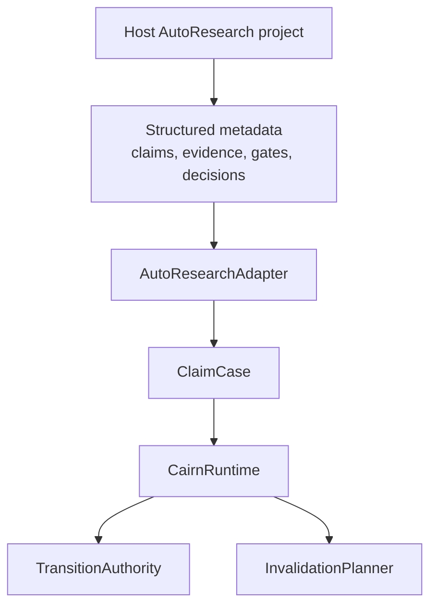

# Adapter Contract

CairnLab adapters translate external AutoResearch project metadata into a portable `ClaimCase`.

The adapter contract is deliberately small. A host project should not need to adopt CairnLab's CLI, `.cairn/` store, execution runtime, LLM prompts, or report layout.

## Design Rule

Adapters are translators, not authorities.

They may read host artifacts and emit:

- claims;
- evidence items;
- verifier or audit outputs;
- human approval gates;
- release decisions;
- typed relations between those objects;
- diagnostics about missing metadata.

They must not decide whether a claim is released, downgraded, or retracted. That decision remains in the transition authority and invalidation runtime.

## Boundary Diagram



## Minimal Python Flow

```python
from cairnlab import CairnRuntime
from cairnlab.adapters import AutoResearchAdapter, export_case

adapter: AutoResearchAdapter = ...
export = adapter.export_case(project_path)

runtime = CairnRuntime.from_case(export.case)
plan = runtime.plan_revert(
    "run:exp_007",
    reason="metric computed on wrong split",
)
events = runtime.events_from_plan(plan)
```

This flow does not touch the filesystem after the adapter returns its `ClaimCase`.

For built-in manifest adapters, deterministic auto-selection is available:

```python
from cairnlab.adapters import detect_adapters, export_case

matches = detect_adapters(project_path)
export = export_case(project_path, adapter_name="auto")
```

`adapter_name="auto"` succeeds only when exactly one adapter matches. If none
or multiple adapters match, the caller must pass an explicit adapter name.

## Protocol

```python
class AutoResearchAdapter(Protocol):
    name: str

    def detect(self, path: Path) -> bool:
        ...

    def export_case(self, path: Path) -> AdapterExportResult:
        ...
```

`detect` should be conservative. It should return true only when the adapter sees enough host metadata to build at least one claim or evidence object.

`export_case` returns:

```python
class AdapterExportResult(BaseModel):
    case: ClaimCase
    diagnostics: list[AdapterDiagnostic]
```

Diagnostics should report missing or ambiguous source metadata without blocking export unless the case would be structurally invalid.

## Registry API

The in-tree registry is intentionally static and dependency-free:

```python
from cairnlab.adapters import (
    adapter_names,
    detect_adapters,
    select_adapter,
    export_case,
)
```

It provides:

- `adapter_names()` for available built-in adapter names;
- `detect_adapters(path)` for conservative manifest detection;
- `select_adapter(path, adapter_name="auto")` for deterministic selection;
- `export_case(path, adapter_name="auto")` for one-step export.

The registry does not load external plugins, import host project packages, mutate
host state, write to `.cairn/`, or decide claim transitions. It only selects a
translator that emits a `ClaimCase`.

CLI equivalents:

```bash
cairn adapter detect path/to/project --json
cairn import-external path/to/project --adapter auto --path path/to/cairn-project
```

## Builder API

Adapters should usually use `ClaimCaseBuilder` instead of manually constructing every model.

```python
from cairnlab import ClaimCaseBuilder

case = (
    ClaimCaseBuilder(
        case_id="autoresearchclaw-run-001",
        source_system="autoresearchclaw",
        stress_scenario="imported_run",
    )
    .add_claim(
        "claim:C1",
        "Method A improves baseline B on Dataset X.",
        state="released",
    )
    .add_evidence(
        "run:exp_007",
        "run",
        uri="file://artifacts/rc-001/experiment_summary.json",
        hash="sha256:...",
    )
    .add_evidence(
        "metric:exp_007.primary",
        "metric",
        metadata={"metric_name": "primary_metric", "value": 0.923},
    )
    .add_relation("run:exp_007", "metric:exp_007.primary", "computed", criticality="critical")
    .add_support("metric:exp_007.primary", "claim:C1")
    .add_human_gate(
        "human_gate:H1",
        "claim:C1",
        "human:alice",
        authority="project_owner",
        scope={"claim": "claim:C1", "run": "run:exp_007"},
        rationale="Approved after reviewing experiment summary.",
    )
    .add_release_decision("release_decision:R1", "claim:C1", "human:alice")
    .build()
)
```

## Relation Direction

For ordinary dependencies, `source` is upstream and `target` depends on it:

```text
run -> metric -> claim -> paper_section
```

Authority objects also point to the claim they authorize:

```text
human_gate -> claim
release_decision -> claim
verifier_certificate -> claim
```

The runtime propagates both:

- upstream invalidation to dependent claims;
- affected claim state back to gates, release decisions, and verifier certificates that must be reopened or invalidated.

## Generic External Run Manifest

The preferred integration path for a new upstream tool is not a new CairnLab
runtime integration. It is a small manifest that records the artifacts the tool
already produced. This covers idea generators, paper-to-code projects, external
reviewers, experiment runners, verifier wrappers, and paper-writing systems.

The built-in `ExternalRunManifestAdapter` detects explicit manifests only:

```text
cairn_external_run.yaml
cairn_external_run.yml
cairn_external_run.json
external_run_manifest.yaml
external_run_manifest.yml
external_run_manifest.json
.cairn/external_run_manifest.yaml
.cairn/external_run_manifest.yml
.cairn/external_run_manifest.json
```

The manifest must set:

```yaml
manifest_type: cairn.external_run.v1
source_system: external-paper2code-stack
stage: paper_to_code
```

Supported stage names are intentionally open. Common values include
`idea_generation`, `literature_review`, `paper_to_code`, `experiment`,
`result_analysis`, `paper_write`, `review`, `verifier`, and `release_review`.
They are metadata, not CairnLab workflow states.

Minimal example:

```yaml
manifest_type: cairn.external_run.v1
case_id: external-run:paper2code-review-001
source_system: external-paper2code-stack
source_task: "Reproduce one scoped paper claim"
stage: paper_to_code

stages:
  - id: run:paper_to_code_001
    phase: paper_to_code
    tool: external-paper-to-code
    status: completed
    path: artifacts/code_patch.diff

claims:
  - id: claim:C1
    text: "The external reproduction reaches accuracy >= 0.90."
    state: verified

evidence:
  - id: metric:repro.accuracy
    type: metric
    metadata: {metric_name: accuracy, value: 0.91}

relations:
  - source: run:paper_to_code_001
    target: metric:repro.accuracy
    type: computed
    criticality: critical
  - source: metric:repro.accuracy
    target: claim:C1
    type: supports
    criticality: critical

verifier_certificates:
  - id: verifier:metric_threshold_accuracy
    verifier: metric_threshold
    claim: claim:C1
    status: pass
    inputs: [metric:repro.accuracy]
    result: {observed: 0.91, threshold: 0.90, direction: ">="}
    can_authorize:
      - evidence_attached -> verified

reviewer_verdicts:
  - id: reviewer:external_scope_review
    claim: claim:C1
    reviewer: external-reviewer
    verdict: warn
    path: reviews/scope_review.json

material_dissent:
  - id: dissent:split_scope
    claim: claim:C1
    severity: material
    resolved: false
    summary: "The reproduced split may not match the paper's claimed split."
```

The adapter maps:

- `claims[*]` to `Claim` objects, with legacy `state` or `status` treated as
  upstream `observed_state`;
- `stages[*]` to `run` evidence by default;
- `evidence[*]` to typed `EvidenceItem` objects;
- `relations[*]` to typed dependency edges;
- `verifier_certificates[*]` to verifier evidence that can support `verified`;
- `reviewer_verdicts[*]` to `reviewer_verdict` evidence with
  `not_transition_authority=true`;
- unresolved `material_dissent[*]` to critical challenge evidence and
  `external_material_dissent`;
- `human_gates[*]`, `release_decisions[*]`, `risk_assessments[*]`,
  `responsibility_assignments[*]`, and `decision_trace_packages[*]` to the
  matching governance objects.

`path` values may point at files or directories. Relative paths are resolved
against the import root, the manifest directory, and manifest ancestors so a
nested manifest can still refer to repository-root artifacts. File artifacts get
`sha256:` hashes; directory artifacts get deterministic `sha256-tree:` hashes
over sorted contained file paths and bytes. The adapter reads artifacts only for
URI and hash provenance; it never executes them. External relation criticality
aliases such as `material`, `blocking`, and `required` are normalized to
CairnLab `critical` relation criticality.

The generic manifest still does not authorize release. A passing verifier can
support `verified`; release remains blocked until CairnLab transition authority
sees the required risk assessment, human gate, accountability, and no unresolved
material dissent.

## AutoResearchClaw Mapping

The first AutoResearchClaw adapter should treat the following as metadata sources, not runtime dependencies:

| Host object | CairnLab object |
| --- | --- |
| `experiment_summary.json` | `run`, `metric`, `artifact` evidence |
| `VerifiedRegistry` exported values | `verifier_certificate` or metric evidence |
| result tables | `paper_section` evidence |
| HITL intervention records | `human_gate` evidence |
| final deliverable decision | `release_decision` evidence |
| stage artifacts | `artifact` evidence |

The adapter should not import AutoResearchClaw classes in the core package. If needed later, a plugin package can depend on AutoResearchClaw.

### Current Manifest Adapter

The in-tree `AutoResearchClawManifestAdapter` is the first minimal implementation.

It detects and reads:

```text
experiment_summary.json
experiment_summary_best.json
results/experiment_summary.json
deliverables/experiment_summary.json
hitl/approval.json              optional
release_decision.json           optional
```

It maps:

- the experiment summary file to a `run` evidence item;
- the primary metric to a `metric` evidence item;
- listed artifacts to `artifact` evidence items;
- an exported claim object, if present, to `Claim`;
- `hitl/approval.json` to a `human_gate`;
- `release_decision.json` to a `release_decision`.

It does not import AutoResearchClaw, run its pipeline, repair experiments, parse papers, or infer human approval when approval metadata is missing.

### Current E2E Run Adapter

The in-tree `AutoResearchClawE2ERunAdapter` handles the real e2e run directory
shape produced by AutoResearchClaw validation. It detects a run root containing
`stage-14/experiment_summary.json` plus root-level e2e markers such as
`topic_manifest.json` or `pipeline_summary.json`.

It reads:

```text
topic_manifest.json             optional source task context
pipeline_summary.json           optional pipeline status context
stage-14/experiment_summary.json
stage-14/stage_health.json      optional stage evidence
stage-14/decision.json          optional stage evidence
stage-15/stage_health.json      optional downstream diagnostic evidence
stage-15/decision.json          optional downstream diagnostic evidence
stage-15/decision_structured.json optional model/parse diagnostic evidence
stage-20/quality_report.json    optional quality-gate evidence
stage-22/paper_verification.json optional paper verifier evidence
stage-22/sanitization_report.json optional sanitization evidence
```

It maps:

- `stage-14/experiment_summary.json` through the manifest adapter;
- `condition_summaries[*].metrics[*]` to condition-level metric evidence and
  verified observation claims;
- `pipeline_summary.json`, stage health, decision, quality, verification, and
  sanitization files to contextual `artifact` evidence;
- structured decision parse failures and model API errors to diagnostics;
- pipeline `degraded`, paused, failed, or blocked status to adapter diagnostics;
- quality-gate `FAIL`, paper-verifier `REJECT` or `FAIL`, and claim-number
  sanitization to adapter diagnostics;
- paused, failed, or blocked downstream stages to `failure_classes` for
  validation reporting.
- pipeline degradation and verifier rejection signals to `failure_classes` for
  validation reporting.

The e2e adapter is not a release gate. For example, a paused
`stage-15/research_decision` is imported as evidence and warning diagnostics, not
as a CairnLab release decision. Release still requires CairnLab transition
authority, verifier certificates, human gates, and accountable responsibility.

## ARIS Mapping

The first ARIS adapter should treat these sources as metadata:

| Host object | CairnLab object |
| --- | --- |
| `research-wiki/claims` JSON or Markdown frontmatter | `Claim` |
| experiment JSON or Markdown frontmatter pages | `run`, `metric`, `artifact` evidence |
| `research-wiki/graph/edges.jsonl` with `source`/`target` or `from`/`to` | typed relations |
| `/result-to-claim` status | claim base state or transition seed |
| `PROOF_AUDIT.json` | `verifier_certificate` evidence |
| `EXPERIMENT_AUDIT.json` | `verifier_certificate` evidence |
| `PAPER_CLAIM_AUDIT.json` | `verifier_certificate` evidence |
| `CITATION_AUDIT.json` | citation verifier evidence |
| `*.review.json` sidecars | `reviewer_verdict` evidence |
| `.aris/audit-verifier-report.json` | `verifier_certificate` evidence |
| `.aris/meta/events.jsonl` | optional source event evidence |
| human checkpoint metadata | `human_gate` evidence |

The adapter should preserve ARIS audit verdicts as machine-readable metadata and avoid turning them into prose-only notes. ARIS LLM review sidecars are reviewer evidence, not deterministic verifier certificates. The submission verifier report is verifier evidence, but it still does not decide CairnLab claim release by itself.

### Current ARIS Manifest Adapter

The in-tree `ArisManifestAdapter` is the first minimal ARIS implementation.

It detects and reads:

```text
research-wiki/claims/*.json
research-wiki/claims/*.md
research-wiki/experiments/*.json
research-wiki/experiments/*.md
research-wiki/graph/edges.jsonl
PROOF_AUDIT.json                 optional
EXPERIMENT_AUDIT.json            optional
PAPER_CLAIM_AUDIT.json           optional
CITATION_AUDIT.json              optional
KILL_ARGUMENT.json               optional
*.review.json                    optional, when ARIS markers are present
.aris/audit-verifier-report.json optional
.aris/human_gate.json            optional
```

It maps:

- `research-wiki/claims/*.json` and Markdown frontmatter pages to `Claim`;
- `research-wiki/experiments/*.json` and Markdown frontmatter pages to `run`,
  `metric`, and `artifact` evidence;
- `research-wiki/graph/edges.jsonl` to typed CairnLab relations, including the
  real ARIS helper's `from`/`to` edge shape;
- ARIS `exp:*` node IDs to CairnLab `run:*` evidence IDs;
- ARIS audit JSON files to `verifier_certificate` evidence;
- ARIS `*.review.json` sidecars to `reviewer_verdict` evidence with
  `not_transition_authority=true`;
- ARIS submission verifier reports, including the real
  `verify_paper_audits.sh` report shape, to `verifier_certificate` evidence;
- rejected, blocked, failed, or errored verifier reports to diagnostics and
  `failure_classes`;
- `.aris/human_gate.json` to a `human_gate`.

It does not parse arbitrary wiki Markdown, run ARIS skills, call reviewers, mutate `.aris/meta/events.jsonl`, infer missing human approvals, treat LLM reviewer agreement as release authority, or decide claim lifecycle authority.

## Reliability Requirements

Adapters should:

- produce stable object IDs;
- attach stable URIs or hashes whenever possible;
- preserve actor, authority, scope, and rationale for human gates;
- preserve verifier status and input references;
- emit diagnostics for missing evidence bindings;
- avoid network access by default;
- never mutate the host project while exporting a case.

## Non-Goals

Adapters must not:

- run new experiments;
- parse or rewrite papers;
- call LLM reviewers;
- restore workspaces;
- hide material dissent;
- silently drop unsupported claims;
- change host project state.
