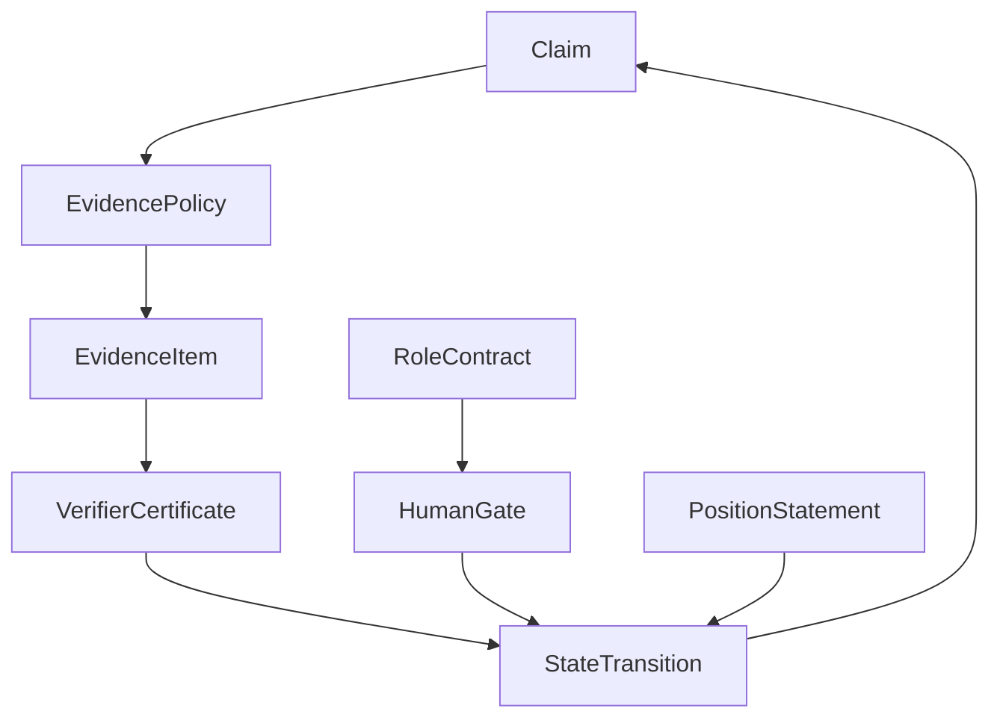

# CairnLab Candidate Kernel Spec v0.1

This document defines the minimum kernel primitives for CairnLab if the validation-first phase justifies building a claim lifecycle control layer.

The goal is to prevent the project from becoming a loose integration of MLflow, DVC, PROV, review prompts, and agent logs. CairnLab's first-class abstraction is the **scientific claim state machine**.

## Kernel primitives

CairnLab v0.1 has six core objects:

1. `Claim`
2. `EvidencePolicy`
3. `EvidenceItem`
4. `VerifierCertificate`
5. `StateTransition`
6. `HumanGate`

Two additional governance objects are required for multi-agent work:

7. `RoleContract`
8. `PositionStatement`

## Primitive Relationship



## Claim

A `Claim` is a stateful scientific assertion.

```yaml
id: C1
text: "Method A improves baseline B by 2.3% on Dataset X."
type: empirical_score
status: draft
source:
  kind: paper_span
  uri: paper.pdf#page=5&table=1
created_by:
  actor: llm:claude
  role: claim_extractor
```

A claim is not considered verified because it is plausible. It is verified only through state transitions authorized by verifier certificates and policy.

## Claim states

Initial v0.1 states:

```text
draft
scoped
evidence_required
evidence_attached
verification_pending
verified
blocked
challenged
human_accepted
released
downgraded
retracted
```

## EvidencePolicy

An `EvidencePolicy` defines what evidence is required for a claim type.

```yaml
id: empirical-score-v1
applies_to: empirical_score
required_evidence:
  - experiment_spec
  - code_commit
  - environment_snapshot
  - dataset_identity
  - metric_artifact
  - run_log
required_verifiers:
  - artifact_exists
  - metric_schema
  - metric_threshold
  - method_code_alignment
  - provenance_complete
governance:
  require_human_gate_for:
    - release
  block_if:
    - material_dissent_unresolved
    - verifier_failed
    - missing_dataset_identity
```

## EvidenceItem

An `EvidenceItem` points to an artifact, run, reference, code commit, dataset, log, or human decision.

```yaml
id: EVID1
kind: metric_artifact
uri: runs/exp001/metrics.json
sha256: abc123...
produced_by: run:R1
```

## VerifierCertificate

A `VerifierCertificate` is a machine-checkable judgment that can authorize or block a claim state transition.

```yaml
id: VC1
verifier: metric_threshold@0.1.0
claim: C1
status: pass
inputs:
  - EVID1
result:
  observed: 0.923
  expected_min: 0.900
  tolerance: 0.005
can_authorize:
  - verification_pending -> verified
```

Verifier output is not commentary. It is transition authority.

## StateTransition

A `StateTransition` is an append-only event.

```yaml
id: ST1
claim: C1
from: verification_pending
to: verified
authorized_by:
  - verifier_certificate:VC1
  - verifier_certificate:VC2
blocked_by: []
created_at: 2026-06-02T00:00:00Z
actor: system:cairn-kernel
previous_event_hash: ...
event_hash: ...
```

Claim status must never be overwritten directly. It must be derived from transition history.

## HumanGate

A `HumanGate` is a liability-bearing decision.

```yaml
id: HG1
claim: C1
gate_type: release_acceptance
decision: approve
actor: human:pi@example.org
liability_scope:
  - claim_text
  - evidence_policy
  - verifier_certificates
  - unresolved_limitations
disclosure: "Metric reproduced under three seeds; external benchmark server unavailable."
```

Human approval does not erase uncertainty. It records responsibility for the decision.

## RoleContract

A `RoleContract` defines what an actor is allowed to do.

```yaml
role: implementation_agent
allowed:
  - propose_patch
  - attach_code_artifact
forbidden:
  - mark_claim_verified
  - modify_transition_log
  - approve_human_gate
```

## PositionStatement

A `PositionStatement` records an agent or human stance.

```yaml
id: PS1
claim: C1
actor: llm:critic-1
role: reviewer
stance: material_dissent
summary: "The reported metric lacks multi-seed evidence."
evidence_refs:
  - C1
  - EVID1
sealed_initial: true
```

If a position changes, CairnLab must record a new position and a transition reason; it must not mutate the old one.

## Kernel rule

A claim status transition is valid only if:

```text
transition_requested
AND required evidence exists
AND required verifier certificates pass
AND no blocking governance rule applies
AND required human gates are satisfied
```

## What v0.1 must prove

CairnLab v0.1 should prove one thing:

> Given a claim, the kernel can enforce whether it may move to a stronger scientific state.

It does not need to run a full autonomous research loop in v0.1.


## Governance extension v0.3

The v0.3 kernel adds governance objects that make traceability and accountability operational rather than decorative.

### LifecycleContext

`LifecycleContext` binds a claim or transition to an AI/research lifecycle stage.

```yaml
lifecycle_context:
  stage: design | development | evaluation | deployment_use | publication | monitoring | downgrade_retraction
  system_scope: local_research | shared_lab | public_release | high_impact_decision
  autonomy_level: assistive | supervised_agentic | autonomous_agentic
  affected_parties:
    - researchers
    - downstream_users
    - public_readers
```

### ResponsibilityAssignment

`ResponsibilityAssignment` records who is responsible and accountable for a claim or transition.

```yaml
responsibility_assignment:
  object: claim:C1
  action: release_claim
  responsible:
    - role: verifier
      actor: system:metric-threshold@0.1.0
  accountable:
    - role: human_pi
      actor: human:pi@example.org
  consulted:
    - role: domain_reviewer
      actor: human:reviewer@example.org
  informed:
    - role: project_maintainer
      actor: human:maintainer@example.org
```

Rules:

- every released claim must have an accountable party;
- implementation agents cannot be accountable for scientific acceptance;
- verifier certificates authorize transitions but do not replace human accountability for publication;
- human overrides must create new events, never mutate previous verdicts.

### RiskAssessment

`RiskAssessment` determines which governance controls apply.

```yaml
risk_assessment:
  object: claim:C1
  risk_tier: low | medium | high | critical
  dimensions:
    scientific_validity: high
    reproducibility: medium
    data_sensitivity: low
    downstream_impact: high
    autonomy_level: supervised_agentic
  controls:
    - require_human_gate
    - require_limitation_disclosure
    - block_if_material_dissent_unresolved
```

### AssessmentRecord

`AssessmentRecord` makes algorithm, data, design, and deployment assumptions explicit.

```yaml
assessment_record:
  id: ASSESS1
  object: claim:C1
  assessment_type: algorithm | data | design | deployment_context | governance
  result: pass | fail | needs_more_evidence | not_applicable
  evidence_refs:
    - evidence:EVID1
    - verifier_certificate:VC1
```

### DecisionTracePackage

A `DecisionTracePackage` is required for high-impact or released claims.

```yaml
decision_trace_package:
  id: DTP1
  claim: C1
  includes:
    - lifecycle_context
    - risk_assessment
    - responsibility_assignment
    - evidence_policy
    - evidence_items
    - verifier_certificates
    - state_transition_log
    - human_gates
    - unresolved_limitations
    - export_hash
```

## Transition rule v0.3

A transition is allowed only if:

```text
transition_requested
AND required evidence exists
AND required verifier certificates pass
AND no blocking governance rule applies
AND required human gates are satisfied
AND lifecycle context is recorded
AND risk tier is assigned
AND responsibility assignment exists for consequential transitions
AND required assessment records exist for algorithm/data/design/deployment context
AND decision trace package can be generated for high-impact transitions
```
