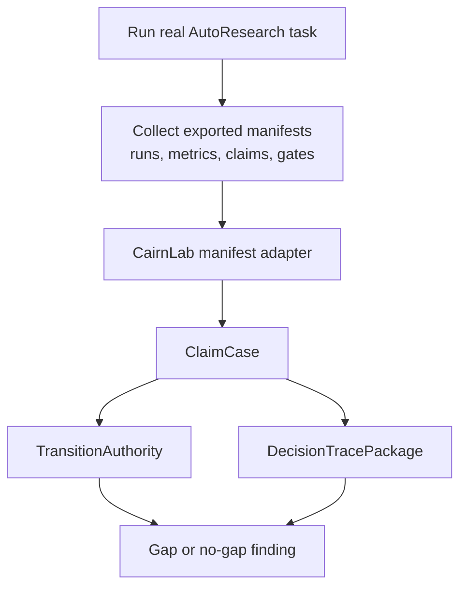

# Verification Scope

This document records what the current repository verification does and does not
prove.

## Current Verification

The current engineering verification command is:

```bash
pytest -q -p no:rerunfailures
```

It verifies:

- domain models and builder helpers;
- synthetic semantic invalidation cases;
- in-memory `CairnRuntime`;
- local `.cairn/` store behavior;
- AutoResearchClaw and ARIS manifest adapter fixtures;
- deterministic adapter registry detection;
- transition authority blocking and allow paths;
- verifier certificate execution;
- decision trace package generation;
- selected CLI entrypoints.

It does not run real AutoResearchClaw, ARIS, or another AutoResearch runtime.
Fixture tests prove the CairnLab contracts and adapter mappings. They do not
prove that a live upstream framework emits complete metadata under real load.

## Real AutoResearch Validation

Real-framework validation should be a separate integration layer:



Recommended order:

1. Run the smallest documented AutoResearchClaw task.
2. Export or hand-normalize its manifest files into the current adapter shape.
3. Import with `cairn import-external`.
4. Run `cairn transition request` on material claims.
5. Run `cairn decision-trace` for any claim that appears release-ready.
6. Record whether CairnLab blocks or changes a release-relevant state that the
   upstream system leaves implicit.

This is required to validate the market/design thesis. It is not required for
unit-level correctness of the kernel modules.
