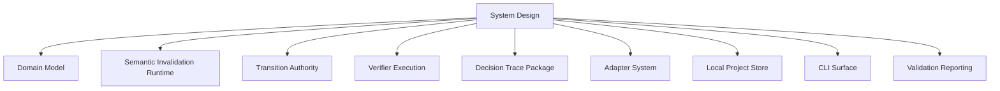

# CairnLab Design Docs

This directory is the design home for the implemented CairnLab software system.

The top-level README explains the project. The roadmap explains staged intent.
This directory explains how the current system is structured, where each module
boundary sits, and what must be updated when code changes.

## Design Map

- [System Design](SYSTEM_DESIGN.md): current implemented architecture and dependency boundaries.
- [Domain Model](modules/domain_model.md): portable claim, evidence, relation, event, and case models.
- [Verifier Execution](modules/verifier_execution.md): deterministic certificate generation from structured evidence.
- [Transition Authority](modules/transition_authority.md): deterministic claim lifecycle transition gate.
- [Decision Trace Package](modules/decision_trace_package.md): reviewable release/high-impact claim trace export.
- [Semantic Invalidation Runtime](modules/semantic_invalidation_runtime.md): graph, projection, planner, and in-memory runtime.
- [Adapter System](modules/adapter_system.md): external manifest adapters and deterministic registry.
- [Local Project Store](modules/local_project_store.md): `.cairn/` persistence and append-only event storage.
- [CLI Surface](modules/cli_surface.md): command-line facade over reusable APIs.
- [Validation Reporting](modules/validation_reporting.md): validation report scope and limits.

## Maintenance Rule

Every code change that modifies one of these items must update the relevant
design document in the same change:

- public Python API;
- CLI command or output shape;
- schema or model field;
- event type or projected state behavior;
- adapter detection or export contract;
- storage layout;
- dependency direction between modules;
- claim transition, invalidation, release, gate, or dissent semantics.

If the change crosses module boundaries, update [System Design](SYSTEM_DESIGN.md)
as well as the module document.

## Design Principles

CairnLab modules should remain:

- lightly coupled;
- reusable outside this repository;
- deterministic where transition authority is involved;
- explicit about provenance, evidence, and actor authority;
- small enough to remove or replace without rewriting the kernel.

No module may collapse the project into integration glue. A change is core only
when it affects whether a claim is allowed to transition to a stronger or weaker
state, or whether the evidence for that transition remains valid.

## Documentation Roles

Existing documents keep their current roles:

- `docs/ARCHITECTURE.md`: broader candidate architecture and future kernel direction.
- `docs/KERNEL_SPEC.md`: kernel primitive specification.
- `docs/SEMANTIC_INVALIDATION_HARNESS.md`: 0.3 harness rationale and contract.
- `docs/ADAPTER_CONTRACT.md`: adapter protocol and external project mapping rules.
- `docs/ROADMAP.md`: staged build and validation sequence.

The files under `docs/design/` are the source of truth for the current
implemented software architecture.
