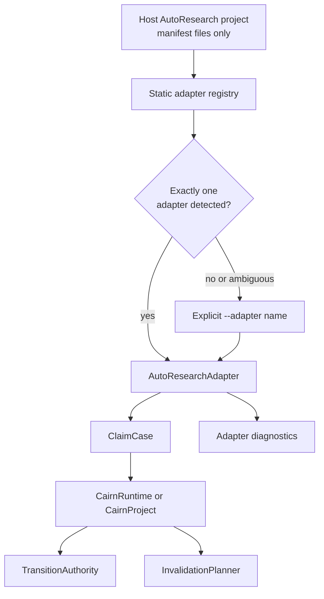

# Adapter System Design

## Purpose

Adapters translate external AutoResearch project metadata into portable
`ClaimCase` objects. They make CairnLab reusable without requiring host projects
to adopt CairnLab storage, CLI, prompts, or execution runtime.

Primary source files:

- `src/cairnlab/adapters/base.py`
- `src/cairnlab/adapters/registry.py`
- `src/cairnlab/adapters/autoresearchclaw_manifest.py`
- `src/cairnlab/adapters/aris_manifest.py`
- `docs/ADAPTER_CONTRACT.md`

## Owns

This module owns:

- the `AutoResearchAdapter` protocol;
- adapter diagnostics;
- dependency-free manifest export into `ClaimCase`;
- conservative adapter detection;
- deterministic adapter selection.

## Does Not Own

This module must not own:

- claim transition authority;
- invalidation planning;
- verifier execution;
- host project mutation;
- network access;
- external project package imports.

Adapters are translators, not authorities.

## Registry Behavior

The registry is intentionally static:

```python
from cairnlab.adapters import detect_adapters, select_adapter, export_case

matches = detect_adapters(path)
adapter = select_adapter(path, adapter_name="auto")
export = export_case(path)
```

`adapter_name="auto"` succeeds only when exactly one adapter matches. Zero
matches or multiple matches raise `AdapterSelectionError`.

This avoids silent imports from ambiguous projects and keeps detection behavior
scriptable for external users.

## Adapter Flow



The adapter boundary ends at `ClaimCase`. Detection and export do not import the
host runtime, mutate host state, run experiments, or decide lifecycle authority.

## Built-In Adapters

Current built-ins:

- `autoresearchclaw-e2e-run`
- `autoresearchclaw-manifest`
- `aris-manifest`

All built-ins read structured JSON or JSONL metadata only. They do not import
AutoResearchClaw, ARIS, or any host runtime.

`autoresearchclaw-e2e-run` is a resolver layer for the real AutoResearchClaw
e2e directory shape observed in validation:

```text
topic_manifest.json
pipeline_summary.json
stage-14/experiment_summary.json
stage-14/stage_health.json
stage-14/decision.json
stage-15/stage_health.json
stage-15/decision.json
stage-15/decision_structured.json
stage-20/quality_report.json
stage-22/paper_verification.json
stage-22/sanitization_report.json
```

It selects `stage-14/experiment_summary.json` as the result-analysis manifest,
delegates base run/metric/claim mapping to `autoresearchclaw-manifest`, and then
adds condition-level metric claims plus pipeline, stage health, decision,
quality, paper-verification, and sanitization artifacts. Downstream pauses such
as `stage-15` research-decision failures, pipeline degradation, quality-gate
failures, paper verifier rejection, and sanitized numerical claims are
diagnostics and evidence context only. They never authorize a claim release.

`aris-manifest` handles exported ARIS research-wiki manifests, the real ARIS
wiki helper's Markdown-frontmatter page style, and the real ARIS repository
sidecar pattern observed in validation. It accepts `source`/`target` graph
edges and the `from`/`to` edge shape emitted by `research_wiki.py add_edge`.
ARIS `exp:*` IDs are normalized to CairnLab `run:*` evidence IDs at the adapter
boundary.

When ARIS markers are present, the adapter can import `*.review.json` files as
`reviewer_verdict` evidence. Those sidecars preserve reviewer route, source
hashes, nested verdict history, warnings, and blocking issues, but they are
explicitly marked as non-authority evidence. `.aris/audit-verifier-report.json`
is imported as `verifier_certificate` evidence because it represents the
machine-readable submission gate result. Rejected, blocked, failed, or errored
verifier reports become diagnostics and `failure_classes`; they still do not
release or retract a claim without CairnLab transition authority.

The optional `scripts/run_aris_e2e_smoke.py` validation runner exercises this
boundary against a local ARIS checkout by invoking ARIS deterministic helpers as
external commands. It does not import ARIS packages or add ARIS to CairnLab's
runtime dependency graph.

## CLI Surface

```bash
cairn adapter detect path/to/project --json
cairn import-external path/to/project --adapter auto --path .
```

CLI import calls the adapter, receives a `ClaimCase`, and passes it to the same
local project import path used by ordinary case files.

## Dependency Rules

Adapters may depend on:

- `models`;
- `builder`;
- standard-library file and JSON utilities.

Adapters must not depend on:

- `store`;
- `engine`;
- `cli`;
- host project packages;
- planner internals.

## Extension Rules

When adding an adapter:

- implement `AutoResearchAdapter`;
- make `detect()` conservative;
- preserve stable IDs, URIs, hashes, actors, authority, scope, and rationale;
- emit diagnostics for missing structured metadata;
- add fixture-based tests;
- update `docs/ADAPTER_CONTRACT.md` and this document.

Do not add a plugin mechanism until at least one adapter lives outside this
repository and needs packaging support.

## Tests

Current coverage:

- AutoResearchClaw e2e run detection, export, diagnostics, and revert planning;
- AutoResearchClaw manifest detection and export;
- ARIS manifest, review sidecar, submission verifier, and missing human-gate
  diagnostics;
- ARIS E2E smoke contract with Markdown-frontmatter wiki pages, real helper
  `from`/`to` edges, paper audits, verifier reports, and revert planning;
- registry name listing;
- auto-detection success;
- no-match failure;
- ambiguous match failure;
- CLI `adapter detect`;
- CLI `import-external`.
