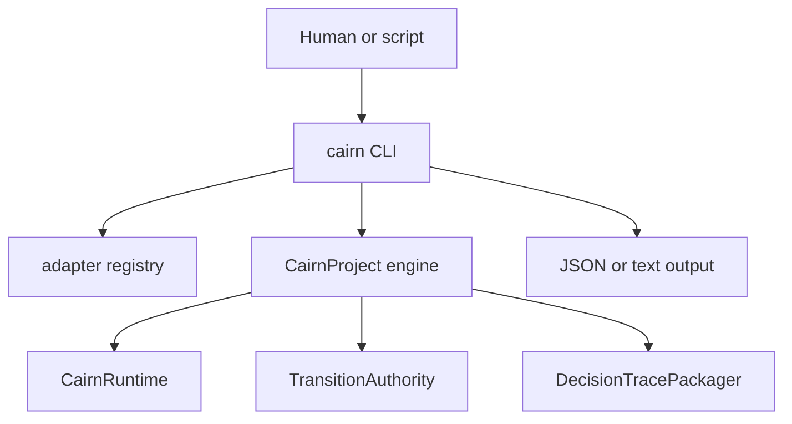

# CLI Surface Design

## Purpose

The CLI exposes local project operations for humans and scripts. It is a facade
over reusable Python APIs, not the place where kernel semantics live.

Primary source file:

- `src/cairnlab/cli.py`

## Owns

This module owns:

- command names;
- option parsing;
- human-readable output;
- JSON output for automation;
- non-zero exits for user-facing selection errors.

## Does Not Own

This module must not own:

- graph traversal;
- invalidation planning;
- state projection;
- storage semantics;
- adapter export mapping;
- claim transition authority.

## CLI Boundary



## Current Commands

Project and import:

```bash
cairn version
cairn init --path .
cairn import-case case.yaml --path .
cairn import-external path/to/project --adapter auto --path . --json
```

Adapter inspection:

```bash
cairn adapter detect path/to/project --json
```

Validation and trace:

```bash
cairn validate --path . --json
cairn trace claim:C1 --path . --json
cairn decision-trace claim:C1 --transition release --path . --json
cairn affected run:exp_007 --path . --json
```

Invalidation:

```bash
cairn revert run:exp_007 --reason "wrong split" --plan-only
cairn revert run:exp_007 --reason "wrong split" --apply --actor user:alice
```

Transition authority:

```bash
cairn transition request claim:C1 --to released --reason "release review"
cairn transition request claim:C1 --to released --reason "release review" --apply
cairn transition request claim:C1 --to released --reason "release review" --record-blocked
cairn transition explain claim:C1 --to released --reason "release review" --json
```

`trace` reports `observed_state` and `authority_state` for claims. The legacy
`projected_state` field remains for compatibility and is the authority projection.
`transition request` is plan-only unless `--apply` is set. Blocked transitions are
not persisted unless `--record-blocked` is set for audit. `transition explain`
is always plan-only; it renders the `TransitionDecision` without appending events.

## Output Rule

Every command intended for automation should support `--json`. JSON payloads
should be stable enough for tests before external users depend on them.

## Dependency Rules

The CLI may import `engine`, adapter registry functions, models needed for
argument parsing, and formatting utilities.

The CLI must not import planner internals directly when an `engine` or runtime
method already exists.

## Extension Rules

When adding or changing a command:

- update this document;
- add a Typer `CliRunner` test for success and expected failure modes;
- prefer calling `engine` or public library APIs;
- keep command handlers short.

## Tests

Current coverage:

- `adapter detect` JSON output;
- `import-external` with auto-detected adapter;
- underlying import, trace, revert, and transition behavior through engine tests;
- `transition explain` JSON/text output and plan-only behavior.
