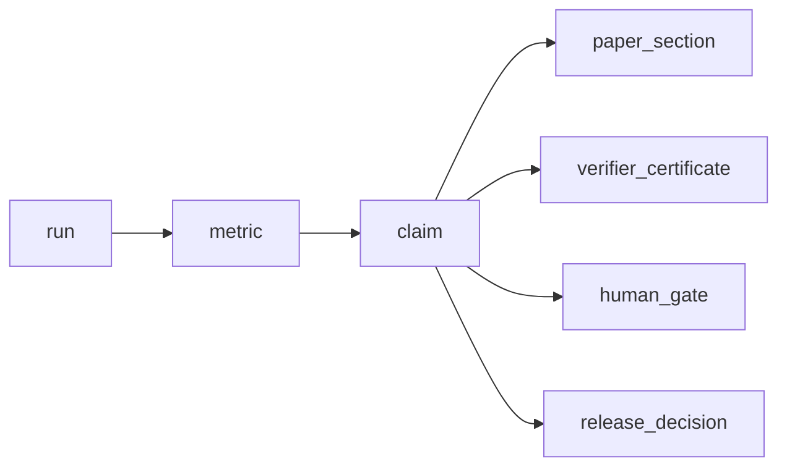

# Semantic Invalidation Runtime Design

## Purpose

The runtime computes semantic consequences of invalidating a claim-supporting
object. It is CairnLab's current reusable rollback-control layer for
AutoResearch systems.

Primary source files:

- `src/cairnlab/graph.py`
- `src/cairnlab/projection.py`
- `src/cairnlab/planner.py`
- `src/cairnlab/runtime.py`

## Owns

This module owns:

- relation traversal;
- current state projection from base objects plus events;
- affected-object planning;
- conversion from `RevertPlan` to append-only `TransitionEvent` objects;
- in-memory tracing without filesystem dependency.

## Does Not Own

This module must not own:

- host project adapter logic;
- file persistence;
- CLI rendering;
- verifier execution;
- experiment replay;
- workspace rollback.

It is semantic rollback, not filesystem rollback.

## Data Flow

```mermaid
flowchart TD
    case["ClaimCase"]
    objects["claims + evidence + relations"]
    graph["RelationGraph"]
    projection["EventProjection"]
    planner["InvalidationPlanner.plan_revert()"]
    plan["RevertPlan"]
    events["TransitionEvents"]
    updated["Updated projected state"]

    case --> objects --> graph --> planner --> plan --> events --> updated
    objects --> projection --> planner
    events --> projection
```

## Propagation Semantics

Ordinary relations flow upstream to downstream:



The first chain is ordinary evidence dependency. The outgoing claim edges show
authority objects that must be reopened or invalidated when a claim loses
support.

The planner emits explicit actions rather than mutating objects:

- `invalidate`;
- `challenge`;
- `downgrade`;
- `mark_stale`;
- `require_reapproval`;
- `reopen_release_decision`;
- `needs_review`.

## Public Contracts

Library users should be able to use:

```python
runtime = CairnRuntime.from_case(case)
plan = runtime.plan_revert("run:exp_007", reason="wrong split")
events = runtime.events_from_plan(plan)
updated = runtime.with_events(events)
trace = updated.trace("claim:C1")
```

No local `.cairn/` project is required for this flow.

## Dependency Rules

The runtime may depend on `models`, `graph`, `projection`, and `planner`.
It must not depend on `store`, `engine`, or `cli`.

The planner may read a graph and projection. It must not append events to a file.

## Extension Rules

When adding a new evidence type, relation type, action, or event type:

- update `models.py`;
- update planner mapping;
- update this document;
- add at least one test that proves propagation from an invalidated upstream
  object to affected downstream authority.

## Tests

Current coverage:

- wrong metric invalidation;
- human approval scope drift;
- in-memory runtime without filesystem;
- adapter exports feeding runtime plans.
