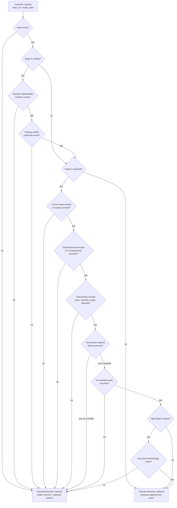

# Transition Authority Design

## Purpose

The transition authority module decides whether a requested claim lifecycle
transition is allowed or blocked. This is CairnLab's core differentiation from
ordinary AutoResearch logs, dashboards, reviewer prompts, and provenance stores.

Primary source file:

- `src/cairnlab/authority.py`

## Owns

This module owns deterministic checks for:

- machine-addressable evidence before verification;
- passing verifier certificates before verification;
- machine-addressable evidence and passing verifier certificates before release;
- verified state before release unless there is an explicit override;
- human gates with actor, authority, scope, and rationale;
- unresolved material dissent;
- `RiskAssessment` for consequential transitions;
- `ResponsibilityAssignment` with an accountable party for released claims;
- `DecisionTracePackage` for high-impact releases.

## Does Not Own

This module must not own:

- file storage;
- CLI rendering;
- adapter export mapping;
- graph construction;
- event persistence;
- experiment execution;
- LLM reviewing.

It reads imported structured objects and returns a `TransitionDecision`. It does
not mutate state.

## Decision Flow



The flow rechecks evidence and verifier certificates for release. Imported
`state: verified` is not treated as transition authority by itself.

## Difference From Invalidation Planner

`InvalidationPlanner` answers:

```text
If this supporting object is invalidated, what downstream authority must change?
```

`TransitionAuthority` answers:

```text
May this claim move to the requested lifecycle state now?
```

They share graph and projection inputs, but they enforce different parts of the
claim lifecycle.

```mermaid
flowchart LR
    invalidated["Invalidated object"]
    requested["Requested claim transition"]
    graph["RelationGraph + EventProjection"]
    planner["InvalidationPlanner"]
    authority["TransitionAuthority"]
    revert["Affected objects<br/>and revert events"]
    decision["Allowed or blocked<br/>transition decision"]

    invalidated --> graph --> planner --> revert
    requested --> graph --> authority --> decision
```

## Public Contract

```python
authority = TransitionAuthority(
    claims=claims,
    evidence=evidence,
    graph=graph,
    projection=projection,
    cases=cases,
)
decision = authority.request_transition(
    claim_id="claim:C1",
    target_state=ClaimState.RELEASED,
    actor=Actor(id="human:pi", role="principal_investigator"),
    reason="release review",
)
```

The result is a `TransitionDecision` containing:

- `decision`: `allowed` or `blocked`;
- `blocking_reasons`;
- `required_actions`;
- a proposed append-only `TransitionEvent`.

## Governance Indexing

Governance can be attached directly to a `Claim` or listed at `ClaimCase` level:

- `RiskAssessment.object == claim_id`;
- `ResponsibilityAssignment.object == claim_id`;
- `DecisionTracePackage.claim == claim_id`.

The authority module indexes both forms so adapters can choose the least coupled
representation for their host metadata.

## Override Rule

`force=True` is treated as an explicit human override for release-state checks
that are overrideable, such as release from a non-verified state or unresolved
material dissent. It does not waive structural requirements such as human gate,
accountable party, risk assessment, or high-impact decision trace package.

## Dependency Rules

The authority module may depend on:

- `models`;
- `graph`;
- `projection`;
- deterministic utility functions.

It must not depend on:

- `store`;
- `engine`;
- `cli`;
- adapters.

## Extension Rules

When adding a new transition rule:

- keep it deterministic;
- emit a stable blocking reason string;
- include a clear required action;
- add tests for blocked and allowed paths;
- update this document and any relevant schema or contract docs.

Do not add a policy language until repeated rules require external
configuration.

## Tests

Current coverage:

- verification blocks without a passing verifier certificate;
- high-impact release blocks without risk, accountability, and decision trace;
- release succeeds with required governance;
- unresolved material dissent blocks release unless explicitly overridden.
