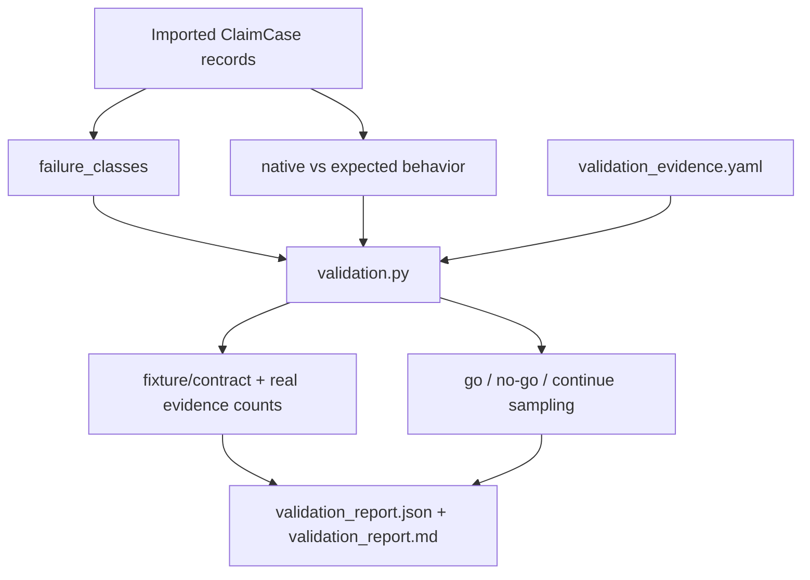

# Validation Reporting Design

## Purpose

Validation reporting checks whether imported claim cases expose the failure
classes and governance gaps CairnLab is meant to study. It supports the
validation-first decision about whether a full Research Claim Kernel is needed.

Primary source files:

- `src/cairnlab/validation.py`
- `src/cairnlab/validation_evidence.py`

## Owns

This module owns:

- case-level validation summaries;
- real validation evidence ledger loading;
- recommendation text;
- failure taxonomy aggregation;
- validation report JSON and Markdown payloads.

## Does Not Own

This module must not own:

- verifier execution;
- claim transition authorization;
- adapter export;
- graph propagation;
- benchmark execution.

Validation reports can inform build decisions. They do not authorize claim state
transitions.

## Reporting Flow



## Inputs

Current inputs are imported `ClaimCase` records from the local store plus an
optional validation evidence ledger:

```text
data/validation_evidence.yaml
.cairn/validation_evidence.yaml
```

Important fields:

- `native_system_behavior`;
- `expected_cairnlab_behavior`;
- `failure_classes`;
- claims, evidence, and relations.

Ledger fields record real-vs-fixture systems, runs, tasks, material claims, and
release-control failure classes. Fixture and adapter tests are labeled as
contract verification; they do not satisfy real validation thresholds by
themselves.

## Outputs

The local store writes:

```text
.cairn/reports/validation_report.json
.cairn/reports/validation_report.md
```

## Dependency Rules

`validation.py` may depend on `models` and `validation_evidence`. It must not
import CLI, store, adapters, planner, or host project packages.

The store is responsible for writing report files.

## Extension Rules

When validation becomes stricter:

- keep deterministic scoring;
- avoid LLM reviewer calls in this module;
- update this document and `docs/VALIDATION_FIRST_EXECUTION_PLAN.md`;
- add tests with representative case fixtures.
- keep `go` gated on real framework evidence, not only synthetic or fixture
  coverage.

## Tests

Current coverage includes direct validation evidence ledger tests, semantic
invalidation tests, and CLI validation flow.
