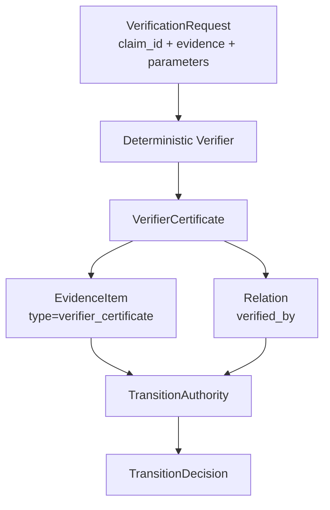

# Verifier Execution Design

## Purpose

Verifier execution turns structured evidence into machine-readable
`VerifierCertificate` objects. This is the smallest execution layer needed to
avoid treating AutoResearch output, reviewer prose, or imported claim status as
transition authority.

Primary source file:

- `src/cairnlab/verifiers.py`

## Owns

This module owns:

- the `Verifier` protocol;
- deterministic verification requests;
- built-in `artifact_hash` verification;
- built-in `metric_threshold` verification;
- structured `VerifierCertificate` emission.

## Does Not Own

This module must not own:

- claim transition decisions;
- event persistence;
- file discovery;
- experiment execution;
- adapter export;
- policy DSL evaluation;
- LLM review.

Verifier execution emits certificates. `TransitionAuthority` decides whether
those certificates authorize a claim transition.

## Flow



The conversion from certificate to `EvidenceItem` is handled by
`ClaimCaseBuilder.add_verifier_certificate()`. This keeps storage unchanged and
allows external projects to emit certificates without adopting CairnLab's local
`.cairn/` layout.

## Public Contract

```python
from cairnlab import MetricThresholdVerifier, VerificationRequest

certificate = MetricThresholdVerifier().verify(
    VerificationRequest(
        claim_id="claim:C1",
        evidence=[metric_evidence],
        parameters={"metric_name": "accuracy", "min_value": 0.90},
    )
)
```

The resulting certificate records:

- verifier name and version;
- claim target;
- pass/fail/error status;
- input evidence IDs;
- structured result payload;
- transitions it can authorize.

## Built-In Verifiers

`ArtifactHashVerifier` checks an evidence object's declared `hash` against an
expected hash.

`MetricThresholdVerifier` checks a metric evidence value against optional
minimum and maximum thresholds.

Both verifiers are deterministic and operate only on supplied `EvidenceItem`
objects. They do not read files, query run trackers, or call external services.

## Dependency Rules

`verifiers.py` may depend on:

- `models`;
- deterministic utility functions.

It must not depend on:

- `store`;
- `engine`;
- `cli`;
- adapters;
- planner;
- transition authority.

## Extension Rules

When adding a verifier:

- keep the input explicit in `VerificationRequest`;
- return a `VerifierCertificate` for pass, fail, and error cases;
- keep result payloads structured;
- add tests proving whether the certificate can or cannot authorize a transition;
- update this document and the verifier certificate schema.

Do not add plugin loading until at least one verifier package exists outside
this repository.

## Tests

Current coverage:

- artifact hash pass certificate authorizes verification;
- failed metric threshold certificate does not authorize verification;
- passing metric threshold certificate feeds release authority when governance is present.
