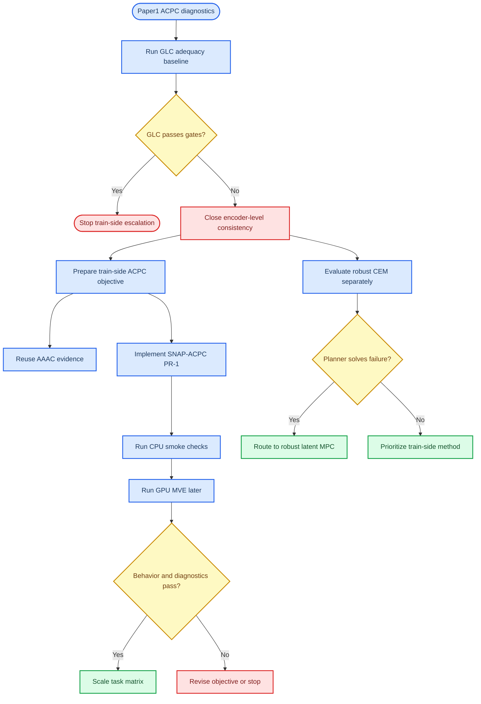

# Paper 2 Method Preparation Plan

_Paper2 method-selection and code-adaptation gate. Last updated: 2026-06-21._

---

## 1. Scope

This document consolidates the Paper2 preparation state after the Paper1 ACPC
diagnostics and the Reacher GLC adequacy baseline. It is a planning and gate
document, not a replacement for the detailed experiment logs.

Current role:

- record what has already been ruled out
- separate Paper2 method candidates from Paper1 diagnostic claims
- define the smallest safe next code-adaptation step
- keep train-side and planner-side directions from collapsing into one story

Source documents:

| Source | Role |
|---|---|
| [`paper1/PLAN.md`](../paper1/PLAN.md) | Paper1 framing, ACPC definition, Paper2 route map |
| [`experiments.md`](../experiments.md) | Experiment log, including the Reacher GLC adequacy result |
| [`plan_adaptive_resolution.md`](../plan_adaptive_resolution.md) | AAAC / APDC method evidence and ablations |
| [`planner_side_robustification_experiment_plan.md`](../planner_side_robustification_experiment_plan.md) | Planner-side robust CEM plan |
| [`train.py`](../train.py) | Current LeWM training implementation |
| [`config/train/lewm.yaml`](../config/train/lewm.yaml) | Current default-off loss switches |

## 2. Current evidence

### Paper1 diagnostic boundary

Paper1 has already established the core framing: visual robustness for latent
world-model control should be read as action-conditioned predictive consistency
plus a discriminability countercondition, not as encoder-level clean/noisy
latent closeness.

Implications for Paper2:

- Do not sell encoder invariance as the target.
- Do not claim a diagnostic is a robustness predictor by itself.
- Any method claim must be judged on behavior, ACPC/predictive drift, and
  discriminability.
- Target-view denoising is a negative scope result, not a finished fix.

### GLC adequacy baseline

GLC was implemented as the smallest related-work adequacy baseline:
clean/noisy encoder context tokens are pulled together with a self-bounded
auxiliary term and no explicit loss weight.

Status:

| Item | Status |
|---|---|
| Code path | Implemented |
| Runner overrides | Implemented |
| BN clean-anchor fix | Implemented |
| Reacher 0.08 behavior | Failed |
| Paper2 gate | Closed as negative baseline |

Key Reacher 0.08 result:

| Model | `pixels_std0.08` | `pixels_goal_std0.08` | Read |
|---|---:|---:|---|
| normal noise training | 83.67 | 81.00 | strong |
| old GLC | 19.67 | 18.33 | failed |
| BN-fix GLC | 24.00 | 12.00 | failed |
| target-origin branch | 24.33 |  | similar failure mode |

Decision:

- stop broad GLC sweeps
- keep GLC only as a negative adequacy baseline
- do not promote generic encoder-level consistency as a Paper2 method
- use the result to justify moving toward action-conditioned predictive losses

### AAAC / APDC evidence

The adaptive-resolution line already has substantially more evidence than GLC.
The important distinction is that AAAC should not be framed as "generic
consistency beats noise training." The stable claim is narrower:

- C1 is input-side global noise training.
- C2 is controller-side per-token consistency routing.
- C1 and C2 are complementary under same-noise comparisons.
- The specific `sigma + A_t` gate is a chosen instantiation, not a universal or
  mathematically unique controller.

Important evidence already recorded in
[`plan_adaptive_resolution.md`](../plan_adaptive_resolution.md):

| Claim | Evidence |
|---|---|
| Hetero loss is unsafe | PushT clean collapse under direct loss reweighting |
| Probe-only sigma is usable | Sigma head can be trained without breaking LeWM MSE |
| Gate logging needed BN discipline | Freeze-BN gate path fixed a stateful side effect |
| Per-token routing matters on PushT | `constant_w` loses 28.67pt on PushT px+goal 0.08 |
| C1+C2 is additive under same-noise comparison | PushT +9.58pt, TwoRoom +2.00pt, Reacher +9.67pt, Cube +8.00pt |

Paper2 implication:

- AAAC / APDC is already a serious Paper2 candidate.
- SNAP-ACPC should be treated as a minimal action-conditioned predictive
  objective candidate, not as a replacement for the existing AAAC evidence.
- If SNAP-ACPC is implemented, it should share the same guardrails: detached
  controllers, BN-safe auxiliary forwards, behavior gates, and discriminability
  checks.

### Planner-side robust CEM

Planner-side robust CEM is a separate Paper2 route. It should remain separate
from train-side method claims.

Status:

| Item | Status |
|---|---|
| `robust_cem.py` | Implemented |
| `config/eval/solver/robust_cem.yaml` | Implemented |
| System evaluation | Not started |
| Paper role | Planner-side alternative or causal intervention |

Decision:

- do not block train-side SNAP-ACPC preparation on robust CEM
- do not claim train-side necessity if robust CEM later solves the failure
- if robust CEM works strongly, Paper2 may become robust latent MPC rather than
  a new train-side objective

## 3. Method decision flow



## 4. Code-adaptation readiness

Current code already provides several pieces needed for the next step:

| Component | Current state | Next use |
|---|---|---|
| Paired-view forward | Available through GLC path | Reuse for predictive consistency |
| BN-safe clean anchor | Available via `preserve_batchnorm_eval` | Keep for any detached clean branch |
| Dataset transform bypass | Available for paired-view methods | Keep clean anchor in-batch |
| `snap_acpc` switch | Default-off one-step PR-1A path | Extend only after CPU smoke and GPU MVE |
| GLC metrics | Logged with `glc_` prefix | Kept separate from `snap_acpc_` metrics |
| `adaptive_consistency` | Existing encoder consistency with action-gate weights | Do not confuse with SNAP-ACPC predictive loss |
| Runner passthrough | GLC/AAAC/SNAP-ACPC available | Use `loss_snap_acpc_enabled=true` |

The next code adaptation should be narrow. It should not change default LeWM,
GLC, AAAC, robust CEM, or Paper1 artifact behavior.

## 5. PR-1 target

Working name: `loss.snap_acpc.enabled`.

Status: PR-1A is implemented in the current working tree and awaits GPU behavior
validation.

Minimum viable PR-1:

1. Keep the config default off.
2. Reuse paired-view infrastructure already introduced for GLC.
3. Keep `loss.pred.target_view=perturbed` as a requirement.
4. Encode clean branch under `no_grad` and BN freeze.
5. Keep normal pred loss and SIGReg on the noisy branch.
6. Compute predictive clean/noisy consistency after the predictor, not on
   encoder context tokens.
7. Bound the auxiliary term by current base pred MSE scale, as in GLC.
8. Log `snap_acpc_` metrics separately from `glc_` and `adaptive_`.
9. Run only CPU-safe verification in this environment.

Suggested PR-1A objective:

```text
base_loss = MSE(pred_noisy, target_noisy)
raw_acpc  = MSE(pred_noisy_context_rollout, pred_clean_context_rollout.detach())
loss      = base_loss + self_bounded_aux_loss(base_loss, raw_acpc)
```

Important constraints:

- PR-1A is a minimal predictive-consistency hook, not the final method.
- Multi-step rollout consistency should wait until the one-step hook is stable.
- Discriminability must at least be logged before any method claim is made.
- If the objective reduces predictive drift by collapsing action-relevant
  differences, it fails the Paper2 gate.

## 6. Gate criteria

Behavior gates:

| Gate | Requirement |
|---|---|
| Clean guardrail | No obvious clean degradation relative to matched baseline |
| Corrupted behavior | Improve `pixels_std0.08` or `pixels_goal_std0.08` under matched settings |
| Same-noise fairness | Compare against C1 at the same `image_noise.std_max` |
| GLC dominance check | Must beat GLC by a large margin |

Diagnostic gates:

| Gate | Requirement |
|---|---|
| ACPC drift | Reduce clean/noisy predictive drift under the same action sequence |
| Discriminability | Preserve inverse-dynamics / transition-resolution probes |
| Rank / resolution | Avoid effective-rank or local-resolution collapse |
| Predictor stability | Avoid large rollout T8 drift relative to normal noise training |

Stop conditions:

- If SNAP-ACPC behaves like GLC or target-origin, stop and do not broaden sweeps.
- If robust CEM alone solves the failure, do not overclaim train-side necessity.
- If clean success drops while robustness improves, treat it as a trade-off
  result, not a clean method win.

## 7. CPU-only preparation checklist

The current environment has no GPU, so the next adaptation should verify only
syntax and CPU-safe execution.

Planned checks:

```bash
python3 -m py_compile train.py jepa.py utils.py
bash -n run_trainer.sh
bash -n run_trainer_batch.sh
git diff --check -- train.py config/train/lewm.yaml run_trainer.sh run_trainer_batch.sh
```

Optional smoke, only if imports and small data access are available:

```bash
python train.py data=tworoom \
  exp_name=debug_snap_acpc_tworoom \
  trainer.max_epochs=1 \
  loader.batch_size=8 \
  loss.snap_acpc.enabled=true \
  image_noise.std_max=0.08
```

## 8. Open decisions before code

| Question | Current answer |
|---|---|
| Should GLC continue? | No, except for table-completeness eval rows |
| Should SNAP-ACPC be one-step or multi-step first? | One-step first, multi-step after smoke |
| Should SNAP-ACPC reuse AAAC gates immediately? | No, keep PR-1A simple; add routing later if needed |
| Should robust CEM block train-side work? | No, but its result can change the paper framing |
| Should `SNAP-ACPC` be the final method name? | Not yet; treat as a working name |

## 9. Immediate next step

Do not broaden this into a method rewrite yet. PR-1A now provides the
default-off one-step predictive consistency path, runner passthrough, and logs.
The immediate next step is GPU behavior validation against matched noise
baselines, followed by Paper1 diagnostics if the behavior gate is non-negative.
