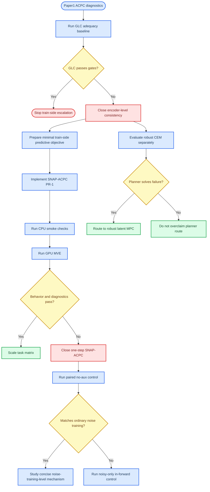

# Paper 2 Method Preparation Plan

_Paper2 method-selection and code-adaptation gate. Last updated: 2026-06-23._

---

## 1. Scope

This document consolidates the Paper2 preparation state after the Paper1 ACPC
diagnostics, the Reacher GLC adequacy baseline, the one-step SNAP-ACPC
negative result, and the paired no-aux equivalence-control failure. It is a
planning and gate document, not a replacement for the detailed experiment logs.

Current role:

- record what has already been ruled out
- separate Paper2 method candidates from Paper1 diagnostic claims
- define the smallest safe next code-adaptation step
- keep train-side and planner-side directions from collapsing into one story

Source documents:

| Source | Role |
|---|---|
| [`paper1/PLAN.md`](../paper1/PLAN.md) | Paper1 framing, ACPC definition, Paper2 route map |
| [`experiments.md`](../experiments.md) | Experiment log, including the Reacher GLC, SNAP-ACPC, and paired no-aux results |
| [`plan_adaptive_resolution.md`](../plan_adaptive_resolution.md) | Archived AAAC / APDC evidence and ablations; not the next default route |
| [`planner_side_robustification_experiment_plan.md`](../planner_side_robustification_experiment_plan.md) | Planner-side robust CEM plan |
| [`train.py`](../train.py) | Current LeWM training implementation |
| [`config/train/lewm.yaml`](../config/train/lewm.yaml) | Current default-off loss switches |

## 2. Current evidence

### Paper1 diagnostic boundary

Paper1 has already established the core framing: visual robustness for latent
world-model control should be read as action-conditioned predictive consistency
plus a discriminability countercondition, not as encoder-level clean/noisy
latent closeness.

Implications for Paper2:

- Do not sell encoder invariance as the target.
- Do not claim a diagnostic is a robustness predictor by itself.
- Any method claim must be judged on behavior, ACPC/predictive drift, and
  discriminability.
- Target-view denoising is a negative scope result, not a finished fix.

### GLC adequacy baseline

GLC was implemented as the smallest related-work adequacy baseline:
clean/noisy encoder context tokens are pulled together with a self-bounded
auxiliary term and no explicit loss weight.

Status:

| Item | Status |
|---|---|
| Code path | Implemented |
| Runner overrides | Implemented |
| BN clean-anchor fix | Implemented |
| Reacher 0.08 behavior | Failed |
| Paper2 gate | Closed as negative baseline |

Key Reacher 0.08 result:

| Model | `pixels_std0.08` | `pixels_goal_std0.08` | Read |
|---|---:|---:|---|
| normal noise training | 83.67 | 81.00 | strong |
| old GLC | 19.67 | 18.33 | failed |
| BN-fix GLC | 24.00 | 12.00 | failed |
| target-origin branch | 24.33 |  | similar failure mode |

Decision:

- stop broad GLC sweeps
- keep GLC only as a negative adequacy baseline
- do not promote generic encoder-level consistency as a Paper2 method
- use the result to justify moving toward action-conditioned predictive losses

### AAAC / APDC archived route

The adaptive-resolution line remains useful background evidence, but it is not
the next Paper2 route. The current decision is to avoid returning to AAAC as
the mainline because it does not give the paper what is now needed:

- it is not a concise mechanism relative to ordinary input-side noise training
- it depends on a multi-part controller route (`sigma`, action sensitivity,
  per-token routing, BN-safe side paths)
- its evidence is not a clean, simple, noise-training-dominating result
- it risks shifting Paper2 away from the sharper question exposed by Paper1:
  why ordinary noise training works so well, and what minimal predictive
  mechanism can match or improve it

Important evidence already recorded in
[`plan_adaptive_resolution.md`](../plan_adaptive_resolution.md) should remain
available for provenance, but should be read as archived route evidence rather
than as the default next implementation target.

### Planner-side robust CEM

Planner-side robust CEM is a separate Paper2 route. It should remain separate
from train-side method claims.

Status:

| Item | Status |
|---|---|
| `robust_cem.py` | Implemented |
| `config/eval/solver/robust_cem.yaml` | Implemented |
| System evaluation | Not started |
| Paper role | Planner-side alternative or causal intervention |

Decision:

- do not use robust CEM to re-open AAAC or one-step SNAP-ACPC by default
- do not claim train-side necessity if robust CEM later solves the failure
- if robust CEM works strongly, Paper2 may become robust latent MPC rather than
  a new train-side objective

### SNAP-ACPC PR-1A result

SNAP-ACPC PR-1A was implemented as a minimal one-step predictive consistency
baseline: clean and noisy branches share the same batch and actions, normal
LeWM prediction loss stays on the noisy branch, and a self-bounded auxiliary
term matches the noisy predicted latent to a detached clean predicted latent.

Main Reacher run:

```text
/home/ag/dataset/ag_data/data/world_model/quentinll/lewm-reacher/ckpt/reacher_lewm_snap_acpc_noise_0to008_p1
```

Behavior at `image_noise.std_max=0.08`:

| Model | `pixels_std0.08` | `pixels_goal_std0.08` | Read |
|---|---:|---:|---|
| normal noise training | 83.67 | 81.00 | strong |
| old GLC | 19.67 | 18.33 | failed |
| BN-fix GLC | 24.00 | 12.00 | failed |
| target-origin branch | 24.33 |  | failed |
| SNAP-ACPC PR-1A | 24.67 | 19.67 | failed |

Diagnostics at the same Reacher setting do not rescue the result:

| Metric | Normal noise 0.08 | SNAP-ACPC PR-1A |
|---|---:|---:|
| noise angle median, std 0.08 all frames | 2.55 | 80.81 |
| CKA, std 0.08 all frames | 0.998 | 0.495 |
| predictor rollout T8 L2, std 0.08 | 0.252 | 16.422 |
| inverse-dynamics probe R2 | 0.177 | 0.167 |
| transition ratio L2 | 0.383 | 0.373 |

Decision:

- close one-step self-bounded SNAP-ACPC as a negative baseline
- do not broaden this PR-1A path into larger sweeps by default
- do not route back to AAAC/APDC as the next mainline
- treat normal noise training as the empirical bar that Paper2 must explain,
  simplify, or beat under matched settings

### Paired no-aux equivalence-control result

The paired no-aux control was run to test whether the paired clean/noisy
in-forward path behaves like ordinary `TransformDataset` noise training when
no auxiliary loss is added.

Main Reacher run:

```text
/home/ag/dataset/ag_data/data/world_model/quentinll/lewm-reacher/ckpt/reacher_lewm_paired_noaux_noise_0to008_p1
```

The rerun config is correct: `loss.paired_view_control.enabled=true`,
`loss.generic_latent_consistency.enabled=false`, `loss.snap_acpc.enabled=false`,
`loss.pred.target_view=perturbed`, and `image_noise.std_max=0.08`.

Behavior:

| Model | `pixels_std0.08` | `pixels_goal_std0.08` | Read |
|---|---:|---:|---|
| normal noise training | 83.67 | 81.00 | strong |
| BN-fix GLC | 24.00 | 12.00 | failed |
| SNAP-ACPC PR-1A | 24.67 | 19.67 | failed |
| paired no-aux | 24.67 | 14.67 | failed |

Diagnostics:

| Metric | Normal noise 0.08 | Paired no-aux |
|---|---:|---:|
| predictor rollout T8 L2 | 0.357 | 14.875 |
| CKA at max std | 0.997 | 0.433 |
| transition ratio L2 | 0.383 | 0.369 |
| inverse-dynamics probe R2 | 0.177 | 0.165 |

Decision:

- close paired no-aux as an equivalence-control failure
- do not attribute GLC/SNAP failure primarily to auxiliary-loss design
- debug the training data path before adding another consistency objective
- split the next control into noisy-only in-forward perturbation, without a
  clean branch and without any auxiliary loss

## 3. Method decision flow



## 4. Code-adaptation readiness

Current code already provides several pieces needed for the next step:

| Component | Current state | Next use |
|---|---|---|
| Paired-view forward | Available through GLC path | Reuse for predictive consistency |
| BN-safe clean anchor | Available via `preserve_batchnorm_eval` | Keep for any detached clean branch |
| Dataset transform bypass | Available for paired-view methods | Keep clean anchor in-batch |
| `snap_acpc` switch | Default-off one-step PR-1A path | Kept for negative-baseline reproducibility |
| `paired_view_control` switch | Default-off paired clean/noisy no-aux path | Test paired-view path equivalence without auxiliary loss |
| `in_forward_noise_control` switch | Default-off noisy-only in-forward path | Test `TransformDataset` versus forward-time perturbation semantics |
| GLC metrics | Logged with `glc_` prefix | Kept separate from `snap_acpc_` metrics |
| `adaptive_consistency` | Existing encoder consistency with action-gate weights | Archived AAAC route, not next mainline |
| Runner passthrough | GLC/AAAC/SNAP-ACPC available | Kept for reproducibility and controlled reruns |

Any next code adaptation should be narrow and must first state how it can
explain, simplify, or beat ordinary noise training. It should not change default
LeWM, GLC, AAAC, robust CEM, or Paper1 artifact behavior.

## 5. PR-1 target

Working name: `loss.snap_acpc.enabled`.

Status: PR-1A is implemented and has failed the first Reacher behavior and
diagnostic gate.

Minimum viable PR-1:

1. Keep the config default off.
2. Reuse paired-view infrastructure already introduced for GLC.
3. Keep `loss.pred.target_view=perturbed` as a requirement.
4. Encode clean branch under `no_grad` and BN freeze.
5. Keep normal pred loss and SIGReg on the noisy branch.
6. Compute predictive clean/noisy consistency after the predictor, not on
   encoder context tokens.
7. Bound the auxiliary term by current base pred MSE scale, as in GLC.
8. Log `snap_acpc_` metrics separately from `glc_` and `adaptive_`.
9. Run only CPU-safe verification in this environment.

Suggested PR-1A objective:

```text
base_loss = MSE(pred_noisy, target_noisy)
raw_acpc  = MSE(pred_noisy_context_rollout, pred_clean_context_rollout.detach())
loss      = base_loss + self_bounded_aux_loss(base_loss, raw_acpc)
```

Important constraints:

- PR-1A is a minimal predictive-consistency hook, not the final method.
- Multi-step rollout consistency is not automatically approved by the PR-1A
  failure; it needs a separate, concise hypothesis.
- Discriminability must at least be logged before any method claim is made.
- If the objective reduces predictive drift by collapsing action-relevant
  differences, it fails the Paper2 gate.

## 6. Gate criteria

Behavior gates:

| Gate | Requirement |
|---|---|
| Clean guardrail | No obvious clean degradation relative to matched baseline |
| Corrupted behavior | Improve `pixels_std0.08` or `pixels_goal_std0.08` under matched settings |
| Same-noise fairness | Compare against C1 at the same `image_noise.std_max` |
| GLC dominance check | Must beat GLC by a large margin |

Diagnostic gates:

| Gate | Requirement |
|---|---|
| ACPC drift | Reduce clean/noisy predictive drift under the same action sequence |
| Discriminability | Preserve inverse-dynamics / transition-resolution probes |
| Rank / resolution | Avoid effective-rank or local-resolution collapse |
| Predictor stability | Avoid large rollout T8 drift relative to normal noise training |

Stop conditions:

- If SNAP-ACPC behaves like GLC or target-origin, stop and do not broaden sweeps.
- If robust CEM alone solves the failure, do not overclaim train-side necessity.
- If clean success drops while robustness improves, treat it as a trade-off
  result, not a clean method win.
- If a proposed route is materially more complex than ordinary noise training
  without a clear matched-setting advantage, do not make it the Paper2 mainline.

## 7. CPU-only preparation checklist

The current environment has no GPU, so the next adaptation should verify only
syntax and CPU-safe execution.

Planned checks:

```bash
python3 -m py_compile train.py jepa.py utils.py
bash -n run_trainer.sh
bash -n run_trainer_batch.sh
git diff --check -- train.py config/train/lewm.yaml run_trainer.sh run_trainer_batch.sh
```

Optional smoke, only if imports and small data access are available:

```bash
python train.py data=tworoom \
  exp_name=debug_in_forward_noise_tworoom \
  trainer.max_epochs=1 \
  loader.batch_size=8 \
  loss.in_forward_noise_control.enabled=true \
  image_noise.std_max=0.08
```

## 8. Open decisions before code

| Question | Current answer |
|---|---|
| Should GLC continue? | No, except for table-completeness eval rows |
| Should one-step SNAP-ACPC continue? | No, close as a negative baseline |
| Should SNAP-ACPC move to multi-step automatically? | No, only with a new concise hypothesis |
| Should paired-view infrastructure be checked? | Already checked; paired no-aux failed |
| Should the in-forward perturbation path be checked next? | Yes, run noisy-only in-forward control |
| Should the route return to AAAC/APDC? | No, archived evidence only; not the next mainline |
| Should robust CEM block train-side work? | No, but its result can change the paper framing |
| Should `SNAP-ACPC` be the final method name? | Not yet; treat as a working name |

## 9. Immediate next step

Record paired no-aux as a failed equivalence control. Before proposing another
loss, run the noisy-only in-forward control with
`loss.in_forward_noise_control.enabled=true`. This isolates whether applying
configured noise inside `lejepa_forward`, without a clean branch and without
auxiliary loss, is behaviorally equivalent to ordinary `TransformDataset`
noise training.

Gate:

- if noisy-only in-forward matches ordinary noise training, the next suspect is
  the extra clean-anchor paired forward and its interaction with training
- if noisy-only in-forward also fails, the issue is perturbation placement or
  semantics versus `TransformDataset`
- only after this control should the next Paper2 step return to method
  hypothesis design around the ordinary noise-training mechanism
