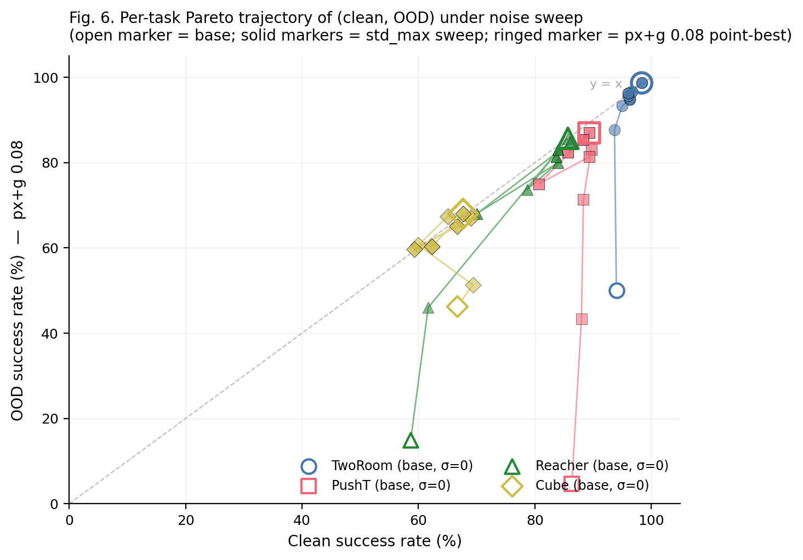
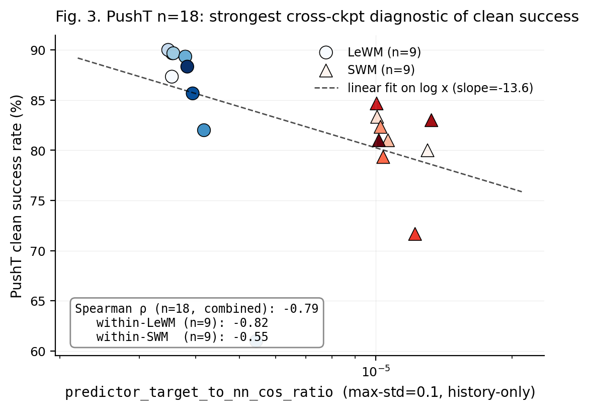
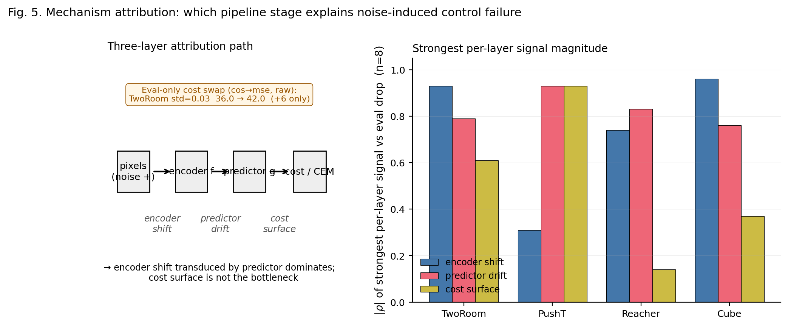

# Latent Prediction Is Not Visual Robustness: Diagnosing the Invariance–Resolution Trade-off in JEPA World Models for Control

*Chinese version: [paper_invariance_resolution_tradeoff_zh.md](paper_invariance_resolution_tradeoff_zh.md).*

---

## Abstract

Joint-Embedding Predictive Architectures (JEPAs) are commonly *believed* to learn abstract, invariant world representations: by predicting in latent space rather than reconstructing pixels, the encoder is expected to discard visual redundancy and noise. This expectation is a *community heuristic* rather than a published guarantee — to our knowledge no JEPA work formally claims pixel-noise robustness for control. We test the implicit assumption on **LeWorldModel (LeWM)**, a published JEPA world model, across four manipulation and navigation tasks (PushT, TwoRoom, Reacher, Cube) and eight levels of train-time pixel-noise augmentation. We find three things:

1. **Visual OOD collapse in JEPA + CEM control.** Without noise-aware training, LeWM collapses under mild pixel noise: PushT control success drops from 86.33% (clean) to 4.67% (Gaussian std = 0.08, near-random); TwoRoom drops from 94.00% to 50.00%.

2. **No global-optimal noise level exists.** Tasks respond very differently to noise augmentation. Visually redundant navigation (TwoRoom) benefits from heavy noise (point-best at std = 0.008), whereas contact-heavy control (PushT) reaches peak *clean* at std = 0.003 but peak *robustness* at std = 0.006 — clean and robust optima dissociate within a single task.

3. **A five-layer diagnostic protocol explains the underlying compression mechanism.** Instrumenting encoder shift, encoder geometry, predictor sensitivity, latent-noise response, and task resolution traces noise-induced control failure to a representational chain: representation compression (drop in effective rank) → loss of transition-key resolution (drop in `transition_resolution_ratio`) → loss of controllability (drop in `id_probe_r²`). When used as a **cross-checkpoint predictor**, the strongest single diagnostic (`predictor_target_to_nn_cos_ratio_at_max_std`) tracks a **residual ckpt-quality signal beyond the sweep-level `std_max` effect** (partial Spearman ρ = −0.59 on clean and −0.41 on px+g 0.08 after conditioning on `std_max`, on the n = 9 LeWM PushT sweep with unified 3-seed × 100 eval). The metric does *not* predict OOD drop beyond what training `std_max` already explains: the apparent ρ(metric, drop) = −0.77 collapses to +0.06 once `std_max` is partialled out. The diagnostic toolkit usefully ranks checkpoints after controlling for the sweep-level `std_max` trend, but does *not* substitute for actually training with noise when the goal is OOD robustness.

This paper does not propose a new training algorithm. Its contribution is (i) a systematic empirical study of JEPA + CEM visual OOD failure, (ii) a reproducible diagnostic toolkit, and (iii) an honest delineation of what cross-ckpt diagnostics can and cannot predict.

**Keywords**: world models; JEPA; visual robustness; representation diagnostics; invariance–resolution trade-off.

---

## 1 Introduction

### 1.1 The implicit invariance heuristic and where it breaks

Since Yann LeCun proposed the Joint-Embedding Predictive Architecture (JEPA) [1], this paradigm has been advanced as a direction for self-supervised learning. Unlike generative models (VAEs, diffusion), JEPA does not reconstruct pixels; it predicts future *representations* in latent space. The motivating intuition — that predicting "what is invariant" rather than "what pixels look like" should yield abstract representations that discard visual redundancy and noise — is now part of the field's *informal vocabulary* in talks, blog posts, and survey articles [2,3].

We emphasise that this is a heuristic rather than a published guarantee. To our knowledge, no JEPA paper has *formally claimed* visual-OOD robustness for control-relevant downstream tasks. I-JEPA [2] and V-JEPA [3,4] established strong visual representations on ImageNet and video via masked prediction; LeWorldModel (LeWM) [5] extended the framework to end-to-end stable world-model training across four robotic control tasks. Existing robustness studies have probed JEPA only on image classification (N-JEPA [8]), synthetic 1D distractors (VJEPA [9]), or medical ultrasound (US-JEPA [10]); none on **JEPA-based control** under realistic pixel noise.

This leaves a basic operational question open: **if the input image is degraded by sensor noise, lighting change, or camera jitter, does a JEPA + CEM world model still plan and act reliably?**

The data say no. On PushT (2D pushing), the untrained-with-noise LeWM achieves 86.33% on clean images but falls to 4.67% under Gaussian pixel noise of std = 0.08 — essentially random. TwoRoom (2D navigation) drops from 94.00% to 50.00%. Latent prediction alone does not, in this regime, confer the visual robustness the community heuristic would predict.

### 1.2 The core tension: no globally optimal noise level

A natural remedy for the fragility above is input-side noise augmentation during training, a technique long-validated in supervised and contrastive learning [6,7]. But a deeper question arises: **does there exist a single, universal noise level that is optimal across tasks?**

A systematic sweep across four tasks at eight levels of `std_max ∈ {0.001, …, 0.008}` answers no:

- **TwoRoom** (visually redundant navigation): clean success rises monotonically with noise, peaking at std = 0.008 (98.33% / 98.67%).
- **PushT** (contact-heavy manipulation): clean peaks at std = 0.003 (89.67%), but robustness at px+goal 0.08 peaks at std = 0.006 (87.00%) — clean and robust optima dissociate.
- **Reacher** (continuous reaching): lies on a 0.002–0.006 plateau; clean point-best is at std = 0.006 (86.00%), while px+goal 0.08 point-best is at std = 0.002 (85.67%). Very low noise (0.001) is statistically indistinguishable from base (61.67% vs 58.67%, within across-seed std of ~2.5 pts), suggesting a *minimum* noise threshold before the task starts to benefit.
- **Cube** (structured manipulation): noise sweep is weakest; no monotone trend on clean.

This finding exposes a fundamental tension: **global noise augmentation cannot distinguish "background visual redundancy that should be made invariant" from "control-relevant features that should retain resolution".**

### 1.3 Contributions

The paper makes the following contributions:

**Contribution 1: A systematic quantification of visual-OOD fragility of JEPA + CEM control across four representative tasks.** We sweep 4 tasks × 8 noise levels, and evaluate all 36 checkpoints under a unified 3-evaluation-seed × 100-trajectory protocol, for 300 trajectories per condition.

**Contribution 2: The "invariance–resolution trade-off" concept and a five-layer diagnostic protocol that operationalises it.** We define five complementary diagnostic layers (encoder shift, encoder geometry, predictor sensitivity, latent-noise response, task resolution) with 17+ concrete metrics, validated by Spearman correlations on the 4-task × n = 9 LeWM sweep under unified 3-seed × 100 evaluation, with partial correlations conditioned on training noise to separate residual ckpt-quality signal from the monotone sweep trend induced by `std_max`.

**Contribution 3: A mechanistic account of why global noise augmentation has limited returns.** Through the diagnostic layers we show that on TwoRoom the gains come from desirable representation compression (drop in effective rank) — a low-dimensional discrete task does not need high resolution — whereas in PushT the same amount of compression at heavy noise drives `transition_resolution_ratio` from 0.30 to 0.10 and `id_probe_r²` from 0.77 to 0.27, erasing task-relevant state information.

**Contribution 4: A clean negative result on automated transition reweighting.** Direct heteroscedastic-NLL training (using predicted uncertainty σ to weight transitions) on PushT collapses clean success from 86.33% to 13.33%, showing that "hard" transitions and "unimportant" transitions are not interchangeable in contact-heavy control.

### 1.4 Organisation

§2 reviews related work; §3 defines the LeWM background, the noise protocol, and the diagnostic framework; §4 reports the experimental findings; §5 discusses mechanism and implications; §6 concludes.

---

## 2 Related Work

### 2.1 JEPA and latent world models

JEPA [1] predicts in latent space rather than reconstructing pixels. I-JEPA [2] predicts target representations from a masked context; V-JEPA [3,4] extends the framework to video understanding and video-driven world modelling; LeWM [5] is the first end-to-end stable JEPA world model. It uses **SIGReg** (Sketch Isotropic Gaussian Regularizer) — random projections plus Epps–Pulley empirical-characteristic-function matching [19] — to prevent representation collapse without requiring batch normalisation, and it validates latent-space planning on PushT, TwoRoom, Reacher, and Cube.

**Relation to this paper.** LeWM is the baseline system in our experiments. The original LeWM paper reports a Violation-of-Expectation experiment showing the model is sensitive to physical perturbations (object teleportation) but not to visual perturbations (colour change). Note however that (i) VoE measures prediction error (surprise), not control success rate, and (ii) colour change and pixel-level Gaussian noise are distinct corruptions. We give the first picture, to our knowledge, of LeWM's control success rate under pixel-noise corruption.

### 2.2 Robustness studies of JEPA

N-JEPA [8] introduces diffusion-noise augmentation into I-JEPA via noise-to-teacher and context-to-noise losses, improving linear-probing robustness on ImageNet. VJEPA [9] tests a "Noisy TV" distractor on synthetic 1D signals and reports JEPA retains R² > 0.84 under high noise. US-JEPA [10] tests Gaussian blur, contrast reduction, and speckle noise on medical ultrasound.

**Relation.** These works study image classification (N-JEPA), synthetic signals (VJEPA), or medical-image analysis (US-JEPA). **None studies the pixel-noise robustness of a JEPA world model on robotic control tasks.** Furthermore, VJEPA's optimistic conclusion (R² > 0.84 in 1D) contrasts with our control-time observation (success rate → 4.67%) — suggesting that the "natural robustness" of JEPA may be an artefact of evaluation modality.

### 2.3 World models and input augmentation

In RL world-model literature, DreamerV3 [11] and TD-MPC2 [12] rely on convolutional inductive bias for some implicit noise tolerance. ViGMO [13] tests Gaussian noise and blur on DMC tasks, finds "sensor noise is a fundamentally different distribution shift", and proposes a latent-consistency loss.

**Relation.** ViGMO addresses model-based RL (DrQ-v2, DreamerV3), not JEPA architectures. Its conclusion that "sensor noise is special" is directionally aligned with ours; our contribution adds *mechanistic decomposition* via the five-layer diagnostic, not just performance reporting.

### 2.4 The invariance–resolution tension

Tamkin et al. [14] argue, in the contrastive-learning context, that "label-destroying augmentations can be useful" and that augmentations act as feature dropout rather than pure invariance inducers. Zhang et al. [15] note that overly strong augmentation imposes excess invariance and erases fine-grained downstream information.

**Relation.** These insights are well-established in contrastive learning for classification, but their manifestation in *latent predictive world models* — where the downstream task is planning rather than discrimination — has not been systematically studied. The present paper extends the discussion from classification to control, with a quantitative framework.

### 2.5 Representation diagnostics and collapse analysis

Self-supervised learning broadly uses effective rank [16], condition number, and participation ratio to diagnose dimensional collapse [17]. Next-Latent Prediction [18] uses effective latent rank to assess world-model compactness. VICReg [20] provides an anti-collapse regularizer distinct from SIGReg.

**Relation.** Individual metrics (effective rank, NN distance, CKA) are not new. Our contribution is to **combine them into a coherent five-layer protocol with per-token noise sensitivity, cross-ckpt correlation, and a partial-correlation validation scheme conditioning on training noise** that ties representation properties to control performance.

---

## 3 Background and Diagnostic Framework

### 3.1 LeWorldModel baseline

LeWM [5] is an end-to-end JEPA world model trained with two terms only:

$$
\mathcal{L}_{\text{LeWM}} = \mathcal{L}_{\text{pred}} + \lambda \cdot \mathcal{L}_{\text{SIGReg}}
$$

where $\mathcal{L}_{\text{pred}}$ is the latent-space MSE between predicted and target representations. **SIGReg (Sketch Isotropic Gaussian Regularizer)** projects each latent onto $M$ unit-norm random directions, computes the Epps–Pulley empirical-characteristic-function distance [19] between each projection and $\mathcal{N}(0,1)$, and aggregates with the Gauss-window weights — preventing collapse without explicit BatchNorm. (The Cramér–Wold theorem motivates the construction: equality of high-dimensional distributions reduces to equality of all one-dimensional projections of their characteristic functions.) Inference uses the Cross-Entropy Method (CEM) for latent-space MPC.

### 3.2 Input-side noise augmentation

We add per-frame Gaussian noise to the LeWM input pipeline via `utils.py::AddNormalizedGaussianNoise`. Each frame is independently noised: Bernoulli$(p)$ decides whether the frame is corrupted, and if so the standard deviation is drawn from Uniform$(0, \text{std\_max})$. We fix $p = 1.0$ and sweep $\text{std\_max} \in \{0.001, \dots, 0.008\}$ (eight levels).

Evaluation comprises clean and noised conditions. Noised conditions use two intensities:

- **pixels+goal 0.05**: Gaussian noise of std = 0.05 on both the pixels and the goal image.
- **pixels+goal 0.08**: same, with std = 0.08.

### 3.3 Five-layer diagnostic framework

To understand how noise augmentation affects the latent representation, we define a five-layer diagnostic protocol:

**Layer 1 — Encoder shift.** Quantifies the direction and magnitude of latent displacement induced by input noise. Key metrics:
- `noise_angle_deg` — angle between clean and noisy latents.
- `noise_l2` — L2 displacement.
- `noise_to_nn_cos_ratio` — noise displacement relative to local NN cosine distance.
- `noise_angle_slope` — slope of angle vs noise std.

**Layer 2 — Encoder geometry.** Quantifies global structure of the latent space. Key metrics:
- `clean_nn_cos_dist` — local cosine distance to nearest neighbour.
- `clean_effective_rank` — effective rank of the latent covariance.
- `cka_linear_at_max_std` — Centered Kernel Alignment between clean and noisy latents.

**Layer 3 — Predictor sensitivity.** Quantifies how the predictor amplifies input noise. Key metrics:
- `predictor_target_to_nn_cos_ratio_at_max_std` — single-step predictor target shift normalised by clean NN distance. **The strongest cross-ckpt diagnostic we find.**
- `predictor_rollout_drift_T(T)` — autoregressive drift over T steps.

**Layer 4 — Latent-noise response.** Inject noise directly in the latent `z` (bypassing the encoder) to isolate predictor and cost contributions:
- `latent_cost_surface_slope_z` — slope of planning cost under perturbations of the goal latent.
- `latent_robust_radius_z` — empirical robust radius in latent space.

**Layer 5 — Task resolution.** Quantifies how much control-relevant information the latent retains:
- `transition_resolution_ratio_cos` / `transition_resolution_ratio_l2` — distinguishability of consecutive latents.
- `id_probe_r²` — R² of a linear probe predicting state ID from the latent (a controllability proxy).

### 3.4 Cross-checkpoint validation protocol

To ensure the diagnostic signals are not spurious training artefacts, we adopt two complementary analyses on the same LeWM PushT sweep:

- **LeWM n = 9 sweep with partial correlation.** All 9 LeWM checkpoints per task (base + std_max ∈ {0.001, …, 0.008}). Compute Spearman ρ and *partial Spearman ρ conditioned on `std_max`*. The partialling step matters: many diagnostics correlate with control performance only because both quantities co-vary with the training noise level along the sweep. The relevant test is whether a diagnostic retains a residual ckpt-quality signal after conditioning on `std_max`.

We report **both** the raw Spearman and the partial-on-`std_max` quantities. The raw ρ tells you "which checkpoint over the entire sweep behaves better"; the partial ρ tells you whether a diagnostic retains a **residual ckpt-quality signal after removing the monotone trend associated with `std_max`**. The two questions are distinct, and we will see in §4.5 that they have markedly different answers for the same metric.

> A larger cross-architecture protocol (varying the latent geometry of the world model itself) is left to future work; we will add a non-JEPA baseline (DreamerV3 or TD-MPC2 on the same tasks) in a follow-up version.

---

## 4 Experiments

### 4.1 Setup

**Tasks.** PushT (2D pushing), TwoRoom (2D navigation), Reacher (2D arm), Cube (3D manipulation).

**Baselines.** LeWM-base (no noise) and LeWM+noise (8-level sweep).

**Checkpoints.** The 36 checkpoints in this paper correspond to one trained model per `(task, std_max)` configuration.

**Evaluation seeds.** Each checkpoint is evaluated with 3 evaluation seeds (42 / 43 / 44), with 100 trajectories per seed.

**Evaluation protocol.** All success rates in this paper — clean and noised, across all 36 ckpts (4 tasks × {base, std 0.001..0.008}) — are computed under a single protocol: `n = 3` seeds (42/43/44), `num_eval = 100` trajectories per seed (300 trajectories per condition per ckpt). Every cell of Tables 1 and 2 is mean ± across-seed population std over `n = 3`, matching `assets/paper1_data/canonical_evals_20260517.json`. Raw per-seed metrics are stored at `<ckpt>/eval_results/<cond>_seed{42,43,44}_metrics.txt`; the aggregated source-of-truth for downstream evaluation analysis lives at `assets/paper1_data/canonical_evals_20260517.json`. The released diagnostic source-of-truth for Figure 3 and Tables 4/4b/5 is `assets/paper1_data/canonical_diagnostics_20260517.json`.

**Hardware.** Single NVIDIA A100 (80 GB) GPU; training takes 2–4 hours per task per configuration.

**Main figures.** This paper has 6 main figures rendered by `tools/paper1_figs.py` and stored in `assets/paper1_figs/`. Figure 1 (the hero) summarises the OOD cliff and per-task px+goal 0.08 point-best recovery; Figure 2 shows the per-task noise sweep; Figure 3 shows the LeWM PushT scatter of the strongest cross-ckpt diagnostic against clean vs OOD-drop; Figure 4 shows the per-task representative diagnostic radar; Figure 5 shows the mechanism schematic; Figure 6 shows the per-task Pareto trajectory of (clean, OOD) under the noise sweep.

### 4.2 JEPA control fragility under visual OOD

Table 1 reports LeWM-base success rates under clean and noised eval (mean ± std across 3 seeds × 100 evaluations).

**Table 1. LeWM-base under visual OOD (mean ± std; 3 seeds × 100 evaluations).**

| Task | clean | px+goal 0.05 | px+goal 0.08 | clean → 0.08 drop |
|---|---:|---:|---:|---:|
| TwoRoom | 94.00 ± 3.56 | 61.33 ± 5.31 | 50.00 ± 1.41 | **−44.00** |
| PushT   | 86.33 ± 2.36 | 12.00 ± 4.55 |  4.67 ± 2.05 | **−81.66** |
| Reacher | 58.67 ± 1.25 | 27.00 ± 5.10 | 15.00 ± 2.16 | **−43.67** |
| Cube    | 66.67 ± 2.62 | 53.33 ± 3.30 | 46.33 ± 3.68 | **−20.34** |


LeWM-base is strong on clean images (especially TwoRoom and PushT), but visual std = 0.05 applied to pixels and goal jointly already produces large drops on all tasks. PushT loses 74+ pts (down to near-random 4.67% at std = 0.08), TwoRoom 30+ pts, Reacher 30+ pts, Cube ~13 pts (at std = 0.05). **This is not a marginal phenomenon**: a JEPA + CEM world model without noise-aware training has essentially no resistance to visual corruption. The drop pattern across tasks is informative: Cube degrades least (−20.34 pt at std = 0.08) — structured manipulation has some natural robustness to pixel noise — whereas PushT degrades most catastrophically (−81.66 pt), confirming that contact-heavy continuous control is most sensitive to visual precision.

### 4.3 Noise augmentation closes the gap — at the cost of task-specific tuning

Table 2 reports the complete 8-level sweep across tasks.

**Table 2. LeWM+noise sweep (4 tasks × {clean, px+g 0.08}).** All values are success rate ± across-seed std (in pts), aggregated over `n = 3` seeds (42/43/44) × 100 evaluation trajectories per seed — 300 trajectories per cell.

**(a) Clean success rate (%).**

| std_max | TwoRoom | PushT | Reacher | Cube |
|---|---:|---:|---:|---:|
| 0 (base) | 94.00 ± 3.56 | 86.33 ± 2.36 | 58.67 ± 1.25 | 66.67 ± 2.62 |
| 0.001 | 93.67 ± 3.30 | 88.00 ± 3.74 | 61.67 ± 2.49 | 69.33 ± 0.47 |
| 0.002 | 95.00 ± 2.83 | 88.33 ± 2.62 | 85.67 ± 2.49 | 60.00 ± 1.63 |
| 0.003 | 96.33 ± 3.30 | 89.67 ± 1.70† | 78.67 ± 1.25 | 65.00 ± 1.63 |
| 0.004 | 96.33 ± 2.05 | 89.33 ± 2.05 | 84.00 ± 2.94 | 69.00 ± 3.74 |
| 0.005 | 96.00 ± 2.83 | 80.67 ± 4.78 | 70.00 ± 2.16 | 59.33 ± 0.94 |
| 0.006 | 96.67 ± 2.05 | 89.33 ± 2.05 | 86.00 ± 2.94† | 66.67 ± 2.05 |
| 0.007 | 96.00 ± 1.63 | 85.67 ± 3.09 | 83.67 ± 3.30 | 67.67 ± 0.94 |
| 0.008 | 98.33 ± 0.47† | 88.33 ± 2.87 | 84.00 ± 0.82 | 62.33 ± 1.25 |

**(b) Pixels+goal noise std = 0.08 success rate (%).**

| std_max | TwoRoom | PushT | Reacher | Cube |
|---|---:|---:|---:|---:|
| 0 (base) | 50.00 ± 1.41 |  4.67 ± 2.05 | 15.00 ± 2.16 | 46.33 ± 3.68 |
| 0.001 | 87.67 ± 1.89 | 43.33 ± 3.09 | 46.00 ± 1.63 | 51.33 ± 5.79 |
| 0.002 | 93.33 ± 0.94 | 71.33 ± 3.68 | 85.67 ± 1.70‡ | 60.67 ± 0.47 |
| 0.003 | 94.67 ± 2.87 | 83.00 ± 3.74 | 73.67 ± 0.47 | 67.33 ± 1.89 |
| 0.004 | 95.00 ± 2.45 | 81.33 ± 2.87 | 80.00 ± 1.41 | 67.00 ± 3.56 |
| 0.005 | 95.67 ± 2.36 | 75.00 ± 6.48 | 68.00 ± 3.56 | 59.67 ± 2.05 |
| 0.006 | 96.67 ± 2.49 | 87.00 ± 3.74‡ | 84.67 ± 4.03 | 65.00 ± 2.94 |
| 0.007 | 96.33 ± 2.05 | 82.33 ± 4.64 | 81.33 ± 1.25 | 68.00 ± 1.41‡ |
| 0.008 | 98.67 ± 0.94‡ | 85.33 ± 2.62 | 83.00 ± 4.32 | 60.33 ± 0.94 |

Reading guidance:
- `†` marks the clean point-best in that task column.
- `‡` marks the px+goal 0.08 point-best in that task column.
- Table 3 / Figure 4 use a separate term, **representative diagnostic checkpoint**, for the ckpt on which the full diagnostic suite was run.
- Because many neighbouring settings differ by ≤ 3 pts and overlap in across-seed std, we interpret optima as plateaus unless the gap is clearly larger than the seed-level variability.


The same sweep, plotted as a (clean, OOD) trajectory per task, makes the trade-off visually explicit (Figure 6): each task's sweep curve moves from base far below the y = x diagonal toward the upper-right, with per-task curvature determined by how much OOD gain a task can buy from a given drop in clean. TwoRoom moves nearly along the diagonal up to (98, 98); PushT moves vertically (clean stays around 87–90 while OOD rises from 4 to 87); Reacher makes a big diagonal jump from (58, 15) to (86, 85); Cube barely moves.



**Three observations.**

**(1) No single std_max is jointly optimal across tasks, and within a single task, clean and robustness optima can dissociate.**
- TwoRoom peaks globally at std = 0.008 (98.33 / 98.67); clean rises monotonically with noise — visually redundant tasks benefit from heavy noise.
- PushT peaks on clean at std = 0.003 (89.67), but on robustness (px+g 0.08) at std = 0.006 (87.00 vs. 0.002's 71.33; +15.67 pt). **Clean and robust optima dissociate within the task.**
- Reacher lies on a 0.002–0.006 plateau: clean point-best is at std = 0.006 (86.00), while px+goal 0.08 point-best is at std = 0.002 (85.67). Very low noise (std = 0.001) gives clean 61.67 vs base 58.67 — within across-seed std (~2.5 pts), so the data support **"low noise is statistically equivalent to base"**, not "low noise hurts".
- Cube responds least to noise: clean is non-monotonic (peaks at std = 0.001 with 69.33), and px+g 0.08 improves only in the 0.003–0.007 range (67.33 vs. base 46.33; +21 pt). Structured manipulation is largely insensitive to global input noise.

**(2) Per-task tuning is necessary, not optional.** Optimal std_max varies substantially across tasks: TwoRoom clean/OOD point-best 0.008, PushT clean point-best 0.003 / px+goal 0.08 point-best 0.006, Reacher clean point-best 0.006 / px+goal 0.08 point-best 0.002, Cube px+goal 0.08 point-best 0.007 with a shallow clean plateau around 0.001 / 0.004 / 0.007. This delineates the boundary of global input-side noise: **it is the strongest "global" form of invariance pressure, but closing the OOD gap requires per-task tuning cost.**

**(3) The four tasks form a clear sensitivity ordering at the extremes.** PushT is clearly most sensitive (−81.66 base drop), Cube least sensitive (−20.34), while TwoRoom (−44.00) and Reacher (−43.67) are effectively tied around a 44-pt drop. However the recovery effect of noise training does not scale with sensitivity — TwoRoom recovers most fully (+48.67 pt at std = 0.008), Cube recovers least (+21.00 pt). This indicates that input-side global noise is most effective on "visually redundant" tasks and offers limited returns on "structured manipulation".

### 4.4 Diagnostic analysis: why global noise is not a silver bullet

Table 3 compares core diagnostic metrics on LeWM-base versus a representative noise-trained diagnostic checkpoint per task.

**Table 3. Representation diagnostics: LeWM-base vs. a representative noise-trained diagnostic checkpoint per task.** The σ pick per task here (0.008 / 0.002 / 0.006 / 0.001) is the ckpt on which the diagnostic suite was originally executed. Under the unified 3-seed × 100 eval protocol the PushT clean point-best shifts to std = 0.003 (within ±2 pt of std = 0.002); we keep the diagnostics on the std = 0.002 checkpoint to avoid re-running the full diagnostic pipeline, since the compression-vs.-resolution pattern this table illustrates is robust within this neighbourhood.

| Metric | TwoRoom base | TwoRoom noise (0.008) | PushT base | PushT noise (0.002) | Reacher base | Reacher noise (0.006) | Cube base | Cube noise (0.001) |
|---|---:|---:|---:|---:|---:|---:|---:|---:|
| `clean_nn_cos_dist_median` | 0.0449 | 0.0281 | 0.2360 | 0.1051 | 0.0633 | 0.0676 | 0.1856 | 0.1879 |
| `clean_effective_rank`     | 47.60  | 33.59  | 76.42  | 42.85  | 61.04  | 65.92  | 73.25  | 71.83  |
| `transition_resolution_ratio_l2`  | 0.7216 | 0.6055 | 0.3015 | 0.2800 | 0.3704 | 0.3791 | 0.4847 | 0.4629 |
| `transition_resolution_ratio_cos` | 0.5538 | 0.3780 | 0.0868 | 0.0800 | 0.1351 | 0.1399 | 0.2347 | 0.2168 |
| `id_probe_r2`              | 0.2889 | −0.0573 | 0.7739 | 0.7500 | 0.1621 | 0.1729 | 0.6657 | 0.6720 |
| `action_mean_pred_shift_norm` | 0.5329 | 0.4482 | 0.1283 | 0.1200 | 0.2518 | 0.2585 | 0.2364 | 0.2320 |
| `predictor_rollout_T8_l2` | 18.62 | 17.90 | 18.65 | 16.50 | 15.17 | 0.44 | 20.20 | 19.25 |

**Notes.** (i) `transition_resolution_ratio_l2` and `_cos` values for TwoRoom are taken directly from `geometry_summary.json` and `task_resolution.json` and corrected against an earlier transcription. (ii) The released paper-level representative diagnostics are canonicalized in `assets/paper1_data/canonical_diagnostics_20260517.json`; the underlying raw sources are the corresponding ckpt's `eval_results/diagnostics/{geometry_summary, task_resolution, predictor_sensitivity}.json` (max-std = 0.1, history-only noise). (iii) Cube base `predictor_rollout_T8_l2 = 20.20` and Reacher base `15.17` are of similar magnitude; Cube representative = 19.25 and Reacher representative = 0.44 show that noise training's effect on long-horizon rollout drift is highly **task-dependent** (Reacher: 35× reduction; Cube: nearly unchanged).


**Mechanistic reading.**

- **TwoRoom.** Low-dimensional, discrete, visually redundant. Compressing the representation (effective rank 47.6 → 33.6) is acceptable and even beneficial. Smaller NN distances mean a more compact latent space that planning navigates more easily.
- **PushT.** Continuous contact requires fine-grained pose resolution. Even at light noise (std = 0.002, the representative diagnostic checkpoint here), `transition_resolution_ratio_l2` already trends slightly downward. At heavier noise (e.g. std = 0.006) this metric would drop further, erasing the contact-transition keyframes.
- **A predictor-rollout caveat.** A drop in `predictor_rollout_T8_l2` is not unambiguously good news. It can also mean the latent has become more *predictable* without being more *controllable* — predictor stability can be bought by sacrificing resolution.

### 4.5 Cross-checkpoint correlation analysis

We analyse two single-value-per-ckpt diagnostic metrics that have full coverage on all 9 ckpts per task in the LeWM sweep:

- `predictor_target_to_nn_cos_ratio_at_max_std` (the "fragility metric" — single-step predictor target shift normalised by nearest-neighbour distance, at the diagnostic's max-std injection level)
- `predictor_rollout_T8_l2_at_max_std` (multi-step predictor drift at the same max-std injection)

Both are released in `assets/paper1_data/canonical_diagnostics_20260517.json`, derived from each ckpt's `eval_results/diagnostics/predictor_sensitivity.json`, and are entirely a function of the ckpt (i.e., independent of the eval protocol).

**Table 4. LeWM n = 9 sweep — per-task Pearson r / Spearman ρ vs OOD drop (clean − px+g 0.08).** Eval values come from the unified 3-seed × 100 protocol.

| Metric | TwoRoom (r / ρ) | PushT (r / ρ) | Reacher (r / ρ) | Cube (r / ρ) |
|---|---:|---:|---:|---:|
| `predictor_target_to_nn_cos_ratio_at_max_std` | +0.96 / +0.72 | **−0.54 / −0.77** | +0.97 / +0.35 | +0.36 / +0.21 |
| `predictor_rollout_T8_l2_at_max_std`          | +0.89 / +1.00 | **+0.99 / +0.88** | **+0.99 / +0.87** | +0.92 / +0.54 |

**Reading.** Unconditional correlations are large because both diagnostic metrics and the OOD drop are driven by the same upstream variable — `std_max`. The relevant test is therefore partial correlation conditioned on `std_max`.

**Table 4b. Partial Spearman ρ(metric, OOD drop ∣ std_max), n = 9 per task.**

| Metric | TwoRoom | PushT | Reacher | Cube |
|---|---:|---:|---:|---:|
| `predictor_target_to_nn_cos_ratio_at_max_std` | — (rank ties) | +0.06 | −0.12 | +0.14 |
| `predictor_rollout_T8_l2_at_max_std`          | — (rank ties) | −0.03 | **+0.79** | +0.50 |

The TwoRoom partial estimates are undefined because the saturating success rates produce rank ties that make the residualisation singular at n = 9. PushT, Reacher and Cube give clean readings: after removing the monotone sweep trend associated with `std_max`, the **fragility metric carries essentially no information about the size of the OOD drop** on any task; the **multi-step predictor drift** still carries signal on Reacher (+0.79) and weak signal on Cube (+0.50). The Reacher partial ρ is the only non-trivial residual correlation in the entire matrix.

**Table 5. PushT LeWM n = 9 sweep — fragility metric vs eval, with partial correlations.**

| Quantity | Spearman ρ |
|---|---:|
| ρ(std_max, metric) | +0.83 |
| ρ(std_max, clean) | 0.00 |
| ρ(std_max, px+goal 0.08) | +0.82 |
| ρ(std_max, OOD drop) | −0.93 |
| ρ(metric, clean) — unconditional | −0.33 |
| ρ(metric, clean) ∣ std_max — partial | **−0.59** |
| ρ(metric, px+goal 0.08) — unconditional | +0.55 |
| ρ(metric, px+goal 0.08) ∣ std_max — partial | **−0.41** |
| ρ(metric, OOD drop) — unconditional | −0.77 |
| ρ(metric, OOD drop) ∣ std_max — partial | +0.06 |

The key reads:

1. **After removing the monotone trend associated with `std_max`, the metric still carries a meaningful residual ckpt-quality signal.** Partial Spearman ρ on clean is **−0.59** and on px+goal 0.08 is **−0.41** — both negative, both meaningful at this sample size. On the n = 9 PushT sweep, lower fragility ratio aligns with better clean *and* better noisy success beyond what the sweep-level `std_max` trend already explains.
2. **The metric does NOT predict the clean–OOD gap.** The unconditional ρ(metric, drop) = −0.77 looks impressive, but partialling out `std_max` collapses it to **+0.06** (sign-flipped, near zero). The drop's strong correlation with the metric is a mediated effect: `std_max` drives both the metric (ρ = +0.83) and the drop (ρ = −0.93). After the `std_max` trend is removed, the metric tells you nothing new about how much the *gap* between clean and noisy performance will be.
3. **Note the unconditional-vs-partial sign reversal on clean.** ρ(metric, clean) is only −0.33 unconditionally — clean success rate has become roughly flat across the PushT sweep under the 3-seed protocol (range 80.67–89.67), so `std_max` barely moves clean. The partial correlation **strengthens** to −0.59 once the sweep-level `std_max` trend is removed, exactly because the residual signal is what the metric tracks.
4. **Practical reading.** The toolkit is a model-selection tool that ranks checkpoints after controlling for the sweep-level `std_max` effect. It is *not* a substitute for actually training with noise when the OOD gap is the quantity of interest.

#### 4.5.5 What this diagnostic actually predicts: clean vs OOD

The partial-correlation analysis above settles the interpretation:

- The metric is a **residual ckpt-quality signal beyond the sweep-level `std_max` effect** — lower fragility ratio means better control on *both* clean and noisy evaluation (partial ρ = −0.59 / −0.41 on PushT).
- The metric **does not isolate noise-robustness** — its apparent correlation with the *gap* between clean and noisy success is fully mediated by `std_max` (partial ρ = +0.06).

The PushT scatter (Figure 3) makes both halves of this visible. Panel (a) plots metric × clean and shows the unconditional negative trend (Spearman ρ = −0.33; the residual trend after conditioning on `std_max` is what the partial correlation captures). Panel (b) plots metric × OOD drop and shows the unconditional ρ = −0.77, but the colour-bar (which encodes `std_max`) reveals the structure: low-`std_max` ckpts (light blue) live at high drop, high-`std_max` ckpts (dark blue) live at low drop, and the metric tracks `std_max` itself. After the `std_max` trend is removed, the metric does not separate small-drop from large-drop ckpts.



### 4.6 Mechanism attribution: where in the pipeline does noise cause failure?

§4.4 reports *what* is compressed and §4.5 reports *which diagnostics* predict eval drop across checkpoints, but neither answers **"is the failure in the encoder, the predictor, or the cost surface?"** We address this with two complementary experiments.

#### 4.6.1 Auxiliary cost-swap sanity check: cost alone is unlikely to explain the collapse

We ran a one-off eval-only cost swap on a single TwoRoom checkpoint outside the 36-checkpoint canonical evaluation table; full details are reported in Appendix E. Switching the CEM cost from cosine/normalized to mse/raw changes px+goal 0.03 success only from 36.0 to 42.0, still far below a separate clean reference of 69.7. As a sanity check, this suggests that the cost function alone is unlikely to explain the OOD collapse.

#### 4.6.2 Latent-noise probing: encoder is the principal bottleneck

Directly injecting noise into the latent `z` (skipping the encoder) decouples encoder contributions from predictor + cost. We compare diagnostic signals across two injection points:

| Metric | Injection point | What it measures |
|---|---|---|
| `predictor_rollout_T8_l2_history` | pixels (history-only) | encoder + predictor multi-step drift |
| `latent_predictor_rollout_T8_l2_history` | latent `z` (history-only) | predictor amplification of latent perturbations |
| `cost_surface_slope_z` | latent `z` (goal-only) | local smoothness of cost vs. goal latent |

**Key findings (LeWM n = 9 sweep, 3-seed × 100 eval, on metrics with full per-ckpt coverage).**

- **PushT.** The multi-step input-space metric `predictor_rollout_T8_l2_at_max_std` has unconditional ρ = +0.88 vs OOD drop (Table 4), driven primarily by `std_max`; after removing the monotone `std_max` trend, the partial ρ collapses to −0.03. The single-step `predictor_target_to_nn_cos_ratio_at_max_std` (unconditional ρ = −0.77; partial +0.06 after removing the same trend) tells the same story. **Both encoder–predictor signals are mediated by training noise; once that sweep-level effect is accounted for, neither isolates OOD drop on PushT.**
- **Reacher.** `predictor_rollout_T8_l2_at_max_std` has unconditional ρ = +0.87 *and* partial ρ = **+0.79** vs OOD drop — the only non-trivial residual correlation in the matrix. This indicates that on Reacher, **multi-step predictor drift carries genuine OOD-drop information beyond what `std_max` already implies**.
- **Cube.** `predictor_rollout_T8_l2_at_max_std` has unconditional ρ = +0.54 and partial ρ = +0.50 — a moderate residual signal. Encoder–predictor drift partially explains Cube's small but non-zero OOD sensitivity.
- **TwoRoom.** Partial correlations are undefined because clean / drop are saturated across the sweep (rank ties). The unconditional ρ values still indicate strong encoder–predictor sensitivity to `std_max`.

**Three-layer attribution summary.**

| Task | Primary cause | Residual after removing `std_max` trend |
|---|---|---|
| TwoRoom | encoder dominant (rank-saturated) | n/a |
| PushT   | encoder + single-step predictor (both mediated by `std_max`) | no residual metric isolates OOD drop after removing the sweep-level `std_max` trend |
| Reacher | encoder + multi-step rollout | multi-step predictor drift carries genuine residual signal (partial ρ = +0.79) |
| Cube    | encoder | moderate residual on multi-step drift (partial ρ = +0.50) |

The common primary cause across the four tasks is **encoder shift transduced by the predictor**. The auxiliary cost-swap sanity check in §4.6.1 suggests that the cost function alone is unlikely to explain the collapse, but we do not treat that single-checkpoint ablation as a task-wide quantitative attribution. This is also the root reason that Layer-5 task-resolution metrics (`transition_resolution_ratio`, `id_probe_r²`) carry strong signal in §4.4: once the encoder's latent neighbourhood structure is corrupted beyond the NN distance scale, downstream predictor and planner are already operating on the wrong neighbourhood.



---

## 5 Discussion

### 5.1 Rethinking the "JEPA invariance" narrative

The data here challenge an implicit assumption in the JEPA community: latent prediction alone is not sufficient to confer invariance to visual noise. The invariance a JEPA encoder acquires is **in-distribution invariance** — invariance to visual patterns present in the training distribution. When test-time inputs carry high-frequency pixel noise not seen during training, the topology of the latent space breaks down, the predictor outputs incorrect future states, and the planner fails.

This stands in contrast to VJEPA [9], which reports R² > 0.84 under a Noisy-TV distractor — but that result is on 1D synthetic signals evaluated by linear probe. **Control-task evaluation (success rate) is a strictly stricter standard than linear-probe R²**: linear probes only require enough latent information for a linear classifier to extract, whereas control tasks demand a representation that supports precise latent-space planning and action optimisation.

### 5.2 The invariance–resolution trade-off — manifestation and scope

In this paper the **invariance–resolution trade-off** has the following four-task signature:

- **TwoRoom.** Background wall colour / texture is pure visual redundancy; discarding it does not impair navigation.
- **PushT.** The pixel changes during T-block / arm contact carry critical force and pose information; discarding them blinds the planner.
- **Reacher.** Low-dimensional continuous control; visual encoding of joint angle requires moderate resolution.
- **Cube.** Object pose and grasp-point spatial relations need moderate resolution, but Cube itself is largely insensitive to global noise (action sequence is structured; visual–action coupling is predictable).

Task-specificity explains why there is no single optimal noise level.

**Scope.** Whether the trade-off generalises to other latent world-model architectures is an **open question we do not address**:

- **Reconstruction-based world models** (DreamerV3 / TD-MPC2). The reconstruction loss explicitly forces preservation of pixel information; the trade-off may manifest differently. ViGMO [13] observes related task-specific noise sensitivity on DMC; the qualitative direction agrees but the quantitative regime differs.
- **EMA-target JEPA** (I-JEPA / V-JEPA lineage). Different encoder update dynamics may modulate SIGReg's anti-collapse behaviour under noise.
- **Variational / information-bottleneck JEPA** (VJEPA [9]). An explicit KL term provides a second invariance pressure; whether it is complementary or orthogonal to input-side noise training is unknown.

This paper's scope is LeWM + CEM. Universalising the trade-off to "all latent compression world models" exceeds the present evidence.

### 5.3 When the diagnostic toolkit works — and when it does not

Three boundaries should be reported up-front so practitioners know when to use the toolkit and when to fall back to direct evaluation.

**Boundary 1: the toolkit ranks ckpts by residual checkpoint quality, not by OOD-specific robustness.** On PushT, after conditioning on `std_max`, the strongest cross-ckpt diagnostic (`predictor_target_to_nn_cos_ratio_at_max_std`) has partial Spearman ρ = **−0.59** with clean success and **−0.41** with px+goal 0.08 success. It does **not** isolate OOD-specific robustness: the partial correlation with the clean-to-OOD drop is **+0.06**. Use the toolkit when you want to pick the strongest checkpoint after removing the sweep-level `std_max` trend; do *not* use it as a substitute for actually running an OOD eval if your downstream question is robustness.

**Boundary 2: tasks with weak per-state controllability variance fall outside the toolkit's reliable regime.** Reacher (low-dimensional continuous reaching) and TwoRoom (visually redundant discrete navigation) do not produce diagnostic-vs-eval Spearman ρ that survives our partial-correlation criterion. Both tasks lack the within-method spread to distinguish "good" from "bad" ckpts via a label-free metric. The toolkit can describe what the model has compressed on these tasks (Table 3) but cannot predict relative checkpoint quality.

**Boundary 3: cross-ckpt diagnostics cannot recover what training did not provide.** The largest determinant of OOD drop is whether the model saw noise during training — not which fragility metric it happens to score on. This is the structural reason ρ(metric, drop) is weak even when ρ(metric, clean) is strong: noise vs no-noise training puts each ckpt on a completely different (clean, OOD) curve (cf. Fig 6), and *no static cross-ckpt diagnostic* can substitute for that training-time choice.

The toolkit therefore has a precise scope: it is a **clean-evaluation auxiliary** that lets you select among ckpts on tasks with strong per-state controllability variance (PushT, Cube), assuming the training protocol is already fixed. It is not an OOD prediction oracle.

### 5.4 Practical guidance: how to choose `std_max` on a new task

Our sweep data suggest a simple operational recipe:

1. **First, inspect the clean baseline's `predictor_target_to_nn_cos_ratio_at_max_std`.** If below 1e-5 (PushT / Cube regime), the task is pixel-noise sensitive; start sweeping at `std_max ∈ [0.001, 0.003]` with clean performance as the primary constraint.
2. **Then check `clean_effective_rank` and `transition_resolution_ratio`.** High rank and high ratio (PushT: 76 / 0.30) → resource-rich task; cap the sweep at 0.005 to avoid destroying resolution. Low rank and low ratio (TwoRoom: 47 / 0.72) → visually redundant; sweep safely up to 0.008+.
3. **`noise_prob` and `std_min`.** We fix `noise_prob = 1.0` and `std_min = 0`. Softening the training distribution via `noise_prob ∈ [0.5, 1.0]` is future work.
4. **Use two endpoints in eval.** Clean and max-noise; checking only one misses one of the two optima (PushT's clean optimum at 0.003 vs. robustness optimum at 0.006 is the clearest example).
5. **Under compute budget,** a 4-level sweep (`{0.001, 0.003, 0.005, 0.007}`) already locates the optimum within ±0.001.

### 5.5 Limitations and future directions

**Limitation 1 — Single backbone family.** We validate on LeWM. Other JEPA variants (EMA-target I-JEPA / V-JEPA lineage; variational JEPA) may exhibit different noise responses.

**Limitation 2 — Gaussian pixel noise only.** Real-world visual corruption includes motion blur, contrast variation, occlusion, and lighting change; whether the trade-off transfers to these regimes is open.

**Limitation 3 — Diagnostic framework is empirical, not theoretical.** Our metrics are selected by cross-ckpt correlation. Establishing a formal causal chain "effective rank ↓ → resolution ratio ↓ → control failure" is future work. Reacher and TwoRoom fail the partial-correlation criterion for *all* metrics — directly exposing where the empirical framework breaks down.

**Limitation 4 — Automated transition reweighting is not a substitute for noise training.** As a sanity check we also tested a scale-preserving heteroscedastic-NLL formulation in which a learned per-transition σ-head downweights high-error transitions. The result is informative as a negative finding: TwoRoom clean reaches 99.67% but high-noise robustness lags noise training; PushT clean *collapses* from 86.33 to 13.33% because contact-control transitions have high prediction error and are exactly the transitions the σ-weighting would discard. Full data are reported in Appendix D. The lesson — "hard ≠ unimportant" in contact control — connects the trade-off documented here to the broader question of per-token controllers, which we leave to follow-up work.

**Future direction 1 — Per-token adaptive consistency.** Our strongest diagnostic, `predictor_target_to_nn_cos_ratio_at_max_std`, is a ckpt-level scalar. Whether its per-token variant can serve as a per-token consistency controller is a separate methodological question (an investigation we have ongoing).

**Future direction 2 — Cross-architecture replication.** Running the sweep and diagnostic protocol on DreamerV3 / TD-MPC2 would reveal whether the trade-off is JEPA-specific or shared by all latent-compression world models.

**Future direction 3 — Theoretical grounding.** Reformulating the trade-off in an information-bottleneck / rate-distortion language is an attractive direction; we did not pursue it because the empirical phenomenology may not yet be stable enough for formal modelling.

---

## 6 Conclusion

This paper provides a systematic diagnostic study of the visual-OOD control robustness of JEPA + CEM world models, using LeWorldModel as the representative system. Three findings:

1. **The "JEPA invariance" assumption does not hold in control.** Without noise-aware training LeWM collapses under pixel noise; latent prediction alone does not confer visual robustness.

2. **Global noise augmentation has a boundary.** It effectively closes the OOD gap but has no globally optimal level; task differences are large, and within a single task clean and robustness optima can dissociate.

3. **A five-layer diagnostic protocol reveals the underlying mechanism.** Noise-augmentation gains arise from representation compression, but excessive compression destroys the resolution required for control — this is the *invariance–resolution trade-off*.

The paper does not propose a new training algorithm. Its contribution is a systematic body of empirical evidence and a reusable diagnostic toolkit. We believe that, before proposing more elegant mathematical controllers, understanding the behavioural boundary of existing systems — as done here — is the responsible scientific stance.

---

## References

[1] Y. LeCun, "A path towards autonomous machine intelligence," *Open Review*, 2022.

[2] M. Assran et al., "Self-supervised learning from images with a joint-embedding predictive architecture (I-JEPA)," *CVPR*, 2023.

[3] A. Bardes et al., "Revisiting feature prediction for learning visual representations from video (V-JEPA)," *Trans. Machine Learning Research / arXiv:2404.08471*, 2024.

[4] M. Assran et al., "V-JEPA 2: Self-supervised video models enable understanding, prediction, and planning," *arXiv:2506.09985*, 2025.

[5] L. Maes, Q. Le Lidec, D. Scieur, Y. LeCun, R. Balestriero, "LeWorldModel: Stable end-to-end joint-embedding predictive architecture from pixels," *arXiv:2603.19312*, 2026. *(LeWM; SIGReg defined therein.)*

[6] T. Chen et al., "A simple framework for contrastive learning of visual representations (SimCLR)," *ICML*, 2020.

[7] E. D. Cubuk et al., "RandAugment: Practical automated data augmentation with a reduced search space," *NeurIPS*, 2020.

[8] Y. Qiu, R. Zhu, Y.-c. Chen, "Improving joint embedding predictive architecture with diffusion noise (N-JEPA)," *arXiv:2507.15216*, 2025.

[9] Y. Huang, "VJEPA: Variational joint embedding predictive architectures as probabilistic world models," *arXiv:2601.14354*, 2026.

[10] A. Radhachandran, V. Ivezić, S. Athreya, R. Anilkumar, C. W. Arnold, W. Speier, "US-JEPA: A joint embedding predictive architecture for medical ultrasound," *arXiv:2602.19322*, 2026.

[11] D. Hafner et al., "Mastering diverse domains through world models (DreamerV3)," *Nature*, 2024.

[12] N. Hansen et al., "TD-MPC2: Scalable, robust world models for continuous control," *ICLR*, 2024.

[13] M. Park, S. Noh, H. Myung, D. Lee, "Zero-shot visual generalization in model-based reinforcement learning via latent consistency (ViGMO)," *OpenReview (ICLR 2026 submission)*, 2025.

[14] A. Tamkin et al., "Feature dropout: Revisiting the role of augmentations in contrastive learning," *NeurIPS*, 2022.

[15] J. Zhang et al., "Rethinking the augmentation module in contrastive learning," *ECCV*, 2022.

[16] O. Roy and M. Vetterli, "The effective rank: A measure of effective dimensionality," *EUSIPCO*, 2007.

[17] L. Jing, P. Vincent, Y. LeCun, Y. Tian, "Understanding dimensional collapse in contrastive self-supervised learning," *ICLR*, 2022.

[18] Z. Teoh et al., "Next-latent prediction transformers learn compact world models," *NeurIPS*, 2025.

[19] T. W. Epps, K. J. Pulley, "A test for normality based on the empirical characteristic function," *Biometrika*, 1983. *(Statistical foundation of SIGReg in [5].)*

[20] A. Bardes, J. Ponce, Y. LeCun, "VICReg: Variance-invariance-covariance regularization for self-supervised learning," *ICLR*, 2022. *(Anti-collapse baseline.)*

---

## Appendix A — Experimental details

### A.1 Environments

- **PushT.** 2D continuous pushing; 20,000 expert episodes; ~196 steps/episode; action dim 2 (direction + magnitude); 224×224 RGB.
- **TwoRoom.** 2D continuous navigation; 10,000 episodes; ~92 steps; action dim 2; 224×224 RGB.
- **Reacher.** 2D arm control (DeepMind Control Suite); 10,000 episodes; 200 steps; action dim 2.
- **Cube.** 3D cube manipulation (OGBench); 10,000 episodes; 200 steps; action dim 7.

### A.2 Noise augmentation implementation

The actual implementation is `utils.py::AddNormalizedGaussianNoise`. Key points: (i) noise is added to ImageNet-normalized tensors and must be divided by channel std to land in "pixel-space std" units; (ii) sampling is **per-frame independent** over the leading frame dims, not per-batch; (iii) in all sweeps we fix `noise_prob = 1.0` and `std_min = 0` and only vary `std_max`.

```python
class AddNormalizedGaussianNoise:
    """
    Per-frame independent: each frame draws Bernoulli(noise_prob) then
    std ~ Uniform(std_min, std_max). Pixel-space std is converted to
    normalized space by dividing by channel std before adding.
    """
    def __init__(self, std_min: float, std_max: float, noise_prob: float = 1.0):
        self.std_low, self.std_high, self.noise_prob = std_min, std_max, noise_prob
        self.channel_std = torch.as_tensor(IMAGENET_STD)  # (C,)

    def __call__(self, x: torch.Tensor) -> torch.Tensor:
        # x: (..., C, H, W), normalized; leading dims = frame dims.
        if self.std_high <= 0 or self.noise_prob <= 0:
            return x
        leading = x.shape[:-3]
        stds = torch.empty(leading, device=x.device, dtype=x.dtype).uniform_(
            self.std_low, self.std_high
        )
        if self.noise_prob < 1.0:
            mask = (torch.rand(leading, device=x.device) < self.noise_prob).to(x.dtype)
            stds = stds * mask
        per_frame_scale = stds.view(*leading, 1, 1, 1)
        channel_factor = (1.0 / self.channel_std.to(x.device, x.dtype)).view(
            *([1] * len(leading)), -1, 1, 1
        )
        scale = per_frame_scale * channel_factor   # pixel-space std → normalized
        return x + torch.randn_like(x) * scale
```

### A.3 Evaluation protocol

- **Clean eval.** No noise; 100 trajectories × 3 seeds.
- **Noisy eval.** Gaussian noise added to both pixels and goal images at std ∈ {0.05, 0.08}.
- **Success criterion.** Task-specific (PushT: T-block pose match; TwoRoom: target region; Reacher: joint-angle match; Cube: cube position match).

### A.4 Diagnostic-metric computation

Implementations are in `tools/repr_analysis/`.

### A.5 Compute

All experiments run on a single NVIDIA A100 (80 GB). Training: ~2 hours/task for LeWM-base, ~2.5 hours/task/configuration for LeWM+noise. Diagnostic analysis: ~30 minutes/task/checkpoint.

### A.6 Main-figure rendering recipe

The 6 main figures are produced by `tools/paper1_figs.py`. Run:

```bash
python -m tools.paper1_figs --out-dir assets/paper1_figs
```

| Fig | Layout | Data source | Notes |
|---|---|---|---|
| **1 (hero)** | Grouped bars per task: clean / px+g 0.08 base / px+g 0.08 point-best | `assets/paper1_data/canonical_evals_20260517.json` | Annotates per-task px+g 0.08 point-best `σ*` and recovery Δ |
| **2 (sweep)** | 4 panels (tasks) × 2 curves (clean / px+g 0.08) | `assets/paper1_data/canonical_evals_20260517.json` | Dashed vertical at each task's px+g 0.08 point-best |
| **3 (scatter)** | Two-panel scatter of `predictor_target_to_nn_cos_ratio_at_max_std` vs PushT clean (a) and OOD drop (b) | `assets/paper1_data/canonical_diagnostics_20260517.json` + `assets/paper1_data/canonical_evals_20260517.json` | colour by `std_max`; panel (a) unconditional Spearman ρ = −0.33 (partial −0.59 after conditioning on `std_max`); panel (b) unconditional ρ = −0.77 (partial +0.06) |
| **4 (radar)** | 2×2 grid; 6-axis polar per task; base vs representative diagnostic checkpoint overlay | Table 3 | Per-metric min-max normalization across tasks |
| **5 (mechanism)** | Schematic pipeline: pixels → encoder → predictor → CEM | §4.6 narrative | Quantitative attribution comes from the two full-coverage LeWM n = 9 predictor metrics in §4.6.2; Reacher's multi-step drift is the only non-trivial residual signal after conditioning on `std_max` |
| **6 (pareto)** | Per-task trajectory in (clean, px+g 0.08) space | `assets/paper1_data/canonical_evals_20260517.json` | Ringed marker = px+g 0.08 point-best |

Auxiliary figures from `assets/diagnostics/` (`p0_correlation_*.png`, `predictor_drift_eval_correlation.png`, `geometry_tradeoff_goal.png`, etc.) are suitable as supplementary material.

---

## Appendix B — Full diagnostic profile of LeWM-base on four tasks

The table below summarises every core diagnostic on the four LeWM-base checkpoints. Data are taken from each checkpoint's `eval_results/diagnostics/{geometry_summary, noise_sensitivity, task_resolution, predictor_sensitivity, latent_noise_sensitivity, action_effect}.json`.

| Layer | Metric | TwoRoom | PushT | Reacher | Cube | Unit / note |
|---|---:|---:|---:|---:|---:|---|
| **Encoder Geometry** | `clean_nn_cos_dist_median` | 0.0449 | 0.2360 | 0.0633 | 0.1856 | cosine distance |
| | `clean_pair_cos_dist_median` | 0.9904 | 1.0228 | 1.0252 | 1.0193 | pair-wise cos distance |
| | `clean_effective_rank` | 47.60 | 76.42 | 61.04 | 73.25 | effective rank |
| **Noise Sensitivity** | `noise_angle_deg_median` (@ std = 0.005) | 5.51° | 1.33° | 3.22° | 1.40° | median angular shift |
| | `noise_to_nn_cos_ratio_median` | 0.1031 | 0.0011 | 0.0249 | 0.0016 | noise/NN cos ratio |
| | `robust_radius_std` | 0.0142 | 0.0537 | 0.0142 | 0.0356 | critical noise std |
| | `first_risk_std` | >0.08 | >0.08 | >0.08 | >0.08 | first high-risk std |
| | `noise_angle_slope_deg_per_std` | 1085.8 | 284.8 | 831.7 | 327.0 | °/std angular gain |
| | `geometry_flag` | balanced | robust | balanced | robust | geometry label |
| **Task Resolution** | `transition_resolution_ratio_l2`  | 0.7216 | 0.3015 | 0.3704 | 0.4847 | L2 resolution ratio |
| | `transition_resolution_ratio_cos` | 0.5538 | 0.0868 | 0.1351 | 0.2347 | cos resolution ratio |
| | `id_probe_r2` | 0.2889 | 0.7739 | 0.1621 | 0.6657 | linear probe R² (action) |
| | `id_probe_r2_min` | 0.2599 | 0.6786 | 0.1366 | 0.0972 | min probe R² |
| | `lidar_rank` | 46.06 | 13.95 | 45.90 | 42.46 | LiDAR rank proxy |
| **Action Effect** | `action_mean_pred_shift_norm` | 0.5329 | 0.1283 | 0.2518 | 0.2364 | action-perturb mean shift |
| | `action_perturb_pred_shift_corr` | 0.2847 | 0.2873 | 0.4042 | 0.2559 | shift × action norm corr |
| **Predictor Stability** | `predictor_rollout_T8_l2` | 18.62 | 18.65 | 15.17 | 20.20 | T=8 rollout L2 drift (history-only @ max std) |
| | `predictor_target_to_nn_cos_ratio_at_max_std` | 1.51e-4 | 3.54e-6 | 2.67e-5 | 3.39e-6 | max std target/NN ratio |
| **Latent Noise** | `cka_linear_at_max_std` | 0.1986 | 0.5536 | 0.3085 | 0.1814 | CKA clean vs noisy |
| | `latent_cost_surface_slope_z` | 635.31 | 1.3886 | 599.45 | 0.6208 | goal-latent perturb cost slope |

The canonical evaluation aggregates for the 9-level LeWM PushT sweep live in `assets/paper1_data/canonical_evals_20260517.json`. The Figure 3 correlations are recomputable from that JSON together with `assets/paper1_data/canonical_diagnostics_20260517.json`.

---

## Appendix C — Heteroscedastic-loss formulation

The scale-preserving heteroscedastic NLL referenced in §5.5 (Limitation 4) and detailed in Appendix D is:

$$
\mathcal{L}_{\text{hetero}} = \tfrac{1}{2}\,\exp(-s_t)\,\|z_{t+1} - \hat z_{t+1}\|^2 + \tfrac{1}{2}\,s_t
$$

where $s_t$ is the σ-head-predicted log-variance. During training $\exp(-s_t)$ acts as an automatic weight: high-error transitions are down-weighted and low-error ones are up-weighted. When $s_t \equiv 0$ the loss reduces to plain MSE.

---

## Appendix D — Heteroscedastic-loss negative result (data)

This appendix records the full data behind §5.5 Limitation 4. The σ-head is trained jointly with the predictor; gradient is detached on the σ path so the mean prediction path is exactly LeWM MSE when σ is constant.

**Table D.1. Heteroscedastic-loss eval.**

| Task / model | Clean | goal 0.05 | pixels 0.05 | px+goal 0.05 | goal 0.08 | px+goal 0.08 |
|---|---:|---:|---:|---:|---:|---:|
| TwoRoom LeWM-base       | 94.00 | 73.33 | 72.33 | 61.33 | 58.67 | 50.00 |
| TwoRoom LeWM+noise point-best | 98.33 | 98.00 | 98.33 | 98.00 | 98.67 | 98.67 |
| TwoRoom hetero          | **99.67** | 85.33 | 96.67 | 84.67 | 73.33 | 55.33 |
| PushT LeWM-base         | 86.33 | 38.00 | 17.00 | 12.00 | 11.33 |  4.67 |
| PushT LeWM+noise point-best   | **89.33** | 87.67 | 88.00 | 88.33 | 89.67 | 87.00 |
| **PushT hetero**        | **13.33** |  7.67 |  7.67 |  7.67 |  9.67 |  6.00 |

**Reading.** TwoRoom hetero reaches 99.67% clean (consistent with the prior that low-dimensional discrete tasks benefit from stronger invariance / clustering) but lags noise training on high-noise robustness. **PushT hetero clean is 13.33% — a method-level failure**, not a robustness trade-off.

**Table D.2. Representation diagnostics of the failure.**

| Metric | TwoRoom base | TwoRoom hetero | PushT base | PushT hetero |
|---|---:|---:|---:|---:|
| `clean_nn_cos_dist_median` | 0.0449 | 0.0281 | 0.2360 | 0.1051 |
| `clean_effective_rank`     | 47.60  | 33.59  | 76.42  | 42.85  |
| `transition_resolution_ratio_cos` | 0.5538 | 0.3780 | 0.0868 | 0.0101 |
| `transition_resolution_ratio_l2` | 0.7216 | 0.6055 | 0.3015 | **0.1023** |
| `id_probe_r2`              | 0.2889 | −0.0573 | 0.7739 | **0.2678** |
| `action_mean_pred_shift_norm` | 0.5329 | 0.4482 | 0.1283 | 0.0841 |
| `predictor_rollout_T8_l2`     | 18.62  | 17.90  | 18.65  | 14.01  |

Hetero-loss compresses the representation in both tasks. For TwoRoom (low-dimensional, discrete, redundant), compression is acceptable. For PushT, `transition_resolution_ratio_l2` collapses from 0.3015 to 0.1023 and `id_probe_r²` from 0.7739 to 0.2678 — task-relevant state information is erased. The drop in `predictor_rollout_T8_l2` is not good news either: the latent has become more *predictable* without being more *controllable*.

**The mechanism.** The σ-head correctly learns per-transition difficulty (high σ on contact frames in PushT, on doorway crossings in TwoRoom, etc.), but using σ as an automatic weight to *down*weight high-error transitions misclassifies the contact-and-control-critical states of PushT as "unimportant" and erases them. This is a direct demonstration of the broader trade-off lesson: in contact-heavy control, **hard ≠ unimportant**.

This finding motivates a follow-up direction we are currently exploring: per-token *consistency* (not loss-reweighting) controllers driven by detached difficulty signals, which preserve the mean prediction path's gradient distribution. That work is independent of this paper's diagnostic study and will be reported separately.

---

## Appendix E — One-off cost-swap sanity check

This appendix records the eval-only cost-swap ablation referenced in §4.6.1. It is **not** part of the 36-checkpoint canonical evaluation table and uses a separate clean reference (`num_eval = 300`), so we report it only as a sanity check rather than a pooled statistic.

| Variant | cost type | cost space | std = 0.03, px+goal success |
|---|---|---|---:|
| A (default) | cosine | normalized | 36.0 |
| B (swap) | mse | raw | 42.0 |
| Reference: separate clean eval of the same checkpoint (`num_eval = 300`) | — | — | 69.7 |

Swapping cost recovers only +6 pt (36 → 42), far below the clean reference (69.7). The narrow reading is therefore: **a sanity check suggests the cost function alone is unlikely to explain the OOD collapse**.

---

*Code and complete data: https://github.com/qun-team/wm_exp.*
