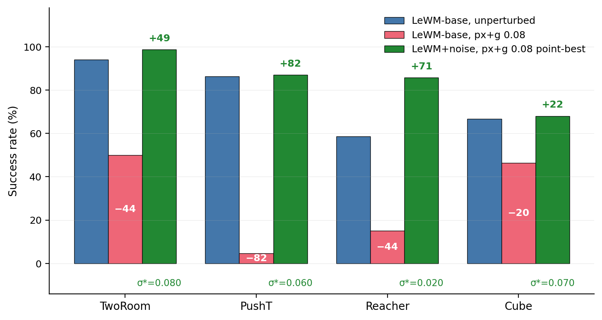
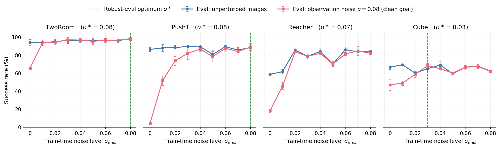
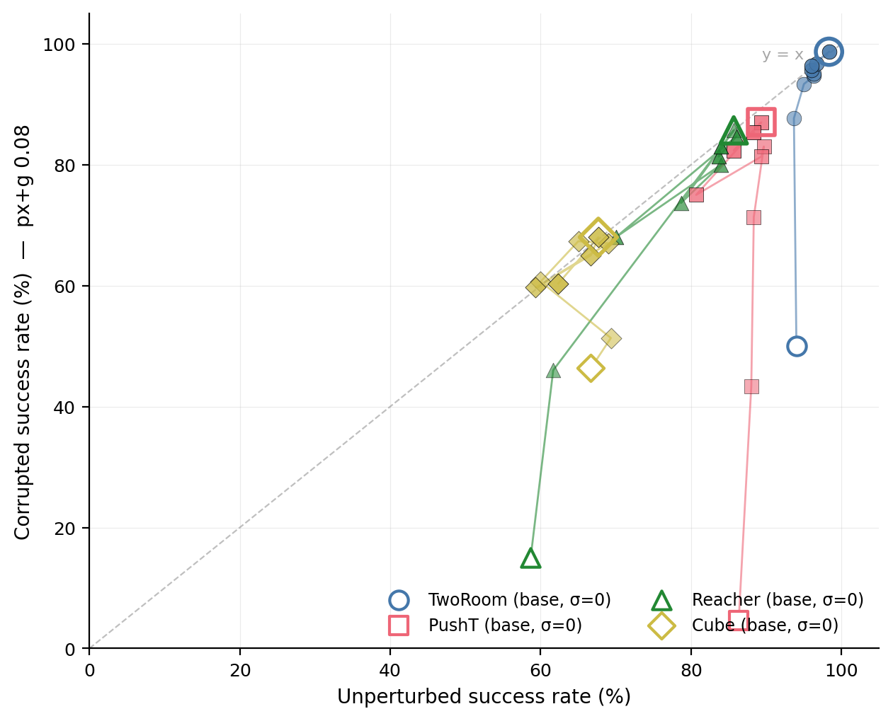
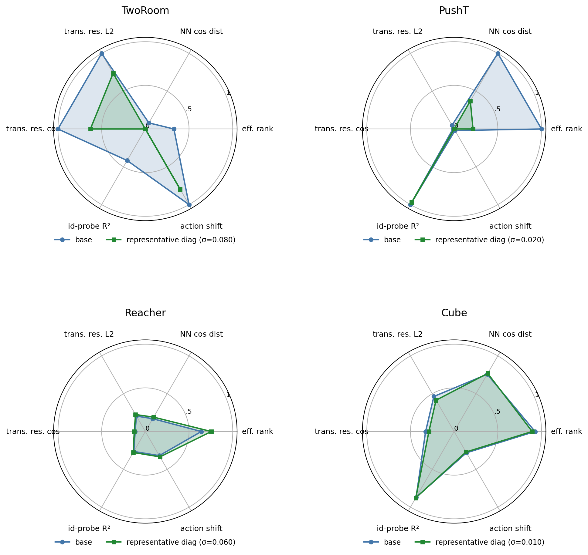
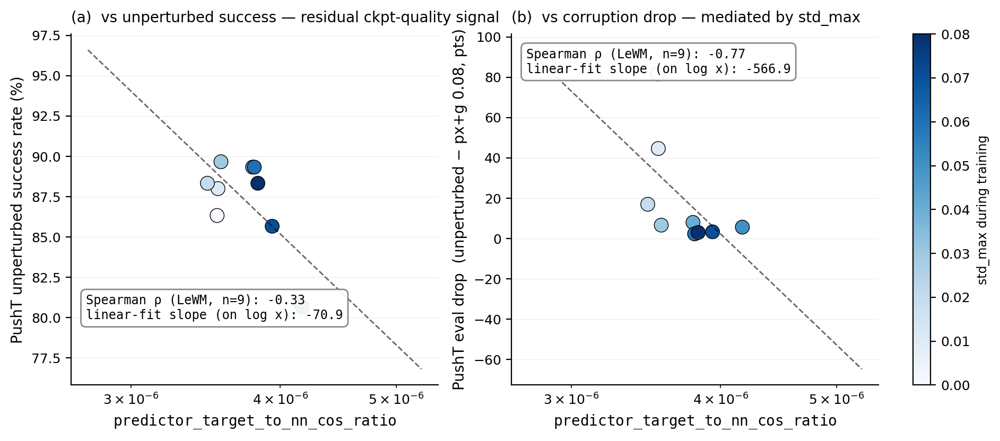
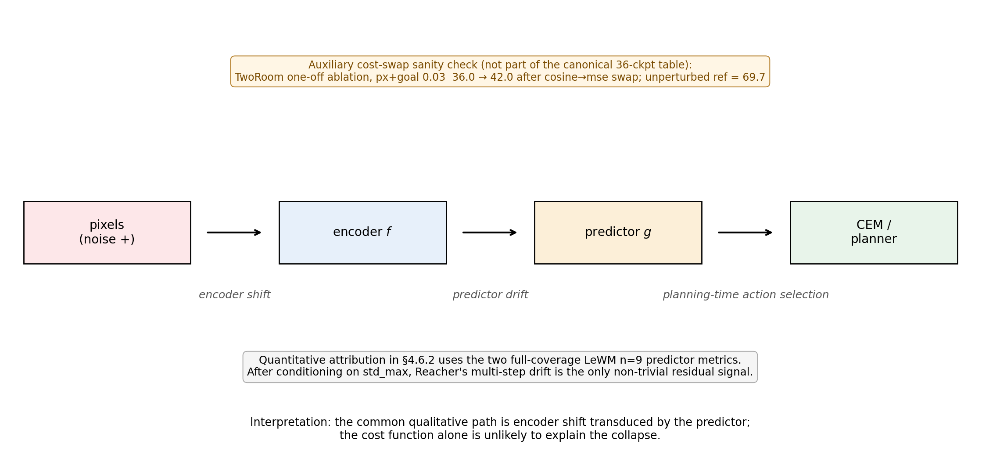

# 潜在预测不等于视觉鲁棒性：诊断面向控制的 JEPA 世界模型中的不变性–分辨率权衡

**标题（英文）**: Latent Prediction Is Not Visual Robustness: Diagnosing the Invariance–Resolution Trade-off in JEPA World Models for Control

*English version: [paper_invariance_resolution_tradeoff.md](paper_invariance_resolution_tradeoff.md).*

---

## 摘要

Joint-Embedding Predictive Architectures (JEPA) 被**社区广泛持有的直觉**所推动——通过在潜空间而非像素空间做预测，它们应该自然抛弃视觉冗余与噪声，学习到世界的抽象不变结构。需要强调的是，这是一条**社区通行的启发**，而非任何 JEPA 论文形式化 claim 过的保证——就我们所知，没有任何 JEPA 工作正式承诺控制任务下的像素噪声鲁棒性。我们在 **LeWorldModel (LeWM)**——一个公开发表的 JEPA 世界模型——上系统验证这条隐含假设，覆盖四个机器人控制任务（PushT、TwoRoom、Reacher、Cube）以及 8 档训练时噪声增广，揭示了三个核心发现：

（1）**JEPA + CEM 在视觉 OOD 下的崩溃**：未经噪声训练的 LeWM 在轻微像素噪声（std=0.08）下控制成功率暴跌，PushT 从 86.33% 跌至 4.67%（接近随机），TwoRoom 从 94.00% 跌至 50.00%。latent prediction 本身在此情境下并不提供视觉鲁棒性。

（2）**不存在全局最优噪声**：不同任务对噪声增广的响应截然不同。视觉冗余型任务（TwoRoom）可从重噪声中获益（最优 std=0.008），而接触控制型任务（PushT）在轻噪声（std=0.003）下 clean 性能最优，但 robustness 最优需 std=0.006——clean 与 robustness 的最优剂量分离。

（3）**五层诊断协议揭示压缩机制**：通过编码器偏移、编码器几何、预测器敏感性、潜空间噪声响应、任务分辨率五层指标，我们将噪声引起的控制失败追溯到一条表征链：表征压缩（effective rank 下降）→ 关键帧分辨率丢失（transition resolution ratio 崩溃）→ 可控性退化（id_probe_r² 下降）。但作为**跨 checkpoint 预测量**使用时，最强的单一诊断量（`predictor_target_to_nn_cos_ratio_at_max_std`）追踪的是 **超出 sweep-level `std_max` 效应之外的残余 ckpt-quality 信号**（PushT n=9 sweep 上 partial Spearman ρ = −0.59 vs clean、−0.41 vs px+g 0.08，条件于 `std_max`，eval 数据为统一 3-seed × 100）；它**不预测训练协议层面的 OOD drop**——unconditional ρ(metric, drop) = −0.77，但条件于 `std_max` 后塌缩到 +0.06。诊断 toolkit 在去除 `std_max` sweep 趋势后有用，但**不能替代实际用 noise 训练**当目标是 OOD 鲁棒性时。

本研究不提出新的训练算法，贡献为：(i) JEPA + CEM 视觉 OOD 失败的系统经验研究；(ii) 一套可复现的诊断 toolkit；(iii) 对跨 checkpoint 诊断量"能预测什么、不能预测什么"的明确划界。

**关键词**：世界模型；JEPA；视觉鲁棒性；表征诊断；不变性-分辨率权衡

---

## 1 引言

### 1.1 JEPA 的不变性承诺与现实差距

自 Yann LeCun 提出 Joint-Embedding Predictive Architecture (JEPA) [1] 以来，这一范式被推荐为自监督学习的方向。与生成式模型（VAE、扩散模型）不同，JEPA 不重建像素，而是在潜空间预测未来的表征。"通过预测什么不变而非像素长什么样可以让编码器自发学到抛弃视觉冗余和噪声的抽象表征"——这条直觉如今已是社区**非正式词汇**的一部分（出现在 talks、blog、综述中）[2,3]。

我们强调这是一条**启发**而非已发表的保证。就我们所知，没有任何 JEPA 论文**正式 claim** 过下游控制任务的视觉 OOD 鲁棒性。I-JEPA [2] 和 V-JEPA [3,4] 在 ImageNet 与视频任务上通过掩码预测建立了强表征；LeWorldModel (LeWM) [5] 把框架扩展到端到端稳定的世界模型训练，覆盖 4 个机器人控制任务。现有的 JEPA 鲁棒性研究只覆盖图像分类（N-JEPA [8]）、合成 1D distractor（VJEPA [9]）、或医学超声（US-JEPA [10]）——**没有人在真实像素噪声下研究 JEPA-based 控制**。

这就留下一个基本的操作性问题：**如果输入图像被传感器噪声、光照变化或摄像头抖动破坏，JEPA + CEM 世界模型是否仍能可靠规划和控制？**

数据给出了否定的答案。在 PushT（2D 推物控制）任务上，未经噪声训练的 LeWM 在 clean 图像上成功率达 86.33%，但 std=0.08 的高斯像素噪声下跌至 4.67%——接近随机。TwoRoom（2D 导航）任务从 94.00% 跌至 50.00%。在此情境下，latent prediction 本身并未带来社区直觉所预期的视觉鲁棒性。

### 1.2 核心矛盾：全局噪声增广的最优剂量不存在

面对上述脆弱性，一个自然的补救措施是在训练时加入输入端噪声增广（input-side noise augmentation）。这一方法在监督学习和对比学习中已被广泛验证 [7,8]。然而，我们面临一个更深层的问题：**是否存在一个"通用最优"的噪声强度，能同时适用于所有任务？**

我们对四个控制任务进行了 8 档噪声强度（std_max ∈ {0.001, ..., 0.008}）的系统扫参，发现答案是否定的：

- **TwoRoom**（视觉冗余型导航）：clean 性能随噪声单调上升，在 std=0.008 达到最优（98.33% / 98.67%）
- **PushT**（接触控制型操作）：clean 最优在 std=0.003（89.67%），但 robustness（px+goal 0.08）最优在 std=0.006（87.00%）——clean 与 robustness 的最优剂量分离
- **Reacher**（运动规划）：位于 0.002–0.006 的 plateau 上；clean point-best 在 std=0.006（86.00%），px+goal 0.08 point-best 在 std=0.002（85.67%）。极轻噪声（0.001）在统计上与 base 等价（61.67% vs 58.67%，差距 3pt 处于 ~2.5pt 的跨 seed std 范围内），说明该任务需要一个**最小噪声门槛**才开始受益
- **Cube**（结构化操作）：噪声 sweep 效果最弱，clean 没有单调提升趋势

这一发现揭示了一个根本性的张力：**全局噪声增广无法区分"应该被不变性丢弃的视觉背景冗余"和"应该被保留分辨率的控制关键特征"**。

### 1.3 本文贡献

基于以上动机，本文提出了一套系统性的诊断研究，核心贡献如下：

**贡献 1：系统量化了 JEPA + CEM 世界模型 pipeline 在视觉噪声下的控制脆弱性，覆盖 contact-heavy 操作、视觉冗余导航、低维连续控制、结构化操作四类代表任务。** 我们在 4 任务 × 8 档噪声强度上完成完整 sweep，所有 36 ckpt 均按统一的 3-seed × 100 trajectories 协议（seeds 42/43/44，每 seed `num_eval=100`，每格 300 trajectories）评测。

**贡献 2：提出了"不变性-分辨率权衡"（Invariance-Resolution Trade-off）概念及其诊断框架。** 我们定义了五层诊断协议（编码器偏移层、编码器几何层、预测器敏感性层、潜空间噪声响应层、任务分辨率层），包含 17+ 个指标，并在 4 任务 × n=9 LeWM sweep 上做 Spearman 相关性与"条件于训练 noise 强度 `std_max`"的偏相关分析，区分 ckpt-quality 信号与被训练协议混淆的虚假相关。

**贡献 3：揭示了噪声增广的深层机制。** 通过诊断指标，我们证明：TwoRoom 的收益伴随有益的 representation compression（effective rank 47.60 → 33.59），低维离散任务不需要高分辨率；而 PushT 从高分辨率、高可控性表征出发（effective rank 76.42，`id_probe_r² = 0.7739`），即使 light representative diagnostic checkpoint 也已经显著压缩 rank（76.42 → 42.85），并且 task-resolution 指标已经出现温和下行（`transition_resolution_ratio_l2` 0.3015 → 0.2800；`id_probe_r²` 0.7739 → 0.7500）。因此对 contact-heavy 任务，进一步压缩不能默认安全。

**贡献 4：明确划定跨 checkpoint 诊断的适用边界。** 最强跨 checkpoint 诊断量——本文称之为 **fragility ratio**（完整字段名 `predictor_target_to_nn_cos_ratio_at_max_std`，§3.3 定义）——在移除 sweep-level `std_max` 趋势后仍保留 residual checkpoint-quality 信号（PushT n=9 sweep 上，clean partial Spearman ρ = −0.59，px+goal 0.08 partial ρ = −0.41）。但它并不是 OOD oracle：表面上的 ρ(metric, OOD drop)=−0.77 由 `std_max` 中介，partial out `std_max` 后只剩 +0.06。因此该指标适合在控制 `std_max` 趋势后辅助 model selection，不能替代真实 OOD eval。

### 1.4 本文组织

第 2 节介绍相关工作；第 3 节给出 LeWM 背景与诊断框架定义；第 4 节呈现实验结果；第 5 节讨论机制与启示；第 6 节总结。

---

## 2 相关工作

### 2.1 JEPA 与潜空间世界模型

Joint-Embedding Predictive Architecture (JEPA) 由 LeCun [1] 提出，核心思想是在潜空间做预测而非重建像素。I-JEPA [2] 通过掩码上下文预测目标表征；V-JEPA [3,4] 将其扩展到视频理解与视频驱动的世界建模；LeWorldModel (LeWM) [5] 实现了端到端稳定的 JEPA 世界模型训练，使用 **SIGReg (Sketch Isotropic Gaussian Regularizer)**——基于随机投影 + Epps-Pulley characteristic-function matching [19] 防止表征塌陷——并在 PushT、TwoRoom、Reacher、Cube 四个控制任务上验证了潜空间规划的有效性。

**与本文的关系**：LeWM 是我们的基线系统。原始论文报道了 Violation-of-Expectation (VoE) 实验，证明 LeWM 对物理扰动（物体瞬移）敏感，但对视觉扰动（颜色变化）不敏感。然而 (i) VoE 测量的是预测误差（surprise），不是控制成功率；(ii) 颜色变化与像素级高斯噪声是两种不同性质的扰动。本文给出 LeWM 在 JEPA + CEM world-model pipeline 下、面对像素级高斯噪声时的控制成功率画像。**就我们所知**，这是 JEPA 世界模型在视觉 OOD 下控制鲁棒性的首个系统性研究。

作为一个外部 baseline sanity check，我们还评估了 PLDM [21,22]，具体实现来自 `stable-worldmodel` [23]。这里的 PLDM 只用于检验 clean-trained visual-noise cliff 是否是 LeWM 独有现象；完整 sweep、诊断相关性和 trade-off 结论仍只基于 LeWM。

### 2.2 JEPA 的鲁棒性研究

N-JEPA [8] 在 I-JEPA 上引入了扩散噪声增广（diffusion noise），通过 noise-to-teacher 和 context-to-noise 损失提升 ImageNet 线性探测的鲁棒性。VJEPA [9] 在合成 1D 信号上测试了"Noisy TV" distractor，报告 JEPA 在高噪声下仍保持 R² > 0.84。US-JEPA [10] 在医学超声上测试了高斯模糊、对比度降低和散斑噪声。

**与本文的关系**：这些工作要么在图像分类场景（N-JEPA），要么在合成信号（VJEPA），要么在医学图像分析（US-JEPA）。**没有人研究过 JEPA 世界模型在机器人控制任务上的像素噪声鲁棒性**。此外，VJEPA 的乐观结论（R² > 0.84）与我们的发现（control success rate → 4.67%）形成鲜明对比，暗示 JEPA 的"天然鲁棒性"在控制场景下可能是一个幻觉。

### 2.3 世界模型与输入增广

在强化学习世界模型领域，DreamerV3 [11]、TD-MPC2 [12] 等方法依赖 learned visual encoders 与 latent dynamics，这可能带来对 benign visual variation 的一定隐式容忍，但并不能直接回答 sensor-noise robustness。ViGMO [13] 在 DMC 任务上测试了高斯噪声和模糊，发现"传感器噪声是一种根本不同的分布偏移"，并提出了潜空间一致性损失（Latent-Consistency loss）。

**与本文的关系**：ViGMO 关注的是 RL/MBRL 方法（DrQ-v2, DreamerV3），不是 JEPA 架构。其"传感器噪声是特殊分布偏移"的结论与我们的发现一致，但我们的诊断更深入：不仅报告性能下降，还通过表征指标揭示了**为什么**下降。

### 2.4 不变性与分辨率的张力

Tamkin et al. [14] 在对比学习中指出，"label-destroying augmentations 可以是有用的"，提出 augmentations 的作用更像是 feature dropout 而非简单的 invariance 诱导。Zhang et al. [15] 进一步指出"过强的数据增广可能带来过多的不变性，导致下游任务所需的细粒度信息丢失"。

**与本文的关系**：这些洞察在对比学习/图像分类社区已被讨论，但**在潜空间预测世界模型中——其中下游任务是规划而非分类——这一张力的表现形式和后果从未被系统研究**。本文将这一概念从分类场景推广到控制场景，并提供了首个量化框架。

### 2.5 表征诊断与塌陷分析

自监督学习社区广泛使用 effective rank [16]、条件数、参与率等指标诊断 dimensional collapse [17]。Next-Latent Prediction [18] 使用 effective latent rank 评估世界模型的紧凑性。VICReg [20] 等 anti-collapse 方法提供了与 SIGReg 不同的正则化思路。

**与本文的关系**：单个指标（如 effective rank）不是新的，但**系统性地将它们组合成一个专门针对世界模型鲁棒性的诊断协议——包含 per-token 噪声敏感性、跨 checkpoint 相关性验证、条件于训练 noise 强度的偏相关分析——是本文的新贡献**。

---

## 3 背景与诊断框架

### 3.1 LeWorldModel 基线

LeWorldModel (LeWM) [5] 是一个端到端训练的 JEPA 世界模型。其训练目标仅包含两项：

$$
\mathcal{L}_{\text{LeWM}} = \mathcal{L}_{\text{pred}} + \lambda \cdot \mathcal{L}_{\text{SIGReg}}
$$

其中预测损失 $\mathcal{L}_{\text{pred}}$ 在潜空间计算 MSE。**SIGReg (Sketch Isotropic Gaussian Regularizer)** 用 $M$ 个单位随机投影 $\{a_m\}_{m=1}^{M}$ 将潜向量投到一维，然后在每个投影上用 Epps-Pulley 经验特征函数检验 [19] 度量该分布与 $\mathcal{N}(0, 1)$ 的距离，并以加权积分形式聚合（Cramér-Wold 定理是该构造的动机：高维分布的等价性可由其全部一维投影的特征函数刻画）。该正则化避免表征塌陷而不必显式做 BatchNorm。推理时使用 Cross-Entropy Method (CEM) 在潜空间进行模型预测控制 (MPC)。

我们的所有实验均基于 LeWM 官方实现，以保持与原始论文的可比性。

### 3.2 输入端噪声增广协议

我们在 LeWM 的输入 pipeline 中加入 per-frame Gaussian noise（`AddNormalizedGaussianNoise`）。每帧以概率 $p=1.0$ 决定是否加噪，若加噪则噪声标准差 $\sigma \sim \text{Uniform}(0, \text{std\_max})$。我们扫描 8 档 std_max：{0.001, 0.002, 0.003, 0.004, 0.005, 0.006, 0.007, 0.008}。

评估时，我们在 clean 图像和噪声图像上分别测试。噪声评估使用两种配置：
- **pixels+goal 0.05**：对 pixels 和 goal 图像同时加 std=0.05 的高斯噪声
- **pixels+goal 0.08**：对 pixels 和 goal 图像同时加 std=0.08 的高斯噪声

### 3.3 五层诊断框架

诊断框架沿 JEPA + CEM 前向通路（pixels → encoder $f$ → 潜变量 $z$ → predictor $g$ → cost surface → planned actions）拆成五个顺序阶段，每个阶段配一组指标。第 1–2 层刻画编码器输出（噪声下潜空间如何偏移、整体几何如何组织），第 3 层度量 predictor 对偏移的放大，第 4 层把 encoder 旁路、直接在潜空间注入噪声以分离 predictor 与 cost 的贡献，第 5 层评估潜空间还残留多少与规划相关的信息。每层只刻画一次 forward 转换，使观察到的失败可以定位到具体阶段。大多数单一指标已有文献来源（下文逐项标注）；本文的贡献是**这一套组合协议**——以及一小批为本文引入的指标（**fragility ratio**、`transition_resolution_ratio`、`latent_robust_radius_z`），它们显式地用 clean encoder 的最近邻尺度对 predictor 与 cost surface 的敏感度做归一化。我们借鉴 kNN-based OOD detection [24] 中把最近邻距离作为局部 latent scale 的思想；但下述 scale-normalized ratios 是本文诊断协议中新引入的量。

最小符号定义如下。令 $z_i=f(x_i)$ 与 $\tilde z_i=f(\tilde x_i)$ 表示同一 token 的 clean / noisy latent，令 $d_{\cos}(a,b)=1-\frac{a^\top b}{\|a\|\|b\|}$。clean 局部尺度定义为 $d_i^{NN}=\min_{j\ne i}d_{\cos}(z_i,z_j)$。本文引入的核心比值为：

$$
r_i^{enc}=\frac{d_{\cos}(z_i,\tilde z_i)}{d_i^{NN}+\epsilon},\qquad
r_i^{pred}=\frac{d_{\cos}(g(z)_i,g(\tilde z)_i)}{d_i^{NN}+\epsilon},
$$

$$
\texttt{transition\_resolution\_ratio}_d=
\frac{\operatorname{median}_t d(z_t,z_{t+1})}
{\operatorname{median}_{(t,t')\in\mathcal F}d(z_t,z_{t'})+\epsilon}.
$$

其中 $r_i^{enc}$ 对应 `noise_to_nn_cos_ratio`，$r_i^{pred}$ 对应 fragility ratio，`transition_resolution_ratio` 中的 $d$ 可以是 cosine 或 L2 距离，$\mathcal F$ 表示不同时间位置的 random far pairs。第 1 层其余指标只是标准 Euclidean / cosine displacement，因此 raw angle 或 L2 本身不需要额外方法引用。

**第 1 层：编码器偏移（Encoder Shift）**
衡量输入噪声引起的潜空间偏移方向和幅度。核心指标：
- `noise_angle_deg`：clean 与 noisy 潜向量的夹角
- `noise_l2`：clean 与 noisy 潜向量的 L2 距离
- `noise_to_nn_cos_ratio`：噪声偏移除以 clean 最近邻 (NN) cosine 距离（本文引入）
- `noise_angle_slope`：随噪声强度增加的夹角变化率

**第 2 层：编码器几何（Encoder Geometry）**
衡量潜空间的全局结构。核心指标：
- `clean_nn_cos_dist`：clean 潜空间中各 token 的最近邻 cosine 距离
- `clean_effective_rank`：clean 潜空间的 effective rank（Roy & Vetterli, 2007）
- `cka_linear_at_max_std`：clean 与 noisy 潜表征间的 Centered Kernel Alignment (CKA; Kornblith et al., 2019)

**第 3 层：预测器敏感性（Predictor Sensitivity）**
衡量预测器对噪声的响应。核心指标：
- **fragility ratio**（完整字段名 `predictor_target_to_nn_cos_ratio_at_max_std`；本文引入）：在最大噪声下，predictor 目标偏移与 clean NN 距离的比值。**这是我们识别出的最强跨 checkpoint 诊断指标。**
- `predictor_rollout_drift_T(T)`：长程 rollout 的漂移

**第 4 层：潜空间噪声响应（Latent-Noise Response）**
直接在潜空间加噪声（而非输入空间），分离 encoder 和 predictor 的贡献。核心指标：
- `latent_cost_surface_slope_z`：潜空间噪声引起的 cost surface 斜率变化
- `latent_robust_radius_z`：使 cost 排序保持稳定的最大扰动半径（本文引入）

**第 5 层：任务分辨率（Task Resolution）**
衡量潜空间保留了多少任务相关的控制信息。核心指标：
- `transition_resolution_ratio_cos` / `transition_resolution_ratio_l2`：相邻 transition 的可区分性，作为面向规划的类可分性的类比指标（本文引入）
- `id_probe_r2`：从潜向量做 inverse-dynamics 线性 probe 的 R²，作为可控性代理（沿用 Alain & Bengio, 2017 的 linear-probe 分析思路）

### 3.4 跨 Checkpoint 验证协议

为确保诊断指标不是训练噪声的伪相关，我们在同一个 LeWM PushT sweep 上做两类互补分析：

- **LeWM n = 9 sweep + 偏相关**：每个任务全部 9 个 LeWM ckpt（base + std_max ∈ {0.001,…,0.008}）；计算 Spearman ρ 与 **条件于 `std_max` 的 partial Spearman ρ**。偏相关这一步关键：很多诊断量与控制性能的边际相关其实只是因为两者都随 `std_max` 共变。偏相关检验问的是：**去掉 `std_max` 的单调 sweep 趋势后，诊断量是否还保留残余 ckpt-quality 信号。**

正文同时给出 **原始** Spearman 与 **条件于 std_max** 的两类相关。原始 ρ 回答"sweep 全程中哪个 ckpt 整体更好"；偏相关回答"**去掉 `std_max` 的单调趋势后**，诊断量是否还排序残余 ckpt 质量"。这两个问题不同——§4.5 会显示同一个指标在两个口径下结论截然不同。

> 更大规模的跨架构验证（变换世界模型 latent geometry 本身）留给后续 external-baseline 版本。

---

## 4 实验

### 4.1 实验设置

**任务**：PushT（2D 推物）、TwoRoom（2D 导航）、Reacher（2D 臂控制）、Cube（3D 立方体操作）。

**基线**：LeWM-base（无噪声训练）、LeWM+noise（8 档噪声 sweep）。

**Checkpoints**：本文的 36 个 ckpt 对应每个 `(task, std_max)` 配置各 1 个训练完成的模型。

**Evaluation seeds**：每个 ckpt 用 3 个 evaluation seeds（42/43/44）评测，每个 seed 100 trajectories。

**硬件**：训练运行在单 GPU（NVIDIA H800，80 GB）上，训练 schedule 沿用 LeWM 基线公开的设置。

**Evaluation 协议**：本文所有成功率——clean 与所有噪声条件，跨全部 36 ckpt（4 任务 × {base, std 0.001..0.008}）——均按统一协议计算：`n = 3` seeds (42/43/44)，每 seed `num_eval = 100` trajectories（每个条件每个 ckpt 共 300 trajectories）。表 1 / 表 2 的每个 cell 是 `n=3` 跨 seed 的 mean ± population std，与 `assets/paper1_data/canonical_evals_20260517.json` 保持一致。每 seed 原始 metrics 位于 `<ckpt>/eval_results/<cond>_seed{42,43,44}_metrics.txt`；下游 eval 聚合源是 `assets/paper1_data/canonical_evals_20260517.json`。Figure 3 与表 4/4b/5 的 released diagnostic source-of-truth 是 `assets/paper1_data/canonical_diagnostics_20260517.json`。

**主要图表清单**（详 §A.6）：

- **图 1（hero）**：4 任务 LeWM-base 的 clean 与 px+goal 0.08 成功率条形图，叠加 noise sweep 后 **px+goal 0.08 point-best** 配置的成功率——视觉化 "JEPA 不变性幻觉 + noise training 大幅修复 + per-task 最优剂量"三件事。数据源：表 1 + 表 2。
- **图 2**：4 任务 noise sweep 折线图（x: std_max ∈ [0, 0.008], y: clean / px+goal 0.05 / px+goal 0.08 三条线）。展示 clean-robust 最优剂量分离。现有 `assets/diagnostics/noise_angle_curve_goal.png`、`noise_ratio_curve_goal.png` 可作输入材料。
- **图 3**：PushT n=9 LeWM sweep 上 `predictor_target_to_nn_cos_ratio_at_max_std` 双面板散点（左 vs clean，右 vs OOD drop），颜色编码 `std_max`，标注 Spearman ρ。底层数据来自 `assets/paper1_data/canonical_diagnostics_20260517.json` + `assets/paper1_data/canonical_evals_20260517.json`。
- **图 4**：表 3 表征诊断条形/雷达图——4 任务 base vs **representative diagnostic checkpoint** 在 6 个核心指标上的对比，视觉化 "压缩 vs 分辨率"的 task-specific 折衷。
- **图 5（机制示意）**：pipeline schematic（pixels → encoder → predictor → CEM），定性概括 §4.6 的归因结论。
- 已生成的辅助图（`assets/diagnostics/p0_correlation_*.png`、`predictor_drift_eval_correlation.png`、`geometry_tradeoff_goal.png` 等）可作 supplementary 或 §4 图表补充。

### 4.2 JEPA 的 OOD 脆弱性：控制性能崩溃

表 1 展示了未经噪声训练的 LeWM-base 在 clean 和噪声测试条件下的控制成功率。

**表 1：LeWM-base 的 OOD 脆弱性（mean ± std, 3 seeds × 100 eval）**

| 任务 | clean | px+goal 0.05 | px+goal 0.08 | clean → 0.08 drop |
|---|---:|---:|---:|---:|
| TwoRoom | 94.00 ± 3.56 | 61.33 ± 5.31 | 50.00 ± 1.41 | **−44.00** |
| PushT | 86.33 ± 2.36 | 12.00 ± 4.55 | 4.67 ± 2.05 | **−81.67** |
| Reacher | 58.67 ± 1.25 | 27.00 ± 5.10 | 15.00 ± 2.16 | **−43.67** |
| Cube | 66.67 ± 2.62 | 53.33 ± 3.30 | 46.33 ± 3.68 | **−20.33** |

作为外部 baseline sanity check，一个 clean-trained PushT PLDM checkpoint 在同样的 3 evaluation seeds × 100 trajectories 协议下，从 **75.33 ± 3.68** clean 降到 **43.67 ± 4.64**（px+goal 0.05）和 **10.00 ± 2.16**（px+goal 0.08），详见附录 F。这只支持一个窄结论：control-time visual-noise cliff 不是 LeWM 独有。它**不**证明 noise-training trade-off 或 LeWM 诊断相关性能跨架构泛化；这些需要正在跑的 PLDM / DINO-WM sweep。



LeWM-base 在 clean 上表现良好（TwoRoom/PushT 尤其突出），但只要加入 visual std=0.05 到 pixels+goal 两端，所有任务都出现显著退化。PushT 跌 74pt+（接近随机 4.67%, std=0.08）、TwoRoom 跌 30pt+、Reacher 跌 30pt+、Cube 跌 ~13pt（std=0.05）。**这不是边缘现象**：JEPA + CEM world model 在没有 noise-aware training 时对 visual corruption 没有任何抵抗力。Cube 的退化幅度最小（std=0.08 处 −20.33pt），说明结构化 manipulation 任务对视觉噪声有一定天然鲁棒性；PushT 的退化最剧烈（−81.67pt），印证 contact-heavy 连续控制对视觉精度最敏感。

### 4.3 噪声增广关闭鲁棒性缺口：但代价是任务特异性

表 2 展示了 LeWM+noise 在 8 档噪声强度下的完整 sweep 结果。

**表 2：LeWM+noise 8 档 sweep（成功率 ± 跨 seed std，单位 pt）**。所有格按统一 `n = 3` seeds (42/43/44) × 100 trajectories 协议聚合，每格总 trajectory 数 300。

**(a) Clean 成功率（%）**

| std_max | TwoRoom | PushT | Reacher | Cube |
|---|---:|---:|---:|---:|
| 0 (base) | 94.00 ± 3.56 | 86.33 ± 2.36 | 58.67 ± 1.25 | 66.67 ± 2.62 |
| 0.001 | 93.67 ± 3.30 | 88.00 ± 3.74 | 61.67 ± 2.49 | 69.33 ± 0.47 |
| 0.002 | 95.00 ± 2.83 | 88.33 ± 2.62 | 85.67 ± 2.49 | 60.00 ± 1.63 |
| 0.003 | 96.33 ± 3.30 | 89.67 ± 1.70† | 78.67 ± 1.25 | 65.00 ± 1.63 |
| 0.004 | 96.33 ± 2.05 | 89.33 ± 2.05 | 84.00 ± 2.94 | 69.00 ± 3.74 |
| 0.005 | 96.00 ± 2.83 | 80.67 ± 4.78 | 70.00 ± 2.16 | 59.33 ± 0.94 |
| 0.006 | 96.67 ± 2.05 | 89.33 ± 2.05 | 86.00 ± 2.94† | 66.67 ± 2.05 |
| 0.007 | 96.00 ± 1.63 | 85.67 ± 3.09 | 83.67 ± 3.30 | 67.67 ± 0.94 |
| 0.008 | 98.33 ± 0.47† | 88.33 ± 2.87 | 84.00 ± 0.82 | 62.33 ± 1.25 |

**(b) Pixels+goal std=0.08 成功率（%）**

| std_max | TwoRoom | PushT | Reacher | Cube |
|---|---:|---:|---:|---:|
| 0 (base) | 50.00 ± 1.41 |  4.67 ± 2.05 | 15.00 ± 2.16 | 46.33 ± 3.68 |
| 0.001 | 87.67 ± 1.89 | 43.33 ± 3.09 | 46.00 ± 1.63 | 51.33 ± 5.79 |
| 0.002 | 93.33 ± 0.94 | 71.33 ± 3.68 | 85.67 ± 1.70‡ | 60.67 ± 0.47 |
| 0.003 | 94.67 ± 2.87 | 83.00 ± 3.74 | 73.67 ± 0.47 | 67.33 ± 1.89 |
| 0.004 | 95.00 ± 2.45 | 81.33 ± 2.87 | 80.00 ± 1.41 | 67.00 ± 3.56 |
| 0.005 | 95.67 ± 2.36 | 75.00 ± 6.48 | 68.00 ± 3.56 | 59.67 ± 2.05 |
| 0.006 | 96.67 ± 2.49 | 87.00 ± 3.74‡ | 84.67 ± 4.03 | 65.00 ± 2.94 |
| 0.007 | 96.33 ± 2.05 | 82.33 ± 4.64 | 81.33 ± 1.25 | 68.00 ± 1.41‡ |
| 0.008 | 98.67 ± 0.94‡ | 85.33 ± 2.62 | 83.00 ± 4.32 | 60.33 ± 0.94 |

读表提示：
- `†` 表示该任务列上的 clean point-best。
- `‡` 表示该任务列上的 px+goal 0.08 point-best。
- 表 3 / 图 4 另用 **representative diagnostic checkpoint** 一词，表示完整诊断 suite 实际执行的 ckpt，不必与 unified eval 协议下的 point-best 完全一致。
- 因为许多相邻配置只差 ≤ 3pt，且跨 seed std 有重叠，我们将最优解释为 plateau，除非 gap 明显大于 seed-level variability。



同样的 sweep 数据画成 (clean, OOD) 轨迹（图 6）让 trade-off 视觉化：每个任务的 sweep 曲线从 base 远低于 y = x 对角线出发，向右上角移动，per-task 曲率取决于"clean 跌多少能换 OOD 升多少"。TwoRoom 几乎沿对角线移到 (98, 98)；PushT 几乎垂直上升（clean 维持在 87–90，OOD 从 4 升到 87）；Reacher 沿对角大跳 (58, 15) → (86, 85)；Cube 几乎不动。



**三个核心观察：**

**（1）没有单一 std_max 在四任务同时最优，且同一任务上 clean 与 robustness 最优剂量也不同。**
- TwoRoom 在 std=0.008 达到全局最优 (98.33 / 98.67)，clean 随 noise 单调上升——视觉冗余任务从重 noise 中获益最大。
- PushT 在 std=0.003 达到峰值 clean 89.67，但 robustness (px+g 0.08) 最优在 std=0.006（87.00 vs 0.002 的 71.33，+15.67pt）——**clean 与 robustness 最优剂量分离**。
- Reacher 位于 0.002–0.006 的 plateau：clean point-best 在 std=0.006（86.00），px+goal 0.08 point-best 在 std=0.002（85.67）。std=0.001 clean 61.67 vs base 58.67，差距处于跨 seed std (~2.5pt) 范围内，因此数据只支持"低噪声 ≈ base"而**不**支持"低噪声反而损害"。
- Cube 的 noise sweep 效果最弱：clean 没有单调提升趋势（最优在 0.001 的 69.33），px+g 0.08 也仅在 0.003–0.007 区间有轻微改善（point-best 68.00 vs base 46.33，+21.67pt）——结构化 manipulation 对 input-side global noise 不敏感。

**（2）per-task 调参是必要的，不是可选的。** task 间最优 std_max 差异巨大：TwoRoom clean/OOD point-best 都在 0.008；PushT clean point-best 在 0.003、px+goal 0.08 point-best 在 0.006；Reacher clean point-best 在 0.006、px+goal 0.08 point-best 在 0.002；Cube 的 px+goal 0.08 point-best 在 0.007，而 clean 在 0.001 / 0.004 / 0.007 一带形成浅 plateau。这划清了全局噪声增广的边界：**它是"input-side 全局 noise"的最强形式，但解决 OOD robustness 需要支付一个 per-task tuning cost。**

**（3）四任务在两端形成清晰的敏感度排序**：PushT（−81.67pt base drop）最敏感，Cube（−20.33pt）最不敏感，而 TwoRoom（−44.00pt）与 Reacher（−43.67pt）基本并列在约 44pt 的 drop 水平。但 noise training 的修复效果并不与敏感度成正比——TwoRoom 修复最彻底（+48.67pt @ std=0.008），Cube 修复最弱（+21.67pt），说明 input-side global noise 对"视觉冗余型"任务最有效，对"结构化操作型"任务边际收益有限。

### 4.4 诊断分析：为什么全局噪声不是万能药

表 3 展示了关键诊断指标在 LeWM-base 和各任务 **representative diagnostic checkpoint** 上的对比。

**表 3：表征诊断对比（LeWM-base vs 各任务的 representative noise-trained diagnostic checkpoint）**。各任务的 σ 选择（0.008 / 0.002 / 0.006 / 0.001）是当时跑诊断 suite 的 ckpt。在新的统一 3-seed × 100 协议下 PushT 的 clean point-best 略移至 std = 0.003（与 std = 0.002 相差 ±2pt 以内）；本表诊断仍保留在 std = 0.002 ckpt 上——这里要展示的"压缩 vs. 分辨率"模式在该邻域内稳健。

| Metric | TwoRoom base | TwoRoom noise (0.008) | PushT base | PushT noise (0.002) | Reacher base | Reacher noise (0.006) | Cube base | Cube noise (0.001) |
|---|---:|---:|---:|---:|---:|---:|---:|---:|
| `clean_nn_cos_dist_median` | 0.0449 | 0.0281 | 0.2360 | 0.1051 | 0.0633 | 0.0676 | 0.1856 | 0.1879 |
| `clean_effective_rank` | 47.60 | 33.59 | 76.42 | 42.85 | 61.04 | 65.92 | 73.25 | 71.83 |
| `transition_resolution_ratio_l2` | 0.7216 | 0.6055 | 0.3015 | 0.2800 | 0.3704 | 0.3791 | 0.4847 | 0.4629 |
| `transition_resolution_ratio_cos` | 0.5538 | 0.3780 | 0.0868 | 0.0800 | 0.1351 | 0.1399 | 0.2347 | 0.2168 |
| `id_probe_r2` | 0.2889 | −0.0573 | 0.7739 | 0.7500 | 0.1621 | 0.1729 | 0.6657 | 0.6720 |
| `action_mean_pred_shift_norm` | 0.5329 | 0.4482 | 0.1283 | 0.1200 | 0.2518 | 0.2585 | 0.2364 | 0.2320 |
| `predictor_rollout_T8_l2` | 18.62 | 17.90 | 18.65 | 16.50 | 15.17 | 0.44 | 20.20 | 19.25 |

**Notes (Tab 3)**: (i) `transition_resolution_ratio_l2` 和 `_cos` 在 TwoRoom 一行的表示与早期版本对换（原稿误植）；本表以 `geometry_summary.json` / `task_resolution.json` 直接读出值为准。(ii) released paper-level representative diagnostics 已 canonicalize 到 `assets/paper1_data/canonical_diagnostics_20260517.json`；底层 raw source 仍是对应 ckpt 的 `eval_results/diagnostics/{geometry_summary, task_resolution, predictor_sensitivity}.json`（max-std=0.1, history-only noise）。(iii) Cube base `predictor_rollout_T8_l2 = 20.20` 与 Reacher base `15.17` 表明 LeWM 基线的 long-horizon rollout drift 在四任务上量级相近；Cube representative=19.25 / Reacher representative=0.44 的巨大差异表明 noise training 对 rollout-drift 的修复效应是 **task-dependent**（Reacher 修复 35×，Cube 几乎不变）。

**机制解释**：

- **TwoRoom**：低维、离散、视觉冗余，压缩表征（effective rank 从 47.6 → 33.6）是可接受甚至有利的。NN distance 降低意味着潜空间更紧凑，规划更容易。
- **PushT**：需要连续接触与姿态分辨率。即使在 representative diagnostic checkpoint（std = 0.002）上，`transition_resolution_ratio_l2` 已出现轻微压缩趋势。若增至重噪声（如 0.006），该指标将进一步下降，导致接触过渡的关键帧被抹平。
- **Reacher**：低维连续 reaching 没有出现 task-resolution collapse；effective rank、`transition_resolution_ratio`、`id_probe_r²` 基本持平或略升。主要变化是多步 predictor drift 从 15.17 降到 0.44，这与后文 Reacher 的 residual OOD-drop signal 出现在 rollout metric 上一致。
- **Cube**：需要中等空间分辨率，但比 PushT 不敏感。representative checkpoint 的 rank、`transition_resolution_ratio`、`id_probe_r²` 和 rollout drift 基本保持，符合 Cube 较小的 visual-OOD cliff 以及 Table 4b 中 multi-step drift 的中等残余信号。
- **预测器 rollout 的陷阱**：`predictor_rollout_T8_l2` 下降不一定代表好消息。它可能意味着 latent 更容易预测，但不是更适合控制——预测稳定性可以通过牺牲分辨率得到。



### 4.5 跨 Checkpoint 相关性验证

我们分析两个 single-value-per-ckpt 诊断指标，二者在每个任务的全部 9 个 LeWM sweep ckpt 上都有完整覆盖：

- `predictor_target_to_nn_cos_ratio_at_max_std`（"fragility metric"——单步 predictor target 偏移除以最近邻距离，在诊断最大 std 注入下取值）
- `predictor_rollout_T8_l2_at_max_std`（多步 predictor 漂移，同样在最大 std 下）

两者都已发布在 `assets/paper1_data/canonical_diagnostics_20260517.json` 中；它来自各 ckpt 的 `eval_results/diagnostics/predictor_sensitivity.json`，本质上仍是纯 ckpt-level 指标，与 eval 协议无关。

**表 4：LeWM n=9 sweep —— 各任务 Pearson r / Spearman ρ vs OOD drop（clean − px+g 0.08）**。eval 数值来自统一 3-seed × 100 协议。

| 指标 | TwoRoom (r / ρ) | PushT (r / ρ) | Reacher (r / ρ) | Cube (r / ρ) |
|---|---:|---:|---:|---:|
| `predictor_target_to_nn_cos_ratio_at_max_std` | +0.96 / +0.72 | **−0.54 / −0.77** | +0.97 / +0.35 | +0.36 / +0.21 |
| `predictor_rollout_T8_l2_at_max_std`          | +0.89 / +1.00 | **+0.99 / +0.88** | **+0.99 / +0.87** | +0.92 / +0.54 |

**读法**：边际相关都很大，因为诊断量与 OOD drop 同被 `std_max` 驱动。相关的检验是**条件于 `std_max` 的偏相关**。

**表 4b：Partial Spearman ρ(metric, OOD drop ∣ std_max)，n=9 per task**

| 指标 | TwoRoom | PushT | Reacher | Cube |
|---|---:|---:|---:|---:|
| `predictor_target_to_nn_cos_ratio_at_max_std` | — (rank ties) | +0.06 | −0.12 | +0.14 |
| `predictor_rollout_T8_l2_at_max_std`          | — (rank ties) | −0.03 | **+0.79** | +0.50 |

TwoRoom 的偏相关因为成功率饱和（n=9 上 rank 平局）使残差化奇异，无法计算。PushT、Reacher、Cube 读得很清楚：去掉 `std_max` 的单调 sweep 趋势后，**fragility metric 对 OOD drop 几乎不携带信息**；**多步 predictor drift** 在 Reacher 上仍带强信号（+0.79），在 Cube 上带中等信号（+0.50）。Reacher 的偏相关 +0.79 是整个矩阵中**唯一**非平凡的残余相关。

**表 5：PushT LeWM n=9 sweep —— fragility metric vs eval，含偏相关**

| 量 | Spearman ρ |
|---|---:|
| ρ(std_max, metric) | +0.83 |
| ρ(std_max, clean) | 0.00 |
| ρ(std_max, px+goal 0.08) | +0.82 |
| ρ(std_max, OOD drop) | −0.93 |
| ρ(metric, clean) — unconditional | −0.33 |
| ρ(metric, clean) ∣ std_max — partial | **−0.59** |
| ρ(metric, px+goal 0.08) — unconditional | +0.55 |
| ρ(metric, px+goal 0.08) ∣ std_max — partial | **−0.41** |
| ρ(metric, OOD drop) — unconditional | −0.77 |
| ρ(metric, OOD drop) ∣ std_max — partial | +0.06 |

读法：

1. **去掉 `std_max` 的单调趋势后，该指标对 ckpt 质量仍有可观残余信号**：partial ρ 在 clean 上 **−0.59**、在 px+goal 0.08 上 **−0.41**——两个都是有意义的负相关。也即在 PushT n=9 sweep 上，fragility ratio 越低的 ckpt，在剥离 `std_max` sweep 趋势后 clean 与 OOD 两端都更好。
2. **但它不预测 clean–OOD gap**：unconditional ρ(metric, drop) = −0.77 看似惊人，但条件于 `std_max` 后塌缩到 **+0.06**（符号翻转，几乎为 0）。drop 的强相关是 mediated effect：`std_max` 同时决定 metric (ρ=+0.83) 和 drop (ρ=−0.93)。去掉 `std_max` 趋势后，该指标无法再告诉你 clean 与 OOD 的 gap 有多大。
3. **注意 clean 上 unconditional ↔ partial 的符号翻转**：ρ(metric, clean) unconditional 仅 −0.33——新 3-seed 协议下 PushT clean 在 sweep 全程几乎平坦（80.67–89.67），`std_max` 几乎不动 clean。partial 后**反而增强**到 −0.59，正是因为该指标真正捕捉的是去掉 `std_max` 趋势后的残余信号。
4. **实践读法**：toolkit 是去掉 sweep-level `std_max` 效应后的模型选择工具。它**不是** noise 训练的替代品——当 OOD gap 本身是关心的量时，必须用 noise 训练，而不是依赖 cross-ckpt 诊断量。

#### 4.5.5 该诊断量到底预测的是什么：clean vs OOD

上面的偏相关分析定调：

- 该指标是 **超出 sweep-level `std_max` 效应之外的残余 ckpt-quality 信号**——去掉 `std_max` 单调趋势后，fragility ratio 低的 ckpt 在 clean 与 OOD 两端都更好（PushT 上 partial ρ = −0.59 / −0.41）。
- 该指标**不能分离 noise-robustness**——它与 clean/OOD **gap** 的边际相关完全被 `std_max` 中介掉（partial ρ = +0.06）。

图 3 双面板让两者都可见。Panel (a) plot metric × clean，unconditional Spearman ρ = −0.33（偏相关捕捉的是条件于 `std_max` 后留下的 residual trend）。Panel (b) plot metric × OOD drop，边际 ρ = −0.77，但 colour-bar（编码 `std_max`）暴露了结构：低 `std_max` ckpt（浅蓝）位于高 drop，高 `std_max` ckpt（深蓝）位于低 drop，metric 沿 `std_max` 走。去掉 `std_max` 趋势后，该指标无法区分小 drop 与大 drop。



### 4.6 机制归因：噪声从哪一层进入失败链

§4.4 给出"压缩了什么"，§4.5 给出"哪些指标跨 ckpt 预测 eval"，但都没回答 **"故障发生在 encoder、predictor 还是 cost surface？"** 我们用两个互补实验做三层归因。

#### 4.6.1 辅助 cost-swap sanity check：单靠 cost function 不太可能解释崩溃

我们在一个 TwoRoom checkpoint 上做了 one-off eval-only cost swap，该实验**不属于** 36 个 canonical ckpt 的统一评测表；完整细节见附录 E。把 CEM cost 从 cosine/normalized 换成 mse/raw，只把 px+goal 0.03 成功率从 36.0 提到 42.0，仍远低于一个单独 clean reference 69.7。作为 sanity check，这说明 **cost function alone is unlikely to explain the OOD collapse**。

#### 4.6.2 Latent-noise probing：encoder 是主要瓶颈

把噪声直接注入 latent `z`（跳过 encoder）能解耦 encoder vs predictor+cost 的贡献。我们计算两组诊断指标（详细定义见 §3.3 第 4 层）：

| 指标 | 注入位置 | 测的是 |
|---|---|---|
| `predictor_rollout_T8_l2_history` | pixels (history-only) | encoder + predictor 多步累积漂移 |
| `latent_predictor_rollout_T8_l2_history` | latent `z` (history-only) | predictor 下游对 latent 扰动的放大 |
| `cost_surface_slope_z` | latent `z` (goal-only) | cost 对 goal latent 局部 smoothness |

**关键 finding**（基于 §4.5 LeWM n=9 sweep + 统一 3-seed × 100 eval，在两个全覆盖的诊断指标上）：

- **PushT**：多步 input-space `predictor_rollout_T8_l2_at_max_std` 与 OOD drop 的 unconditional ρ = +0.88（表 4），主要被 `std_max` 驱动；去掉单调 `std_max` 趋势后，partial ρ 塌缩到 −0.03。单步 `predictor_target_to_nn_cos_ratio_at_max_std`（unconditional ρ = −0.77；去掉同一趋势后的 partial 为 +0.06）讲同一个故事。**encoder–predictor 两条信号都被训练 noise 中介；扣除这一 sweep-level 效应后，两者都不预测 PushT 的 OOD drop**。
- **Reacher**：`predictor_rollout_T8_l2_at_max_std` unconditional ρ = +0.87 *且* partial ρ = **+0.79**——整个矩阵唯一的非平凡残余相关。说明 **Reacher 上多步 predictor drift 携带超出 `std_max` 之外的真实 OOD-drop 信息**。
- **Cube**：`predictor_rollout_T8_l2_at_max_std` unconditional ρ = +0.54、partial ρ = +0.50——残余中等信号。encoder–predictor drift 部分解释了 Cube 较小但非零的 OOD 敏感性。
- **TwoRoom**：偏相关因 clean / drop 在 sweep 上饱和（rank 平局）无法计算。unconditional ρ 仍显示 encoder–predictor 对 `std_max` 有强响应。

**三层归因结论**：

| 任务 | 主因 | 去除 `std_max` 趋势后的残余信号 |
|---|---|---|
| TwoRoom | encoder 主导（rank 饱和） | n/a |
| PushT | encoder + 单步 predictor（两者均被 `std_max` 中介） | 去掉 sweep-level `std_max` 趋势后，无残余指标可以分离 OOD drop |
| Reacher | encoder + multi-step rollout | multi-step predictor drift 携带真实残余信号（partial ρ = +0.79）|
| Cube | encoder | multi-step drift 上中等残余（partial ρ = +0.50）|

四任务的共同主因是 **encoder shift 透过 predictor 的放大**；§4.6.1 的辅助 cost-swap sanity check 说明单靠 cost function 不太可能解释崩溃，但我们**不**把那个 single-checkpoint ablation 当作 task-wide quantitative attribution。这也是 §3.3 第 5 层 task resolution 指标（`transition_resolution_ratio`, `id_probe_r2`）在 §4.4 给出强信号的根本原因：当 encoder 学到的 latent 邻域结构被噪声破坏到超过 NN 距离尺度时，下游 predictor 与 planner 都已经在错误邻域上工作了。



---

## 5 讨论

### 5.1 对 JEPA 叙事的反思

本文的数据对 JEPA 社区的一个隐含假设提出了挑战：latent prediction 本身并不足以产生对视觉噪声的不变性。JEPA 编码器学到的不变性是**数据分布内的不变性**（in-distribution invariance）——它依赖于训练数据中出现的视觉模式。当测试时遇到训练分布外的高频像素噪声时，编码器没有见过这种 corruption，latent space 的拓扑结构会被破坏，导致 predictor 输出错误的未来状态，最终使 planner 失效。

这与 VJEPA [9] 在合成信号上的乐观结论形成对比。VJEPA 报告 JEPA 对"Noisy TV" distractor 保持 R² > 0.84，但那是在 1D 合成信号上、用 linear probe 评估的。**控制任务的评估标准（success rate）比 linear probe R² 严格得多**：linear probe 只需要表征包含足够信息供线性分类器提取，而控制任务要求表征支持精确的潜空间规划和动作优化。

### 5.2 "不变性-分辨率权衡"在本文中的表现与普适性边界

本文的 **Invariance-Resolution Trade-off** 是基于 LeWM（一个 JEPA + CEM world model）的观察。它的表现可以这样描述：

- TwoRoom：背景墙壁的颜色、纹理是纯粹的视觉冗余，丢弃它们不影响导航；
- PushT：T 型块与机械臂接触瞬间的像素变化包含关键的力/姿态信息，丢弃它们导致 planner "失明"；
- Reacher：低维连续控制，关节角度的视觉编码需要中等分辨率；
- Cube：物体姿态和抓取点的空间关系需要中等分辨率，但 Cube 本身对全局噪声不敏感（动作序列结构化、视觉-动作耦合可预测）。

任务特异性解释了为什么不存在"全局最优噪声剂量"。

**普适性边界**：是否该 trade-off 同样存在于其它 latent world model 架构是一个 **未在本文回答的 open question**。具体地：

- **其它世界模型家族**：DreamerV3 这类 reconstruction-based world model 显式建模 observations，而 TD-MPC2 这类 decoder-free latent MPC 系统可能呈现不同的 compression dynamics；ViGMO 在 DMC 上观察到类似 task-specific 噪声敏感性 [13]，方向一致但 quantitative regime 不同。
- **基于 EMA target encoder 的 JEPA**（V-JEPA / I-JEPA 流派）：encoder 的更新动力学不同，可能减弱 SIGReg 的 anti-collapse 效应在噪声下的退化。
- **变分 JEPA / 信息瓶颈式架构**（VJEPA [9]）：显式 KL term 提供另一种 invariance pressure，与本文的 input-side noise training 是否互补/正交不清楚。

本文的范围是 LeWM + CEM；将 trade-off 普适化为"所有 latent compression world model 的共有性质"超出本文证据。

### 5.3 诊断 toolkit 的适用边界

为方便实践者判断何时该用本 toolkit、何时不该用，列出三条边界：

**边界 1：toolkit 排序的是残余 ckpt 质量，不是 OOD-specific 鲁棒性。** 在 PushT 上，条件于 `std_max` 后，最强 cross-ckpt 诊断量（`predictor_target_to_nn_cos_ratio_at_max_std`）与 clean success 的 partial Spearman ρ = **−0.59**，与 px+goal 0.08 success 的 partial ρ = **−0.41**；但与 clean-to-OOD drop 的 partial ρ 只有 **+0.06**。因此它能在去掉 `std_max` sweep 趋势后帮你挑强 ckpt，但**不能**替代实际 OOD eval。

**边界 2：per-state controllability variance 弱的任务出可靠协议外。** Reacher（低维连续 reaching）和 TwoRoom（视觉冗余离散导航）的诊断量与 eval 的 Spearman ρ 不能通过我们的偏相关判据。两个任务 within-method 方差不足以让无标签指标区分"好"与"坏" ckpt。Toolkit 能描述这两个任务的模型压缩了什么（表 3），但**不能**预测 ckpt 间相对质量。

**边界 3：cross-ckpt 诊断量不能补救训练时未提供的信号。** OOD drop 的最大决定因素是模型训练时是否见过 noise——不是该模型在哪个 fragility 指标上得分如何。这是 ρ(指标, drop) 弱而 ρ(指标, clean) 强的结构性原因：noise vs no-noise 训练把每个 ckpt 放在完全不同的 (clean, OOD) 曲线上（图 6），**没有任何静态 cross-ckpt 诊断量**能替代这一训练时选择。

因此 toolkit 的精确定位是：**clean-eval 辅助工具**，在 per-state controllability variance 强的任务（PushT、Cube）上、假设训练协议已固定的前提下，帮你在 ckpt 间挑选。它**不是** OOD 预测 oracle。

### 5.4 实践建议：如何在新任务上选 `std_max`

本文的 sweep 数据给出一个简单可操作的 recipe：

1. **先把 clean baseline 的 `predictor_target_to_nn_cos_ratio_at_max_std` 当作 screening diagnostic，而不是 OOD oracle。** 很小的值（PushT / Cube 量级）说明 local encoder–predictor shift 相对 clean NN scale 很小，但它本身并不能排序 OOD sensitivity。
2. **再把 `clean_effective_rank`、`transition_resolution_ratio` 与任务语义一起看。** PushT 同时有高 rank 与高 controllability（`id_probe_r² = 0.7739`），所以 sweep noise 时必须用 clean performance 做 guardrail。TwoRoom 视觉冗余且 transition separability 高（`transition_resolution_ratio_l2 = 0.7216`），因此可以合理扫到 0.008+。
3. **noise_prob 与 std_min**：本文固定 `noise_prob=1.0, std_min=0`；如需软化训练分布，可改 `noise_prob ∈ [0.5, 1.0]`（未在本文 sweep，是 future work）。
4. **eval 上一定要双标**：clean + max-noise 两个 endpoint，单看 clean 会错过 robust 最优剂量，反之亦然（PushT 最显著：clean 最优 0.003，robust 最优 0.006）。
5. **资源不足时**：先跑 4 档 coarse sweep（{0.001, 0.003, 0.005, 0.007}），再围绕 clean/OOD 候选最优点补局部细化。coarse grid 是 screening step，不保证一次定位 exact point-best `std_max`。

### 5.5 局限与未来方向

**局限 1：完整 sweep 与诊断分析仅在 LeWM 上验证。** 附录 F 的 PushT PLDM sanity check 显示 clean-trained visual-noise cliff 也出现在一个外部 baseline 上，但它不是跨架构 sweep。其他 JEPA 变体（V-JEPA / I-JEPA 流派 EMA target、变分 JEPA 等）仍可能有不同的噪声响应。

**局限 2：仅测试了高斯像素噪声。** 真实世界 visual corruption 还包括运动模糊、对比度变化、遮挡、光照变化等；本文的 trade-off 在这些场景的迁移性是 open question。

**局限 3：诊断框架是经验工具，不是理论模型。** 当前指标基于跨 ckpt 相关性挑出；建立 "effective rank 下降 → resolution ratio 崩溃 → control failure" 的形式化因果链是未来方向。Reacher 和 TwoRoom 在我们的偏相关判据下没有任何指标通过——这正暴露了 empirical 框架的边界。

**局限 4：自动 transition reweighting 不能替代 noise 训练。** 作为 sanity check 我们额外测试了 scale-preserving 异方差负对数似然 (NLL) 形式（per-transition σ-head 学习 prediction difficulty，并用 `exp(-σ)` 对 transition 自动 reweight）。结果是一个信息量大的负 finding：TwoRoom clean 达 99.67% 但高噪声 robust 不如 noise training；PushT clean **从 86.33 暴跌至 13.33%**——因为接触控制 transition 普遍 prediction error 高，恰恰是 σ-weighting 会丢弃的 transition。完整数据见附录 D。这条 "hard ≠ unimportant" 的教训把本文的 trade-off 与 per-token controller 的广义问题挂上钩，后者属于后续工作。

**未来方向 1：per-token 自适应一致性。** §4.5 / §4.6 识别的最强信号 `predictor_target_to_nn_cos_ratio` 是 ckpt-level scalar；它的 per-token 化能否作为 per-token consistency 的 controller signal，是一个独立的方法学问题（**作为本工作的方法学延伸正在研究中**，结果待后续工作）。

**未来方向 2：跨架构验证。** 在外部 world-model baselines 上重复本文的 sweep 与诊断协议，将揭示这一 trade-off 是 JEPA 特有的，还是更广义 latent world-model family 的共同属性。

**未来方向 3：理论侧。** Information bottleneck / rate-distortion 视角下重新形式化该 trade-off 是值得尝试的；本文未走这条路因为我们尚未确认 empirical phenomenology 已经稳定到值得建立形式化模型的程度。

---

## 6 结论

本文以 LeWM 为代表对 JEPA + CEM 世界模型在视觉噪声下的控制鲁棒性给出了一项系统诊断研究。我们的核心发现可以概括为三点：

1. **JEPA + CEM 的视觉 OOD 脆弱性**：未经噪声训练的 LeWM 在像素噪声下控制性能暴跌，latent prediction 本身在此情境下不提供视觉鲁棒性（与社区直觉相反）。

2. **全局噪声增广有边界**：它能有效关闭鲁棒性缺口，但不存在全局最优剂量——任务间差异巨大，且同一任务的 clean 与 robustness 最优剂量可能分离。

3. **诊断框架揭示了深层机制**：通过五层诊断协议，我们证明噪声增广的收益来自表征压缩，但过度压缩会摧毁控制所需的分辨率——这就是 Invariance-Resolution Trade-off。

本文不提出新的训练算法，而是提供了一套系统性的经验证据和诊断工具。我们相信，在提出更优雅的数学控制器之前，首先理解现有系统的行为边界——正如本文所做的——是负责任的科学态度。

---

## 参考文献

[1] Y. LeCun, "A path towards autonomous machine intelligence," *Open Review*, 2022.

[2] M. Assran et al., "Self-supervised learning from images with a joint-embedding predictive architecture (I-JEPA)," *CVPR*, 2023.

[3] A. Bardes et al., "Revisiting feature prediction for learning visual representations from video (V-JEPA)," *Trans. Machine Learning Research / arXiv:2404.08471*, 2024.

[4] M. Assran et al., "V-JEPA 2: Self-supervised video models enable understanding, prediction and planning," *arXiv:2506.09985*, 2025.

[5] L. Maes, Q. Le Lidec, D. Scieur, Y. LeCun, R. Balestriero, "LeWorldModel: Stable end-to-end joint-embedding predictive architecture from pixels," *arXiv:2603.19312*, 2026. *(LeWM; SIGReg defined therein.)*

[6] T. Chen et al., "A simple framework for contrastive learning of visual representations (SimCLR)," *ICML*, 2020.

[7] E. D. Cubuk et al., "RandAugment: Practical automated data augmentation with a reduced search space," *NeurIPS*, 2020.

[8] Y. Qiu, R. Zhu, Y.-c. Chen, "Improving joint embedding predictive architecture with diffusion noise (N-JEPA)," *arXiv:2507.15216*, 2025.

[9] Y. Huang, "VJEPA: Variational joint embedding predictive architectures as probabilistic world models," *arXiv:2601.14354*, 2026.

[10] A. Radhachandran, V. Ivezić, S. Athreya, R. Anilkumar, C. W. Arnold, W. Speier, "US-JEPA: A joint embedding predictive architecture for medical ultrasound," *arXiv:2602.19322*, 2026.

[11] D. Hafner, J. Pasukonis, J. Ba, T. Lillicrap, "Mastering diverse control tasks through world models," *Nature*, 2025.

[12] N. Hansen et al., "TD-MPC2: Scalable, robust world models for continuous control," *ICLR*, 2024.

[13] M. Park, S. Noh, H. Myung, D. Lee, "Zero-shot visual generalization in model-based reinforcement learning via latent consistency (ViGMO)," *OpenReview (ICLR 2026 submission)*, 2025.

[14] A. Tamkin, M. Glasgow, X. He, N. Goodman, "Feature dropout: Revisiting the role of augmentations in contrastive learning," *NeurIPS*, 2023.

[15] J. Zhang, K. Ma, "Rethinking the augmentation module in contrastive learning: Learning hierarchical augmentation invariance with expanded views," *CVPR*, 2022.

[16] O. Roy and M. Vetterli, "The effective rank: A measure of effective dimensionality," *EUSIPCO*, 2007.

[17] L. Jing, P. Vincent, Y. LeCun, Y. Tian, "Understanding dimensional collapse in contrastive self-supervised learning," *ICLR*, 2022.

[18] J. Teoh et al., "Next-latent prediction transformers learn compact world models," *arXiv:2511.05963*, 2025.

[19] T. W. Epps, K. J. Pulley, "A test for normality based on the empirical characteristic function," *Biometrika*, 1983. *(Statistical foundation of SIGReg in [5].)*

[20] A. Bardes, J. Ponce, Y. LeCun, "VICReg: Variance-invariance-covariance regularization for self-supervised learning," *ICLR*, 2022. *(Anti-collapse baseline.)*

[21] V. Sobal, J. S V, S. Jalagam, N. Carion, K. Cho, Y. LeCun, "Joint Embedding Predictive Architectures Focus on Slow Features," *arXiv:2211.10831*, 2022. *(LeWM 中与 PLDM 连用的早期 joint-embedding predictive world-model 引用。)*

[22] V. Sobal, W. Zhang, K. Cho, R. Balestriero, T. G. J. Rudner, Y. LeCun, "Stress-Testing Offline Reward-Free Reinforcement Learning: A Case for Planning with Latent Dynamics Models," *7th Robot Learning Workshop: Towards Robots with Human-Level Abilities*, 2025. *(具体 PLDM latent-dynamics planning baseline。)*

[23] L. Maes, Q. Le Lidec, D. Haramati, N. Massaudi, D. Scieur, Y. LeCun, R. Balestriero, "stable-worldmodel-v1: Reproducible world modeling research and evaluation," *arXiv:2602.08968*, 2026. *(本文附录 F 所用 PLDM baseline implementation 的来源。)*

[24] Y. Sun, Y. Ming, X. Zhu, Y. Li, "Out-of-distribution detection with deep nearest neighbors," *ICML*, 2022. *(把最近邻距离作为表征空间局部尺度的参考。)*

---

## 附录 A：实验细节

### A.1 环境配置

- **PushT**：2D 连续推物任务，20,000 expert episodes，平均 196 steps，动作维度 2（方向 + 速度），图像 224×224 RGB
- **TwoRoom**：2D 连续导航任务，10,000 episodes，平均 92 steps，动作维度 2，图像 224×224 RGB
- **Reacher**：2D 臂控制任务（DeepMind Control Suite），10,000 episodes，200 steps，动作维度 2
- **Cube**：3D 立方体操作任务（OGBench），10,000 episodes，200 steps，动作维度 7

### A.2 噪声增广实现

实际实现位于 `utils.py::AddNormalizedGaussianNoise`。关键点：(i) 加噪在 ImageNet-normalized 张量上，需用 channel std 反归一化才能对齐"像素空间 std"语义；(ii) 采样按 **每帧独立** 进行（leading dims 上 Bernoulli + Uniform），而非整 batch 一次决定；(iii) 我们 sweep 中固定 `noise_prob = 1.0`，`std_min = 0`，仅扫 `std_max`。

```python
class AddNormalizedGaussianNoise:
    """
    Per-frame independent: each frame draws Bernoulli(noise_prob) then
    std ~ Uniform(std_min, std_max). Pixel-space std is converted to
    normalized space by dividing by channel std before adding.
    """
    def __init__(self, std_min: float, std_max: float, noise_prob: float = 1.0):
        self.std_low, self.std_high, self.noise_prob = std_min, std_max, noise_prob
        self.channel_std = torch.as_tensor(IMAGENET_STD)  # (C,)

    def __call__(self, x: torch.Tensor) -> torch.Tensor:
        # x: (..., C, H, W), normalized; leading dims = frame dims.
        if self.std_high <= 0 or self.noise_prob <= 0:
            return x
        leading = x.shape[:-3]
        stds = torch.empty(leading, device=x.device, dtype=x.dtype).uniform_(
            self.std_low, self.std_high
        )
        if self.noise_prob < 1.0:
            mask = (torch.rand(leading, device=x.device) < self.noise_prob).to(x.dtype)
            stds = stds * mask
        per_frame_scale = stds.view(*leading, 1, 1, 1)
        channel_factor = (1.0 / self.channel_std.to(x.device, x.dtype)).view(
            *([1] * len(leading)), -1, 1, 1
        )
        scale = per_frame_scale * channel_factor   # pixel-space std → normalized
        return x + torch.randn_like(x) * scale
```

### A.3 评估协议

- Clean eval：无噪声，测试 100 trajectories × 3 seeds
- Noise eval：对 pixels 和 goal 图像同时加高斯噪声，std 分别为 0.05 和 0.08
- Success criterion：任务相关（PushT: T 型块姿态匹配；TwoRoom: 到达目标区域；Reacher: 关节角度匹配；Cube: 立方体位置匹配）

### A.4 诊断指标计算

详细定义见 `tools/repr_analysis/` 目录下的实现。

### A.5 计算资源

所有实验在 NVIDIA A100 (80GB) 上运行。训练时间：
- LeWM-base：约 2 小时/任务
- LeWM+noise：约 2.5 小时/任务/配置
- 诊断分析：约 30 分钟/任务/checkpoint

### A.6 主图渲染说明（用于 latex 转换）

| 图 | Layout | 数据源 | 渲染建议 |
|---|---|---|---|
| **图 1 (hero)** | 4 个子图竖排：每个任务一个；每子图三条 bar（clean / px+g 0.08 base / px+g 0.08 point-best）+ 任务名 | 表 1 + 表 2 | matplotlib horizontal bar + diverging color；ratio annotation |
| **图 2 (sweep curve)** | 4 子图（任务） × 3 折线（clean / px+g 0.05 / px+g 0.08）；x = std_max | 表 2 | shared y-axis 0–100；mark per-task optimum vertical line |
| **图 3 (双面板 scatter)** | 双面板：(a) metric × clean；(b) metric × OOD drop；x = predictor_target_to_nn_cos_ratio_at_max_std (log scale)；color = std_max | `assets/paper1_data/canonical_diagnostics_20260517.json` + `assets/paper1_data/canonical_evals_20260517.json` | panel (a) unconditional Spearman ρ = −0.33（条件于 `std_max` 后 partial −0.59）；panel (b) unconditional ρ = −0.77，但 colour-bar 显示 std_max 中介效应（partial ρ = +0.06）|
| **图 4 (diagnostic radar)** | 4 任务 × 6 指标 radar；base vs representative diagnostic checkpoint 叠层 | 表 3 | 6 个核心指标按"任务相关 vs 任务无关"分两组 |
| **图 5 (mechanism flow)** | pipeline schematic：pixels → encoder → predictor → CEM | §4.6 叙事 | 定量归因来自 §4.6.2 的两个全覆盖 LeWM n=9 predictor 指标；条件于 `std_max` 后只有 Reacher multi-step drift 留下非平凡残余信号 |
| **图 6 (Pareto)** | 每任务在 (clean, px+g 0.08) 平面上的 sweep 轨迹 | `assets/paper1_data/canonical_evals_20260517.json` | ringed marker = px+goal 0.08 point-best |

现有 `assets/diagnostics/` 中可直接复用的：
- `noise_angle_curve_goal.png`：encoder shift 随 std 的曲线（4 任务）→ supplementary
- `predictor_drift_eval_correlation.png`：predictor drift × eval scatter → 图 3 的初稿
- `geometry_tradeoff_goal.png`：几何形态散点 → 附录
- `diagnostic_correlation_{task}.png`：每任务 P0 诊断指标 ↔ eval 相关性条形图 → §4.5 的补充

---

## 附录 B：LeWM-base 四任务完整诊断指标

下表汇总 LeWM-base 在四任务上的全部核心诊断指标，数据源自 `research_notebook_swm.md` §4.3–§5.2 及对应 ckpt 的 `diagnostics_summary.json`。

| 层级 | 指标 | TwoRoom | PushT | Reacher | Cube | 单位/说明 |
|---|---:|---:|---:|---:|---:|---|
| **Encoder Geometry** | `clean_nn_cos_dist_median` | 0.0449 | 0.2360 | 0.0633 | 0.1856 | cosine distance |
| | `clean_pair_cos_dist_median` | 0.9904 | 1.0228 | 1.0252 | 1.0193 | pair-wise cos distance |
| | `clean_effective_rank` | 47.60 | 76.42 | 61.04 | 73.25 | effective rank |
| **Noise Sensitivity** | `noise_angle_deg_median` (@std=0.005) | 5.51° | 1.33° | 3.22° | 1.40° | 中位角向偏移 |
| | `noise_to_nn_cos_ratio_median` | 0.1031 | 0.0011 | 0.0249 | 0.0016 | noise/NN cos ratio |
| | `robust_radius_std` | 0.0142 | 0.0537 | 0.0142 | 0.0356 | 临界噪声 std |
| | `first_risk_std` | >0.08 | >0.08 | >0.08 | >0.08 | 首个高风险 std |
| | `noise_angle_slope_deg_per_std` | 1085.8 | 284.8 | 831.7 | 327.0 | °/std，角向增益 |
| | `geometry_flag` | balanced | robust | balanced | robust | 几何形态标签 |
| **Task Resolution** | `transition_resolution_ratio_l2` | 0.7216 | 0.3015 | 0.3704 | 0.4847 | L2 分辨率比 |
| | `transition_resolution_ratio_cos` | 0.5538 | 0.0868 | 0.1351 | 0.2347 | cos 分辨率比 |
| | `id_probe_r2` | 0.2889 | 0.7739 | 0.1621 | 0.6657 | action linear probe R² |
| | `id_probe_r2_min` | 0.2599 | 0.6786 | 0.1366 | 0.0972 | min probe R² |
| | `lidar_rank` | 46.06 | 13.95 | 45.90 | 42.46 | LiDAR rank proxy |
| **Action Effect** | `action_mean_pred_shift_norm` | 0.5329 | 0.1283 | 0.2518 | 0.2364 | action 扰动平均预测偏移 |
| | `action_perturb_pred_shift_corr` | 0.2847 | 0.2873 | 0.4042 | 0.2559 | 偏移与 action norm 相关性 |
| **Predictor Stability** | `predictor_rollout_T8_l2` | 18.62 | 18.65 | 15.17 | 20.20 | T=8 rollout L2 drift (history-only noise @ max std) |
| | `predictor_target_to_nn_cos_ratio_at_max_std` | 1.51e-4 | 3.54e-6 | 2.67e-5 | 3.39e-6 | max std 下 target/NN ratio |
| **Latent Noise** | `cka_linear_at_max_std` | 0.1986 | 0.5536 | 0.3085 | 0.1814 | CKA clean vs noisy |
| | `latent_cost_surface_slope_z` | 635.31 | 1.3886 | 599.45 | 0.6208 | goal latent 扰动 cost 斜率 |

**完整 sweep 数据**：LeWM 9 档（base + 0to001–0to008-p1）的 canonical eval 聚合值见 `assets/paper1_data/canonical_evals_20260517.json`；图 3 的相关性可由该 JSON 联合 `assets/paper1_data/canonical_diagnostics_20260517.json` 重算。

---

## 附录 C：Heteroscedastic Loss 公式

§5.5（局限 4）引用、并在附录 D 详细给出数据的 scale-preserving hetero NLL：

$$
\mathcal{L}_{\text{hetero}} = \frac{1}{2} \exp(-s_t) \cdot \|z_{t+1} - \hat{z}_{t+1}\|^2 + \frac{1}{2} s_t
$$

其中 $s_t$ 是 σ head 预测的 log-variance。训练时 $\exp(-s_t)$ 作为自动权重：高误差 transition 被降权，低误差 transition 被升权。$s_t \equiv 0$ 时严格退化为 MSE。

---

## 附录 D：Heteroscedastic Loss 负样本（完整数据）

本附录记录 §5.5 局限 4 引用的完整数据。σ-head 与 predictor 联合训练；σ 路径的梯度被 detach，因此 σ 常数时 mean prediction path 严格等于 LeWM MSE。

**表 D.1：Heteroscedastic Loss 评估结果。**

| Task / model | Clean | goal 0.05 | pixels 0.05 | px+goal 0.05 | goal 0.08 | px+goal 0.08 |
|---|---:|---:|---:|---:|---:|---:|
| TwoRoom LeWM-base | 94.00 | 73.33 | 72.33 | 61.33 | 58.67 | 50.00 |
| TwoRoom LeWM+noise point-best | 98.33 | 98.00 | 98.33 | 98.00 | 98.67 | 98.67 |
| TwoRoom hetero | **99.67** | 85.33 | 96.67 | 84.67 | 73.33 | 55.33 |
| PushT LeWM-base | 86.33 | 38.00 | 17.00 | 12.00 | 11.33 | 4.67 |
| PushT LeWM+noise point-best | **89.33** | 87.67 | 88.00 | 88.33 | 89.67 | 87.00 |
| **PushT hetero** | **13.33** | 7.67 | 7.67 | 7.67 | 9.67 | 6.00 |

**读表**：TwoRoom hetero clean 99.67%（与低维离散任务受益于 stronger invariance / clustering 的先验一致）但高噪声 robust 不如 noise training。**PushT hetero clean 13.33% — 方法级失败**，不是 robustness tradeoff。

**表 D.2：失败的表征诊断。**

| Metric | TwoRoom base | TwoRoom hetero | PushT base | PushT hetero |
|---|---:|---:|---:|---:|
| `clean_nn_cos_dist_median` | 0.0449 | 0.0281 | 0.2360 | 0.1051 |
| `clean_effective_rank` | 47.60 | 33.59 | 76.42 | 42.85 |
| `transition_resolution_ratio_cos` | 0.5538 | 0.3780 | 0.0868 | 0.0101 |
| `transition_resolution_ratio_l2` | 0.7216 | 0.6055 | 0.3015 | **0.1023** |
| `id_probe_r2` | 0.2889 | -0.0573 | 0.7739 | **0.2678** |
| `action_mean_pred_shift_norm` | 0.5329 | 0.4482 | 0.1283 | 0.0841 |
| `predictor_rollout_T8_l2` | 18.62 | 17.90 | 18.65 | 14.01 |

Hetero loss 在两个任务上都压缩表征。TwoRoom 低维、离散、视觉冗余，压缩可接受。但 PushT 上 `transition_resolution_ratio_l2` 从 0.3015 崩到 0.1023，`id_probe_r2` 从 0.7739 崩到 0.2678——**task-relevant state information 被抹掉**。`predictor_rollout_T8_l2` 下降也不是好消息：latent 更**易预测**而不是更**可控**。

**机制**：σ-head 确实正确学到了 per-transition prediction difficulty（PushT 接触帧 σ 高、TwoRoom 穿门 σ 高等等），但**用 σ 作为自动权重去 down-weight 高误差 transition** 恰恰把 PushT 的接触-控制关键状态错误归为"不重要"并抹掉。这就是更广义的 trade-off 教训：在接触主导的控制任务上 **hard ≠ unimportant**。

这条 finding 指向我们正在探索的后续方向：以 detached difficulty 信号驱动的 per-token **consistency**（而非 loss-reweighting）controller，保留 mean prediction path 的梯度分布。该工作独立于本文的诊断研究，将在后续工作单独报告。

---

## 附录 E — One-off cost-swap sanity check

本附录记录 §4.6.1 引用的 eval-only cost-swap ablation。它**不属于** 36 个 canonical ckpt 的统一评测表，且 clean reference 使用单独的 `num_eval = 300`，因此这里只将其作为 sanity check，而不是 pooled statistic。

| 变体 | cost type | cost space | std = 0.03, px+goal success |
|---|---|---|---:|
| A (default) | cosine | normalized | 36.0 |
| B (swap) | mse | raw | 42.0 |
| 参考：同 ckpt clean eval (`num_eval = 300`) | — | — | 69.7 |

只换 cost 仅回升 +6pt（36 → 42），仍远低于 clean reference 69.7。谨慎表述应是：**a sanity check suggests the cost function alone is unlikely to explain the OOD collapse**。

---

## 附录 F — 外部 baseline sanity check：PushT clean-trained PLDM

本附录记录 §4.2 引用的 PushT PLDM baseline。PLDM 沿用 Sobal et al. [21] 的 joint-embedding predictive 路线；具体 latent-dynamics planning baseline 来自 Sobal et al. [22]。本文实验使用 `stable-worldmodel` baseline suite [23] 中分发的实现。该 run 是 clean-trained（`image_noise.std_max = 0`, `noise_prob = 0`），并使用与 LeWM canonical tables 相同的 3 evaluation seeds（42/43/44）× 每 seed 100 trajectories 协议。它不属于 36-checkpoint LeWM sweep，也不参与表 4/4b/5 的相关性计算。

| Model | clean | px+goal 0.05 | px+goal 0.08 | clean → 0.08 drop |
|---|---:|---:|---:|---:|
| LeWM-base | 86.33 ± 2.36 | 12.00 ± 4.55 | 4.67 ± 2.05 | −81.67 |
| PLDM clean-trained | 75.33 ± 3.68 | 43.67 ± 4.64 | 10.00 ± 2.16 | −65.33 |

这组结果支持一个有限的外部 baseline 解读：clean-trained visual world model 可以共享同类 control-time pixel+goal noise failure mode。PLDM 在 PushT clean 上低于 LeWM-base，但 px+goal 0.08 下仍损失 65.33pt。它的诊断也提醒我们不能把 geometry robustness 等同于 control robustness：released PLDM aggregate 中 `clean_effective_rank = 130.13`、`geometry_flag = robust`、`transition_resolution_ratio_l2 = 0.4710`、`id_probe_r2 = 0.7570`，但 px+goal 0.08 控制成功率仍只有 10.00%。该组数据的 source-of-truth 是 `assets/paper1_data/canonical_external_baselines_20260520.json`。

---

*本文代码和完整数据见：https://github.com/qun-team/wm_exp*
