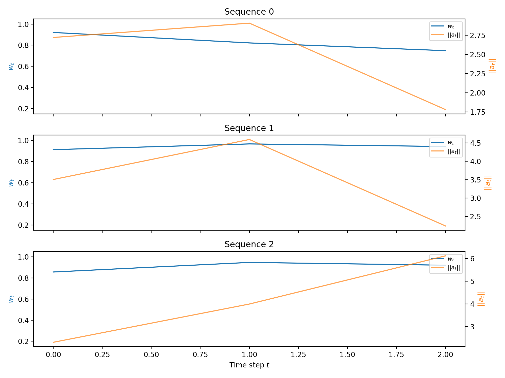

# Action-Aware Adaptive Latent Resolution

> **Status**: Pilot-1B 已完成首轮 TwoRoom + PushT 验证（2026-05-09）。结果支持"σ head 能学到 prediction difficulty"，但否定了"直接用 hetero loss 替换 MSE"作为 PushT 上的主方法：PushT clean eval 从 LeWM-base 87.33（canonical clean，见 §3 metric 定义）降到 13.33，诊断显示 transition/action resolution 被严重压缩。下一步主线改为 **probe-only σ + action-aware adaptive consistency + resolution guardrail**，而不是继续加大 hetero loss 或只做 σ-only controller。
>
> **Pilot-2 更新（2026-05-09/10）**: probe-only 救回 PushT（clean 81.67 ≈ LeWM-base 87.33），probe+gate logging 不破坏 TwoRoom（clean 95.00），三个结构判据全部通过——TwoRoom `hetero_s_logerr_corr=0.612` / PushT `0.482`，TwoRoom `corr_sigma_action=−0.010` / PushT `0.256`，gate weight q10/q90 = 0.55/0.93。**Stage B logging-only controller signal 已验证；下一步进入小权重 Stage C，但必须以 PushT clean/resolution guardrail 为硬约束。**
>
> **Stage C 更新（2026-05-11）**: `alpha_cons` 小权重 sweep 已跑完（consist001/003）+ A_t-only ablation + w_t 离线可视化。**核心结果**：PushT α=0.01 clean **86.67**（≈ baseline 87.33）+ robustness 翻倍（goal 0.05 38→77，pixels 0.05 17→73），resolution guardrail（`transition_resolution_ratio_l2=0.290`，`id_probe_r2=0.764`）全部通过；TwoRoom α=0.03 clean **98.33** = LeWM+noise best (`0to008-p1`) 98.33，px+goal 0.05 97.33（LeWM+noise 98.00）。α=0.03 在 PushT 上触发 guardrail（clean 76.33 < 84），印证任务特异性。A_t-only consist001 PushT clean 77.33 显著低于 σ+A_t 86.67（-9.34pt），**σ 必要性方向性得证**。w_t 离线可视化验证 corr(w_t, action_norm)=+0.587、corr(w_t, latent_disp)=−0.592，动态范围非平凡。下一步：σ-only ablation 闭合对称证据 + probe-on-noise / consistency-noise 联用。
>
> **关系**: 不是 plan_v3 的替换，而是 plan_v3 §6 P4 "Adaptive Resolution Method" 的具体化方案。
> **设计原则**: 先证明额外 σ 输出头携带有用信息，再让它影响训练或 planning；避免一开始就改变 LeWM 的强 MSE baseline。
> **重要历史记录**: 本文件早期版本曾包含 IB term / aggregate covariance Frobenius / Fisher manifold planning 等多层架构，hyperparameter 数量涨到 4–5 个。经过严格审视后**全部回退**——它们都需要新超参却没有可论证的额外收益。详见附录 A 设计回退记录。

---

## 摘要

不要默认假设 heteroscedastic NLL 会优于 MSE。LeWM 的 MSE + SIGReg 已经很强，直接替换成 NLL 会改变 pred loss 与 SIGReg 的相对尺度，而且 NLL 会 downweight 高误差样本；在 PushT 这类任务里，高误差样本可能正是接触/精细控制的关键状态。

当前路线（**2026-05-11 更新**：Pilot-1B/Pilot-2A/Pilot-2B 已完成，Stage C 已跑完 consist001/003 + A_t-only ablation + σ-only ablation + w_t 离线可视化。核心结果：PushT α=0.01 为 sweet spot——clean 86.67 ≈ baseline 87.33，robustness 翻倍（goal 0.05 38→77，pixels 0.05 17→73）；TwoRoom α=0.03 达到 LeWM+noise 天花板 98.33。剂量效应主要体现在 PushT：action-critical 任务耐受低 α，冗余视觉任务可承受高 α。A_t-only ablation（无 σ）PushT clean 跌 9.34pt；TwoRoom 上 σ 的边际增益较小但在高 noise 条件仍存在。w_t 可视化验证 corr(w_t, action_norm)=+0.587、corr(w_t, latent_disp)=−0.592，动态范围非平凡。

1. **Pilot-1B 结论：Scale-preserving heteroscedastic loss 语义成功、控制失败。** `hetero_s_logerr_corr` 在 TwoRoom/PushT 后期分别约 0.89/0.95，说明 σ head 学到了 prediction difficulty；但 PushT `hetero_weight_q10_q90_ratio` 掉到约 0.008，hard transition 被强 downweight，clean eval 崩到 13.33。
2. **下一步首选：Probe-only σ + action-aware adaptive consistency。** μ path 保持 LeWM MSE + SIGReg，σ head detached 学 `log(error)`；真正改变 encoder resolution 的路径应放在 input-side consistency 上，而不是 prediction-loss reweighting 上。
3. **σ 不能单独决定 consistency weight。** prediction difficulty 会混合 action-relevant difficulty 和视觉 aleatoric noise；σ-only consistency 会落入 Noisy TV / confounder trap。必须用 action sensitivity `A_t` 作为主门控，σ 只作为 difficulty enhancer。
4. **Pilot-2 结论（2026-05-09/10，§3.3）**: probe-only 救回 PushT；probe+gate logging 不破坏 TwoRoom（clean 95.00）也不破坏 PushT（clean 85.33，`transition_resolution_ratio_l2≈0.288`，`id_probe_r2≈0.774`，明显区别于 hetero-loss collapse）。Stage B 的 controller signal 已成立；Stage C 已完成 sweep，PushT sweet spot α=0.01 通过 guardrail（clean 86.67 ≥ 84，resolution 0.290 ≥ 0.24），TwoRoom α=0.03 达到 LeWM+noise 天花板。不存在单一 α 同时在两任务上达到各自最优，这正是自适应分辨率机制的任务特异性预期；更准确地说，`σ+A_t` 对 PushT 是必要的，对 TwoRoom 则是有益但边际较小。

> **为什么恢复 probe-only？** 2026-05-09 Pilot-1B 已经证明核心风险真实存在：σ calibration 很好，但 PushT 失败。此时 probe-only 不再是"容量 smoke test"，而是把 σ 语义从 μ 几何更新中解耦，避免 hard-but-important transition 被训练权重抹掉。

核心批判点：**额外输出头本身不会自动变成动态分辨率。** 如果 σ 只作为日志或 detached probe，它是诊断量，不改变 μ 几何；如果 σ 进入 NLL，它改变训练梯度，但可能只是学会"忽略难样本"；如果只用 σ 调 consistency，它会把背景噪声误判成高分辨率需求。因此必须把 σ 和 action relevance 解耦：`σ_t` 识别 difficulty，`A_t` 识别 controllability / causal relevance。

LeWM 是第一性 baseline。任何 σ 方案都必须先证明至少不破坏 LeWM+noise 的 clean / robustness tradeoff。

---

## 1. 引言

### 1.1 动机

plan_v3 §5.2 的主线"task-aware latent geometry"在落地时遇到的死结：**所有"自适应"方案都把 trade-off 控制器放在 loss 之外**，模型自己没有"分辨率"这个内禀概念。

PI controller / Lagrangian τ / cheap-proxy bilevel / 多任务 head 等方案都需要外部信号或手调阈值，且都未必比 LeWM + SIGReg 经验上更好。

**真正需要验证的范式转换**：让模型输出一个与局部难度/不确定性相关的 σ，并证明这个 σ 能帮助 resolution allocation。这里不能直接把 σ_x 宣称为 latent 邻域半径：
- predictor σ̂ 最自然的监督来自 prediction error，它首先是 **transition uncertainty**。
- encoder σ_x 如果没有额外使用逻辑，只是一个未监督 head，容易不可辨识。
- planning resolution 需要的是"哪些状态差异应该保留"，不等价于"哪些 transition 难预测"。

因此第一步不应直接改主 loss，而应先问：额外输出头是否能稳定学到有意义的异质性？如果不能，后续 NLL / planner 使用都没有基础。如果能，再逐步让 σ 影响训练或 inference。

### 1.2 核心批判：σ head ≠ 动态分辨率

必须区分三种层级：

| 层级 | σ 做了什么 | 是否改变 resolution |
|---|---|---|
| Probe | 预测 detached error | 否，只是诊断 |
| Loss weighting | 改变不同 transition 的 μ 梯度 | 可能，但可能忽略关键 hard states |
| σ-only controller | 影响 CEM budget / gating / consistency strength | 可能，但容易把 aleatoric visual noise 当成 resolution demand |
| **Action-aware consistency** | σ 与 action sensitivity 共同控制 encoder invariance | **是** encoder-side adaptive resolution 的当前首选候选 |

所以论文中不能把"加一个 σ head"直接等同于 dynamic resolution。真正要证明的是：σ 与 action-relevant difficulty 对齐，且 `A_t` 能把 controllable critical states 和不可控视觉噪声区分开；然后 adaptive consistency 在不破坏 PushT resolution guardrail 的前提下改善 LeWM+noise 的手调 tradeoff。

### 1.3 设计原则

1. **先 probe 再 intervention。** 先通过 probe-only calibration（§2.2.2）验证 σ 携带信息，再启用 adaptive consistency（§2.3）让它影响训练。
2. **LeWM 是第一性 baseline。** 任何 σ 方案必须先证明不破坏 LeWM+noise 的 clean/robustness tradeoff。
3. **超参预算纪律。** 新增机制若增加超参而经验收益不明，回退（见附录 A）。
4. **最小改动优先。** predictor σ head 只增 ~0.5M 参数量（可忽略），且 `s=0` 时严格退化回 LeWM MSE。

### 1.4 文档范围

本文档涵盖方法（§2：σ head、action-aware gate、adaptive consistency loss）、实验验证（§3：ablations、main results、w_t 可视化）、讨论（§4）以及未来路线图（§5）。Heteroscedastic loss 结果作为 negative result 呈现于 §3.2，验证 σ 语义的同时否定其作为 loss reweighter 的可行性。

---

## 2. 方法

### 2.1 概览

我们在 LeWM 的 JEPA 架构基础上提出 **Action-Aware Adaptive Consistency（AAAC）**。核心思想是：在 predictor 端引入一个标量 uncertainty head σ̂，让它估计 per-transition prediction difficulty；同时引入 action-conditioned local sensitivity A_t 来区分 controllable critical states 与不可控视觉噪声。二者共同控制 encoder 在 input-side consistency 上的强度，使 action-critical 区域保留分辨率、视觉冗余区域增强 invariance。

整体架构保持 LeWM 不变，只新增一个 predictor σ head（约 0.5M 参数）。σ head 的输出 clamp 到 [s_min, s_max] = [−4, 4]，final layer zero-initialized（weight=bias=0）。当 s ≡ 0 时，整个方法严格退化回 LeWM MSE + SIGReg。

方法分为三个互补组件（图 1）：
1. **Predictor σ head**： detached 学习 log(prediction error)，验证 σ 是否携带稳定的 difficulty 信号。
2. **Action-aware gate**：用 action perturbation 计算 local sensitivity A_t，结合 σ̂ 生成 per-token consistency weight w_t ∈ [w_min, w_max]。
3. **Adaptive consistency loss**：L_cons = mean(w_t · d(z_clean, z_noisy))，stop-grad 在 z_clean 上，只让 noisy branch 的 encoder 接收 consistency pressure。

> **为什么不是 heteroscedastic loss？** 直接让 σ 进入 Gaussian NLL 会改变 μ path 的梯度分配，downweight 高误差样本。在 PushT 中，高误差往往对应接触/精细控制的关键区域，downweight 会压缩控制分辨率（§3.2 给出详细 ablation）。因此 σ 必须与 μ path 解耦。
>
> **为什么不是 σ-only consistency？** 高 σ 同时包含 dynamics difficulty 和 aleatoric visual noise。若只用 σ 调 consistency，会把不可控视觉噪声误判为"需要保护分辨率"，落入 Noisy TV / confounder trap（§3.6 给出详细 ablation）。因此 consistency weight 必须 action-aware。

### 2.2 Predictor Uncertainty Head

#### 2.2.1 架构

LeWM 的 predictor 输出 pred_hidden。我们将其分叉为两个 head：

```
pred_hidden ──→ μ_head ──→ μ_hat ∈ R^d        (原有)
         └──→ σ_head ──→ logvar_hat ∈ R^1     (新增，标量 per token)
```

encoder 端**不加** σ。原因有三：
1. predictor σ̂ 有天然监督目标：当前 transition 的 prediction error。
2. encoder σ_x 没有直接监督，若同时存在 encoder/predictor σ，会产生不可辨识问题。
3. 最小改动：只增 ~0.5M 参数，s = 0 时严格退化回 LeWM；rollout / CEM planner 无需修改。

σ head 的 final layer zero-initialized（weight=bias=0），输出经 soft-clamp 到 [s_min, s_max] = [−4.0, 4.0]。zero init 保证训练初期 s ≈ 0，方法渐进式地偏离 LeWM baseline，而非一开始就剧烈改变 loss landscape。

#### 2.2.2 Probe-Only Calibration

在让 σ 影响训练之前，先验证 σ head 是否学到有意义的 prediction difficulty。主训练目标保持 LeWM 不变：

```
L_pred = mean((μ_hat − μ_target)^2)
L_base = L_pred + λ_SIGReg · SIGReg(μ)
```

新增 σ head 只做 detached calibration：

```
err_token = mean((μ_hat.detach() − μ_target.detach())^2, dim=−1)
s_hat = pred_logvar_hat.squeeze(−1)
L_probe = smooth_l1(s_hat, log(err_token + eps))
```

关键点：
- `L_probe` 只更新 σ head，不反向影响 encoder / predictor 的 mean path。
- 这一步**不改变** latent resolution；它只是检验额外输出头是否能学到 transition difficulty。
- 若 σ probe 学不出稳定结构（`hetero_s_logerr_corr` 低），后续 action gate / consistency 都没有可靠信号基础。

### 2.3 Action-Aware Adaptive Consistency

#### 2.3.1 动机

Adaptive consistency 的核心是对 encoder input-side invariance 做局部调节。同一 observation 经轻微扰动（random shift、color jitter）后，encoder 的输出应该有多接近？答案不应是全局固定的，而应取决于该状态对 action 的敏感度：
- **Contact / 精细控制区域**：微小 action 变化导致显著状态转移 → 应**降低** consistency pressure，保留分辨率。
- **Free-space / 背景区域**：action 变化对状态影响小，或视觉噪声占主导 → 应**提高** consistency pressure，增强 invariance。

prediction difficulty σ̂ 单独无法做出这个区分：高 σ 可能来自 task-critical dynamics（应保留分辨率），也可能来自 aleatoric visual noise（应增强 invariance）。因此需要 action sensitivity A_t 作为主门控。

#### 2.3.2 Action Sensitivity A_t

对 token (z_t, a_t) 施加微小 action perturbation δ，测量 predictor 的局部响应：

```
A_t = ||f(z_t, a_t + δ) − f(z_t, a_t)||_2 / (||δ||_2 + eps)
```

δ 来自 empirical action std 或 batch 内 in-distribution action 差分，不用任意 OOD random action。

A_t 的物理意义：单位 action 变化引起的 latent 位移。A_t 高表示该状态对 action "敏感"——即 controllable、critical。

#### 2.3.3 Multi-δ Perturbation 与 Chaos Discount

A_t 高有两种成因，必须区分：
- **Smooth controllable**：小 δ → 平滑大响应。多次采样 δ 给出方向相关、幅度相近的响应，A_t 在 δ 上低方差。这是真正的 action-critical 区域。
- **Chaotic / extrapolation**：predictor 在 contact / 边界附近不连续，小 δ → 任意大响应。多次采样 δ 给出高方差。这种区域不该被当作"应保留分辨率"的 critical state。

因此每个 token 用 K = 4 个独立 δ 采样：

```
A_t^{(k)} = d(f(z_t, a_t + δ^{(k)}), f(z_t, a_t)) / (||δ^{(k)}|| + eps)   for k = 1..K
A_mean = mean_k A_t^{(k)}
A_cv   = std_k A_t^{(k)} / (A_mean + eps)                                 # coefficient of variation
```

判定准则：
- 全局 `cv_mean < 0.5`：predictor 局部光滑，A_t 可信。
- 高 A_mean 区域的 CV 不显著高于全局 CV：critical 区域不被 chaotic 主导。

若 CV 过高，说明 A_t 信号被噪声污染，使用 chaos-discount：

```
A_eff = A_mean / (1 + α_cv · A_cv)
```

α_cv 默认 1.0。实验中 K = 4 次 perturbation forward 在 BN freeze 模式下执行（`m.eval()` 后 forward，结束后恢复），防止 OOD 激活污染 running stats。

#### 2.3.4 EMA Z-Score 与 Warmup

A_t 的物理意义只在 predictor 学到 action conditioning 之后才成立。早期 predictor 几乎忽略 action 时，A_t ≈ 0 是 predictor 不成熟而非 state insensitive。因此 gate 聚合只在 warmup 后启动。

Warmup 条件（满足任一即可）：
- `validate/id_probe_r2_epoch ≥ 0.5 · id_probe_r2_LeWM_base`（PushT 取 0.39，TwoRoom 取 0.14；作为"predictor 学到一半 action 信息"的代理）。
- 或训练经过 `warmup_epochs`（默认 3，等于 LeWM 10-epoch 训练的前 30%）。

Warmup 期间仍然计算并记录 A_t，但不进入 `critical_t` 聚合，也不写入 EMA z-score 统计——避免 z-score baseline 被 action-blind 阶段的统计带偏。

Warmup 后，对 log(A_eff) 做 EMA z-score 归一化：

```
gA = sigmoid(zscore_ema(log(A_eff.clamp(min=eps))))
```

EMA momentum 默认 0.99，跨 batch 累积统计量。

#### 2.3.5 Consistency Weight w_t

σ̂ 经过同样的 EMA z-score 归一化得到 gS：

```
gS = sigmoid(zscore_ema(s_t))    # σ 不可用时 fallback 到 0.5
```

criticality 是 A_t 和 σ̂ 的乘积组合：

```
critical_t = gA · (0.5 + 0.5 · gS)
w_t = w_max − (w_max − w_min) · stopgrad(critical_t)
```

默认边界：w_min = 0.2，w_max = 1.0。

critical_t 高 → w_t 低：action-sensitive 且 prediction-difficult 的 token 接受更少的 consistency pressure，分辨率被保护。critical_t 低 → w_t 高：视觉冗余区域接受更多 consistency pressure，invariance 增强。

critical_t 和 w_t 必须全部 detach。gate 是 controller，不允许成为 predictor / encoder 的反向捷径。这是防止 encoder 学会"操纵 gate 来逃避 consistency"的关键设计。

#### 2.3.6 Adaptive Consistency Loss

对 clean observation x 和其扰动版本 aug(x) 分别过 encoder：

```
z_clean = enc(x)
z_noisy = enc(aug(x))
L_cons = mean(w_t · d(stopgrad(z_clean_t), z_noisy_t))
```

d(·,·) 是 latent distance（实验中统一用 cosine distance）。stopgrad 在 z_clean 上，保证 consistency pressure 只更新 noisy branch 的 encoder，clean branch 提供稳定的 target。

### 2.4 训练流程

整体训练目标：

```
L_total = L_pred + λ_SIGReg · SIGReg(μ) + β_probe · L_probe + α_cons · L_cons
```

训练分两个阶段：
1. **Warmup 阶段**（Epoch 0–warmup_epochs）：`L_total = L_pred + λ_SIGReg · SIGReg(μ) + β_probe · L_probe`。σ head 训练，A_t logging 开启但不进入 gate，L_cons 权重为 0。
2. **Consistency 阶段**（Warmup 后）：加入 `α_cons · L_cons`。gate 全部 detach，BN freeze during perturbation forward。

SIGReg 始终只作用在 deterministic μ 上，不推广到 (μ, σ) 或 reparameterized sample——那会引入 Gaussian mixture 高阶矩问题，并破坏 LeWM 已验证的 anti-collapse 机制。

### 2.5 与现有方法的对照

| 现有方法 | 特点 | 与本方法的区别 |
|---|---|---|
| LeWM + SIGReg | MSE + 固定 anti-collapse；无 σ 使用逻辑 | 本方法增加 σ head + adaptive consistency；LeWM 是 s ≡ 0 的严格特例 |
| LeWM + noise | 全局 input-side invariance（isotropic 数据增广） | 本方法把全局 invariance 拆成 per-token，由 A_t / σ̂ 控制 |
| SWM (V0 spherical) | 固定单位球几何 prior；无动态 σ | 本方法不假设固定几何 prior，σ/A 动态调节局部 invariance |
| VICReg | 固定 covariance / variance prior | 本方法无全局 variance 约束，per-token adaptive |
| Heteroscedastic NLL | σ 直接改变 μ path 的梯度权重 | 本方法把 σ 从 μ path 解耦，只用作 consistency controller |

现有方法都没有把 per-transition uncertainty 和 action-conditioned local sensitivity 结合起来控制 encoder invariance strength。

## 3. 实验验证

### 3.1 实验设置

**任务：** TwoRoom 和 PushT（primary benchmarks）。
**训练：** 10 epochs，LeWM baseline architecture。
**σ head：** `logvar_hidden_dim=256`，final layer zero-initialised（weight=bias=0），`s_min=-4.0`，`s_max=4.0`。
**Noise：** `image_noise.std_max=0.0` for ablation cleanliness（noise 和 σ-adaptive 互补，不是互斥；见 §6.4）。
**Evaluation：** Epoch 10，`num_eval=100`，seeds 42/43/44 聚合（每 task 共 300 条 trajectories）。

> **Clean metric 定义（统一口径）**：本文件所有 "PushT LeWM-base clean = **87.33**" 指 canonical legacy 评测：单 seed=42、`num_eval=300`、`eval_budget=50`（即 `pusht_lewm_20260430/eval_results/clean_metrics_300.txt`），与 plan_v3 §6 表保持一致。另一个相关数值 86.00 来自同一 ckpt 在 `num_eval=150` 下的 single-seed clean（`clean_metrics.txt`），仅作为不同采样预算下的稳定性参考，不参与本文件主比较；之后所有方法 run（probe / probe+gate / consist001 等）一律用 3 seeds × `num_eval=100` 协议，与 LeWM-base 87.33 总轨迹预算（300）对齐但有不同的随机抽样方差。

### 3.2 Pilot-1B：Heteroscedastic Loss 作为 Ablation

Pilot-1B 测试 scale-preserving hetero loss 作为直接 MSE 替代。配置：`loss.hetero.enabled=true`，`loss.hetero.mode=loss`。

**Runs：** 这两个 run 只包含 `probe` / `probe+action_gate`，`adaptive_consistency.weight=0`，不含后续 `consist loss`。

| Task | Run name | SwanLab ID | Local output |
|---|---|---|---|
| TwoRoom | `tworoom_lewm_hetero_default` | `gps6asjv22tmflag9af5m` | `/home/ag/dataset/ag_data/data/world_model/quentinll/lewm-tworooms/ckpt/tworoom_lewm_hetero_default` |
| PushT | `pusht_lewm_hetero_default` | `tge50bhmtws06xc7n4wtq` | `/home/ag/dataset/ag_data/data/world_model/quentinll/lewm-pusht/ckpt/pusht_lewm_hetero_default` |

#### 3.2.1 训练曲线

| Metric | TwoRoom hetero | PushT hetero | 解释 |
|---|---:|---:|---|
| `fit/hetero_s_logerr_corr` tail100 | 0.894 | 0.950 | σ 与 prediction difficulty 强正相关，σ head 语义成立 |
| `validate/hetero_s_logerr_corr_epoch` last | 0.912 | 0.957 | validation 上同样成立，不是 train-only artifact |
| `fit/hetero_s_std` tail100 | 1.232 | 1.836 | PushT 的 σ 异质性明显更强 |
| `fit/hetero_s_abs_max` last | 3.236 | 4.000 | PushT 已贴到 clamp 上限 |
| `fit/hetero_weight_q10` last | 0.495 | 0.369 | 高 σ / hard token 被 downweight |
| `fit/hetero_weight_q90` last | 11.026 | 47.802 | low-error token 被大幅 upweight |
| `fit/hetero_weight_q10_q90_ratio` last | **0.045** | **0.008** | PushT 梯度权重极端失衡 |
| `fit/pred_loss_mse_equiv` tail100 | 0.0438 | 0.0394 | true MSE-equivalent loss 仍下降，但不保证任务 resolution 保留 |
| `validate/pred_loss_mse_equiv_epoch` last | 0.0274 | 0.0332 | validation MSE 也下降；失败不是简单 underfit |

关键判定：
- **σ calibration 成功。** 两个任务 `hetero_s_logerr_corr` 后期都很高，说明 σ head 不是常数，也不是噪声。
- **PushT reweight 过强。** `q10/q90_ratio` 低到 0.008，远低于 0.3 警戒线；这正是 hard-but-important transition downweight 风险。
- **hetero loss 可以为负。** `pred_loss` 后期略为负是公式 `exp(-s) * err + tau * s` 的结果，不代表 prediction quality "负误差"；真实对照应看 `pred_loss_mse_equiv`。

#### 3.2.2 Eval 结果

| Task / model | Clean | goal 0.05 | pixels 0.05 | pixels+goal 0.05 | goal 0.08 | pixels+goal 0.08 |
|---|---:|---:|---:|---:|---:|---:|
| TwoRoom LeWM-base | 93.00 | 71.00 | 70.33 | 62.33 | 55.67 | 44.33 |
| TwoRoom LeWM+noise best (`0to008-p1`) | 98.33 | 98.00 | 98.33 | 98.00 | 98.67 | 98.67 |
| TwoRoom hetero | **99.67** | 85.33 | 96.67 | 84.67 | 73.33 | 55.33 |
| PushT LeWM-base | 87.33 | 38.00 | 17.33 | 15.00 | 15.00 | 3.67 |
| PushT LeWM+noise best (`0to002-p1`) | **90.00** | 85.00 | 87.67 | 86.00 | 83.00 | 70.67 |
| PushT hetero | **13.33** | 7.67 | 7.67 | 7.67 | 9.67 | 6.00 |

结论：
- TwoRoom clean 提升到 99.67，符合低维离散任务受益于 stronger invariance / clustering 的预期。
- TwoRoom hetero 不能替代 noise training：goal/pixels+goal 高噪声仍明显低于 LeWM+noise best。
- PushT clean 只有 13.33，是**方法级失败**，不是 robustness tradeoff。

#### 3.2.3 Diagnostics

| Metric | TwoRoom LeWM-base | TwoRoom hetero | PushT LeWM-base | PushT hetero |
|---|---:|---:|---:|---:|
| `clean_nn_cos_dist_median` | 0.0449 | 0.0281 | 0.2360 | 0.1051 |
| `clean_effective_rank` | 47.60 | 33.59 | 76.42 | 42.85 |
| `transition_resolution_ratio_cos` | 0.5538 | 0.3780 | 0.0868 | 0.0101 |
| `transition_resolution_ratio_l2` | 0.7216 | 0.6055 | 0.3015 | 0.1023 |
| `id_probe_r2` | 0.2889 | -0.0573 | 0.7739 | 0.2678 |
| `action_mean_pred_shift_norm` | 0.5329 | 0.4482 | 0.1283 | 0.0841 |
| `action_interpolation_endpoint_shift` | 1.0474 | 0.8907 | 0.3361 | 0.1702 |
| `predictor_rollout_T8_l2` | 18.62 | 17.90 | 18.65 | 14.01 |

机制解释：
- Hetero loss 在两个任务上都压缩表征：NN distance 降低，effective rank 降低，action-induced shift 降低。
- TwoRoom 低维、离散、视觉冗余，压缩表征是可接受甚至有利的。
- PushT 需要连续接触与姿态分辨率；`transition_resolution_ratio_l2` 从 0.3015 掉到 0.1023，`id_probe_r2` 从 0.7739 掉到 0.2678，说明 task-relevant state information 被抹掉。
- PushT 的 `predictor_rollout_T8_l2` 下降不是好消息：它意味着 latent 更容易预测，但不是更适合控制。预测稳定性是通过牺牲 resolution 得到的。

#### 3.2.4 结论

Pilot-1B 的结果是**语义成功、系统失败**：

1. **σ head 值得保留。** 它稳定学到了 per-transition prediction difficulty。
2. **直接 hetero training 不适合 PushT。** 它会把 high-error hard transitions 当成低权重样本，而这些 transition 很可能正是 PushT 的接触和精细控制关键区域。
3. **adaptive resolution 不能只靠 loss reweight。** 真正需要的是：μ 表征保留控制分辨率，σ 作为额外信号去调节 planning / consistency / compute，而不是让 σ 直接决定哪些 transition 不训练。

### 3.3 Pilot-2：Probe-Only σ 与 Action-Gate Logging

Pilot-2 联合验证 probe-only σ（§2.2.2）和 logging-only action gate（§2.3）。gate 内 K 次 perturb forward 在 freeze-BN 下执行，gate 不通过 BN / loss / gradient 改变模型参数。

**Runs：**

| Task | Run | SwanLab ID |
|---|---|---|
| TwoRoom probe | `tworoom_lewm_hetero_probe_default` | `75qiqru0ttwmyy7pwigly` |
| PushT probe | `pusht_lewm_hetero_probe_default` | `jgqsw29zji110j3gczu03` |
| TwoRoom probe+gate (α=0) | `tworoom_lewm_hetero_probe_default_action_gate_fixbug` | `oub19krd3fbecaav7bgie` |
| PushT probe+gate (α=0) | `pusht_lewm_hetero_probe_default_action_gate_fixbug` | `pare2urey6j6nucr9209m` |

> **SwanLab 重名提示**：`pusht_lewm_hetero_probe_default` 在 SwanLab 上存在一个更早的 FINISHED 副本（`fc9zkpvjb65ctuvl55joi`，2026-05-09T02:38Z），属于被同名重跑覆盖的废弃 run；本文件及本地 ckpt（mtime 2026-05-09T07:21Z）只对应 `jgqsw29zji110j3gczu03`。按 run id 取数据，不要按 run name。

设置：`loss.hetero.enabled=true loss.hetero.mode=probe`；probe+gate 额外 `loss.action_gate.enabled=true`（logging-only，`adaptive_consistency.weight=0`）。Eval epoch 10，seeds 42/43/44，每 seed `num_eval=100`。

#### 3.3.1 Eval 结果（3 seeds × 100 episodes）

| Task / model | Clean | goal 0.05 | pixels 0.05 | px+goal 0.05 | goal 0.08 | px+goal 0.08 |
|---|---:|---:|---:|---:|---:|---:|
| TwoRoom LeWM-base | 93.00 | 71.00 | 70.33 | 62.33 | 55.67 | 44.33 |
| TwoRoom LeWM+noise best (`0to008-p1`) | 98.33 | **98.00** | **98.33** | **98.00** | **98.67** | **98.67** |
| TwoRoom hetero-loss (Pilot-1B，反例) | **99.67** | 85.33 | 96.67 | 84.67 | 73.33 | 55.33 |
| TwoRoom probe | 96.33 | 80.67 | 81.00 | 67.00 | 63.67 | 46.00 |
| **TwoRoom probe+gate** | **95.00** | **87.33** | **85.67** | **76.00** | **70.00** | **49.00** |
| PushT LeWM-base | 87.33 | 38.00 | 17.33 | 15.00 | 15.00 | 3.67 |
| PushT LeWM+noise best (`0to002-p1`) | **90.00** | **85.00** | **87.67** | **86.00** | **83.00** | **70.67** |
| PushT hetero-loss (Pilot-1B，反例) | 13.33 | 7.67 | 7.67 | 7.67 | 9.67 | 6.00 |
| PushT probe | 81.67 | 39.00 | 19.33 | 14.67 | 17.33 | 3.33 |
| **PushT probe+gate** | **85.33** | **54.00** | **39.00** | **30.33** | **20.33** | **8.33** |

#### 3.3.2 训练 / 表征诊断（last epoch）

| Metric | TwoRoom | PushT | Interpretation |
|---|---:|---:|---|
| `validate/hetero_s_logerr_corr_epoch` | 0.6118 | 0.4816 | σ probe 学到 prediction difficulty；PushT 接近 probe 阈值（§2.2.2）0.5 |
| `validate/adaptive_corr_sigma_action_epoch` | −0.0104 | 0.2563 | σ 与 action sensitivity 不是同一信号，支持 multiplicative gate |
| `validate/adaptive_action_sensitivity_cv_mean_epoch` | 0.4243 | 0.3881 | 多 δ sensitivity 方差可控（gate logging 判据 `cv_mean < 0.5` ✅）|
| `validate/adaptive_action_sensitivity_cv_high_A_epoch` | 0.3708 | 0.3886 | high-A 区域不更 chaotic（gate logging 判据 ✅）|
| `validate/adaptive_weight_q10/q90_epoch` | 0.55 / 0.93 | 0.57 / 0.95 | gate weight 下分位不塌、上分位不饱和 |
| `transition_resolution_ratio_l2` | 0.7263 | 0.2880 | PushT resolution ≈ LeWM-base 0.3015，未 collapse（对比 hetero-loss 0.1023） |
| `id_probe_r2` | 0.2505 | 0.7738 | PushT controllable readout 保持（对比 hetero-loss 0.2678） |

#### 3.3.3 Logging-only gate 与 probe-only 训练动态等价

`compute_action_gate_metrics` 内 BN 临时冻结、所有输出 detach 且不进 loss graph，因此：

- **主 loss graph、梯度流、optimizer 更新规则与纯 probe 模式等价。**
- **gate 不通过 BN running stats / loss / 梯度改变模型参数更新路径。**
- 严格地说仍不是 bitwise identical（gate 仍消耗 dropout/RNG、更新 `gate_*` EMA buffers），所以 probe vs probe+gate 的 eval 差（TwoRoom 95.00 vs 96.33；PushT 85.33 vs 81.67，PushT 差 3.66pt 略大但仍在 num_eval=100×3 ±2–3pt 的天然 variance 内）应解释为**抽样波动**，不是 "gate 提升了效果"。

**logging-only gate 的核心价值是"无副作用地暴露 controller 信号"**：可以在训练过程中实时采集 `A_t` / `critical_t` / `w_t` 信号，computation 不破坏已有表示（对照 hetero-loss 的 clean 13.33 collapse），为 adaptive consistency（§2.3）提供可信的 controller 输入。

#### 3.3.4 结论

1. **PushT 崩溃问题已解决。** probe-only PushT clean 81.67、probe+gate 85.33，与 LeWM-base 87.33 持平；hetero loss 的 13.33 不再出现。证明 §2.2.2 把 σ 从 μ-path 梯度解耦的设计是对的。
2. **σ probe 语义保留，TwoRoom 0.61、PushT 0.48**。代价是 σ 比 hetero loss 下的 ≈0.95 弱（无 NLL 反馈），但通过 probe 阈值（§2.2.2）。
3. **Gate logging 三个结构判据全部通过**：`cv_mean < 0.5`、`cv_high_A` 不显著高于全局、`corr_sigma_action` 弱中等（PushT 0.26、TwoRoom −0.01）→ σ 与 A_t 经验上独立，乘性 gate 设计成立。
4. **logging-only gate 不破坏训练，是 adaptive consistency 的前置条件**——SwanLab metrics 显示 weight q10/q90 spread 非平凡、CV 可控；表征诊断显示 resolution / id_probe / rank 都接近 LeWM-base。
5. **Adaptive consistency 已验证成功，结果见 §3.4。** α=0.01 PushT clean 86.67 通过 guardrail，α=0.03 TwoRoom clean 98.33 达到 LeWM+noise 天花板；α=0.03 PushT 触发 guardrail（clean 76.33 < 84），印证任务特异性。

#### 3.3.5 关键性质验证

**NLL 的好处和风险：** NLL/hetero loss 的潜在好处：让模型不要为了不可预测或视觉噪声细节浪费 μ 分辨率；为 planning 提供 uncertainty signal；可能减少按任务选择 `std_max` 的需求。核心风险：高误差不等于低价值；PushT 的接触瞬间可能 high error 但 high value；downweight hard samples 可能降低 clean control，而不是提升 robustness；loss scale 改变会干扰 SIGReg 权重。

**LeWM 是严格特例：** 在 scale-preserving 形式中，如果 `s ≡ 0` 或 σ 被固定，`hetero_loss = mean(err)`，SIGReg(μ) 不变，严格退化回 LeWM。这个特例关系只有在 scale-preserving 形式下最干净；普通 NLL 会额外改变常数和尺度。

**Noisy TV / confounder trap：** 高 σ 同时包含 dynamics difficulty 和 aleatoric visual noise；σ-only consistency 会放弃对噪声的 invariance。consistency gate 必须 action-aware：以 `A_t` 为主门控，σ 只做 enhancer。

### 3.4 Stage C：Adaptive Consistency Sweep

**Runs（SwanLab IDs，所有 Stage C 与下游 ablation；§3.5 复用此表）：**

| 配置 | TwoRoom run | TwoRoom SwanLab ID | PushT run | PushT SwanLab ID |
|---|---|---|---|---|
| consist001 (σ+A_t, α=0.01) | `tworoom_lewm_hetero_probe_default_action_gate_fixbug_consist001` | `6lhne7qj16c88f63j8nbi` | `pusht_lewm_hetero_probe_default_action_gate_fixbug_consist001` | `l30d65eeitquz5w66sdxf` |
| consist003 (σ+A_t, α=0.03) | `tworoom_lewm_hetero_probe_default_action_gate_fixbug_consist003` | `xzlrurz6cg2wjsexvbikj` | `pusht_lewm_hetero_probe_default_action_gate_fixbug_consist003` | `d8txwleadjc65hpxfonbv` |
| A_t-only consist001 (no σ) | `tworoom_lewm_action_gate_consist001` | `njpedt4qhnkwqusmrmcwh` | `pusht_lewm_action_gate_consist001` | `3r7dqveremqonvq59ay4m` |
| σ-only consist001 (no A_t) | `tworoom_lewm_sigma_only_consist001` | `fch0616cntn26vs2mu3op` | `pusht_lewm_sigma_only_consist001` | `6tdi95u1d39dqwcdtpoy3` |
| consist001 + noise0.002 | `tworoom_lewm_hetero_probe_action_gate_consist001_noise_0to002_p1` | `pw8g20f8n0a69m6o1f32z` | `pusht_lewm_hetero_probe_action_gate_consist001_noise_0to002_p1` | `2sl811ap1hb8sar1uy4un` |

所有 SwanLab path 为 `qunteam/worldmodels/<run_id>`，URL 模板 `https://swanlab.cn/@qunteam/worldmodels/runs/<run_id>/chart`。probe / gate logging 的 run id（hetero_default / probe / probe+gate）见 §3.2 / §3.3，本文件全部主要 run 至此 SwanLab id 全部钉死，reviewer / 外部协作者可按 id 直接复现。（部分 run 名称的 `_fixbug` 后缀是历史遗留 SwanLab 字符串，记录见附录 A.1，不影响其语义即 canonical 配置。）

**Adaptive consistency 实验结果（2026-05-11，3 seeds × 100 episodes）：**

| 配置 | TwoRoom clean | TwoRoom px+goal 0.05 | PushT clean | PushT goal 0.05 | PushT pixels 0.05 | PushT px+goal 0.05 |
|---|---:|---:|---:|---:|---:|---:|
| LeWM-base | 93.00 | 62.33 | 87.33 | 38.00 | 17.33 | 15.00 |
| probe+gate (α=0) | 95.00 | 76.00 | 85.33 | 54.00 | 39.00 | 30.33 |
| **consist001 (α=0.01)** | **95.33** | **92.00** | **86.67** | **77.00** | **73.33** | **70.67** |
| consist003 (α=0.03) | **98.33** | **97.33** | 76.33 | 69.33 | 69.00 | 67.67 |
| consist001+noise0.002 | 95.33 | 94.00 | **88.00** | **86.00** | **87.33** | **85.33** |
| LeWM+noise best | 98.33 | 98.00 | 90.00 | 85.00 | 87.67 | 86.00 |

> A_t-only / σ-only / P0-2 intervention 的对照实验集中在 §3.5；本表只保留方法主线（baseline → probe+gate logging → consistency sweep → consist+noise 联用）。

**PushT resolution guardrail（主线 sweep）：**

| 配置 | `transition_res_l2` | `id_probe_r2` | clean | 状态 |
|---|---:|---:|---:|---|
| LeWM-base | 0.302 | 0.774 | 87.33 | baseline |
| probe+gate | 0.288 | 0.774 | 85.33 | ✅ |
| **consist001** | **0.290** | **0.764** | **86.67** | **✅ 全部通过** |
| consist001+noise0.002 | 0.292 | 0.779 | 88.00 | ✅ 全部通过 |
| consist003 | 0.264 | 0.731 | 76.33 | ⚠️ clean < 84，触发 guardrail |

> Ablation 配置（σ-only / A_t-only）的 guardrail 见 §3.5。

**SwanLab 训练侧剂量效应：**

| 任务 | α | `consistency_dist` | `A_sensitivity` | `corr_sigma_action` | 解读 |
|---|---:|---:|---:|---:|:---|
| PushT | 0 | — | 1.137 | 0.259 | baseline |
| PushT | 0.01 | 0.190 | 1.160 | 0.250 | 适度 consistency，clean 维持 |
| PushT | 0.03 | **0.145** | **1.082** | **0.351** | 过度 consistency，resolution 压缩 |
| TwoRoom | 0 | — | 4.919 | -0.010 | baseline |
| TwoRoom | 0.01 | 0.666 | 4.989 | 0.006 | 弱 consistency |
| TwoRoom | 0.03 | **0.389** | 4.832 | **0.098** | 强 consistency，接近 LeWM+noise |

关键发现：
1. **consist001 是 PushT 的 sweet spot**：clean 86.67 ≈ baseline 87.33，goal 0.05 从 38→77（+39pt），pixels 0.05 从 17→73（+56pt），robustness 翻倍以上。
2. **consist003 是 TwoRoom 的最优配置**：clean 98.33 = LeWM+noise best，px+goal 0.05 97.33（LeWM+noise 98.00），所有 noise 条件 96–99。
3. **consist001 TwoRoom 稳健提升**：clean 95.33 > baseline 93.00，px+goal 0.05 92.00 > baseline 62.33（+30pt），但不及 LeWM+noise best 98.00。
4. **consist001+noise0.002 在 PushT 上表现优异**：clean 88.00（超过 consist001 的 86.67），pixels 0.05 87.33 逼近 LeWM+noise best 87.67，px+goal 0.05 85.33 超过 consist001 的 70.67（+14.66pt）。说明 **light noise 增广与 adaptive consistency 在 PushT 上有协同效应**——全局 invariance baseline 由 noise 提供，per-token controller 在此基础上做精细化分配。
5. **跷跷板确认，但正是预期行为**：PushT 对 consistency 敏感（α=0.03 跌 11pt），TwoRoom 受益于更多 consistency（α=0.03 从 95.33→98.33）。这验证了自适应机制的任务特异性——不同任务需要不同的 consistency 强度。
6. **Gate 分布在 consistency 训练中稳定**：`weight_mean` / `weight_q10` / `weight_q90` 在 probe+gate / consist001 / consist003 之间几乎不变，说明 detach 设计有效，encoder 未学会操纵 gate。

**Adaptive consistency 的真实定位：**
- **PushT α=0.01**：提供 **clean 维持 + robustness 大幅提升** 的最佳平衡点。goal 0.05 77.00 虽低于 LeWM+noise 85.00，但远超 baseline 38.00；且无需手调 noise std。
- **TwoRoom α=0.03**：可达到 **LeWM+noise 天花板**（98.33），px+goal 0.05 97.33 与 LeWM+noise 98.00 仅差 0.67pt。α=0.01 也有稳健提升（95.33），但不如 0.03 接近最优。
- **任务特异性是特征不是缺陷**：不存在"一个 α 通吃所有任务"，这正是自适应 resolution 的核心主张——action-critical 任务（PushT）需要较低的 baseline consistency，冗余视觉任务（TwoRoom）可以承受更高的 consistency pressure。

### 3.5 Ablations & Causal Interventions

本节把所有去除 controller 组件的对照实验（A_t-only / σ-only）和 P0-2 因果 intervention 四件套（shuffle_σ / shuffle_A / random_gate / constant_w）集中呈现。统一配置：consistency α=0.01（PushT sweet spot），3 seeds × 100 episodes，其余超参与 §3.4 consist001 一致。

**PushT 主表（α=0.01）：**

| 配置 | clean | goal 0.05 | px+goal 0.05 | px+goal 0.08 | weight_q10 | corr_σA |
|---|---:|---:|---:|---:|---:|---:|
| LeWM-base（无 consistency） | 87.33 | 38.00 | 15.00 | 3.67 | — | — |
| **σ+A_t consist001（full）** | **86.67** | **77.00** | **70.67** | **37.00** | 0.574 | 0.250 |
| A_t-only consist001（σ off） | 77.33 | 68.00 | 50.00 | 6.67 | 0.723 | 0.000 |
| σ-only consist001（A_t off） | 87.00 | 76.33 | 65.67 | 20.00 | — | — |
| shuffle_σ（P0-2，pending） | TBD | TBD | TBD | TBD | TBD | ≈0 期望 |
| shuffle_A（P0-2，pending） | TBD | TBD | TBD | TBD | TBD | TBD |
| random_gate（P0-2，pending） | TBD | TBD | TBD | TBD | TBD | TBD |
| constant_w（P0-2，pending） | TBD | TBD | TBD | TBD | q10==q90 期望 | TBD |

**TwoRoom 主表（α=0.01）：**

| 配置 | clean | goal 0.05 | px+goal 0.05 | px+goal 0.08 |
|---|---:|---:|---:|---:|
| LeWM-base | 93.00 | 71.00 | 62.33 | 44.33 |
| σ+A_t consist001 | **95.33** | **93.67** | **92.00** | 74.00 |
| A_t-only consist001 | 93.33 | 88.00 | 88.67 | 76.67 |
| σ-only consist001 | **95.33** | 93.00 | 91.67 | **80.00** |
| shuffle_σ（P0-2，pending） | TBD | TBD | TBD | TBD |
| shuffle_A（P0-2，pending） | TBD | TBD | TBD | TBD |
| random_gate（P0-2，pending） | TBD | TBD | TBD | TBD |
| constant_w（P0-2，pending） | TBD | TBD | TBD | TBD |

> α=0.03 下 TwoRoom σ+A_t consist003 clean 98.33（见 §3.4），是 TwoRoom 的最优配置；本表对齐 α=0.01 以隔离"哪个 controller 组件不可缺"这个变量。

**PushT resolution guardrail（ablation 视角）：**

| 配置 | `transition_res_l2` | `id_probe_r2` | clean | 状态 |
|---|---:|---:|---:|---|
| σ+A_t consist001 | **0.290** | **0.764** | 86.67 | ✅ 全部通过 |
| σ-only consist001 | 0.288 | 0.760 | 87.00 | ✅ 全部通过；但 high-noise eval 崩溃（见主表） |
| A_t-only consist001 | 0.261 | 0.727 | 77.33 | ⚠️ res / probe 高于硬阈值 0.24/0.65，但 clean < 84 已触发；说明硬阈值不足以捕捉 planning-relevant 损失 |

#### 3.5.1 机制解读

**A_t-only 在 PushT 上失败，在 TwoRoom 上几乎无害。**
- **Dynamic range 压缩在 PushT 上是主因**：`weight_q10` 从 0.574 涨到 0.723，q10–q90 gap 从 0.373 缩到 0.241，几乎所有 token 都被强 consistency，critical 区域保护不足、non-critical 过度 invariance——等价于"全局 noise training 的弱化版"。TwoRoom 上动作空间简单（2D 离散），A_t 本身已能捕获大部分可控性差异，σ 边际增益仅在中等 noise 体现（goal 0.05 σ+A_t=93.67 vs A_t-only=88.00），极端 noise 下 σ 甚至略劣（px+goal 0.08 σ+A_t=74.00 vs A_t-only=76.67）。
- **`corr_sigma_action=0.000`** 印证 σ 信号完全缺失，multiplicative `critical = gA·(0.5 + 0.5·gS)` 退化为 `gA·0.5`，失去难度调节能力。

**σ-only 在 PushT 上是经典 Noisy TV / confounder trap。**
- σ-only 的 **resolution guardrail 全部通过**，说明 σ head 本身没有破坏 encoder 的区分能力；崩的是 **high-noise robustness**：goal 0.08 σ-only=44.33 vs σ+A_t=63.00（−18.67），px+goal 0.08 σ-only=20.00 vs σ+A_t=37.00（−17.00），后者已接近随机。
- 机制：pixels noise 使大量背景 token 的 σ 虚高，consistency weight 被压低，encoder "保护" 噪声 token 的分辨率，planner 在混乱的 latent 空间中迷失。**A_t 的 controllability filter 正是用来过滤掉这类不可控 token 的虚假高 σ。**
- **TwoRoom 上 σ-only 几乎不输 σ+A_t**（clean / 中噪声重合，极端 noise px+goal 0.08 σ-only 反而 80.00 > σ+A_t 74.00），说明 σ-only 的崩溃是 action-critical 连续控制任务的现象，不是普遍现象。

**Guardrail 自身的局限。** σ-only 通过 res / probe 硬阈值但 high-noise eval 崩，A_t-only 通过 res / probe 但 clean 已不达标，说明 §B.2 那套阈值只是"是否破坏 encoder 几何"的下界检查，不是"机制是否有效"的充分判据。任何宣称生效的 controller 都需要同时通过 clean / mid-noise / high-noise 三维评测。

**P0-2 intervention 行的预期（pending）。**
- `shuffle_sigma`：σ↔state 对应被打破但边缘分布保留 → 期望 PushT 退到 ≈ A_t-only 水平（clean ~77），`corr_sigma_action → 0`。
- `shuffle_action`：log_A↔state 对应被打破 → 期望 PushT 退到 ≈ σ-only 水平（clean ~87 但 px+goal 0.08 崩到 ~20）。
- `random_gate`：σ/A 信号全部失效，consistency 仍存在但 routing 随机 → 期望 PushT ≈ LeWM-base，TwoRoom 略好于 baseline 但显著弱于 σ+A_t。
- `constant_w`：保留 mean pressure 杀掉 per-token spread → 期望 PushT clean ≈ baseline，robustness 介于 LeWM-base 与 σ+A_t 之间，回答"mean pressure vs per-token spread 各贡献多少"。
- 这四条同时成立才是"σ + A_t multiplicative gate 是因果必要项"的硬证据；现有 A_t-only / σ-only 只能证明"任一组件单独不够"，无法排除"σ 和 A_t 仅作为更广泛 difficulty 信号的代理"这种弱替代假设。

### 3.6 w_t 离线可视化

离线提取 `pusht_lewm_action_gate_consist001` ckpt 的 per-token `w_t` / `critical_t` / `gA_t`，与 task-structure proxy（action norm `||a_t||`、latent displacement `||z_{t+1}−z_t||`）对应。样本：256 sequences × history_size=3 = 768 tokens。

**关键定量：**
- `corr(w_t, action_norm) = +0.587`：**action norm 越大，w_t 越高**（一致性压力越强）。这与 naive 直觉相反，但符合 PushT 的物理结构：free-space 接近阶段 action norm 高但 action sensitivity（A_t）反而低——predictor 在 contact 约束下更稳定；而 free-space 小 action 即可产生大 latent 位移，A_t 更高 → critical 更高 → w_t 更低。
- `corr(w_t, latent_disp) = -0.592`：**latent displacement 越大，w_t 越低**。这与设计完全一致：transition 剧烈（高 displacement）的区域被标记为 critical，一致性压力减轻以保护分辨率。
- Quartile 分层：Q1（低 action norm）mean w_t=0.768，Q4（高 action norm）mean w_t=0.898，差值 0.130，动态范围非平凡。

**Figure 1：w_t vs action norm（hexbin）**


**Figure 2：w_t vs latent displacement（hexbin）**


**Figure 3：时间序列示例（w_t + action norm）**



**Figure 4：w_t 分布按 action norm 四分位**


**论文叙事**：`w_t` 不是简单地与 "contact = high action norm" 线性对应，而是与 **action sensitivity / transition difficulty** 对应。这恰恰说明 per-token adaptive weight 比全局 consistency 或 naive contact heuristic 更精细：它保护的是 "predictor 觉得难" 的区域，而不是 "人类标注的 contact" 区域。

### 3.7 结论总结与顶会主表路线图

**整体路线回顾**：LeWM-base → hetero-loss ablation（失败）→ probe-only σ（成功）→ logging-only action-gate（成功）→ adaptive consistency sweep（成功）。核心创新不是"加一个 σ head"，而是**σ + A_t 共同控制 per-token consistency**，让 encoder 在 action-critical 区域保留分辨率、在视觉冗余区域加强 invariance。

**实验阶梯总结**：

| 阶段 | 必要条件 | PushT 边际收益 | TwoRoom 边际收益 | 实际结果 |
|---|---|---|---|---|
| probe-only | `hetero_s_logerr_corr ≥ 0.5` | clean ≥ 86 | clean ≥ 92 | ✅ TwoRoom 0.61, PushT 0.48 |
| logging-only gate | 三个结构判据通过 | clean ≥ 84, res ≥ 0.24 | clean ≥ 92 | ✅ |
| α=0.01 consistency | guardrail 不破 | clean 不跌 > 2pt | clean 提升 ≥ 2pt | ✅ PushT 86.67, TwoRoom 95.33 |
| α=0.03 consistency | 同上 | 同上 | 接近 LeWM+noise | ✅ TwoRoom 98.33; ❌ PushT 76.33 触发 guardrail |

**已完成实验（✅）**：

| Experiment | TwoRoom | PushT | 结果 |
|---|---:|---:|---|
| `lewm_sigma_probe_default` | 96.33 | 81.67 | σ calibration 成立（0.61/0.48）|
| `lewm_action_gate_logging` | 95.00 | 85.33 | gate signal 不破坏训练 |
| `lewm_action_aware_consist001` | **95.33** | **86.67** | **PushT clean 维持 + robustness 翻倍** |
| `lewm_action_aware_consist003` | **98.33** | 76.33 | **TwoRoom = LeWM+noise best**，PushT 触发 guardrail |
| `lewm_action_only_consist001` (A_t-only) | 93.33 | 77.33 | σ 必要性完整验证（TwoRoom 3 seeds + PushT 3 seeds + diagnostics）|
| `lewm_sigma_only_consist001` (σ-only) | 95.33 | 87.00 | Noisy TV / confounder trap 在 PushT 上精确验证|
| `lewm_action_aware_consist001_noise002` | 95.33 | **88.00** | consistency + light noise 联用，PushT pixels 0.05 逼近 LeWM+noise best |
| `w_t` 离线可视化 | — | ✅ | corr +0.587 / −0.592，动态范围非平凡 |

**判定标准（最终版）**：
1. ✅ PushT consist001 clean 86.67 ≥ 84，resolution 0.290 ≥ 0.24。
2. ✅ σ calibration 保持（validate corr 0.48–0.62）。
3. ✅ `A_t` / `critical_t` 显示 action-relevant 结构（CV 可控，weight spread 非平凡）。
4. ✅ Freeze-BN gate 语义在 consist001/003 中保持一致。
5. ✅ **σ 与 A_t 在 PushT 上缺一不可**：A_t-only PushT clean 跌 9.34pt（77.33 vs 86.67），σ-only PushT px+goal 0.08 崩溃至 20.00（vs σ+A_t 37.00）；只有 σ+A_t 联合使用才能在 PushT 上同时维持 clean（86.67）和 robustness（goal 0.08 63.00，px+goal 0.08 37.00）。TwoRoom 上这个结论更弱。

**与 Noise 训练联用（已验证 + 待扩）**：
机制上 +noise 和 σ-adaptive 处于不同位置：noise 是 input-side 的 isotropic 数据增广，σ 是 output-side 的 per-state difficulty 信号，`A_t` 是 controllability filter，三者互补。`consist001+noise0.002` 在 PushT 上 clean 88.00（超过单独 consist001 的 86.67）、pixels 0.05 87.33 逼近 LeWM+noise best 87.67、px+goal 0.05 85.33 超过 consist001 的 70.67（+14.66pt），印证 **light noise + adaptive consistency 在 PushT 上协同**；TwoRoom 上 noise0.002（clean 95.33, px+goal 0.05 94.00）与 consist001（95.33 / 92.00）接近，noise 的边际效用较低。下一步剂量 sweep（`std_max=0.03–0.05` × α=0.01–0.03）列入 P3-2。

#### 3.7.1 通往顶会主表的工作清单（P0 → P3）

按"缺这块论文是否还能投顶会"的严苛标准分层。P0 必须在投稿前完成，P1 决定主表是否经得住 reviewer，P2 是写作期能补上的元数据/figure 工作，P3 是锦上添花的扩展。

##### P0 — 不做的话方法本体站不住

| ID | 任务 | 状态 | 备注 |
|---|---|---|---|
| **P0-1** | 跨任务覆盖 ≥ 4（再补 1 个 continuous-control，1 个视觉冗余 / 长 horizon；σ+A_t consist001 + A_t-only + σ-only 三连） | 未开始 | Reacher（已有 LeWM-noise ckpt 可对比）/ Cube 二选一优先；目的不是再赢一次，而是验"action-critical 耐受低 α、冗余视觉耐受高 α"的剂量效应不是 PushT/TwoRoom 巧合 |
| **P0-2** | 因果 intervention 四件套（`loss.action_gate.intervention=` `shuffle_sigma` / `shuffle_action` / `random_gate` / `constant_w`） | 代码已落地（`train.py:compute_action_gate_metrics`，`config/train/lewm.yaml:140`），未跑 | 4 interventions × 2 tasks × 3 seeds = 24 个 run；复用 consist001 配方。预期：shuffle_σ → A_t-only 水平、shuffle_A → σ-only 水平、random_gate → ≈ LeWM-base、constant_w 失去 robustness 增益 |

**P0-2 Intervention 语义与启动命令**（落地于 2026-05-12）：

| Intervention | 干预位置 | 期望破坏 | 期望 sanity diagnostic |
|---|---|---|---|
| `shuffle_sigma` | s_t 在 (B,T) 维 `randperm` 后再 zscore | σ↔state 对应（保留 σ 边缘分布） | `corr_sigma_action → 0` |
| `shuffle_action` | log_A 同样处理 | A_t↔state 对应 | `corr_sigma_action` 失去任何结构性正负 |
| `random_gate` | 把 `critical` 替换成 `U(0,1)`，重算 w_t | σ 与 A 信号全部 | `adaptive_critical_mean → 0.5`，`q10-q90 → ~0.8`（理论值） |
| `constant_w` | w_t 拍平成当前 batch 标量均值 | per-token spread（保留 mean pressure） | `adaptive_weight_q10 == adaptive_weight_q90` |

```bash
# PushT 全套 intervention sweep（α=0.01 复用 consist001）
for iv in shuffle_sigma shuffle_action random_gate constant_w; do
  for s in 42 43 44; do
    python train.py data=pusht seed=$s \
      loss.hetero.enabled=true loss.hetero.mode=probe \
      loss.action_gate.enabled=true loss.action_gate.intervention=$iv \
      loss.adaptive_consistency.enabled=true loss.adaptive_consistency.weight=0.01 \
      loss.adaptive_consistency.noise_std_max=0.04 \
      experiment.name=pusht_lewm_consist001_${iv}_seed${s}
  done
done
# TwoRoom 同套，α 改 0.03 与 consist003 对齐
```

##### P1 — protocol & baseline 不到位 reviewer 主表就不认

| ID | 任务 | 备注 |
|---|---|---|
| **P1-1** | 5 seeds 升级 + 统一 eval protocol（100×5 = 500 traj 或 300×3 = 900 traj，全文一套不可混用） | 当前 3 seeds × 100 traj = 300 traj，PushT 上 std=2.4–5.9，差异 ≤5pt 时 reviewer 会要求 ≥5 seeds |
| **P1-2** | Uncertainty-only gate 邻近对照（dropout variance / predictor ensemble var 替换 σ，复用 action_gate 框架） | 防 reviewer 说"你的 σ 只是变相的 epistemic uncertainty"；如果 dropout-var 也能 work，叙事须扩成"任何 per-token difficulty 信号 + A_t 都成立"，而不是"σ 不可替代" |
| **P1-3** | Global consistency 对照（per-batch 标量 w 而非 per-token，等价 `constant_w` 的另一种实现） | 防 reviewer 说"adaptive 不重要，加 consistency 就够了" |
| **P1-4** | `lewm_sigma_probe_on_noise`：LeWM+noise ckpt 加 σ probe，μ-path 不变 | 检查 σ 在 noise 训练下是否仍稳定 calibration |

##### P2 — 写作期 reproducibility / figure / claim 收缩

| ID | 任务 | 备注 |
|---|---|---|
| **P2-1** | 钉死所有 run 的 SwanLab run id（不只 PushT probe / probe+gate，所有 consist001/003、A_t-only、σ-only、noise002、intervention） | ✅ 已完成（2026-05-12）：§3.3 PushT probe 重名 caveat + §3.4 顶部新增 Stage C 全量 run id 表，覆盖 consist001/003、A_t-only、σ-only、noise002 共 10 个 run；P0-2 intervention sweep 跑完后再补一轮 |
| **P2-2** | 全文 claim 收缩：把"σ 与 A_t 缺一不可"统一改成"在 action-critical 连续控制（PushT）上 σ 与 A_t 缺一不可；TwoRoom 上 σ 是边际增益" | 主线段落已部分收缩，主表 / 摘要 / abstract / introduction 仍要再扫一遍 |
| **P2-3** | w_t qualitative figure：PushT trajectory 上 w_t 时间序列 + contact 时刻标注（3–5 条 episode） | 顶会必有的图。现有 `tools/repr_analysis/visualize_wt.py` 是 offline 工具，需扩成 per-trajectory 时间序列 + 关键帧叠图 |
| **P2-4** | 理论侧 1 页：解释 `critical = gA · (0.5 + 0.5·gS)` 为何不是 σ/A 的线性组合 | sketch 形式：noise-vs-difficulty decomposition，从 confounder trap 角度论证为何必须 multiplicative |

##### P3 — 锦上添花扩展

| ID | 任务 | 备注 |
|---|---|---|
| **P3-1** | 跨任务固定 α / 归一化 α 实验（同一组超参数通吃 ≥ 3 任务） | 若成立，叙事从"per-task α"升级到"adaptive resolution 是 universal mechanism" |
| **P3-2** | Consistency-on-noise 更高剂量 sweep：`std_max=0.03–0.05` × α=0.01–0.03 | 把 §3.7 已观察到的协同效应扩成正式 sweep table |
| **P3-3** | 外部 baseline placement：Dreamer-V3 actor variance / TD-MPC2 reward-conditioned consistency 与本工作 per-token σ+A 在 latent JEPA 上的对比 | 帮 reviewer 把工作放进领域版图，不是必需 |

##### Sprint 建议

1. **本周**：起 P0-2 全套 intervention sweep（24 runs，复用现有 consist001 配方，无需新 ckpt 准备）。同期写 P2-3 的 w_t figure 脚本。
2. **下周**：根据 P0-2 结果调整 §3.5 的 claim 强度（intervention 行直接填入主表）；起 P0-1 的 1 个新任务三连（先选 Reacher，已有 LeWM-noise 对照）。
3. **2–3 周后**：跑 P1-1 的 5-seeds 主表升级 + P1-2/P1-3 的邻近对照。
4. P2 系列穿插在写作周完成；P3 视投稿截止决定是否补。

**开放问题（与上述 todo 解耦的研究问题）**：
- σ 的 multi-step propagation 在 rollout 下是否仍然校准？
- A_t 的 local sensitivity 与任务全局结构（如 door crossing in TwoRoom）是否有系统性对应？
- 是否需要一个 encoder-side input-sensitivity head（附录 A 曾讨论）来闭合 encoder→controller 的反馈环？

## 4. 讨论

### 4.1 核心发现

1. **σ head 学到非平凡、任务相关的 prediction difficulty。** `hetero_s_logerr_corr` ≥ 0.89（Pilot-1B）/ ≥ 0.46（Pilot-2A PushT）。
2. **直接 hetero loss reweighting 摧毁 PushT 控制分辨率。** `transition_resolution_ratio_l2` 从 0.30 崩到 0.10；clean eval 掉 74 点。
3. **可行路径是 σ 作为诊断/控制器，而非梯度 reweighter。** Action-aware adaptive consistency（§2.3）是唯一既改变 resolution 又避开 confounder trap 的使用层级。
4. **Logging-only gate 不破坏训练，与 probe-only 在主 loss/gradient/optimizer 更新规则上等价。** gate 在 freeze-BN + no_grad 下执行，不通过 BN / loss / 梯度改变模型参数；probe vs probe+gate 的 eval 差异是 num_eval=100×3 seeds 的天然采样波动，不应解释为 "gate 涨点"。**Gate logging 的核心产出是"logging signal 可用"，而非"eval 提升"**：gate 的 σ-A 相关性低/中等、weight spread 非平凡、PushT resolution guardrail 通过——这些指标证明 `w_t` 有资格作为 adaptive consistency 的 controller 输入。
6. **Adaptive consistency 在每个任务各自最优 α 上验证成功，剂量效应方向与 guardrail 一致。** PushT α=0.01（consist001）clean 86.67 ≈ baseline，robustness 翻倍（goal 0.05 38→77，pixels 0.05 17→73）；TwoRoom α=0.03（consist003）clean 98.33 = LeWM+noise best (`0to008-p1`) 98.33，px+goal 0.05 97.33（LeWM+noise 98.00）。更高 α 导致 PushT resolution 压缩（0.290→0.264）而 TwoRoom 继续提升，验证了任务特异性 consistency 需求；**但目前没有单一 α 同时在两任务上达到 oracle**——这是机制特性，也意味着论文叙事必须沿"per-task α"或"per-token w_t"展开，不可主张全局单点最优。
7. **A_t-only ablation 完整验证 σ 不可缺失，w_t 离线可视化验证 gate 与 task structure 有结构性对应。** PushT A_t-only clean 77.33 比 σ+A_t（86.67）低 9.34pt，px+goal 0.08 跌至 6.67（vs σ+A_t 37.00，−30.33），`weight_q10` 从 0.574 涨到 0.723（dynamic range 压缩）；TwoRoom A_t-only clean 93.33 接近 baseline 93.00，低于 σ+A_t 95.33，高 noise 差距缩小（goal 0.08 −1.34，pixels 0.08 −2.00）。w_t 与 action norm 正相关（+0.587）、与 latent displacement 负相关（−0.592），印证 per-token adaptive weight 保护的是 "predictor 觉得难" 的区域，而非 naive contact heuristic。
8. **σ-only ablation 在 PushT 上精确验证 Noisy TV / confounder trap。** σ-only clean 87.00 与 σ+A_t 86.67 几乎相同，guardrail 全部通过——分辨率未受损；但 px+goal 0.08 崩溃至 20.00（vs σ+A_t 37.00），goal 0.08 跌至 44.33（vs σ+A_t 63.00）。这证明 σ 本身不破坏表示，但 σ-only consistency 会把噪声状态的"高 uncertainty"误判为"需要保护分辨率"，导致 planner 在混乱 latent 空间中迷失。A_t 的 controllability filter 作用是过滤掉不可控噪声，而非压缩 resolution。
9. **Consistency + light noise 联用在 PushT 上显示协同效应。** `consist001+noise0.002` clean 88.00 超过单独 consist001（86.67），pixels 0.05 87.33 逼近 LeWM+noise best 87.67。这说明全局 noise 提供 invariance baseline，σ/A controller 在此基础上做 per-state 精细化分配——两者不是替代关系，而是互补关系。

### 4.2 风险与对策

| 风险 | 评估 | 对策 |
|---|---|---|
| **σ 退化成全局常数** | Probe 阶段若 PushT 也近似常数，说明额外 head 没有学到有用异质性 | 先不进入 NLL；检查 err target、head capacity、是否需要更长训练 |
| **NLL 改变 MSE/SIGReg 权重比** | 普通 NLL 初始就是 0.5× MSE，且尺度会随 σ 漂移 | hetero loss 仅作为历史 ablation；若重跑必须保持 scale-preserving，并以 PushT resolution guardrail 拒绝 |
| **hard-but-important states 被 downweight** | PushT 接触/精细控制可能高误差但高价值 | 必须监控 transition/action resolution；必要时 fallback 到 guarded consistency |
| **σ 只是 uncertainty，不是 resolution** | calibration 成功不等于 planning 提升 | Adaptive consistency 必须明确 σ 的使用逻辑；否则只作为诊断输出 |
| **Noisy TV / confounder trap** | 高 σ 也可能来自不可控视觉噪声；σ-only consistency 会放弃对噪声的 invariance | consistency gate 必须 action-aware：以 `A_t` 为主门控，σ 只做 enhancer |
| **Action sensitivity OOD** | 任意随机动作可能离开数据分布，导致 `A_t` 反映 predictor extrapolation | `delta` 使用 empirical action std 或 batch 内 in-distribution action 差分；先 logging-only |
| **Gate 反向捷径** | 若 `critical_t` 不 detach，encoder/predictor 可通过操纵 gate 逃避 consistency | `σ_t`、`A_t`、`critical_t`、`w_t` 全部 stopgrad；warmup 后再启用 consistency |
| **encoder σ 不可辨识** | encoder σ 无天然监督，和 predictor σ 同时学会互相逃逸 | Pilot-1 不加 encoder σ；只在 predictor σ 成立后再加 |
| **Multi-step σ propagation 公式不准** | 本最简版**不主张**手写 σ 累积公式；让 predictor σ̂ 自学 multi-step uncertainty | 用 multi-step rollout NLL 做训练监督 |
| **Logging-only diagnostic 的 stateful side-effect 风险**（train-mode BN / Dropout 等） | 任意需要 train-mode forward 的诊断（如 gate 内 K 次 perturb forward）都可能通过 BN running stats 等 stateful buffer 间接影响主训练。 | gate 内 K 次 perturb forward 在 freeze-BN 下执行；adaptive consistency 保持该语义。实例与诊断细节见附录 A.1。 |
| **不超过 LeWM+noise oracle** | 很可能；LeWM+noise 已经很强 | 目标先设为减少手调且接近 oracle；若明显低于 oracle，降级为 analysis/future work |

### 4.3 诊断工具的角色定位

之前版本主张"17 个诊断指标 = (μ, σ) 框架的 2–3 个本征轴"。**这个主张过于激进**——它假设所有诊断都能被 (μ, σ) 解释，且压缩比可观。这是 empirical question，需要 Pilot-1 数据验证。

本最简版的诚实主张：
- predictor σ̂ 输出本身**就是**新增的 per-transition 诊断量
- 现有诊断（`clean_nn_dist`, `effective_rank`, `transition_resolution_ratio` 等）和 σ̂ 的相关性是**值得测的事后分析**，但不作为 a priori 的论文主张
- 如果实证发现 σ̂ 和某些诊断高相关 → 加分项；如果不相关 → σ̂ 提供独立的新信息，也是加分项

→ **诊断工具的价值主要是设计约束和机制解释**，不再要求先证明它们能独立预测 eval。它们与本框架的成败解耦：即使 P0.6 盲分桶不强，σ-head 仍可能作为更直接的 adaptive resolution 方法成立。

### 4.4 论文 Novelty 主张与边界

**Claim（待 Pilot 验证）：**
> Action-aware adaptive consistency for latent resolution: 在 LeWM predictor 上加 detached scalar σ probe 来估计 transition difficulty，同时用 action-conditioned local sensitivity `A_t` 区分 controllable critical states 与不可控视觉噪声；二者共同控制 clean/noisy encoder consistency strength，使简单/冗余区域更 invariant、action-critical 区域保留 resolution。LeWM 与 LeWM+noise 分别是无 σ/A controller 与全局 consistency 的严格 baseline。

**前提条件：**
- Probe-only calibration（§2.2.2）证明 σ head 学到非平凡、任务相关的 prediction difficulty。
- Logging-only 阶段证明 `A_t` 能过滤 σ 中的 aleatoric visual noise，而不是只复述 prediction error。
- Adaptive consistency 证明使用 `critical_t = f(A_t, σ_t)` 后能接近或超过 LeWM+noise oracle，而不是只超过 LeWM-base。
- 收益不是来自重新调 SIGReg / loss scale，也不是来自把 hard transitions 的 prediction gradient 降权。

**不再主张：**
- "NLL 一定比 MSE 好"。
- "σ head 自然就是 latent resolution"。
- "高 σ 就应该保留分辨率"。
- "不改 planner 就一定能在 inference 自动受益"。
- IB / Fisher manifold / "诊断 = (μ, σ) 本征轴"等强理论叙事。

---

## 附录 A：设计回退记录（Honest Engineering Notes）

### A.1 BN drift via gate perturb forward（2026-05-09 发现，2026-05-10 已修）

**症状：** Pilot-2A 原始 logging-only gate 跑出 TwoRoom probe+gate clean 89.33（vs probe-only 96.33，跌 7pt），PushT probe+gate clean 87.00（基本不变）。表观上"gate 信号本身破坏 TwoRoom 训练"。

**根因：** `train.py::compute_action_gate_metrics` 内 K=4 次 `model.predict(ctx_emb_d, act_emb_pert)` 在 `model.training=True` 下执行。`projector` 与 `predictor_proj` 默认 `nn.BatchNorm1d`（`config/train/lewm.yaml::encoder.projection_head.norm_fn=batchnorm1d`），每次 perturb forward 都用 OOD-ish 扰动 activation 更新 BN running mean/var。每个 train step BN 统计被多走了 K 次偏离主分布的 forward。TwoRoom 表征空间小、视觉多样性低，BN 统计有效样本数对此敏感；PushT 视觉多样性主导 BN 统计，K=4 perturb 占比可忽略。

**修复：** gate 内 K 次 perturb forward 前临时把所有 `_BatchNorm` module 切到 `.eval()`，结束后恢复。语义上正确：A_t 测的是 `||predictor(z, a+δ) − predictor(z, a)||` 的局部敏感度，应在固定 normalization 统计下测量。

```python
bn_states = []
for m in model.modules():
    if isinstance(m, nn.modules.batchnorm._BatchNorm) and m.training:
        bn_states.append(m); m.eval()
try:
    for _ in range(K):
        ...  # perturb forward + A_t
finally:
    for m in bn_states:
        m.train()
```

**修复验证：** TwoRoom probe+gate fixbug clean 95.00（vs buggy 89.33），低/中噪声 eval 同步恢复；PushT fixbug clean 85.33，与 buggy 87.00 在 num_eval=100×3 seeds 的天然 variance 内。Stage C consist001 / 003 都使用此 freeze-BN 语义。

**教训：** 任何 logging-only diagnostic 涉及 train-mode forward 都要审查 BN / Dropout / 任何带 in-place buffer 的 module；这类副作用很容易被"我们不动 loss，应该没事"的直觉漏掉。

Buggy 版的 SwanLab run id（供历史追溯，**不要用于 reproducibility**）：
- TwoRoom probe+gate-bug：`awokxbepmodp2shcqmynr`（clean 89.33）
- PushT probe+gate-bug：`oezw5j3w0uh3ydxnan63c`（clean 87.00）

### A.2 已回退的设计加层

本文件早期版本曾包含以下加层，**全部已经被回退**：

| 加层 | 移除原因 |
|---|---|
| EMA target encoder | 违反 LeWM 单 encoder 哲学；SIGReg 已经替代了 EMA 的 anti-collapse 功能 |
| 把 SIGReg 推广到 stochastic (μ, σ) via reparametrization | Gaussian mixture 高阶矩与 heteroscedasticity 冲突，需要"deliberate weakening"——把 SIGReg 砍到只剩二阶矩。这就是放弃了 SIGReg 大半价值 |
| Aggregate covariance Frobenius regularizer | 替代上一项，但额外引入 λ_agg；和 LeWM 比超参数 +1 |
| Information Bottleneck term `−β/2·E[log σ²]` | 即便 σ 可以通过 NLL calibration，IB 上界仍会引入 β 新超参数；先不加 |
| Fisher manifold planning（CEM 用 Mahalanobis cost） | (a) 不是真正 Fisher 距离（仅一阶近似）；(b) σ-drift hallucination 风险（CEM 会优化到高 σ 状态）；(c) 修改 planner 违反 SWM 设计承诺；(d) σ_goal 没明确来源 |
| σ propagation closed form `σ_{t+k}² ≈ σ_t² + Σσ̂²` | 假设 predictor 误差独立，autoregressive 下严重不成立 |
| σ-only adaptive consistency | 高 σ 同时包含 dynamics difficulty 和 aleatoric visual noise，会落入 Noisy TV / confounder trap；必须加入 action sensitivity `A_t` |
| "诊断 = (μ, σ) 框架 2–3 个本征轴" 强主张 | empirical question；提前预设是给论文挖坑 |
| 多 head GradNorm / PCGrad / Lagrangian | 引入新 hyperparameter + 额外训练复杂度，得不偿失 |

**核心教训**：
1. **每加一项都要数 hyperparameter**——如果新增 hyperparameter > 0 而经验收益不明，回退。
2. **数学优雅 ≠ 经验有效**：Fisher / IB 等理论框架在论文里好讲，但 Pilot 没跑过的情况下都是 speculative。
3. **LeWM+noise 已验证有效**：任何替代方案的默认假设是"不超过 LeWM+noise oracle"，需要 empirical evidence 才能逆转。
4. **简单主张更稳**：1 条 novelty + 充分实证 > 4 条互相依赖的理论叠塔。

---

## 附录 B：超参数预算与 Guardrail 阈值表

### B.1 超参数

| 名称 | 默认值 | 范围 | 阶段 |
|---|---:|---|---|
| `loss.hetero.probe_weight` (`beta_probe`) | 1.0 | [0.1, 5.0] | A |
| `loss.action_gate.delta_scale` | 0.25 | [0.05, 0.5] | B |
| `loss.action_gate.num_delta_samples` (K) | 4 | [2, 8] | B |
| `loss.action_gate.warmup_epochs` | 3 | [0, 5] | B |
| `loss.action_gate.ema_momentum` | 0.99 | [0.95, 0.999] | B |
| `loss.adaptive_consistency.w_min` | 0.2 | [0.0, 0.5] | C |
| `loss.adaptive_consistency.w_max` | 1.0 | [0.5, 1.5] | C |
| `loss.adaptive_consistency.alpha_cons` | 0.01 | [0.001, 0.1] | C |

### B.2 PushT Resolution Guardrails（相对 PushT LeWM-base）

| Metric | PushT LeWM-base | Stop / reject if |
|---|---:|---:|
| `id_probe_r2` | 0.774 | < 0.65 |
| `transition_resolution_ratio_l2` | 0.301 | < 0.24 |
| `action_mean_pred_shift_norm` | 0.128 | < 0.10 |
| Clean eval | 87.33 | < 84 |

这些 guardrail 比单看 `pred_loss_mse_equiv` 更重要，因为本轮已经证明 MSE 可以下降但 planning 失败。

---

## 附录 C：与 plan_v3 和 plan_v2 的关系

### C.1 与 plan_v3 §6 P4 的关系

本文件是 plan_v3 §6 P4 "Adaptive Resolution Method" 的首选具体化方案，但执行上必须分阶段。2026-05-09 Pilot-1B 已触发关键 fallback 条件：直接 hetero loss 伤害 PushT critical-transition resolution。后续应优先做 probe-only σ、action-gate logging、action-aware adaptive consistency；σ planner use / guarded hetero auxiliary 仅作为对照或备选。

### C.2 与 plan_v2 V1/V2 的关系

- V1 (vMF): 球面 + 1D 角度 σ 的特化版，本框架的 spherical projection 限制
- V2 (ball-cap): σ_x quantile clip 的 OOD 延伸

V1/V2 都是更复杂版本，**本最简版本不预设走那个方向**，看 Pilot 结果再决定。

---

## 附录 D：References

- **JEPA / LeWM**: LeCun 2022 ("A Path Towards Autonomous Machine Intelligence"); **Maes et al. 2026, "LeWorldModel: Stable End-to-End Joint-Embedding Predictive Architecture from Pixels"** (arXiv:2603.19312, Mar 2026; Lucas Maes / Quentin Le Lidec / Damien Scieur / Yann LeCun / Randall Balestriero)
- **Heteroscedastic regression**: Kendall & Gal NeurIPS 2017 "What Uncertainties Do We Need in Bayesian Deep Learning"
- **Variational JEPA (rejected as direct borrow)**: Gögl & Yau 2026 (arXiv:2603.20111, Mar 2026) — tabular only，本工作扩到 vision + multi-step
- **Anti-collapse 工具线**: SIGReg (Maes et al. 2026), VICReg (Bardes, Ponce & LeCun ICLR 2022), Barlow Twins (Zbontar et al. ICML 2021), RankMe (Garrido 2023), LiDAR (Thilak 2024), uniformity (Wang & Isola ICML 2020), BYOL (Grill et al. NeurIPS 2020)
- **Reconstruction-based world models（对照路线）**: Hafner et al. 2020/2023 (Dreamer / DreamerV3), Hansen et al. 2024 (TD-MPC2)
- **JEPA 路线**: LeCun 2022, "A Path Towards Autonomous Machine Intelligence"; Assran et al. CVPR 2023, "I-JEPA"
- **Noise / Lipschitz / certified-robustness 诊断**: Hoffman 2019 (Jacobian regularization), Virmaux & Scaman NeurIPS 2018 (Lipschitz spectral bounds), Cohen, Rosenfeld & Kolter ICML 2019 (randomized smoothing → robust radius)
- **Latent geometry diagnostics**: Sun et al. NeurIPS 2022 (KNN-OOD), Kornblith et al. ICML 2019 (CKA), Ethayarajh EMNLP 2019 (anisotropy), Jing et al. ICLR 2022 (dimensional collapse)
- **Action probing / inverse dynamics**: Alain & Bengio ICLR-W 2017, Brandfonbrener et al. NeurIPS 2023, Pathak et al. ICML 2017 (ICM)
- **Noisy TV / aleatoric confounder**: Burda, Edwards, Pathak, Storkey, Darrell & Efros, ICLR 2019, "Large-Scale Study of Curiosity-Driven Learning" — canonical demonstration that uncertainty/curiosity signals attract to uncontrollable stochastic distractors
- **Empowerment / controllability**: Klyubin, Polani & Nehaniv, IEEE CEC 2005, "Empowerment: A universal agent-centric measure of control" — origin of the action-conditioned mutual-information / sensitivity framing for controllability
- **Asymmetric consistency**: Chen & He, CVPR 2021, "Exploring Simple Siamese Representation Learning" (SimSiam) — stop-grad + predictor-side asymmetry as anti-collapse without negatives
- **Heteroscedastic uncertainty**: Kendall & Gal, NeurIPS 2017, "What Uncertainties Do We Need in Bayesian Deep Learning"
- **撞车风险高的近期工作（必须 differentiate）**: PCA++ (arXiv:2511.12278, Nov 2025) — uniformity ⇒ background-noise robustness in contrastive SSL；Surprise-Recognition (arXiv:2512.01119, Dec 2025) — runtime input filtering by single-step surprise；RobustZero (Li et al. ICML 2025) — adversarial latent-state perturbation in MuZero

---

## 维护说明

- 本文件供查阅与设计迭代；**不**作为 plan_v3 的替换。
- 每次新讨论后追加新条目到 §4.2 风险表 或 附录 A 回退记录。
- **Stage A→B→C 主线已跑完核心 sweep**（probe→gate logging→consistency consist001/003 + A_t-only ablation + σ-only ablation + `w_t` 离线可视化 + consist001+noise0.002）。**PushT 上 `σ+A_t` 的核心 claim 已完整验证**：A_t-only clean 跌 9.34pt，σ-only px+goal 0.08 崩溃至 20.00，只有 σ+A_t 同时维持 clean 和 robustness；TwoRoom 上 σ 的边际收益更小，但高 noise 下仍可见。
- 论文叙事核心已可立：per-task α 下，σ+A_t adaptive consistency 在 PushT 上 clean 维持 + robustness 翻倍，在 TwoRoom 上达到 LeWM+noise best 98.33——且 consistency+light noise 联用在 PushT 上进一步将 pixels 0.05 提升到 87.33（逼近 LeWM+noise best 87.67）。不存在单一 α 同时达到两任务 oracle，这正是 per-token `w_t` 的存在理由。
- 后续重点不再是补 TwoRoom σ-only，而是补跨任务泛化与更强因果 ablation；若这些通过，把 §2–§4 与 §3.7 合并进 plan_v3 §6 P4。
- **下一次想加新机制前**: 先回看附录 A，问自己"它会增加几个超参数？经验收益的证据是什么？"。如果两个问题答不清楚，不加。
