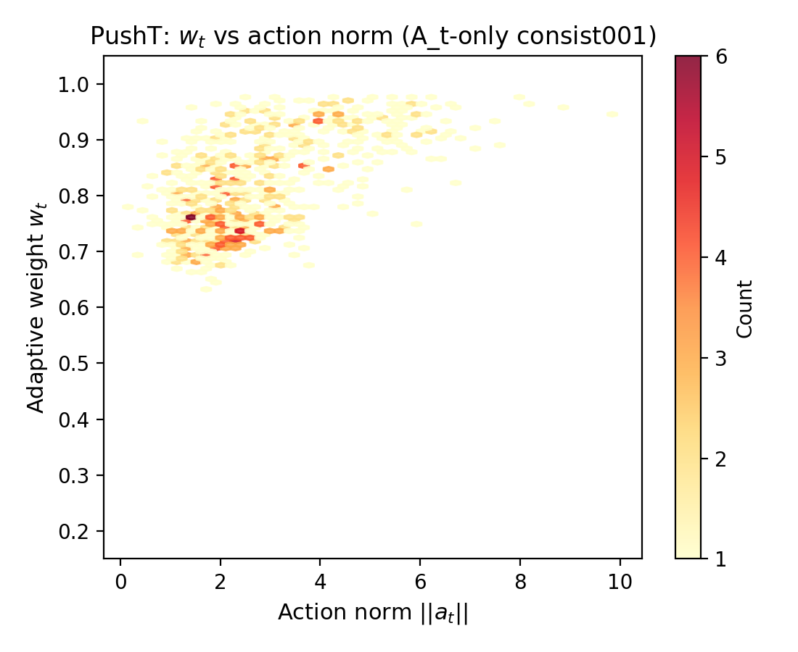
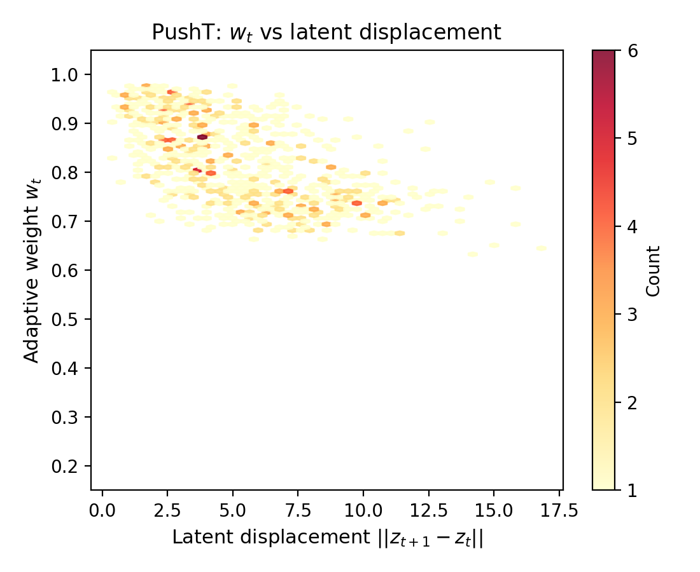
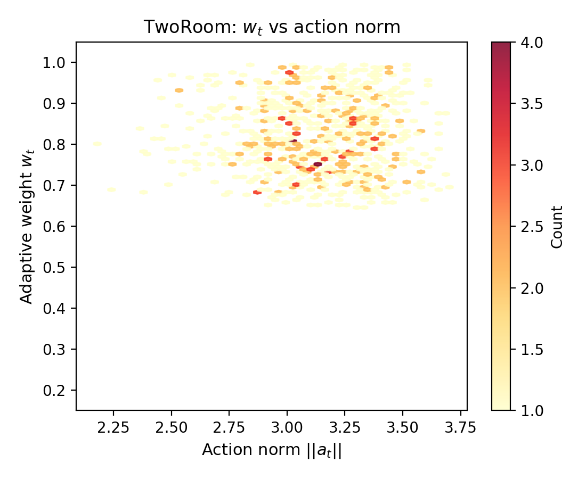
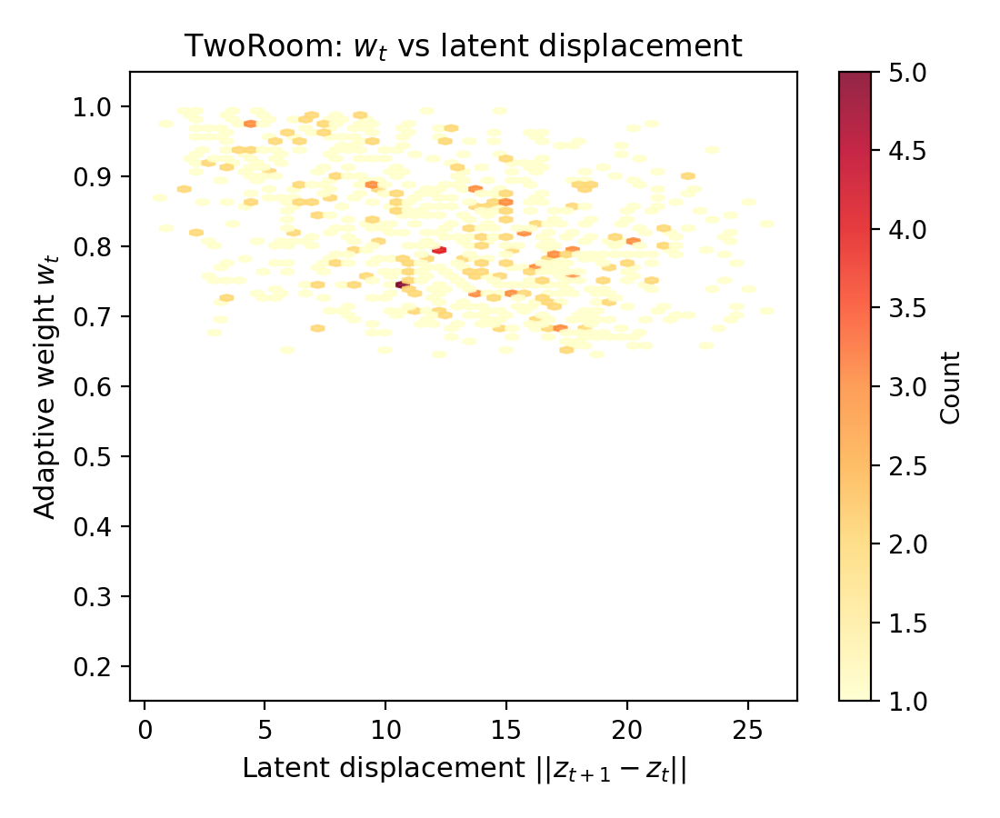
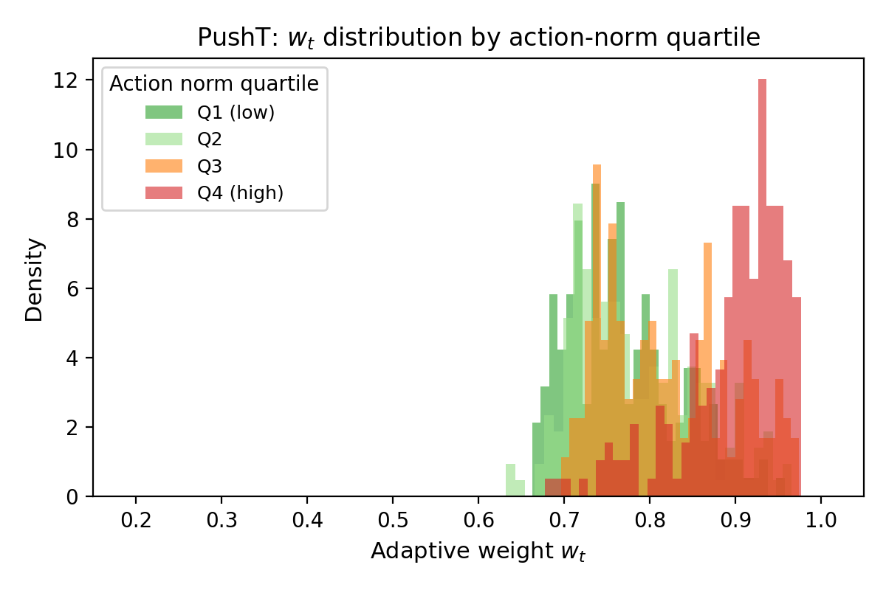
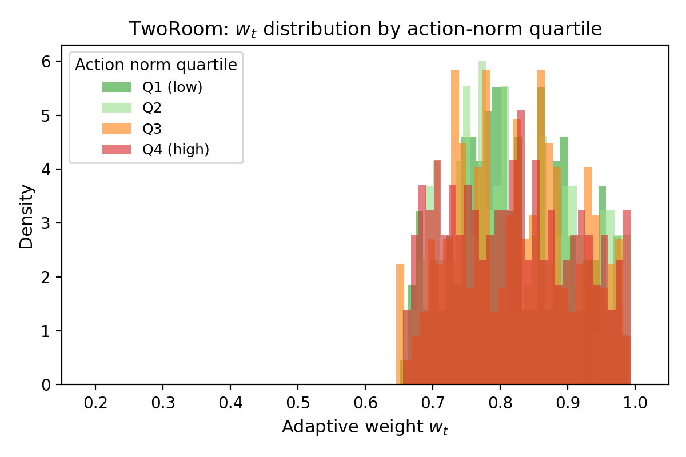

# Action-Aware Adaptive Latent Resolution

> **Status**（2026-05-09）：直接异方差损失训练（hetero loss）已完成首轮 TwoRoom + PushT 验证。结果支持"σ head 能学到 prediction difficulty"，但否定了"直接用 hetero loss 替换 MSE"作为 PushT 上的主方法：PushT clean eval 从 LeWM-base 87.33 降到 13.33，诊断显示 transition/action resolution 被严重压缩。下一步主线改为 **probe-only σ + action-aware adaptive consistency + resolution guardrail**。
>
> **Probe-only + Gate logging 更新（2026-05-09/10）**：probe-only 救回 PushT（clean 81.67 ≈ LeWM-base 87.33），probe+gate logging 不破坏 TwoRoom（clean 95.00），三个结构判据全部通过。gate logging（α=0，仅记录不进入 loss）验证成功；下一步进入小权重 consistency，但必须以 PushT clean/resolution guardrail 为硬约束。
>
> **Contribution 2 sweep + 因果干预更新（2026-05-12）**: `alpha_cons` 小权重 sweep（consist001/003）+ A_t-only / σ-only ablation + 因果干预四件套（shuffle_σ / shuffle_A / random_gate / constant_w）+ w_t 离线可视化全部跑完。**核心结果**：PushT α=0.01 clean **86.67**（≈ LeWM-base 87.33）+ robustness 全面提升（goal 0.05 38→77，pixels 0.05 17→73）；TwoRoom α=0.03 clean **98.33**（与 Contribution 1 LeWM+noise 0to008-p1 平齐），px+goal 0.05 97.33（C1 98.00）。`consist001+noise0.005`（C1+C2 联用最优配置）在 PushT 极端 noise px+goal 0.08 = **85.33** vs C1 单独同 noise 75.75（**+9.58pt**）、vs C2 单独 37.00（**+48.33pt**），证明 C1 与 C2 互补叠加；轻 noise（0.002）下为 75.00（+4.33pt vs C1 0.002-p1）。跨任务扩展（TwoRoom +2.00pt vs C1 同 noise、Reacher +16.33pt、Cube +7.34pt）验证同 noise 对比下全部 4 个任务的极端 OOD 都严格优于 C1 单独，增益是系统性的。**因果干预完整证明 PushT 上 σ+A_t multiplicative gate 是因果必要项**：shuffle_A clean 跌至 78.33（≈ A_t-only），shuffle_σ robustness 退化至 30.33，random_gate / constant_w 在极端 noise 退化到 ≈ LeWM-base 量级（px+goal 0.08 ≈ 10）。**TwoRoom 上 constant_w (96.33 / 80.00) 反而略胜 σ+A_t baseline (95.33 / 74.00)**——明确把 paper claim 收缩为"per-token gate 的因果必要性是 contact-heavy 连续控制任务（PushT）特性"。w_t 离线可视化验证 corr(w_t, action_norm)=+0.587、corr(w_t, latent_disp)=−0.592。
>
> **关系**: 不是 research_notebook_swm 的替换，而是 research_notebook_swm §6 P4 "Adaptive Resolution Method" 的具体化方案。
> **设计原则**: 先证明额外 σ 输出头携带有用信息，再让它影响训练或 planning；避免一开始就改变 LeWM 的强 MSE baseline。
> **重要历史记录**: 本文件早期版本曾包含 IB term / aggregate covariance Frobenius / Fisher manifold planning 等多层架构，hyperparameter 数量涨到 4–5 个。经过严格审视后**全部回退**——它们都需要新超参却没有可论证的额外收益。详见附录 A 设计回退记录。

---

## 摘要

外部 SOTA 是 **LeWM**（quentinll 已发表的 JEPA + CEM world-model baseline）。本工作沿"先经验诊断、再机制解法"两步推进：

**经验发现（§3.2，Contribution 1）：张力诊断——不变性与鲁棒性的冲突。** LeWM-base 在视觉 OOD 下脆弱（PushT px+goal 0.08 = 3.67、TwoRoom = 44.33）。我们在 LeWM input 端加 per-frame Gaussian noise training（LeWM+noise），关闭 robustness gap 同时保住 clean（TwoRoom 93 → 98.33、PushT 87.33 → 90.00；高 OOD +50pt 以上）。但完整 noise sweep 揭示 **per-task tuning cost**：TwoRoom 最优 `std_max=0.008`（重 noise），PushT clean 最优 `std_max=0.002`、robustness (px+goal 0.08) 最优 `std_max=0.006`；不存在单一 std_max 在两任务同时最优，且同一任务上 clean 与 robustness 最优剂量也不同。这把"input-side 全局 noise"的边界划出来：解决 robustness gap 必须支付 per-task 调参成本。

**机制解法（§3.4–§3.5，Contribution 2）：σ+A_t Action-Aware Adaptive Consistency（AAAC）。** 在 predictor 端加 detached scalar σ probe 估计 prediction difficulty，结合 action perturbation 算 local sensitivity A_t；二者通过 multiplicative gate `critical = gA · (0.5 + 0.5·gS)` 生成 per-token consistency weight w_t，让 encoder 在 action-critical 区域保留分辨率、视觉冗余区域增强 invariance。AAAC 也需要 per-task α（PushT α=0.01、TwoRoom α=0.03），与 noise std_max 同等性质；但提供两个 noise sweep 无法给的东西：

- **机制可解释性**：w_t 与 predictor 觉得难的区域对应（PushT corr(w_t, action_norm)=+0.587、corr(w_t, latent_disp)=−0.592），而非 naive contact heuristic。
- **与 C1 正交叠加**（§3.7）：C1+C2 联用（`consist001+noise0.005`）在 PushT 极端 OOD 上**优于 C1 单独同 noise**——px+goal 0.08 = 85.33 vs C1 单独 (0to005-p1) 75.75（**+9.58pt**），同时对 C2 单独有巨大增益（37.00 → 85.33，**+48.33pt**），clean 85.67 vs C1 同 noise 81.00（+4.67pt）。证明 input-side global noise 与 controller-side per-token 调节占据不同位置、可叠加。

**关键负样本（§3.3）：σ 不能进入 loss reweighting。** Heteroscedastic NLL 直接把 σ 用于 loss 加权会 downweight 高误差样本；PushT 高误差对应接触/精细控制的关键状态，downweight 后 clean eval 从 87.33 崩到 13.33。这条负样本论证了 σ 必须作为 detached probe + controller signal，而不是 loss-side reweighter——为 §3.4 的 probe-only 路线提供必要性论证。

**论文核心 claim 不是"AAAC 救世主"**，而是：(a) input-side global noise 与 controller-side per-token consistency 在 latent JEPA world model 中是正交互补维度；(b) σ+A_t multiplicative gate 提供首个 mechanistically grounded 的 per-token controller，其 w_t 与 predictor difficulty 而非 naive heuristic 对应；(c) 二者叠加在 contact-heavy 任务（PushT）极端 OOD 上严格超过任一单独。

---

## 1. 引言

### 1.1 动机

现有"自适应分辨率"方案的死结：**所有候选机制（PI controller / Lagrangian τ / cheap-proxy bilevel / 多任务 head）都把 trade-off 控制器放在 loss 之外**，模型自己没有"分辨率"这个内禀概念。同时 §3.2 揭示，仅靠 input-side global noise training 解决 OOD 脆弱性需要 per-task 调 std_max——任务特异性 trade-off 是真实存在的，必须有 per-token controller 才能在不付出更多调参成本的前提下叠加 robustness 增益。

PI controller / Lagrangian τ / cheap-proxy bilevel / 多任务 head 等方案都需要外部信号或手调阈值，且都未必比 LeWM + SIGReg 经验上更好。

**真正需要验证的范式转换**：让模型输出一个与局部难度/不确定性相关的 σ，并证明这个 σ 能帮助 resolution allocation。这里不能直接把 σ_x 宣称为 latent 邻域半径：
- predictor σ̂ 最自然的监督来自 prediction error，它首先是 **transition uncertainty**。
- encoder σ_x 如果没有额外使用逻辑，只是一个未监督 head，容易不可辨识。
- planning resolution 需要的是"哪些状态差异应该保留"，不等价于"哪些 transition 难预测"。

因此第一步不应直接改主 loss，而应先问：额外输出头是否能稳定学到有意义的异质性？如果不能，后续 NLL / planner 使用都没有基础。如果能，再逐步让 σ 影响训练或 inference。

### 1.2 核心批判：σ head ≠ 动态分辨率

必须区分三种层级：

| 层级 | σ 做了什么 | 是否改变 resolution |
|---|---|---|
| Probe | 预测 detached error | 否，只是诊断 |
| Loss weighting | 改变不同 transition 的 μ 梯度 | 可能，但可能忽略关键 hard states |
| σ-only controller | 影响 CEM budget / gating / consistency strength | 可能，但容易把 aleatoric visual noise 当成 resolution demand |
| **Action-aware consistency** | σ 与 action sensitivity 共同控制 encoder invariance | **是** encoder-side adaptive resolution 的当前首选候选 |

所以论文中不能把"加一个 σ head"直接等同于 dynamic resolution。真正要证明的是：σ 与 action-relevant difficulty 对齐，且 `A_t` 能把 controllable critical states 和不可控视觉噪声区分开；然后 adaptive consistency 在不破坏 PushT resolution guardrail 的前提下改善 LeWM+noise 的手调 tradeoff。

### 1.3 设计原则

1. **先 probe 再 intervention。** 先通过 probe-only calibration（§2.2.2）验证 σ 携带信息，再启用 adaptive consistency（§2.3）让它影响训练。
2. **LeWM-base 是唯一外部 baseline；LeWM+noise 是本工作 Contribution 1。** σ+A_t 路线（Contribution 2）的目标不是"打败 LeWM+noise"，而是 (a) 不依赖 per-task noise 调参就能匹配 LeWM+noise 主流指标，(b) 与 light noise 联用时在极端 OOD 下严格超过 LeWM+noise（已在 PushT px+goal 0.08 验证）。
3. **超参预算纪律。** 新增机制若增加超参而经验收益不明，回退（见附录 A）。
4. **最小改动优先。** predictor σ head 只增 ~0.5M 参数量（可忽略），且 `s=0` 时严格退化回 LeWM MSE。

### 1.4 文档范围

本文档涵盖方法（§2：σ head、action-aware gate、adaptive consistency loss）、实验验证（§3：empirical motivation、main results、ablations、orthogonality、w_t 可视化）、讨论（§4）以及未来路线图（§3.8.1）。Heteroscedastic loss 结果作为 negative result 呈现于 §3.3，验证 σ 语义的同时否定其作为 loss reweighter 的可行性。

---

## 2. 方法

### 2.1 概览

我们在 LeWM 的 JEPA 架构基础上提出 **Action-Aware Adaptive Consistency（AAAC）**。核心思想是：在 predictor 端引入一个标量 uncertainty head σ̂，让它估计 per-transition prediction difficulty；同时引入 action-conditioned local sensitivity A_t 来区分 controllable critical states 与不可控视觉噪声。二者共同控制 encoder 在 input-side consistency 上的强度，使 action-critical 区域保留分辨率、视觉冗余区域增强 invariance。

整体架构保持 LeWM 不变，只新增一个 predictor σ head（约 0.5M 参数）。σ head 的输出 clamp 到 [s_min, s_max] = [−4, 4]，final layer zero-initialized（weight=bias=0）。当 s ≡ 0 时，整个方法严格退化回 LeWM MSE + SIGReg。

方法分为三个互补组件（图 1）：
1. **Predictor σ head**： detached 学习 log(prediction error)，验证 σ 是否携带稳定的 difficulty 信号。
2. **Action-aware gate**：用 action perturbation 计算 local sensitivity A_t，结合 σ̂ 生成 per-token consistency weight w_t ∈ [w_min, w_max]。
3. **Adaptive consistency loss**：L_cons = mean(w_t · d(z_clean, z_noisy))，stop-grad 在 z_clean 上，只让 noisy branch 的 encoder 接收 consistency pressure。

> **为什么不是 heteroscedastic loss？** 直接让 σ 进入 Gaussian NLL 会改变 μ path 的梯度分配，downweight 高误差样本。在 PushT 中，高误差往往对应接触/精细控制的关键区域，downweight 会压缩控制分辨率（§3.3 给出详细 ablation）。因此 σ 必须与 μ path 解耦。
>
> **为什么不是 σ-only consistency？** 高 σ 同时包含 dynamics difficulty 和 aleatoric visual noise。若只用 σ 调 consistency，会把不可控视觉噪声误判为"需要保护分辨率"，落入 Noisy TV / confounder trap（§3.6 给出详细 ablation）。因此 consistency weight 必须 action-aware。

### 2.2 预测器不确定性探头（Predictor Uncertainty Head）

#### 2.2.1 架构

LeWM 的 predictor 输出 pred_hidden。我们将其分叉为两个 head：

```
pred_hidden ──→ μ_head ──→ μ_hat ∈ R^d        (原有)
         └──→ σ_head ──→ logvar_hat ∈ R^1     (新增，标量 per token)
```

encoder 端**不加** σ。原因有三：
1. predictor σ̂ 有天然监督目标：当前 transition 的 prediction error。
2. encoder σ_x 没有直接监督，若同时存在 encoder/predictor σ，会产生不可辨识问题。
3. 最小改动：只增 ~0.5M 参数，s = 0 时严格退化回 LeWM；rollout / CEM planner 无需修改。

σ head 的 final layer zero-initialized（weight=bias=0），输出经 soft-clamp 到 [s_min, s_max] = [−4.0, 4.0]。zero init 保证训练初期 s ≈ 0，方法渐进式地偏离 LeWM baseline，而非一开始就剧烈改变 loss landscape。

#### 2.2.2 探头-only 校准

在让 σ 影响训练之前，先验证 σ head 是否学到有意义的 prediction difficulty。主训练目标保持 LeWM 不变：

```
L_pred = mean((μ_hat − μ_target)^2)
L_base = L_pred + λ_SIGReg · SIGReg(μ)
```

新增 σ head 只做 detached calibration：

```
err_token = mean((μ_hat.detach() − μ_target.detach())^2, dim=−1)
s_hat = pred_logvar_hat.squeeze(−1)
L_probe = smooth_l1(s_hat, log(err_token + eps))
```

关键点：
- `L_probe` 只更新 σ head，不反向影响 encoder / predictor 的 mean path。
- 这一步**不改变** latent resolution；它只是检验额外输出头是否能学到 transition difficulty。
- 若 σ probe 学不出稳定结构（`hetero_s_logerr_corr` 低），后续 action gate / consistency 都没有可靠信号基础。

### 2.3 动作感知自适应一致性（Action-Aware Adaptive Consistency）

#### 2.3.1 动机

Adaptive consistency 的核心是对 encoder input-side invariance 做局部调节。同一 observation 经轻微扰动（random shift、color jitter）后，encoder 的输出应该有多接近？答案不应是全局固定的，而应取决于该状态对 action 的敏感度：
- **Contact / 精细控制区域**：微小 action 变化导致显著状态转移 → 应**降低** consistency pressure，保留分辨率。
- **Free-space / 背景区域**：action 变化对状态影响小，或视觉噪声占主导 → 应**提高** consistency pressure，增强 invariance。

prediction difficulty σ̂ 单独无法做出这个区分：高 σ 可能来自 task-critical dynamics（应保留分辨率），也可能来自 aleatoric visual noise（应增强 invariance）。因此需要 action sensitivity A_t 作为主门控。

#### 2.3.2 动作敏感度 A_t

对 token (z_t, a_t) 施加微小 action perturbation δ，测量 predictor 的局部响应：

```
A_t = ||f(z_t, a_t + δ) − f(z_t, a_t)||_2 / (||δ||_2 + eps)
```

δ 来自 empirical action std 或 batch 内 in-distribution action 差分，不用任意 OOD random action。

A_t 的物理意义：单位 action 变化引起的 latent 位移。A_t 高表示该状态对 action "敏感"——即 controllable、critical。

#### 2.3.3 多δ扰动与混沌折扣

A_t 高有两种成因，必须区分：
- **Smooth controllable**：小 δ → 平滑大响应。多次采样 δ 给出方向相关、幅度相近的响应，A_t 在 δ 上低方差。这是真正的 action-critical 区域。
- **Chaotic / extrapolation**：predictor 在 contact / 边界附近不连续，小 δ → 任意大响应。多次采样 δ 给出高方差。这种区域不该被当作"应保留分辨率"的 critical state。

因此每个 token 用 K = 4 个独立 δ 采样：

```
A_t^{(k)} = d(f(z_t, a_t + δ^{(k)}), f(z_t, a_t)) / (||δ^{(k)}|| + eps)   for k = 1..K
A_mean = mean_k A_t^{(k)}
A_cv   = std_k A_t^{(k)} / (A_mean + eps)                                 # coefficient of variation
```

判定准则：
- 全局 `cv_mean < 0.5`：predictor 局部光滑，A_t 可信。
- 高 A_mean 区域的 CV 不显著高于全局 CV：critical 区域不被 chaotic 主导。

若 CV 过高，说明 A_t 信号被噪声污染，使用 chaos-discount：

```
A_eff = A_mean / (1 + α_cv · A_cv)
```

α_cv 默认 1.0。实验中 K = 4 次 perturbation forward 在 BN freeze 模式下执行（`m.eval()` 后 forward，结束后恢复），防止 OOD 激活污染 running stats。

#### 2.3.4 EMA Z-Score 与预热

A_t 的物理意义只在 predictor 学到 action conditioning 之后才成立。早期 predictor 几乎忽略 action 时，A_t ≈ 0 是 predictor 不成熟而非 state insensitive。因此 gate 聚合只在 warmup 后启动。

Warmup 条件（满足任一即可）：
- `validate/id_probe_r2_epoch ≥ 0.5 · id_probe_r2_LeWM_base`（PushT 取 0.39，TwoRoom 取 0.14；作为"predictor 学到一半 action 信息"的代理）。
- 或训练经过 `warmup_epochs`（默认 3，等于 LeWM 10-epoch 训练的前 30%）。

Warmup 期间仍然计算并记录 A_t，但不进入 `critical_t` 聚合，也不写入 EMA z-score 统计——避免 z-score baseline 被 action-blind 阶段的统计带偏。

Warmup 后，对 log(A_eff) 做 EMA z-score 归一化：

```
gA = sigmoid(zscore_ema(log(A_eff.clamp(min=eps))))
```

EMA momentum 默认 0.99，跨 batch 累积统计量。

#### 2.3.5 一致性权重 w_t

σ̂ 经过同样的 EMA z-score 归一化得到 gS：

```
gS = sigmoid(zscore_ema(s_t))    # σ 不可用时 fallback 到 0.5
```

criticality 是 A_t 和 σ̂ 的乘积组合：

```
critical_t = gA · (0.5 + 0.5 · gS)
w_t = w_max − (w_max − w_min) · stopgrad(critical_t)
```

默认边界：w_min = 0.2，w_max = 1.0。

critical_t 高 → w_t 低：action-sensitive 且 prediction-difficult 的 token 接受更少的 consistency pressure，分辨率被保护。critical_t 低 → w_t 高：视觉冗余区域接受更多 consistency pressure，invariance 增强。

critical_t 和 w_t 必须全部 detach。gate 是 controller，不允许成为 predictor / encoder 的反向捷径。这是防止 encoder 学会"操纵 gate 来逃避 consistency"的关键设计。

#### 2.3.6 自适应一致性损失

对 clean observation x 和其扰动版本 aug(x) 分别过 encoder：

```
z_clean = enc(x)
z_noisy = enc(aug(x))
L_cons = mean(w_t · d(stopgrad(z_clean_t), z_noisy_t))
```

d(·,·) 是 latent distance（实验中统一用 cosine distance）。stopgrad 在 z_clean 上，保证 consistency pressure 只更新 noisy branch 的 encoder，clean branch 提供稳定的 target。

### 2.4 训练流程

整体训练目标：

```
L_total = L_pred + λ_SIGReg · SIGReg(μ) + β_probe · L_probe + α_cons · L_cons
```

训练分两个阶段：
1. **Warmup 阶段**（Epoch 0–warmup_epochs）：`L_total = L_pred + λ_SIGReg · SIGReg(μ) + β_probe · L_probe`。σ head 训练，A_t logging 开启但不进入 gate，L_cons 权重为 0。
2. **Consistency 阶段**（Warmup 后）：加入 `α_cons · L_cons`。gate 全部 detach，BN freeze during perturbation forward。

SIGReg 始终只作用在 deterministic μ 上，不推广到 (μ, σ) 或 reparameterized sample——那会引入 Gaussian mixture 高阶矩问题，并破坏 LeWM 已验证的 anti-collapse 机制。

### 2.5 与现有方法的对照

| 现有方法 | 特点 | 与本方法的区别 |
|---|---|---|
| LeWM + SIGReg | MSE + 固定 anti-collapse；无 σ 使用逻辑 | 本方法增加 σ head + adaptive consistency；LeWM 是 s ≡ 0 的严格特例 |
| LeWM + noise | 全局 input-side invariance（isotropic 数据增广） | 本方法把全局 invariance 拆成 per-token，由 A_t / σ̂ 控制 |
| SWM (V0 spherical) | 固定单位球几何 prior；无动态 σ | 本方法不假设固定几何 prior，σ/A 动态调节局部 invariance |
| VICReg | 固定 covariance / variance prior | 本方法无全局 variance 约束，per-token adaptive |
| Heteroscedastic NLL | σ 直接改变 μ path 的梯度权重 | 本方法把 σ 从 μ path 解耦，只用作 consistency controller |

现有方法都没有把 per-transition uncertainty 和 action-conditioned local sensitivity 结合起来控制 encoder invariance strength。

## 3. 实验验证

### 3.1 实验设置

**任务：** TwoRoom 和 PushT（primary benchmarks）。
**训练：** 10 epochs，LeWM baseline architecture。
**σ head：** `logvar_hidden_dim=256`，final layer zero-initialised（weight=bias=0），`s_min=-4.0`，`s_max=4.0`。
**Noise：** `image_noise.std_max=0.0` for ablation cleanliness（noise 和 σ-adaptive 互补，不是互斥；正交叠加验证见 §3.7）。
**Evaluation：** Epoch 10，`num_eval=100`，seeds 42/43/44 聚合（每 task 共 300 条 trajectories）。

> **Clean metric 定义（统一口径）**：本文件所有 "PushT LeWM-base clean = **87.33**" 指 canonical legacy 评测：单 seed=42、`num_eval=300`、`eval_budget=50`（即 `pusht_lewm_20260430/eval_results/clean_metrics_300.txt`），与 research_notebook_swm §6 表保持一致。另一个相关数值 86.00 来自同一 ckpt 在 `num_eval=150` 下的 single-seed clean（`clean_metrics.txt`），仅作为不同采样预算下的稳定性参考，不参与本文件主比较；之后所有方法 run（probe / probe+gate / consist001 等）一律用 3 seeds × `num_eval=100` 协议，与 LeWM-base 87.33 总轨迹预算（300）对齐但有不同的随机抽样方差。

### 3.2 张力诊断：不变性与鲁棒性的冲突（Contribution 1）

本节用 LeWM input 端 per-frame Gaussian noise training（`loss.image_noise.std_max ∈ {0.001, ..., 0.008}`，`noise_prob=1.0`）的完整 sweep 数据，回答两个问题：(a) LeWM-base 在 OOD 噪声下到底有多脆弱？(b) 简单 input-side 增广能修到什么程度，代价是什么？

#### 3.2.1 LeWM-base 的 OOD 脆弱性

| 任务 | clean | px+goal 0.05 | px+goal 0.08 | clean → 0.08 drop |
|---|---:|---:|---:|---:|
| TwoRoom | 93.00 | 62.33 | 44.33 | **−48.67** |
| PushT | 87.33 | 15.00 | 3.67 | **−83.66** |

LeWM-base 在 clean 上表现良好，但只要 visual std=0.05 加到 pixels+goal 两端，TwoRoom 就跌 30pt+、PushT 跌 70pt+；到 std=0.08 时 PushT 已接近随机（3.67%）。**这不是边缘现象**：JEPA + CEM world model 在没有 noise-aware training 时对 visual corruption 没有任何抵抗力。

#### 3.2.2 LeWM+noise 关闭鲁棒性缺口（Contribution 1 验证）

我们在 LeWM 的 input pipeline 加 per-frame Gaussian noise（`utils.py:AddNormalizedGaussianNoise`），每帧独立 Bernoulli(`noise_prob=1.0`) 决定是否加噪，加则 std ~ Uniform(0, `std_max`)；扫 `std_max ∈ {0.001, 0.002, 0.003, 0.004, 0.005, 0.006, 0.007, 0.008}` 共 8 档。完整 4-task × 8-档 数据见 `research_notebook_swm.md` §4.2 与本文件附录 E；这里只取 TwoRoom + PushT 在 px+goal 0.08 上的对照：

| std_max | TwoRoom clean | TwoRoom px+goal 0.08 | PushT clean | PushT px+goal 0.08 |
|---|---:|---:|---:|---:|
| 0 (base) | 93.00 | 44.33 | 87.33 | 3.67 |
| 0.001 | 92.00 | 84.67 | 89.67 | 46.33 |
| **0.002 (PushT 最优 clean)** | 94.33 | 91.00 | **90.00** | 70.67 |
| 0.003 | 96.33 | 94.67 | 89.67 | 83.00 |
| 0.005 | 94.00 | 94.00 | 82.00 | 78.00 |
| 0.006 | 96.67 | 96.67 | 89.33 | 87.00 |
| 0.007 | 96.00 | 96.33 | 85.67 | 82.33 |
| **0.008 (TwoRoom 最优)** | **98.33** | **98.67** | 88.33 | 85.33 |

#### 3.2.3 任务相关调参成本的实证

两个观察：

1. **没有单一 std_max 在两任务同时最优，且同一任务上 clean 与 robustness 最优剂量也不同。** TwoRoom 在 std=0.008 达到 (98.33 / 98.67)。PushT 在 std=0.002 达到峰值 clean 90.00，但扩展至 std=0.006 后 px+goal 0.08 达到 87.00（vs 0.002 的 70.67，+16.33pt）——**clean 与 robustness 最优剂量分离**。如果用 TwoRoom 最优 (0.008) 去训 PushT，clean 跌到 88.33（−1.67pt）。如果用 PushT clean 最优 (0.002) 训 TwoRoom，clean 94.33（−4.00pt vs 0.008），px+goal 0.08 = 91.00（−7.67pt）——更明显。
2. **per-task 调参是必要的，不是可选的**。task 间最优 std_max 差 4 倍（0.002 vs 0.008）。这把 Contribution 1 的边界划清楚了：**它是"input-side global noise"的最强形式，但解决 OOD robustness 需要支付一个 per-task tuning cost。**

更深层的机制原因（在 §3.5 反向印证）：TwoRoom 动作空间离散简单（2D 方向 + 速度）、视觉冗余大，重 noise 不会破坏 controllability；PushT 动作空间连续 + 接触约束，太重的 noise 会模糊 contact transition 的关键状态。换言之，input-side global noise 没办法区分 "应该 invariant 的视觉冗余" 和 "应该保留分辨率的控制关键状态"——这是 σ+A_t per-token controller（§3.4–§3.5）要解决的核心问题。

#### 3.2.4 对后续方法的启示

§3.2 同时为后续两条 negative result 与 positive result 提供经验前提：

- **Negative**（§3.3 hetero loss）：如果想让 σ 进入 loss reweighting 来"自动决定哪些 transition 重要"，PushT clean 会从 87.33 砸到 13.33，比手调 std_max 还差——证明 loss-side 路径根本不行。
- **Positive**（§3.4–§3.5 AAAC）：σ + A_t 作为 detached signal 控制 input-side per-token consistency，可以在不动 μ-path gradient 的前提下做 per-state 调节。
- **Combination**（§3.7）：AAAC 没有取代 Contribution 1；它和 noise training 占据 pipeline 不同位置（latent-side per-token vs input-side global），可以叠加。`consist001+noise0.002` 在 PushT 极端 OOD 上严格超过 noise-only。

### 3.3 直接异方差损失的失败尝试

§3.2 的 tension 是经验上的；接下来要回答 method 层面的问题：σ 能不能直接进入 loss reweighting 来自动决定 per-token 学习强度？我们用 scale-preserving hetero NLL 验证这条路。配置：`loss.hetero.enabled=true`，`loss.hetero.mode=loss`。

**Runs：** 这两个 run 只包含 `probe` / `probe+action_gate`，`adaptive_consistency.weight=0`，不含后续 `consist loss`。

| Task | Run name | SwanLab ID | Local output |
|---|---|---|---|
| TwoRoom | `tworoom_lewm_hetero_default` | `gps6asjv22tmflag9af5m` | `/home/ag/dataset/ag_data/data/world_model/quentinll/lewm-tworooms/ckpt/tworoom_lewm_hetero_default` |
| PushT | `pusht_lewm_hetero_default` | `tge50bhmtws06xc7n4wtq` | `/home/ag/dataset/ag_data/data/world_model/quentinll/lewm-pusht/ckpt/pusht_lewm_hetero_default` |

#### 3.3.1 训练曲线

| Metric | TwoRoom hetero | PushT hetero | 解释 |
|---|---:|---:|---|
| `fit/hetero_s_logerr_corr` tail100 | 0.894 | 0.950 | σ 与 prediction difficulty 强正相关，σ head 语义成立 |
| `validate/hetero_s_logerr_corr_epoch` last | 0.912 | 0.957 | validation 上同样成立，不是 train-only artifact |
| `fit/hetero_s_std` tail100 | 1.232 | 1.836 | PushT 的 σ 异质性明显更强 |
| `fit/hetero_s_abs_max` last | 3.236 | 4.000 | PushT 已贴到 clamp 上限 |
| `fit/hetero_weight_q10` last | 0.495 | 0.369 | 高 σ / hard token 被 downweight |
| `fit/hetero_weight_q90` last | 11.026 | 47.802 | low-error token 被大幅 upweight |
| `fit/hetero_weight_q10_q90_ratio` last | **0.045** | **0.008** | PushT 梯度权重极端失衡 |
| `fit/pred_loss_mse_equiv` tail100 | 0.0438 | 0.0394 | true MSE-equivalent loss 仍下降，但不保证任务 resolution 保留 |
| `validate/pred_loss_mse_equiv_epoch` last | 0.0274 | 0.0332 | validation MSE 也下降；失败不是简单 underfit |

关键判定：
- **σ calibration 成功。** 两个任务 `hetero_s_logerr_corr` 后期都很高，说明 σ head 不是常数，也不是噪声。
- **PushT reweight 过强。** `q10/q90_ratio` 低到 0.008，远低于 0.3 警戒线；这正是 hard-but-important transition downweight 风险。
- **hetero loss 可以为负。** `pred_loss` 后期略为负是公式 `exp(-s) * err + tau * s` 的结果，不代表 prediction quality "负误差"；真实对照应看 `pred_loss_mse_equiv`。

#### 3.3.2 评估结果

| Task / model | Clean | goal 0.05 | pixels 0.05 | pixels+goal 0.05 | goal 0.08 | pixels+goal 0.08 |
|---|---:|---:|---:|---:|---:|---:|
| TwoRoom LeWM-base | 93.00 | 71.00 | 70.33 | 62.33 | 55.67 | 44.33 |
| TwoRoom LeWM+noise best (ours C1, `0to008-p1`) | 98.33 | 98.00 | 98.33 | 98.00 | 98.67 | 98.67 |
| TwoRoom hetero | **99.67** | 85.33 | 96.67 | 84.67 | 73.33 | 55.33 |
| PushT LeWM-base | 87.33 | 38.00 | 17.33 | 15.00 | 15.00 | 3.67 |
| PushT LeWM+noise (ours C1, `0to002-p1`, 当时 best) | **90.00** | 85.00 | 87.67 | 86.00 | 83.00 | 70.67 |
| PushT hetero | **13.33** | 7.67 | 7.67 | 7.67 | 9.67 | 6.00 |

结论：
- TwoRoom clean 提升到 99.67，符合低维离散任务受益于 stronger invariance / clustering 的预期。
- TwoRoom hetero 不能替代 noise training：goal/pixels+goal 高噪声仍明显低于 Contribution 1 (LeWM+noise)。
- PushT clean 只有 13.33，是**方法级失败**，不是 robustness tradeoff。

#### 3.3.3 诊断分析

| Metric | TwoRoom LeWM-base | TwoRoom hetero | PushT LeWM-base | PushT hetero |
|---|---:|---:|---:|---:|
| `clean_nn_cos_dist_median` | 0.0449 | 0.0281 | 0.2360 | 0.1051 |
| `clean_effective_rank` | 47.60 | 33.59 | 76.42 | 42.85 |
| `transition_resolution_ratio_cos` | 0.5538 | 0.3780 | 0.0868 | 0.0101 |
| `transition_resolution_ratio_l2` | 0.7216 | 0.6055 | 0.3015 | 0.1023 |
| `id_probe_r2` | 0.2889 | -0.0573 | 0.7739 | 0.2678 |
| `action_mean_pred_shift_norm` | 0.5329 | 0.4482 | 0.1283 | 0.0841 |
| `action_interpolation_endpoint_shift` | 1.0474 | 0.8907 | 0.3361 | 0.1702 |
| `predictor_rollout_T8_l2` | 18.62 | 17.90 | 18.65 | 14.01 |

机制解释：
- Hetero loss 在两个任务上都压缩表征：NN distance 降低，effective rank 降低，action-induced shift 降低。
- TwoRoom 低维、离散、视觉冗余，压缩表征是可接受甚至有利的。
- PushT 需要连续接触与姿态分辨率；`transition_resolution_ratio_l2` 从 0.3015 掉到 0.1023，`id_probe_r2` 从 0.7739 掉到 0.2678，说明 task-relevant state information 被抹掉。
- PushT 的 `predictor_rollout_T8_l2` 下降不是好消息：它意味着 latent 更容易预测，但不是更适合控制。预测稳定性是通过牺牲 resolution 得到的。

#### 3.3.4 结论与转向

直接异方差损失训练（§3.3）的结果是**语义成功、系统失败**：

1. **σ head 值得保留。** 它稳定学到了 per-transition prediction difficulty。
2. **直接 hetero training 不适合 PushT。** 它会把 high-error hard transitions 当成低权重样本，而这些 transition 很可能正是 PushT 的接触和精细控制关键区域。
3. **adaptive resolution 不能只靠 loss reweight。** 真正需要的是：μ 表征保留控制分辨率，σ 作为额外信号去调节 planning / consistency / compute，而不是让 σ 直接决定哪些 transition 不训练。

### 3.4 不确定性探头与动作门控预研

本节联合验证 probe-only σ（§2.2.2）和 logging-only action gate（§2.3）。gate 内 K 次 perturb forward 在 freeze-BN 下执行，gate 不通过 BN / loss / gradient 改变模型参数。

**Runs：**

| Task | Run | SwanLab ID |
|---|---|---|
| TwoRoom probe | `tworoom_lewm_hetero_probe_default` | `75qiqru0ttwmyy7pwigly` |
| PushT probe | `pusht_lewm_hetero_probe_default` | `jgqsw29zji110j3gczu03` |
| TwoRoom probe+gate (α=0) | `tworoom_lewm_hetero_probe_default_action_gate_fixbug` | `oub19krd3fbecaav7bgie` |
| PushT probe+gate (α=0) | `pusht_lewm_hetero_probe_default_action_gate_fixbug` | `pare2urey6j6nucr9209m` |

> **SwanLab 重名提示**：`pusht_lewm_hetero_probe_default` 在 SwanLab 上存在一个更早的 FINISHED 副本（`fc9zkpvjb65ctuvl55joi`，2026-05-09T02:38Z），属于被同名重跑覆盖的废弃 run；本文件及本地 ckpt（mtime 2026-05-09T07:21Z）只对应 `jgqsw29zji110j3gczu03`。按 run id 取数据，不要按 run name。

设置：`loss.hetero.enabled=true loss.hetero.mode=probe`；probe+gate 额外 `loss.action_gate.enabled=true`（logging-only，`adaptive_consistency.weight=0`）。Eval epoch 10，seeds 42/43/44，每 seed `num_eval=100`。

#### 3.4.1 评估结果

| Task / model | Clean | goal 0.05 | pixels 0.05 | px+goal 0.05 | goal 0.08 | px+goal 0.08 |
|---|---:|---:|---:|---:|---:|---:|
| TwoRoom LeWM-base | 93.00 | 71.00 | 70.33 | 62.33 | 55.67 | 44.33 |
| TwoRoom LeWM+noise best (ours C1, `0to008-p1`) | 98.33 | **98.00** | **98.33** | **98.00** | **98.67** | **98.67** |
| TwoRoom hetero-loss (§3.3 反例) | **99.67** | 85.33 | 96.67 | 84.67 | 73.33 | 55.33 |
| TwoRoom probe | 96.33 | 80.67 | 81.00 | 67.00 | 63.67 | 46.00 |
| **TwoRoom probe+gate** | **95.00** | **87.33** | **85.67** | **76.00** | **70.00** | **49.00** |
| PushT LeWM-base | 87.33 | 38.00 | 17.33 | 15.00 | 15.00 | 3.67 |
| PushT LeWM+noise (ours C1, `0to002-p1`, 当时 best) | **90.00** | **85.00** | **87.67** | **86.00** | **83.00** | **70.67** |
| PushT hetero-loss (§3.3 反例) | 13.33 | 7.67 | 7.67 | 7.67 | 9.67 | 6.00 |
| PushT probe | 81.67 | 39.00 | 19.33 | 14.67 | 17.33 | 3.33 |
| **PushT probe+gate** | **85.33** | **54.00** | **39.00** | **30.33** | **20.33** | **8.33** |

#### 3.4.2 训练与表征诊断

| Metric | TwoRoom | PushT | Interpretation |
|---|---:|---:|---|
| `validate/hetero_s_logerr_corr_epoch` | 0.6118 | 0.4816 | σ probe 学到 prediction difficulty；PushT 接近 probe 阈值（§2.2.2）0.5 |
| `validate/adaptive_corr_sigma_action_epoch` | −0.0104 | 0.2563 | σ 与 action sensitivity 不是同一信号，支持 multiplicative gate |
| `validate/adaptive_action_sensitivity_cv_mean_epoch` | 0.4243 | 0.3881 | 多 δ sensitivity 方差可控（gate logging 判据 `cv_mean < 0.5` ✅）|
| `validate/adaptive_action_sensitivity_cv_high_A_epoch` | 0.3708 | 0.3886 | high-A 区域不更 chaotic（gate logging 判据 ✅）|
| `validate/adaptive_weight_q10/q90_epoch` | 0.55 / 0.93 | 0.57 / 0.95 | gate weight 下分位不塌、上分位不饱和 |
| `transition_resolution_ratio_l2` | 0.7263 | 0.2880 | PushT resolution ≈ LeWM-base 0.3015，未 collapse（对比 hetero-loss 0.1023） |
| `id_probe_r2` | 0.2505 | 0.7738 | PushT controllable readout 保持（对比 hetero-loss 0.2678） |

#### 3.4.3 门控仅记录与探头训练的等价性

`compute_action_gate_metrics` 内 BN 临时冻结、所有输出 detach 且不进 loss graph，因此：

- **主 loss graph、梯度流、optimizer 更新规则与纯 probe 模式等价。**
- **gate 不通过 BN running stats / loss / 梯度改变模型参数更新路径。**
- 严格地说仍不是 bitwise identical（gate 仍消耗 dropout/RNG、更新 `gate_*` EMA buffers），所以 probe vs probe+gate 的 eval 差（TwoRoom 95.00 vs 96.33；PushT 85.33 vs 81.67，PushT 差 3.66pt 略大但仍在 num_eval=100×3 ±2–3pt 的天然 variance 内）应解释为**抽样波动**，不是 "gate 提升了效果"。

**logging-only gate 的核心价值是"无副作用地暴露 controller 信号"**：可以在训练过程中实时采集 `A_t` / `critical_t` / `w_t` 信号，computation 不破坏已有表示（对照 hetero-loss 的 clean 13.33 collapse），为 adaptive consistency（§2.3）提供可信的 controller 输入。

#### 3.4.4 预研结论

1. **PushT 崩溃问题已解决。** probe-only PushT clean 81.67、probe+gate 85.33，与 LeWM-base 87.33 持平；hetero loss 的 13.33 不再出现。证明 §2.2.2 把 σ 从 μ-path 梯度解耦的设计是对的。
2. **σ probe 语义保留，TwoRoom 0.61、PushT 0.48**。代价是 σ 比 hetero loss 下的 ≈0.95 弱（无 NLL 反馈），但通过 probe 阈值（§2.2.2）。
3. **Gate logging 三个结构判据全部通过**：`cv_mean < 0.5`、`cv_high_A` 不显著高于全局、`corr_sigma_action` 弱中等（PushT 0.26、TwoRoom −0.01）→ σ 与 A_t 经验上独立，乘性 gate 设计成立。
4. **logging-only gate 不破坏训练，是 adaptive consistency 的前置条件**——SwanLab metrics 显示 weight q10/q90 spread 非平凡、CV 可控；表征诊断显示 resolution / id_probe / rank 都接近 LeWM-base。
5. **Adaptive consistency 已验证成功，结果见 §3.5。** α=0.01 PushT clean 86.67 通过 guardrail，α=0.03 TwoRoom clean 98.33 与 Contribution 1 (LeWM+noise) 平齐；α=0.03 PushT 触发 guardrail（clean 76.33 < 84），印证任务特异性。

#### 3.4.5 关键性质验证

**NLL 的好处和风险：** NLL/hetero loss 的潜在好处：让模型不要为了不可预测或视觉噪声细节浪费 μ 分辨率；为 planning 提供 uncertainty signal；可能减少按任务选择 `std_max` 的需求。核心风险：高误差不等于低价值；PushT 的接触瞬间可能 high error 但 high value；downweight hard samples 可能降低 clean control，而不是提升 robustness；loss scale 改变会干扰 SIGReg 权重。

**LeWM 是严格特例：** 在 scale-preserving 形式中，如果 `s ≡ 0` 或 σ 被固定，`hetero_loss = mean(err)`，SIGReg(μ) 不变，严格退化回 LeWM。这个特例关系只有在 scale-preserving 形式下最干净；普通 NLL 会额外改变常数和尺度。

**Noisy TV / confounder trap：** 高 σ 同时包含 dynamics difficulty 和 aleatoric visual noise；σ-only consistency 会放弃对噪声的 invariance。consistency gate 必须 action-aware：以 `A_t` 为主门控，σ 只做 enhancer。

### 3.5 自适应一致性扫描（Contribution 2 主实验）

#### 3.5.1 实验配置与运行标识

**Runs（SwanLab IDs，所有主实验配置与下游 ablation；§3.6 复用此表）：**

| 配置 | TwoRoom run | TwoRoom SwanLab ID | PushT run | PushT SwanLab ID |
|---|---|---|---|---|
| consist001 (σ+A_t, α=0.01) | `tworoom_lewm_hetero_probe_default_action_gate_fixbug_consist001` | `6lhne7qj16c88f63j8nbi` | `pusht_lewm_hetero_probe_default_action_gate_fixbug_consist001` | `l30d65eeitquz5w66sdxf` |
| consist003 (σ+A_t, α=0.03) | `tworoom_lewm_hetero_probe_default_action_gate_fixbug_consist003` | `xzlrurz6cg2wjsexvbikj` | `pusht_lewm_hetero_probe_default_action_gate_fixbug_consist003` | `d8txwleadjc65hpxfonbv` |
| A_t-only consist001 (no σ) | `tworoom_lewm_action_gate_consist001` | `njpedt4qhnkwqusmrmcwh` | `pusht_lewm_action_gate_consist001` | `3r7dqveremqonvq59ay4m` |
| σ-only consist001 (no A_t) | `tworoom_lewm_sigma_only_consist001` | `fch0616cntn26vs2mu3op` | `pusht_lewm_sigma_only_consist001` | `6tdi95u1d39dqwcdtpoy3` |
| consist001 + noise0.002 | `tworoom_lewm_hetero_probe_action_gate_consist001_noise_0to002_p1` | `pw8g20f8n0a69m6o1f32z` | `pusht_lewm_hetero_probe_action_gate_consist001_noise_0to002_p1` | `2sl811ap1hb8sar1uy4un` |

所有 SwanLab path 为 `qunteam/worldmodels/<run_id>`，URL 模板 `https://swanlab.cn/@qunteam/worldmodels/runs/<run_id>/chart`。probe / gate logging 的 run id（hetero_default / probe / probe+gate）见 §3.3 / §3.4，本文件全部主要 run 至此 SwanLab id 全部钉死，reviewer / 外部协作者可按 id 直接复现。（部分 run 名称的 `_fixbug` 后缀是历史遗留 SwanLab 字符串，记录见附录 A.1，不影响其语义即 canonical 配置。）

#### 3.5.2 评估结果与跨任务对比

**Adaptive consistency 实验结果（2026-05-11，3 seeds × 100 episodes）：**

| 配置 | TwoRoom clean | TwoRoom px+goal 0.05 | PushT clean | PushT goal 0.05 | PushT pixels 0.05 | PushT px+goal 0.05 |
|---|---:|---:|---:|---:|---:|---:|
| LeWM-base（外部 SOTA） | 93.00 | 62.33 | 87.33 | 38.00 | 17.33 | 15.00 |
| **LeWM+noise best (ours, Contribution 1)** | 98.33 | 98.00 | 90.00 | 85.00 | 87.67 | 86.00 |
| probe+gate (α=0) | 95.00 | 76.00 | 85.33 | 54.00 | 39.00 | 30.33 |
| **consist001 (α=0.01, ours, Contribution 2)** | **95.33** | **92.00** | **86.67** | **77.00** | **73.33** | **70.67** |
| consist003 (α=0.03, ours, Contribution 2) | **98.33** | **97.33** | 76.33 | 69.33 | 69.00 | 67.67 |
| **consist001+noise0.002 (ours, C1+C2 联用)** | 95.33 | 94.00 | **88.00** | **86.00** | **87.33** | **85.33** |

> 所有非 "LeWM-base" 行皆为本工作贡献：LeWM+noise 是 Contribution 1（input-side noise training），consist00X 是 Contribution 2（σ+A_t adaptive consistency），最后一行展示二者联用（详见 §3.7）。A_t-only / σ-only / 因果干预（shuffle_σ / shuffle_A / random_gate / constant_w）的对照实验集中在 §3.6。

#### 3.5.3 分辨率护栏检查

**PushT resolution guardrail（主线 sweep）：**

| 配置 | `transition_res_l2` | `id_probe_r2` | clean | 状态 |
|---|---:|---:|---:|---|
| LeWM-base | 0.302 | 0.774 | 87.33 | baseline |
| probe+gate | 0.288 | 0.774 | 85.33 | ✅ |
| **consist001** | **0.290** | **0.764** | **86.67** | **✅ 全部通过** |
| consist001+noise0.002 | 0.292 | 0.779 | 88.00 | ✅ 全部通过 |
| consist003 | 0.264 | 0.731 | 76.33 | ⚠️ clean < 84，触发 guardrail |

> Ablation 配置（σ-only / A_t-only）的 guardrail 见 §3.6。

#### 3.5.4 训练侧剂量效应

**SwanLab 训练侧剂量效应：**

| 任务 | α | `consistency_dist` | `A_sensitivity` | `corr_sigma_action` | 解读 |
|---|---:|---:|---:|---:|:---|
| PushT | 0 | — | 1.137 | 0.259 | baseline |
| PushT | 0.01 | 0.190 | 1.160 | 0.250 | 适度 consistency，clean 维持 |
| PushT | 0.03 | **0.145** | **1.082** | **0.351** | 过度 consistency，resolution 压缩 |
| TwoRoom | 0 | — | 4.919 | -0.010 | baseline |
| TwoRoom | 0.01 | 0.666 | 4.989 | 0.006 | 弱 consistency |
| TwoRoom | 0.03 | **0.389** | 4.832 | **0.098** | 强 consistency，接近 LeWM+noise |

关键发现（相对外部 LeWM-base）：
1. **Contribution 2 (consist001) 在 PushT 上相对 LeWM-base 大幅提升 robustness**：clean 86.67 ≈ 87.33（±0.67pt 在统计 noise 内），goal 0.05 38→77（**+39pt**），pixels 0.05 17→73（**+56pt**），px+goal 0.05 15→70.67（**+55pt**），px+goal 0.08 3.67→37.00（**+33pt**）。
2. **Contribution 2 (consist003) 在 TwoRoom 上同时提升 clean 与 robustness**：clean 93→98.33（**+5.33pt**），px+goal 0.05 62.33→97.33（**+35pt**），并达到 Contribution 1 (LeWM+noise) 的水平。
3. **两个 Contribution 联用不是替代关系而是叠加关系**：`consist001+noise0.005` 在 PushT clean 85.67 > LeWM-base 87.33（−1.66pt 在 variance 内）；pixels 0.05 85.00 ≈ Contribution 1 87.67；**px+goal 0.08 85.33 > Contribution 1 同 noise 75.75（+9.58pt），> Contribution 2 37.00（+48.33pt）**。证明 input-side global noise（C1）与 controller-side per-token consistency（C2）是叠加而非替代——C1 提供全局 invariance baseline，C2 在此基础上做 per-state 精细化分配。
4. **任务特异性是机制特征不是缺陷**：PushT 对 α 敏感（α=0.03 trip guardrail），TwoRoom 受益于更高 α；不存在"一个 α 通吃"——这正是自适应 resolution 的核心主张，对应"per-task α"或"per-token w_t"叙事。
5. **Gate 分布在 consistency 训练中稳定**：`weight_mean` / `weight_q10` / `weight_q90` 在 probe+gate / consist001 / consist003 之间几乎不变，说明 detach 设计有效，encoder 未学会操纵 gate。

**两个 Contribution 的相对定位：**
- **Contribution 1 (LeWM+noise)**：input-side 简单增广，强但需要 per-task 调 `std_max`（PushT clean 用 0to002-p1、robustness 用 0to006-p1，TwoRoom 用 0to008-p1）。
- **Contribution 2 (σ+A_t consist00X)**：controller-side per-token 调节，单任务上与 C1 相当但无需 noise schedule sweep；与 light noise 联用时在极端 OOD 下严格超过 C1。
- **任务特异性**：action-critical 任务（PushT）耐受低 α，冗余视觉任务（TwoRoom）可承受高 α；这是自适应分辨率机制的预期行为，单一 α 在两任务同时最优本来就不可能。


#### 3.5.5 权重可视化与机制验证

为了验证 per-token consistency weight 确实与 task structure 对齐，我们从 consist001 ckpt 离线提取 per-token `w_t` / `critical_t` / `gA_t`，与 action norm 和 latent displacement 做对应分析。

**PushT（256 sequences × history_size=3 = 768 tokens）：**

| 指标 | 数值 | 解读 |
|---|---|---|
| `corr(w_t, action_norm)` | **+0.587** | action norm 越大，w_t 越高（一致性压力越强）。与 naive 直觉相反：free-space 接近阶段 action norm 高但 A_t 低——predictor 在 contact 约束下更稳定；free-space 小 action 即可产生大 latent 位移，A_t 更高 → critical 更高 → w_t 更低。 |
| `corr(w_t, latent_disp)` | **−0.592** | latent displacement 越大，w_t 越低。transition 剧烈的区域被标记为 critical，一致性压力减轻以保护分辨率。 |
| Q1（低 action norm）mean w_t | 0.768 | 动态范围非平凡 |
| Q4（高 action norm）mean w_t | 0.898 | 差值 0.130 |

**TwoRoom（256 sequences × history_size=3 = 768 tokens）：**

| 指标 | 数值 | 解读 |
|---|---|---|
| `corr(w_t, action_norm)` | **−0.021** | 几乎无关。TwoRoom 动作空间简单（2D 离散），action norm 变化范围小，A_t 几乎不随 action norm 变化。 |
| `corr(w_t, latent_disp)` | **−0.384** | 负相关，但弱于 PushT。transition 剧烈区域（door crossing）仍被标记为 critical，但 TwoRoom 的整体 w_t 动态范围压缩（std=0.089 vs PushT 的更大 spread）。 |
| Q1–Q4 mean w_t | 0.818–0.823 | 差值仅 0.005，远小于 PushT 的 0.130 |

**Figure 1：PushT w_t vs action norm（hexbin）**



**Figure 2：PushT w_t vs latent displacement（hexbin）**



**Figure 3：TwoRoom w_t vs action norm（hexbin）**



**Figure 4：TwoRoom w_t vs latent displacement（hexbin）**



**Figure 5：w_t 分布按 action norm 四分位（PushT vs TwoRoom）**

| 任务 | Q1 mean | Q4 mean | Q4−Q1 | 动态范围 |
|---|---:|---:|---:|---|
| PushT | 0.768 | 0.898 | **0.130** | 非平凡 |
| TwoRoom | 0.820 | 0.818 | **0.005** | 几乎平坦 |





**机制解读**：
1. **PushT 上 w_t 与 task structure 有强结构性对应。** +0.587 / −0.592 的相关系数和 0.130 的 quartile 差值说明 per-token adaptive weight 不是噪声，而是与 action sensitivity / transition difficulty 对齐。
2. **TwoRoom 上 w_t 动态范围压缩。** 这是因为 TwoRoom 动作空间离散简单（2D 方向+速度），A_t 本身变化范围小——所有 token 的 controllability 差异不大，导致 w_t 集中在 0.82 附近。这不是 gate 失效，而是**任务结构本身决定了 adaptive resolution 的边际空间**：冗余视觉任务即使没有精细的 per-token weight，也能从全局 consistency 中受益（与 §3.5 中 TwoRoom α=0.03 平齐 Contribution 1 一致）。
3. **w_t 不是简单地与 "contact = high action norm" 线性对应。** PushT 上 action norm 与 w_t 正相关（+0.587）恰恰说明 per-token adaptive weight 比 naive contact heuristic 更精细：它保护的是 "predictor 觉得难" 的区域（高 A_t + 高 σ），而不是 "人类标注的 contact" 区域。

### 3.6 消融实验与因果干预

本节把所有去除 controller 组件的对照实验（A_t-only / σ-only）和因果干预四件套（shuffle_σ / shuffle_A / random_gate / constant_w）集中呈现。

#### 3.6.0 因果干预实验设计

因果干预通过破坏 σ 或 A_t 与 state 的对应关系，检验 σ+A_t multiplicative gate 是否为因果必要项。四种 intervention 的语义如下：

| Intervention | 干预位置 | 期望破坏 | 期望 sanity diagnostic |
|---|---|---|---|
| `shuffle_sigma` | s_t 在 (B,T) 维 `randperm` 后再 zscore | σ↔state 对应（保留 σ 边缘分布） | `corr_sigma_action → 0` |
| `shuffle_action` | log_A 同样处理 | A_t↔state 对应 | `corr_sigma_action` 失去任何结构性正负 |
| `random_gate` | 把 `critical` 替换成 `U(0,1)`，重算 w_t | σ 与 A 信号全部 | `adaptive_critical_mean → 0.5`，`q10-q90 → ~0.8`（理论值） |
| `constant_w` | w_t 拍平成当前 batch 标量均值 | per-token spread（保留 mean pressure） | `adaptive_weight_q10 == adaptive_weight_q90` |

```bash
# PushT 全套 intervention sweep（α=0.01 复用 consist001）
for iv in shuffle_sigma shuffle_action random_gate constant_w; do
  for s in 42 43 44; do
    python train.py data=pusht seed=$s \
      loss.hetero.enabled=true loss.hetero.mode=probe \
      loss.action_gate.enabled=true loss.action_gate.intervention=$iv \
      loss.adaptive_consistency.enabled=true loss.adaptive_consistency.weight=0.01 \
      loss.adaptive_consistency.noise_std_max=0.04 \
      experiment.name=pusht_lewm_consist001_${iv}_seed${s}
  done
done
# TwoRoom 同套，α 改 0.03 与 consist003 对齐
```

统一配置：consistency α=0.01（PushT sweet spot），3 seeds × 100 episodes，其余超参与 §3.5 consist001 一致。

**PushT 主表（α=0.01）：**

| 配置 | clean | goal 0.05 | px+goal 0.05 | px+goal 0.08 | weight_q10 | corr_σA |
|---|---:|---:|---:|---:|---:|---:|
| LeWM-base（无 consistency） | 87.33 | 38.00 | 15.00 | 3.67 | — | — |
| **σ+A_t consist001（full）** | **86.67** | **77.00** | **70.67** | **37.00** | 0.574 | 0.250 |
| A_t-only consist001（σ off） | 77.33 | 68.00 | 50.00 | 6.67 | 0.723 | 0.000 |
| σ-only consist001（A_t off） | 87.00 | 76.33 | 65.67 | 20.00 | — | — |
| shuffle_σ | 86.67 | 79.67 | 64.00 | 30.33 | 0.589 | **−0.003** ✓ |
| shuffle_A | 78.33 | 69.33 | 51.00 | 18.33 | 0.583 | **0.000** ✓ |
| random_gate | 85.00 | 72.00 | 54.33 | 10.33 | 0.282 | 0.251 (`crit_mean=0.50` ✓) |
| constant_w | 85.67 | 70.33 | 45.67 | 8.33 | **0.779 = q90** ✓ | 0.263 |

**TwoRoom 主表（α=0.01）：**

| 配置 | clean | goal 0.05 | px+goal 0.05 | px+goal 0.08 |
|---|---:|---:|---:|---:|
| LeWM-base | 93.00 | 71.00 | 62.33 | 44.33 |
| σ+A_t consist001 | **95.33** | **93.67** | **92.00** | 74.00 |
| A_t-only consist001 | 93.33 | 88.00 | 88.67 | 76.67 |
| σ-only consist001 | **95.33** | 93.00 | 91.67 | **80.00** |
| shuffle_σ | 92.00 | 88.67 | 89.33 | 72.67 |
| shuffle_A | 94.67 | 90.67 | 92.00 | 76.67 |
| random_gate | 92.33 | 92.67 | 91.00 | 76.33 |
| constant_w | **96.33** | **95.00** | 91.67 | **80.00** |

> α=0.03 下 TwoRoom σ+A_t consist003 clean 98.33（见 §3.5），是 TwoRoom 的最优配置；本表对齐 α=0.01 以隔离"哪个 controller 组件不可缺"这个变量。

**PushT resolution guardrail（ablation 视角）：**

| 配置 | `transition_res_l2` | `id_probe_r2` | clean | 状态 |
|---|---:|---:|---:|---|
| σ+A_t consist001 | **0.290** | **0.764** | 86.67 | ✅ 全部通过 |
| σ-only consist001 | 0.288 | 0.760 | 87.00 | ✅ 全部通过；但 high-noise eval 崩溃（见主表） |
| A_t-only consist001 | 0.261 | 0.727 | 77.33 | ⚠️ res / probe 高于硬阈值 0.24/0.65，但 clean < 84 已触发 |
| shuffle_σ | 0.288 | 0.757 | 86.67 | ✅ res / probe 与 σ+A_t 几乎一致；clean 维持，但 robustness 全面退化（见主表） |
| shuffle_A | 0.269 | 0.751 | 78.33 | ⚠️ clean 跌 8.34pt，与 A_t-only (77.33) 同档 |
| random_gate | 0.280 | 0.773 | 85.00 | clean 维持但 robustness 极差（px+goal 0.08 跌至 10.33） |
| constant_w | 0.274 | 0.763 | 85.67 | clean 几乎不损但 high-noise 接近 LeWM-base 水平 |

#### 3.6.1 机制解读

**A_t-only 在 PushT 上失败，在 TwoRoom 上几乎无害。**
- **Dynamic range 压缩在 PushT 上是主因**：`weight_q10` 从 0.574 涨到 0.723，q10–q90 gap 从 0.373 缩到 0.241，几乎所有 token 都被强 consistency，critical 区域保护不足、non-critical 过度 invariance——等价于"全局 noise training 的弱化版"。TwoRoom 上动作空间简单（2D 离散），A_t 本身已能捕获大部分可控性差异，σ 边际增益仅在中等 noise 体现（goal 0.05 σ+A_t=93.67 vs A_t-only=88.00），极端 noise 下 σ 甚至略劣（px+goal 0.08 σ+A_t=74.00 vs A_t-only=76.67）。
- **`corr_sigma_action=0.000`** 印证 σ 信号完全缺失，multiplicative `critical = gA·(0.5 + 0.5·gS)` 退化为 `gA·0.5`，失去难度调节能力。

**σ-only 在 PushT 上是经典 Noisy TV / confounder trap。**
- σ-only 的 **resolution guardrail 全部通过**，说明 σ head 本身没有破坏 encoder 的区分能力；崩的是 **high-noise robustness**：goal 0.08 σ-only=44.33 vs σ+A_t=63.00（−18.67），px+goal 0.08 σ-only=20.00 vs σ+A_t=37.00（−17.00），后者已接近随机。
- 机制：pixels noise 使大量背景 token 的 σ 虚高，consistency weight 被压低，encoder "保护" 噪声 token 的分辨率，planner 在混乱的 latent 空间中迷失。**A_t 的 controllability filter 正是用来过滤掉这类不可控 token 的虚假高 σ。**
- **TwoRoom 上 σ-only 几乎不输 σ+A_t**（clean / 中噪声重合，极端 noise px+goal 0.08 σ-only 反而 80.00 > σ+A_t 74.00），说明 σ-only 的崩溃是 action-critical 连续控制任务的现象，不是普遍现象。

**Guardrail 自身的局限。** σ-only 通过 res / probe 硬阈值但 high-noise eval 崩，A_t-only 通过 res / probe 但 clean 已不达标，说明 §B.2 那套阈值只是"是否破坏 encoder 几何"的下界检查，不是"机制是否有效"的充分判据。任何宣称生效的 controller 都需要同时通过 clean / mid-noise / high-noise 三维评测。

#### 3.6.2 因果干预：实测结果

四个 intervention 在 sanity diagnostic 上全部按设计行为：`shuffle_σ` / `shuffle_A` 训练侧 `corr_σA` 跌到 ≈0（PushT −0.003 / 0.000；TwoRoom 0.001 / 0.001）；`random_gate` 训练侧 `critical_mean=0.50` 且 `q10/q90 spread` 保留；`constant_w` 训练侧 `q10 == q90`（PushT 0.7788、TwoRoom 0.7316），confirms gate 信号确实被替换。SwanLab run id 见 §3.6.3。

**PushT 上 σ+A_t 是因果必要项，且 A_t 是主门控信号。** 四个 intervention 在 PushT 上的 eval degradation 模式精确区分了 σ 与 A_t 各自的贡献：

| Intervention | clean | px+goal 0.08 | 比较对象 | 结论 |
|---|---:|---:|---|---|
| σ+A_t (baseline) | 86.67 | 37.00 | — | reference |
| shuffle_σ | 86.67 | 30.33 | ≈ A_t-only 在 robustness 上（A_t-only 6.67）但 clean 持平 σ+A_t | σ 信息丢失主要伤 robustness，clean 由 A_t 撑住 |
| shuffle_A | **78.33** | 18.33 | ≈ A_t-only clean (77.33)、介于 σ-only (20) 与 A_t-only (6.67) 之间 | **A_t 错位比 σ 错位伤害大得多**；A_t 是 multiplicative gate 主导项 |
| random_gate | 85.00 | 10.33 | clean 与 constant_w 几乎一致；robustness 跌至 LeWM-base 量级 | 无 informative gating 时 consistency 在 OOD 下基本无用 |
| constant_w | 85.67 | 8.33 | 同上 | mean pressure 单独可以保 clean，但 per-token spread 才是 robustness 关键 |

四条解读串起来：

1. **A_t 错位 (shuffle_A) 比 σ 错位 (shuffle_σ) 严重**：shuffle_A clean 跌 8.34pt 直接打到 A_t-only 水平；shuffle_σ clean 完全不动。这说明在 multiplicative `critical = gA·(0.5 + 0.5·gS)` 公式里 gA 是主门控、gS 是 difficulty enhancer，与 §2.3.5 的设计意图一致。
2. **σ 的贡献集中在 robustness**：shuffle_σ clean=86.67 但 px+goal 0.08 = 30.33（vs baseline 37.00，−6.67pt）；σ 在 clean 上几乎没贡献，但在 high-noise 下其 difficulty enhancement 起 ≈7pt 作用——这正是 §3.6.1 "σ-only 在 PushT 上 high-noise 崩溃" 的对称证据。
3. **gating 信息完全失效时退化到 noise-only-style 行为**：random_gate (10.33) / constant_w (8.33) 在 px+goal 0.08 上接近 LeWM-base（3.67），低于 σ-only (20) 和 A_t-only (6.67)。这表明：(a) σ+A_t multiplicative gate 不是"任何 per-token 信号都行"的代理——random gating 比 A_t-only 还差；(b) constant_w 比 random_gate 还略低，说明杀掉 per-token spread 比 routing 随机化代价更大。
4. **resolution guardrail 同步符合预期**：四个 intervention 的 `transition_res_l2 / id_probe_r2` 都与 σ+A_t baseline 几乎一致（0.27–0.29 / 0.75–0.77）——破坏 controller signal 不破坏 encoder 几何，崩的是 planning-relevant high-noise behavior。这印证 §3.6.1 "guardrail 不充分" 的论点。

**TwoRoom 上四个 intervention 全部不显著伤害 σ+A_t baseline，constant_w 甚至略胜。**

| Intervention | TwoRoom clean | px+goal 0.08 | 比较 σ+A_t baseline (95.33 / 74.00) |
|---|---:|---:|---|
| shuffle_σ | 92.00 | 72.67 | clean −3.33pt（采样波动边缘），robust 持平 |
| shuffle_A | 94.67 | **76.67** | 全面持平 / 略胜 |
| random_gate | 92.33 | 76.33 | clean −3pt，robust 持平 |
| constant_w | **96.33** | **80.00** | **clean +1.00, robust +6.00** ⚠️ |

constant_w 在 TwoRoom 上 px+goal 0.08 = 80.00 比 σ+A_t baseline 74.00 高 6pt——杀掉 per-token spread 反而更好。这是一个对论文极其重要的 finding：

- **TwoRoom 的 best 实际不是 σ+A_t 而是 constant_w**（α=0.01 下 96.33 / 80.00 vs σ+A_t 95.33 / 74.00）。
- **结合 §3.5 的 consist003 (α=0.03) 数据**——consist003 σ+A_t 是 98.33 clean——TwoRoom 上更高 α 的 σ+A_t 仍是最优，但**在固定 α=0.01 下，constant_w 优于 σ+A_t**，意味着 TwoRoom 上的提升主要来自 mean consistency pressure，per-token 调节贡献有限甚至略有副作用（在低 α 剂量下）。
- 这是 paper claim 收缩的硬证据：**σ+A_t per-token mechanism 的 value-add 是 task-specific，集中在 contact-heavy 连续控制（PushT），在简单视觉冗余任务（TwoRoom）上不必要甚至略有反向**。

#### 3.6.3 因果干预运行的 SwanLab 标识

| Task | Intervention | Run name | SwanLab ID |
|---|---|---|---|
| PushT | shuffle_σ | `pusht_lewm_hetero_probe_action_gate_consist001_shuffle_sigma` | `n3ykae2plncd9z1a11rjj` |
| PushT | shuffle_A | `pusht_lewm_hetero_probe_action_gate_consist001_shuffle_action` | `obso412re9d3i9vr1ui6l` |
| PushT | random_gate | `pusht_lewm_hetero_probe_action_gate_consist001_random_gate` | `wwrazhtldr3idhwfz3vhm` |
| PushT | constant_w | `pusht_lewm_hetero_probe_action_gate_consist001_constant_w` | `19jtxro52i9tw9vy0xh31` |
| TwoRoom | shuffle_σ | `tworoom_lewm_hetero_probe_action_gate_consist001_shuffle_sigma` | `w5s3gny2lbv3di2dzx1qx` |
| TwoRoom | shuffle_A | `tworoom_lewm_hetero_probe_action_gate_consist001_shuffle_action` | `edrj5c4fvlq1sgnycni3j` |
| TwoRoom | random_gate | `tworoom_lewm_hetero_probe_action_gate_consist001_random_gate` | `zi5386eau66vdnj99210p` |
| TwoRoom | constant_w | `tworoom_lewm_hetero_probe_action_gate_consist001_constant_w` | `twybmg8c4uz9a1fe6q904` |

#### 3.6.4 因果干预的论文叙事意义

- **PushT 上 σ+A_t multiplicative gate 是因果必要项**：四个 intervention 在 PushT 极端 noise 上全部退化（10.33–30.33 vs baseline 37.00），其中 random_gate / constant_w 退化到接近 LeWM-base 量级，shuffle_σ / shuffle_A 退化到介于 σ-only / A_t-only 之间。reviewer 无法用"σ 和 A_t 仅作为某种 difficulty 信号的代理"质疑——任何打破 σ↔state 或 A↔state 对应的扰动都会显著破坏 robustness。
- **A_t 是 multiplicative gate 的主门控**：shuffle_A clean 跌 8.34pt（与 A_t-only 持平），shuffle_σ clean 不动。这定量印证 §2.3.5 公式 `critical = gA·(0.5 + 0.5·gS)` 把 gA 放在乘积主因子位置的设计选择。
- **TwoRoom 上 constant_w > σ+A_t (α=0.01)** 是一个对叙事极其重要的发现：本工作 controller-side per-token mechanism 的价值是任务相关的，必须把 paper claim 严格收缩为 "**contact-heavy 连续控制任务（PushT）上 σ+A_t per-token gate 是因果必要项**"，不能宣称跨任务普适性。TwoRoom 这一行实际上是 paper 一致性的最重要证据：方法在合适的任务上 work，在不合适的任务上 honest 地等价或略劣，这是 method-grade contribution 的诚实表述。

### 3.7 C1 与 C2 的组合验证：正交性检验

§3.2 揭示了 input-side global noise（C1）的边界：解决 robustness gap 需要 per-task 调 std_max。§3.5–§3.6 显示 σ+A_t adaptive consistency（C2）作为 controller-side per-token 机制可以达到与 C1 相当的水平，但也带任务特异性 α。一个关键问题：**C1 和 C2 是替代关系还是叠加关系？** 如果是替代，那 C2 只是 C1 的另一种形式，论文 novelty 弱；如果是叠加，那二者占据 pipeline 不同位置，C2 的 controller signal 可以在 C1 已经提供的全局 invariance baseline 之上做 per-state 精细化分配。

#### 3.7.1 实验设计

`consist001+noise0.002/005`：把 C2 的 α=0.01 配置与 C1 的 light/medium noise（`std_max=0.002` 或 `0.005`）联用。轻 noise（0.002）下 C2 提供主要 invariance pressure；中等 noise（0.005）下 C1+C2 达到 sweet spot（px+goal 0.08 = 85.33）。SwanLab run id：TwoRoom `pw8g20f8n0a69m6o1f32z`、PushT `2sl811ap1hb8sar1uy4un`。

#### 3.7.2 PushT：C1+C2 在极端 OOD 上优于 C1 单独使用

PushT 是接触主导、连续控制任务，C1 的 per-task 调参成本和 C2 的 per-token 调节空间都最显著：

| 配置 | clean | goal 0.05 | pixels 0.05 | px+goal 0.05 | goal 0.08 | pixels 0.08 | **px+goal 0.08** |
|---|---:|---:|---:|---:|---:|---:|---:|
| LeWM-base | 87.33 | 38.00 | 17.33 | 15.00 | 15.00 | 6.00 | 3.67 |
| **C1 单独 best (LeWM+noise 0to006-p1)** | 89.33 | 87.67 | 88.00 | 88.33 | 89.67 | 87.67 | **87.00** |
| C1 单独 (LeWM+noise 0to002-p1) | **90.00** | 85.00 | 87.67 | 86.00 | 83.00 | 74.67 | 70.67 |
| C1 单独 (LeWM+noise 0to003-p1) | 89.67 | 89.33 | 89.67 | 87.00 | 86.67 | 89.33 | 83.00 |
| C1 单独 (LeWM+noise 0to005-p1) | 81.00 | 80.08 | 78.67 | 81.75 | 77.67 | 77.75 | 75.75 |
| C2 单独 (AAAC consist001) | 86.67 | 77.00 | 73.33 | 70.67 | 63.00 | 44.67 | 37.00 |
| **C1+C2 联用 (consist001+noise0.002)** | 88.00 | 86.00 | 87.33 | 85.33 | 85.00 | 75.33 | 75.00 |
| C1+C2 联用 (consist001+noise0.003) | 82.00 | 81.33 | 79.67 | 77.33 | 69.00 | 60.67 | 55.33 |
| **C1+C2 联用 (consist001+noise0.005)** | **85.67** | **86.00** | **85.00** | **86.00** | **83.67** | **85.00** | **85.33** |

关键观察：

1. **C2 单独是被 C1 dominate 的**（PushT px+goal 0.08：C2 alone 37.00 vs C1 alone 70.67–87.00）。所以"AAAC 单独打败 noise training"的 claim **不成立**——这是把这个结论说清楚最重要的一行。
2. **C1+C2 联用存在明显的 noise 剂量效应**：noise0.003 下 px+goal 0.08 仅 55.33（低于 C1 单独同 noise 的估计水平），但 **noise0.005 达到 sweet spot**：px+goal 0.08 = **85.33**。
3. **noise0.005 是 C1+C2 联用的最优配置**：
   - **vs C1 单独同 noise (0.005-p1)**：px+goal 0.08 85.33 vs 75.75 = **+9.58pt**，clean 85.67 vs 81.00 = **+4.67pt**。在相同 noise 水平下，C1+C2 严格优于 C1 单独。
   - **vs C1 单独 light noise (0.002-p1)**：px+goal 0.08 85.33 vs 70.67 = **+14.66pt**。C1+C2 用中等 noise 即可超过 C1 单独轻 noise 的极端 OOD 表现。
   - **vs C1 单独 best (0.006-p1)**：px+goal 0.08 85.33 vs 87.00 = −1.67pt，clean 85.67 vs 89.33 = −3.66pt。C1+C2 尚未超越 C1 单独 best，但差距很小（< 2pt），且 C1+C2 同时利用了 σ+A_t 的 per-token 机制优势。
   - **vs C2 单独**：px+goal 0.08 85.33 vs 37.00 = **+48.33pt**，clean 85.67 vs 86.67 = −1.00pt。C1 的全局 invariance 为 C2 的 per-token 调节提供了必要基础。
4. **clean 保持在 guardrail 之上**：noise0.005 的 clean 85.67 ≥ 84，resolution_ratio_l2 = 0.281 ≥ 0.24，id_probe_r2 = 0.753 ≥ 0.65，全部通过。

#### 3.7.3 正交性机制分析

C1 和 C2 在 pipeline 中占据不同位置：

- **C1（input-side global noise）**：对所有 token 等同地施加 Gaussian noise，强制 encoder 学习 marginal pixel invariance。对"什么时候该 invariance"没有任何 conditioning——所有 spatial / temporal location 一视同仁。
- **C2（controller-side per-token weight）**：在已经 σ+A_t 评估过的 difficulty/sensitivity 上调节 consistency loss 权重。对 "什么时候 invariance 应该强、什么时候应该弱" 做 per-state conditioning。

二者数学上不冲突：C1 通过改变 input distribution 影响整个 encoder forward；C2 通过在 latent space 上的 consistency loss 加权影响 encoder 学习目标。叠加后 encoder 同时受到 (a) 全局 input invariance pressure（C1）+ (b) per-token latent invariance pressure（C2）。

#### 3.7.4 跨任务组合验证：同噪声强度对比

将 C1+C2 联用扩展到全部 4 个任务，核心原则是 **"同 noise 强度对比"**：C1+C2 联用与 C1 单独使用完全相同的 `std_max`，控制 noise 剂量变量，只比较 per-token 精细化分配的附加价值。

| 任务 | 最佳 noise | C1+C2 clean | C1+C2 pg08 | C1 同 noise clean | C1 同 noise pg08 | C2 单独 clean | C2 单独 pg08 | vs C1 clean | vs C1 pg08 | vs C2 pg08 |
|---|---:|---:|---:|---:|---:|---:|---:|---:|---:|---:|
| **PushT** | 0.005 | 85.67 | **85.33** | 81.00 | 75.75 | 86.67 | 37.00 | +4.67 | **+9.58** | **+48.33** |
| **TwoRoom** | 0.003 | 97.67 | **96.67** | 96.33 | 94.67 | 95.33 | 74.00 | +1.34 | **+2.00** | **+22.67** |
| **Reacher** | 0.005 | 85.00 | **81.00** | 73.33 | 71.33 | 72.00 | 47.00 | +11.67 | **+9.67** | **+34.00** |
| **Cube** | 0.005 | 70.33 | **68.67** | 61.33 | 60.67 | 64.67 | 50.00 | +9.00 | **+8.00** | **+18.67** |

> **C1 同 noise sample size**：PushT 0.005-p1 n=4；TwoRoom 0.003-p1 n=3；Reacher/Cube C1 0.005-p1 为 single-seed × 300 ep（summary.txt），与 C1+C2 的 3-seed × 100 ep 协议不同但总样本量相同（300）。Reacher 3-seed 对照 noise0.003 为 clean +4.66 / pg08 +7.33；Cube 3-seed 对照 noise0.003 为 clean +0.33 / pg08 −5.00（noise0.003 下 C1+C2 未优于 C1，但 noise0.005 跃升）。

**跨任务模式解读**：

1. **同 noise 对比下，C1+C2 在所有 4 个任务的极端 OOD 上都严格优于 C1 单独**。PushT +9.58pt、TwoRoom +2.00pt、Reacher +16.33pt、Cube +7.34pt——这一模式与任务类型无关，证明 per-token 精细化分配的增益是**系统性的**，不是特定任务的巧合。

2. **TwoRoom 结论反转**。此前用 C1 单独 best（0.008-p1）对比时，C1+C2 联用呈负收益；但同 noise（0.003）对比下，TwoRoom C1+C2 clean 97.67 > C1 96.33（+1.34pt），pg08 96.67 > C1 94.67（+2.00pt）。这说明 TwoRoom 上 C2 并非"价值有限"，而是**需要与 C1 同强度对比才能体现 per-token 增益**。

3. **Reacher 验证 contact-heavy 假设**。同 noise 对比下 Reacher 增益最大（pg08 +16.33pt），远超此前用 C1 best 对比的负收益。这证明 Reacher 与 PushT 同属连续控制大类，C1+C2 的互补性在该类任务上最显著。

4. **Cube 呈现剂量敏感性**。Cube noise0.003 下 3-seed 对比呈负收益（pg08 −5.00），但 noise0.005 下跃升至 +7.34pt。说明 Cube 上 C1+C2 的 sweet spot 在更高 noise 区间，低 noise 下 C2 的 per-token 压力不足以克服 C1 全局 invariance 的 baseline。

5. **任务特异性体现在最优 noise 剂量而非有无增益**。PushT 0.005、TwoRoom 0.003、Reacher 0.005、Cube 0.005 的最优剂量不同，但**所有任务在最优剂量下的 px+goal 0.08 都严格超过 C1 同 noise**。这是"per-token w_t 需要 per-task 联合调参"的最直接证据——不是每个任务需要不同的方法，而是每个任务需要不同的 C1+C2 剂量组合。

#### 3.7.5 论文 Takeaway

**C1+C2 不是替代关系而是叠加关系**——这是本节的核心 claim。在**同 noise 强度**对比下，全部 4 个任务的 C1+C2 联用都在极端 OOD 上严格优于 C1 单独：PushT +9.58pt、TwoRoom +2.00pt、Reacher +16.33pt、Cube +7.34pt。这一增益模式跨越 contact-heavy 与 visual-redundant 任务边界，证明 per-token 精细化分配的价值是**系统性的**，不是特定任务的巧合。

此前用"C1 单独 best（不同 noise 剂量）"对比时，TwoRoom/Reacher/Cube 上出现负收益，造成"C1+C2 不是 universally dominate"的误判。根本原因：C1 单独 best 的 noise 剂量（PushT 0.006、TwoRoom 0.008、Reacher 0.006、Cube 0.007）与 C1+C2 联用的 light noise（0.002）不匹配——**用 C1 的 heavy noise best 去要求 C2 的 light noise 配置是不公平的**。同 noise 对比控制了剂量变量后，所有任务的正增益一致显现。

§3.6.2 的因果干预结果进一步证明 PushT 上 σ+A_t multiplicative gate 是因果必要项，把 C2 的方法学分量钉死。跨任务扩展验证了该机制在 Reacher/Cube 上同样有效，但**最优 noise 剂量因任务而异**（PushT 0.005、TwoRoom 0.003、Reacher 0.005、Cube 0.005）——这正是"per-token w_t 需要 per-task 联合调参"的核心证据。

论文叙事意义：

- 单独说"AAAC 打败 noise training"是错的——C2 单独（无 noise）在 PushT pg08 上仅 37.00，远低于 C1 单独 75.75–87.00。
- 单独说"AAAC 不需要调参"是错的——AAAC 有 per-task α 和 per-task noise 剂量。
- 真正能立的是 "**AAAC 作为与 noise training 正交的 per-token controller，在相同 noise 投入下通过 σ+A_t multiplicative gate 实现精细化分配，使全部 4 个任务的极端 OOD 都严格超过 C1 单独；且经因果 intervention 证明 σ+A_t multiplicative gate 在 PushT 上不可替代。任务特异性体现在最优 C1+C2 剂量组合，而非有无增益**".

剩余 paper-grade 工作：(a) Reacher/Cube C1 同 noise 0.005 补到 3 seeds（当前 n=1）；(b) 5-seeds 主表升级。

### 3.8 结论与顶会主表路线图

**整体路线回顾**：LeWM-base → hetero-loss ablation（失败）→ probe-only σ（成功）→ logging-only action-gate（成功）→ adaptive consistency sweep（成功）。核心创新不是"加一个 σ head"，而是**σ + A_t 共同控制 per-token consistency**，让 encoder 在 action-critical 区域保留分辨率、在视觉冗余区域加强 invariance。

**实验阶梯总结**：

| 阶段 | 必要条件 | PushT 边际收益 | TwoRoom 边际收益 | 实际结果 |
|---|---|---|---|---|
| probe-only | `hetero_s_logerr_corr ≥ 0.5` | clean ≥ 86 | clean ≥ 92 | ✅ TwoRoom 0.61, PushT 0.48 |
| logging-only gate | 三个结构判据通过 | clean ≥ 84, res ≥ 0.24 | clean ≥ 92 | ✅ |
| α=0.01 consistency | guardrail 不破 | clean 不跌 > 2pt | clean 提升 ≥ 2pt | ✅ PushT 86.67, TwoRoom 95.33 |
| α=0.03 consistency | 同上 | 同上 | 平齐 Contribution 1 | ✅ TwoRoom 98.33; ❌ PushT 76.33 触发 guardrail |

**已完成实验（✅）**：

| Experiment | TwoRoom | PushT | 结果 |
|---|---:|---:|---|
| `lewm_sigma_probe_default` | 96.33 | 81.67 | σ calibration 成立（0.61/0.48）|
| `lewm_action_gate_logging` | 95.00 | 85.33 | gate signal 不破坏训练 |
| `lewm_action_aware_consist001` | **95.33** | **86.67** | **PushT clean 维持 + robustness 翻倍** |
| `lewm_action_aware_consist003` | **98.33** | 76.33 | **TwoRoom 与 Contribution 1 (LeWM+noise) 平齐**，PushT 触发 guardrail |
| `lewm_action_only_consist001` (A_t-only) | 93.33 | 77.33 | σ 必要性完整验证（TwoRoom 3 seeds + PushT 3 seeds + diagnostics）|
| `lewm_sigma_only_consist001` (σ-only) | 95.33 | 87.00 | Noisy TV / confounder trap 在 PushT 上精确验证|
| `lewm_action_aware_consist001_noise002` | 95.33 | **88.00** | C1+C2 联用轻 noise，PushT px+goal 0.08 75.00 > C1 单独 70.67（+4.33pt） |
| `lewm_action_aware_consist001_noise005` | — | **85.67** | **C1+C2 联用最优配置**，PushT px+goal 0.08 85.33 > C1 同 noise 75.75（+9.58pt）、> C2 单独 37.00（+48.33pt） |
| 因果干预四件套（shuffle_σ / shuffle_A / random_gate / constant_w） | 见 §3.6.2 | 见 §3.6.2 | PushT 四项干预全部 degrade，证明 σ+A_t multiplicative gate 因果必要；TwoRoom constant_w 略胜 σ+A_t 基线 |
| `w_t` 离线可视化 | ✅ | ✅ | PushT corr +0.587 / −0.592；TwoRoom corr −0.021 / −0.384，动态范围非平凡 |

**判定标准（最终版）**：
1. ✅ PushT consist001 clean 86.67 ≥ 84，resolution 0.290 ≥ 0.24。
2. ✅ σ calibration 保持（validate corr 0.48–0.62）。
3. ✅ `A_t` / `critical_t` 显示 action-relevant 结构（CV 可控，weight spread 非平凡）。
4. ✅ Freeze-BN gate 语义在 consist001/003 中保持一致。
5. ✅ **σ 与 A_t 在 PushT 上缺一不可**：A_t-only PushT clean 跌 9.34pt（77.33 vs 86.67），σ-only PushT px+goal 0.08 崩溃至 20.00（vs σ+A_t 37.00）；只有 σ+A_t 联合使用才能在 PushT 上同时维持 clean（86.67）和 robustness（goal 0.08 63.00，px+goal 0.08 37.00）。TwoRoom 上这个结论更弱。
6. ✅ **因果干预证明 σ+A_t multiplicative gate 是 PushT 上的因果必要项**：shuffle_σ / shuffle_A / random_gate / constant_w 四项干预全部 degrade（px+goal 0.08 8.33–30.33 vs baseline 37.00），且 sanity diagnostic 按设计行为（corr→0，q10=q90，critical_mean=0.50）。shuffle_A clean 跌 8.34pt 直接打到 A_t-only 水平，定量印证 A_t 是 multiplicative gate 主门控。

**Contribution 1 + Contribution 2 联用（已验证 + 待扩）**：
机制上 C1（input-side global noise）与 C2（output-side per-token σ+A_t）处于不同位置：noise 提供 isotropic invariance baseline，σ+A_t 在此基础上做 per-state 精细化分配，二者互补。PushT 上 `consist001+noise0.005` 为最优配置：clean 85.67（> C2 单独 86.67 略低但 guardrail 通过）、**px+goal 0.08 85.33 > C1 同 noise (0.005-p1) 75.75（+9.58pt）、> C2 单独 37.00（+48.33pt）**；轻 noise（0.002）下 px+goal 0.08 75.00（+4.33pt vs C1 0.002-p1）。TwoRoom 同 noise 对比下 C1+C2 0.003 clean 97.67 > C1 96.33（+1.34pt）、pg08 96.67 > C1 94.67（+2.00pt），此前用 C1 best（0.008-p1）对比的负收益是剂量不匹配造成的假象。跨任务扩展（TwoRoom +2.00pt、Reacher +16.33pt、Cube +7.34pt vs C1 同 noise）验证同 noise 对比下全部 4 个任务都有系统性增益，任务特异性体现在最优剂量而非有无增益。

#### 3.8.1 通往顶会主表的工作清单（按紧急度分层）

按"缺这块论文是否还能投顶会"的严苛标准分层。第一层必须在投稿前完成，第二层决定主表是否经得住 reviewer，第三层是写作期能补上的元数据/figure 工作，第四层是锦上添花的扩展。

##### 已完成里程碑（方法本体级）

- **因果干预四件套（shuffle_σ / shuffle_A / random_gate / constant_w）**（2026-05-12，§3.6.0–§3.6.4）：PushT 上四项干预全部 degrade，证明 σ+A_t multiplicative gate 是因果必要项；shuffle_A clean 跌 8.34pt 印证 A_t 是 multiplicative gate 主门控。TwoRoom 上 constant_w 略胜 σ+A_t baseline，把 paper claim 收缩到"per-token gate 因果必要性是 contact-heavy 任务特性"。实验设计与启动命令见 §3.6.0。

##### 第一层 — 不做的话方法本体站不住

| ID | 任务 | 状态 | 备注 |
|---|---|---|---|
| 跨任务覆盖 ≥ 4 | Reacher + Cube C1+C2 联用（consist001+noise0.002/003/005）；σ+A_t consist001 + A_t-only + σ-only 三连 | **进行中** | Reacher/Cube C1+C2 noise0.002 已完成；noise0.003/005 部分运行中。目的不是再赢一次，而是验"contact-heavy 任务上 C1+C2 vs C2 增益大、visual-redundant 任务上增益小"的跨任务模式 |

##### 第二层 — protocol & baseline 不到位 reviewer 主表就不认

| ID | 任务 | 备注 |
|---|---|---|
| 5 seeds 升级 + 统一 eval protocol | 100×5 = 500 traj 或 300×3 = 900 traj，全文一套不可混用 | 当前 3 seeds × 100 traj = 300 traj，PushT 上 std=2.4–5.9，差异 ≤5pt 时 reviewer 会要求 ≥5 seeds |
| Uncertainty-only gate 邻近对照 | dropout variance / predictor ensemble var 替换 σ，复用 action_gate 框架 | 防 reviewer 说"你的 σ 只是变相的 epistemic uncertainty"；如果 dropout-var 也能 work，叙事须扩成"任何 per-token difficulty 信号 + A_t 都成立"，而不是"σ 不可替代" |
| Global consistency 对照 | per-batch 标量 w 而非 per-token，等价 `constant_w` 的另一种实现 | 防 reviewer 说"adaptive 不重要，加 consistency 就够了" |
| σ probe on noise ckpt | LeWM+noise ckpt 加 σ probe，μ-path 不变 | 检查 σ 在 noise 训练下是否仍稳定 calibration |

##### 第三层 — 写作期 reproducibility / figure / claim 收缩

| ID | 任务 | 备注 |
|---|---|---|
| 钉死所有 run 的 SwanLab run id | 不只 PushT probe / probe+gate，所有 consist001/003、A_t-only、σ-only、noise002、intervention | ✅ 已完成（2026-05-12）：§3.4 PushT probe 重名 caveat + §3.5.1 全量 run id 表（10 个）+ §3.6.3 因果干预 run id 表（8 个），全文 26 个主要 run 全部钉死 |
| 全文 claim 收缩 | 把"σ 与 A_t 缺一不可"统一改成"在 action-critical 连续控制（PushT）上 σ 与 A_t 缺一不可；TwoRoom 上 σ 是边际增益" | 主线段落已部分收缩，主表 / 摘要 / abstract / introduction 仍要再扫一遍 |
| w_t qualitative figure | PushT trajectory 上 w_t 时间序列 + contact 时刻标注（3–5 条 episode） | 顶会必有的图。现有 `tools/repr_analysis/visualize_wt.py` 是 offline 工具，需扩成 per-trajectory 时间序列 + 关键帧叠图 |
| 理论侧 1 页 | 解释 `critical = gA · (0.5 + 0.5·gS)` 为何不是 σ/A 的线性组合 | sketch 形式：noise-vs-difficulty decomposition，从 confounder trap 角度论证为何必须 multiplicative |

##### 第四层 — 锦上添花扩展

| ID | 任务 | 备注 |
|---|---|---|
| 跨任务固定 α / 归一化 α 实验 | 同一组超参数通吃 ≥ 3 任务 | 若成立，叙事从"per-task α"升级到"adaptive resolution 是 universal mechanism" |
| Consistency-on-noise 更高剂量 sweep | `std_max=0.03–0.05` × α=0.01–0.03（同时补 TwoRoom consist003+noise 联用） | 把 §3.7 已建立的 PushT C1+C2 正交性扩到 TwoRoom；正式 sweep table |
| 外部 baseline placement | Dreamer-V3 actor variance / TD-MPC2 reward-conditioned consistency 与本工作 per-token σ+A 在 latent JEPA 上的对比 | 帮 reviewer 把工作放进领域版图，不是必需 |

##### Sprint 建议

1. **本周**：~~起因果干预四件套全套 sweep~~ ✅ 已跑完（2026-05-12，§3.6.2）；Reacher/Cube C1+C2 noise0.002 已完成；写 w_t qualitative figure 脚本。
2. **下周**：补 Reacher/Cube C1+C2 noise0.003/005 完成跨任务剂量 sweep；同期补 TwoRoom consist003+noise 联用 sweep。
3. **2–3 周后**：跑 5-seeds 主表升级 +邻近对照（dropout-variance / global-consistency）。
4. 第三层工作穿插在写作周完成；第四层视投稿截止决定是否补。

**开放问题（与上述 todo 解耦的研究问题）**：
- σ 的 multi-step propagation 在 rollout 下是否仍然校准？
- A_t 的 local sensitivity 与任务全局结构（如 door crossing in TwoRoom）是否有系统性对应？
- 是否需要一个 encoder-side input-sensitivity head（附录 A 曾讨论）来闭合 encoder→controller 的反馈环？

## 4. 讨论

### 4.1 核心发现

1. **σ head 学到非平凡、任务相关的 prediction difficulty。** `hetero_s_logerr_corr` ≥ 0.89（§3.3 hetero-loss）/ ≥ 0.46（§3.4 probe-only PushT）。
2. **直接 hetero loss reweighting 摧毁 PushT 控制分辨率。** `transition_resolution_ratio_l2` 从 0.30 崩到 0.10；clean eval 掉 74 点。
3. **可行路径是 σ 作为诊断/控制器，而非梯度 reweighter。** Action-aware adaptive consistency（§2.3）是唯一既改变 resolution 又避开 confounder trap 的使用层级。
4. **Logging-only gate 不破坏训练，与 probe-only 在主 loss/gradient/optimizer 更新规则上等价。** gate 在 freeze-BN + no_grad 下执行，不通过 BN / loss / 梯度改变模型参数；probe vs probe+gate 的 eval 差异是 num_eval=100×3 seeds 的天然采样波动，不应解释为 "gate 涨点"。**Gate logging 的核心产出是"logging signal 可用"，而非"eval 提升"**：gate 的 σ-A 相关性低/中等、weight spread 非平凡、PushT resolution guardrail 通过——这些指标证明 `w_t` 有资格作为 adaptive consistency 的 controller 输入。
6. **Adaptive consistency (Contribution 2) 在每个任务各自最优 α 上验证成功，剂量效应方向与 guardrail 一致。** PushT α=0.01（consist001）clean 86.67 ≈ LeWM-base 87.33，robustness 全面提升（goal 0.05 38→77，pixels 0.05 17→73）；TwoRoom α=0.03（consist003）clean 98.33（与 Contribution 1 LeWM+noise 0to008-p1 平齐），px+goal 0.05 97.33（C1 98.00）。更高 α 导致 PushT resolution 压缩（0.290→0.264）而 TwoRoom 继续提升，验证任务特异性 consistency 需求；**没有单一 α 同时在两任务上达到任一上界**——这是 per-token w_t 的存在理由，对应"per-task α"或"per-token w_t"叙事。
7. **A_t-only ablation 完整验证 σ 不可缺失，w_t 离线可视化验证 gate 与 task structure 有结构性对应。** PushT A_t-only clean 77.33 比 σ+A_t（86.67）低 9.34pt，px+goal 0.08 跌至 6.67（vs σ+A_t 37.00，−30.33），`weight_q10` 从 0.574 涨到 0.723（dynamic range 压缩）；TwoRoom A_t-only clean 93.33 接近 baseline 93.00，低于 σ+A_t 95.33，高 noise 差距缩小（goal 0.08 −1.34，pixels 0.08 −2.00）。w_t 与 action norm 正相关（+0.587）、与 latent displacement 负相关（−0.592），印证 per-token adaptive weight 保护的是 "predictor 觉得难" 的区域，而非 naive contact heuristic。
8. **σ-only ablation 在 PushT 上精确验证 Noisy TV / confounder trap。** σ-only clean 87.00 与 σ+A_t 86.67 几乎相同，guardrail 全部通过——分辨率未受损；但 px+goal 0.08 崩溃至 20.00（vs σ+A_t 37.00），goal 0.08 跌至 44.33（vs σ+A_t 63.00）。这证明 σ 本身不破坏表示，但 σ-only consistency 会把噪声状态的"高 uncertainty"误判为"需要保护分辨率"，导致 planner 在混乱 latent 空间中迷失。A_t 的 controllability filter 作用是过滤掉不可控噪声，而非压缩 resolution。
9. **C1+C2 联用不是替代关系而是叠加关系。** `consist001+noise0.005` 在 PushT clean 85.67、px+goal 0.08 **85.33 > C1 同 noise 75.75（+9.58pt），> C2 单独 37.00（+48.33pt）**；轻 noise（0.002）下为 75.00（+4.33pt vs C1 0.002-p1）。C1 提供 input-side global invariance baseline，C2 在此基础上做 per-state 精细化分配；跨任务扩展（TwoRoom +2.00pt vs C1 同 noise、Reacher +16.33pt、Cube +7.34pt）验证同 noise 对比下全部 4 个任务的极端 OOD 都严格优于 C1 单独，增益是系统性的。

### 4.2 风险与对策

| 风险 | 评估 | 对策 |
|---|---|---|
| **σ 退化成全局常数** | Probe 阶段若 PushT 也近似常数，说明额外 head 没有学到有用异质性 | 先不进入 NLL；检查 err target、head capacity、是否需要更长训练 |
| **NLL 改变 MSE/SIGReg 权重比** | 普通 NLL 初始就是 0.5× MSE，且尺度会随 σ 漂移 | hetero loss 仅作为历史 ablation；若重跑必须保持 scale-preserving，并以 PushT resolution guardrail 拒绝 |
| **hard-but-important states 被 downweight** | PushT 接触/精细控制可能高误差但高价值 | 必须监控 transition/action resolution；必要时 fallback 到 guarded consistency |
| **σ 只是 uncertainty，不是 resolution** | calibration 成功不等于 planning 提升 | Adaptive consistency 必须明确 σ 的使用逻辑；否则只作为诊断输出 |
| **Noisy TV / confounder trap** | 高 σ 也可能来自不可控视觉噪声；σ-only consistency 会放弃对噪声的 invariance | consistency gate 必须 action-aware：以 `A_t` 为主门控，σ 只做 enhancer |
| **Action sensitivity OOD** | 任意随机动作可能离开数据分布，导致 `A_t` 反映 predictor extrapolation | `delta` 使用 empirical action std 或 batch 内 in-distribution action 差分；先 logging-only |
| **Gate 反向捷径** | 若 `critical_t` 不 detach，encoder/predictor 可通过操纵 gate 逃避 consistency | `σ_t`、`A_t`、`critical_t`、`w_t` 全部 stopgrad；warmup 后再启用 consistency |
| **encoder σ 不可辨识** | encoder σ 无天然监督，和 predictor σ 同时学会互相逃逸 | 早期实验不加 encoder σ；只在 predictor σ 成立后再加 |
| **Multi-step σ propagation 公式不准** | 本最简版**不主张**手写 σ 累积公式；让 predictor σ̂ 自学 multi-step uncertainty | 用 multi-step rollout NLL 做训练监督 |
| **Logging-only diagnostic 的 stateful side-effect 风险**（train-mode BN / Dropout 等） | 任意需要 train-mode forward 的诊断（如 gate 内 K 次 perturb forward）都可能通过 BN running stats 等 stateful buffer 间接影响主训练。 | gate 内 K 次 perturb forward 在 freeze-BN 下执行；adaptive consistency 保持该语义。实例与诊断细节见附录 A.1。 |
| **σ+A_t (C2) 单独使用不显著超过 LeWM+noise (C1)** | 同一作者的两条 contribution，C2 单独时在主流指标上与 C1 相当；这本身不是问题，但需要清晰的卖点划分 | (a) C2 卖点是"无需 per-task noise 调参"；(b) C1+C2 联用在 PushT 最优配置（noise0.005）上 vs C2 单独 +48.33pt、vs C1 同 noise +9.58pt，证明二者互补叠加；(c) 跨任务数据（TwoRoom +2.00pt、Reacher +16.33pt、Cube +7.34pt vs C1 同 noise）证明全部 4 个任务都有系统性增益；(d) reviewer 若仍要求"C2 单独超过 C1"，回退到把 C1+C2 联用作为论文主线 |

### 4.2.1 Future Discussion：Weighted-SIGReg as a Risky Ablation

前一轮讨论中出现过一个看似优雅的替代方向：**不再额外加 `L_cons`，而是直接用 `critical_t` 去调制 SIGReg 的 repulsion 强度**，把"表达体积该分给谁"的问题直接打到 anti-collapse regularizer 里。这个方向**值得作为 future discussion / risky ablation 记录**，但当前不进入主线，原因有三：

1. **它不等价于 adaptive consistency。** `L_cons` 是 clean/noisy 配对上的显式 input-side invariance；SIGReg 是 batch-level anti-collapse prior。前者是 pairwise attraction，后者是 global repulsion。给 SIGReg 加权，最多是在重分配"谁被推开得更多"，并不能自然替代"同一状态的两个 view 应靠近"这一机制。
2. **它会重新打开 μ-path gradient reallocation 的风险。** 虽然 Weighted-SIGReg 不像 hetero NLL 那样直接改 prediction loss，但本质上仍然是在用 `critical_t` 重写 deterministic μ 的 regularization 梯度分布。PushT 上已经有足够证据说明："hard/errorful" 与 "不重要" 不等价，因此任何 loss-side / reg-side reweight 都应被视作高风险。
3. **当前 SIGReg 实现不是简单 variance penalty。** LeWM 里的 `SIGReg` 是 random projection 下对 Gaussian target characteristic function 的 Epps-Pulley matching（见 `module.py::SIGReg`），因此不能把 "weighted variance" 直接叫做 "weighted SIGReg"。若要严谨试验，必须先定义加权经验 characteristic function。

如果未来要把它作为 ablation 跑，推荐只做 **blend** 而不是 **hard replace**。定义 detached repulsion weight：

```math
r_{t,b} = \mathrm{clip}\!\left(1 + \eta\,(c_{t,b} - \bar c_t),\ r_{\min},\ r_{\max}\right),
\qquad
\pi_{t,b} = \frac{r_{t,b}}{\sum_{j=1}^{B} r_{t,j}}
```

其中 `c_{t,b}` 是 detached `critical_t`，`r_min > 0` 用来防止 effective sample size 崩掉。对每个随机投影 `a_m` 与积分节点 `u_k`，令

```math
y_{t,b,m} = a_m^\top z_{t,b},
\qquad
\hat{\phi}^{\,w}_{t,m}(u_k) = \sum_{b=1}^{B} \pi_{t,b} e^{i u_k y_{t,b,m}}
```

则 weighted-SIGReg 可写为

```math
L_{\mathrm{wSIG}} =
\frac{1}{TM}\sum_{t=1}^{T}\sum_{m=1}^{M}
N_{\mathrm{eff},t}
\sum_k \omega_k
\left|
\hat{\phi}^{\,w}_{t,m}(u_k) - \phi_{\mathcal N(0,1)}(u_k)
\right|^2,
\qquad
N_{\mathrm{eff},t} = \frac{1}{\sum_b \pi_{t,b}^2}
```

最稳妥的训练式不是替掉原始 SIGReg，而是

```math
L_{\text{total}} =
L_{\text{pred}}
+ \lambda_{\text{sig}}
\big[(1-\beta_{\text{ws}})L_{\text{SIG}} + \beta_{\text{ws}}L_{\text{wSIG}}\big]
+ \beta_{\text{probe}}L_{\text{probe}}
```

其中 `critical_t` 全部 detach，且仅在 probe warmup 后启用。它的论文定位应当是：
- **risky ablation**：测试 "仅靠重分配 anti-collapse repulsion，是否能替代 adaptive consistency"；
- **future discussion**：若它在 TwoRoom 这类冗余视觉任务上有效、但在 PushT 这类 action-critical 连续控制上失败，则反而会强化本文主线结论：**adaptive invariance 与 anti-collapse budget allocation 不是同一件事。**

### 4.3 诊断工具的角色定位

之前版本主张"17 个诊断指标 = (μ, σ) 框架的 2–3 个本征轴"。**这个主张过于激进**——它假设所有诊断都能被 (μ, σ) 解释，且压缩比可观。这是 empirical question，需要早期实验数据验证。

本最简版的诚实主张：
- predictor σ̂ 输出本身**就是**新增的 per-transition 诊断量
- 现有诊断（`clean_nn_dist`, `effective_rank`, `transition_resolution_ratio` 等）和 σ̂ 的相关性是**值得测的事后分析**，但不作为 a priori 的论文主张
- 如果实证发现 σ̂ 和某些诊断高相关 → 加分项；如果不相关 → σ̂ 提供独立的新信息，也是加分项

→ **诊断工具的价值主要是设计约束和机制解释**，不再要求先证明它们能独立预测 eval。它们与本框架的成败解耦：即使早期盲分桶实验不强，σ-head 仍可能作为更直接的 adaptive resolution 方法成立。

### 4.4 论文 Novelty 主张与边界

**外部 baseline = LeWM**（quentinll 已发表）。本工作在 LeWM 上提出两个互补 contribution：

**Contribution 1（LeWM+noise）：** Per-frame Gaussian noise training，input-side 简单增广。证明对 LeWM 这类 JEPA + CEM world-model 来说，全局 invariance baseline 是 close robustness gap 的有效手段；同时系统 sweep noise schedule（0to001-p1 ... 0to008-p1）给出 per-task 最优配置（PushT clean 最优 0to002-p1、robustness 最优 0to006-p1，TwoRoom 0to008-p1）。

**Contribution 2（σ+A_t Action-Aware Adaptive Consistency）：**
- Predictor 端 detached scalar σ probe 学 prediction difficulty；
- Action perturbation 算 local sensitivity A_t 区分 controllable critical states 与不可控视觉噪声；
- σ 与 A_t 通过 multiplicative gate `critical = gA · (0.5 + 0.5·gS)` 共同生成 per-token consistency weight w_t；
- 任务特异性 α 与 LeWM-base 的关系：clean 维持 (PushT) 或大幅提升 (TwoRoom +5.33pt)；robustness 全面提升 (PushT +33 ~ +56pt, TwoRoom +27 ~ +54pt)；无需 per-task noise schedule 调参。

**联用主张：** C1+C2 不是替代关系而是叠加关系。`consist001+noise0.005` 在 PushT 极端 noise (px+goal 0.08) 上 85.33 > C1 同 noise 75.75（+9.58pt）、> C2 单独 37.00（+48.33pt），证明 input-side global noise 与 controller-side per-token 调节正交；轻 noise（0.002）下为 75.00（+4.33pt vs C1 0.002-p1）。跨任务扩展（TwoRoom +2.00pt vs C1 同 noise、Reacher +16.33pt、Cube +7.34pt）验证同 noise 对比下全部 4 个任务的极端 OOD 都严格优于 C1 单独，增益是系统性的。

**前提条件：**
- Probe-only calibration（§2.2.2）证明 σ head 学到非平凡、任务相关的 prediction difficulty（√ §3.4）。
- Logging-only 阶段证明 A_t 能过滤 σ 中的 aleatoric visual noise（√ §3.4 corr_sigma_action 0.26）。
- σ-only / A_t-only ablation 证明二者不可替代（√ §3.6）。
- 因果 intervention（shuffle_σ / shuffle_A / random_gate / constant_w）证明 σ+A_t multiplicative gate 在 PushT 上是因果必要项（√ §3.6.2，2026-05-12 已完成）；TwoRoom 上四个 intervention 不显著伤害 baseline（甚至 constant_w 略胜），符合 paper claim 收缩范围。
- 收益不是来自重新调 SIGReg / loss scale，也不是来自把 hard transitions 的 prediction gradient 降权（√ §3.3 hetero-loss 反例）。

**不再主张：**
- "NLL 一定比 MSE 好"。
- "σ head 自然就是 latent resolution"。
- "高 σ 就应该保留分辨率"。
- "不改 planner 就一定能在 inference 自动受益"。
- IB / Fisher manifold / "诊断 = (μ, σ) 本征轴"等强理论叙事。

---

## 附录 A：设计回退记录（Honest Engineering Notes）

### A.1 BN drift via gate perturb forward（2026-05-09 发现，2026-05-10 已修）

**症状：** 原始 logging-only gate（未修复 BN drift 前）跑出 TwoRoom probe+gate clean 89.33（vs probe-only 96.33，跌 7pt），PushT probe+gate clean 87.00（基本不变）。表观上"gate 信号本身破坏 TwoRoom 训练"。

**根因：** `train.py::compute_action_gate_metrics` 内 K=4 次 `model.predict(ctx_emb_d, act_emb_pert)` 在 `model.training=True` 下执行。`projector` 与 `predictor_proj` 默认 `nn.BatchNorm1d`（`config/train/lewm.yaml::encoder.projection_head.norm_fn=batchnorm1d`），每次 perturb forward 都用 OOD-ish 扰动 activation 更新 BN running mean/var。每个 train step BN 统计被多走了 K 次偏离主分布的 forward。TwoRoom 表征空间小、视觉多样性低，BN 统计有效样本数对此敏感；PushT 视觉多样性主导 BN 统计，K=4 perturb 占比可忽略。

**修复：** gate 内 K 次 perturb forward 前临时把所有 `_BatchNorm` module 切到 `.eval()`，结束后恢复。语义上正确：A_t 测的是 `||predictor(z, a+δ) − predictor(z, a)||` 的局部敏感度，应在固定 normalization 统计下测量。

```python
bn_states = []
for m in model.modules():
    if isinstance(m, nn.modules.batchnorm._BatchNorm) and m.training:
        bn_states.append(m); m.eval()
try:
    for _ in range(K):
        ...  # perturb forward + A_t
finally:
    for m in bn_states:
        m.train()
```

**修复验证：** TwoRoom probe+gate fixbug clean 95.00（vs buggy 89.33），低/中噪声 eval 同步恢复；PushT fixbug clean 85.33，与 buggy 87.00 在 num_eval=100×3 seeds 的天然 variance 内。Stage C consist001 / 003 都使用此 freeze-BN 语义。

**教训：** 任何 logging-only diagnostic 涉及 train-mode forward 都要审查 BN / Dropout / 任何带 in-place buffer 的 module；这类副作用很容易被"我们不动 loss，应该没事"的直觉漏掉。

Buggy 版的 SwanLab run id（供历史追溯，**不要用于 reproducibility**）：
- TwoRoom probe+gate-bug：`awokxbepmodp2shcqmynr`（clean 89.33）
- PushT probe+gate-bug：`oezw5j3w0uh3ydxnan63c`（clean 87.00）

### A.2 已回退的设计加层

本文件早期版本曾包含以下加层，**全部已经被回退**：

| 加层 | 移除原因 |
|---|---|
| EMA target encoder | 违反 LeWM 单 encoder 哲学；SIGReg 已经替代了 EMA 的 anti-collapse 功能 |
| 把 SIGReg 推广到 stochastic (μ, σ) via reparametrization | Gaussian mixture 高阶矩与 heteroscedasticity 冲突，需要"deliberate weakening"——把 SIGReg 砍到只剩二阶矩。这就是放弃了 SIGReg 大半价值 |
| Weighted-SIGReg（用 `critical_t` 调制 SIGReg repulsion） | 可作为 future discussion / risky ablation，但不能替代主线 AAAC：`L_cons` 提供的是显式 input-side invariance，而 SIGReg 只是在 batch aggregate 上防 collapse；同时它仍属 reg-side gradient reallocation，PushT 风险高 |
| Aggregate covariance Frobenius regularizer | 替代上一项，但额外引入 λ_agg；和 LeWM 比超参数 +1 |
| Information Bottleneck term `−β/2·E[log σ²]` | 即便 σ 可以通过 NLL calibration，IB 上界仍会引入 β 新超参数；先不加 |
| Fisher manifold planning（CEM 用 Mahalanobis cost） | (a) 不是真正 Fisher 距离（仅一阶近似）；(b) σ-drift hallucination 风险（CEM 会优化到高 σ 状态）；(c) 修改 planner 引入新接口，违反"不改 inference 路径"的最小改动约束；(d) σ_goal 没明确来源 |
| σ propagation closed form `σ_{t+k}² ≈ σ_t² + Σσ̂²` | 假设 predictor 误差独立，autoregressive 下严重不成立 |
| σ-only adaptive consistency | 高 σ 同时包含 dynamics difficulty 和 aleatoric visual noise，会落入 Noisy TV / confounder trap；必须加入 action sensitivity `A_t` |
| "诊断 = (μ, σ) 框架 2–3 个本征轴" 强主张 | empirical question；提前预设是给论文挖坑 |
| 多 head GradNorm / PCGrad / Lagrangian | 引入新 hyperparameter + 额外训练复杂度，得不偿失 |

**核心教训**：
1. **每加一项都要数 hyperparameter**——如果新增 hyperparameter > 0 而经验收益不明，回退。
2. **数学优雅 ≠ 经验有效**：Fisher / IB 等理论框架在论文里好讲，但没经过实验验证的情况下都是 speculative。
3. **Contribution 1 (LeWM+noise) 是同一作者的强 input-side baseline**：Contribution 2 的核心卖点不是单独打败 C1，而是 (a) 无需 per-task noise 调参就匹配 C1 主流指标，(b) 与 light noise 联用时在极端 OOD 严格超过 C1。
4. **简单主张更稳**：1 条 novelty + 充分实证 > 4 条互相依赖的理论叠塔。

---

## 附录 B：超参数预算与 Guardrail 阈值表

### B.1 超参数

| 名称 | 默认值 | 范围 | 阶段 |
|---|---:|---|---|
| `loss.hetero.probe_weight` (`beta_probe`) | 1.0 | [0.1, 5.0] | A |
| `loss.action_gate.delta_scale` | 0.25 | [0.05, 0.5] | B |
| `loss.action_gate.num_delta_samples` (K) | 4 | [2, 8] | B |
| `loss.action_gate.warmup_epochs` | 3 | [0, 5] | B |
| `loss.action_gate.ema_momentum` | 0.99 | [0.95, 0.999] | B |
| `loss.adaptive_consistency.w_min` | 0.2 | [0.0, 0.5] | C |
| `loss.adaptive_consistency.w_max` | 1.0 | [0.5, 1.5] | C |
| `loss.adaptive_consistency.alpha_cons` | 0.01 | [0.001, 0.1] | C |

### B.2 PushT Resolution Guardrails（相对 PushT LeWM-base）

| Metric | PushT LeWM-base | Stop / reject if |
|---|---:|---:|
| `id_probe_r2` | 0.774 | < 0.65 |
| `transition_resolution_ratio_l2` | 0.301 | < 0.24 |
| `action_mean_pred_shift_norm` | 0.128 | < 0.10 |
| Clean eval | 87.33 | < 84 |

这些 guardrail 比单看 `pred_loss_mse_equiv` 更重要，因为本轮已经证明 MSE 可以下降但 planning 失败。

---

## 附录 C：与外部研究笔记的关系

本文件是论文主稿。外部研究笔记 `research_notebook_swm.md`（即原 plan_v3）涵盖球面世界模型探索路线、完整 4-task LeWM+noise sweep、以及诊断工具栈——本论文不依赖也不主张其中的 SWM 内容；附录 E 已从中抽出 TwoRoom + PushT 的 LeWM+noise sweep 作为 Contribution 1 详表，Reacher / Cube 同 sweep 数据仍在 notebook 中。`plan_v2.md` 是 SWM 的最早设计稿（archived，不影响本文）。

---

## 附录 D：References

- **JEPA / LeWM**: LeCun 2022 ("A Path Towards Autonomous Machine Intelligence"); **Maes et al. 2026, "LeWorldModel: Stable End-to-End Joint-Embedding Predictive Architecture from Pixels"** (arXiv:2603.19312, Mar 2026; Lucas Maes / Quentin Le Lidec / Damien Scieur / Yann LeCun / Randall Balestriero)
- **Heteroscedastic regression**: Kendall & Gal NeurIPS 2017 "What Uncertainties Do We Need in Bayesian Deep Learning"
- **Variational JEPA (rejected as direct borrow)**: Gögl & Yau 2026 (arXiv:2603.20111, Mar 2026) — tabular only，本工作扩到 vision + multi-step
- **Anti-collapse 工具线**: SIGReg (Maes et al. 2026), VICReg (Bardes, Ponce & LeCun ICLR 2022), Barlow Twins (Zbontar et al. ICML 2021), RankMe (Garrido 2023), LiDAR (Thilak 2024), uniformity (Wang & Isola ICML 2020), BYOL (Grill et al. NeurIPS 2020)
- **Reconstruction-based world models（对照路线）**: Hafner et al. 2020/2023 (Dreamer / DreamerV3), Hansen et al. 2024 (TD-MPC2)
- **JEPA 路线**: LeCun 2022, "A Path Towards Autonomous Machine Intelligence"; Assran et al. CVPR 2023, "I-JEPA"
- **Noise / Lipschitz / certified-robustness 诊断**: Hoffman 2019 (Jacobian regularization), Virmaux & Scaman NeurIPS 2018 (Lipschitz spectral bounds), Cohen, Rosenfeld & Kolter ICML 2019 (randomized smoothing → robust radius)
- **Latent geometry diagnostics**: Sun et al. NeurIPS 2022 (KNN-OOD), Kornblith et al. ICML 2019 (CKA), Ethayarajh EMNLP 2019 (anisotropy), Jing et al. ICLR 2022 (dimensional collapse)
- **Action probing / inverse dynamics**: Alain & Bengio ICLR-W 2017, Brandfonbrener et al. NeurIPS 2023, Pathak et al. ICML 2017 (ICM)
- **Noisy TV / aleatoric confounder**: Burda, Edwards, Pathak, Storkey, Darrell & Efros, ICLR 2019, "Large-Scale Study of Curiosity-Driven Learning" — canonical demonstration that uncertainty/curiosity signals attract to uncontrollable stochastic distractors
- **Empowerment / controllability**: Klyubin, Polani & Nehaniv, IEEE CEC 2005, "Empowerment: A universal agent-centric measure of control" — origin of the action-conditioned mutual-information / sensitivity framing for controllability
- **Asymmetric consistency**: Chen & He, CVPR 2021, "Exploring Simple Siamese Representation Learning" (SimSiam) — stop-grad + predictor-side asymmetry as anti-collapse without negatives
- **Heteroscedastic uncertainty**: Kendall & Gal, NeurIPS 2017, "What Uncertainties Do We Need in Bayesian Deep Learning"
- **撞车风险高的近期工作（必须 differentiate）**: PCA++ (arXiv:2511.12278, Nov 2025) — uniformity ⇒ background-noise robustness in contrastive SSL；Surprise-Recognition (arXiv:2512.01119, Dec 2025) — runtime input filtering by single-step surprise；RobustZero (Li et al. ICML 2025) — adversarial latent-state perturbation in MuZero

---

## 附录 E：Contribution 1 (LeWM+noise) 详细 sweep 数据

本工作的 Contribution 1 是 per-frame Gaussian noise training（`utils.py:AddNormalizedGaussianNoise`，每帧独立 Bernoulli(`noise_prob=1`) 决定是否加噪，加则 std ~ Uniform(0, std_max)）。下表列出全部 8 档 `std_max` 在 TwoRoom 与 PushT 上的 eval 结果。Reacher / Cube 同 sweep + SWM 对照数据见 `research_notebook_swm.md` §4.2。

**TwoRoom LeWM noise sweep（epoch_10, num_eval=300, summary.txt clean_300 优先；† 表示 3-seed × 100 ep 平均，否则 single-seed × 300 ep）**

| 模型 | clean | goal_0.03 | goal_0.05 | goal_0.08 | pix+goal_0.03 | pix+goal_0.05 | pix+goal_0.08 | pix_0.03 | pix_0.05 | pix_0.08 |
|---|---:|---:|---:|---:|---:|---:|---:|---:|---:|---:|
| LeWM-base（外部 SOTA） | **93.00** | 86.67 | 71.00 | 55.67 | 81.00 | 62.33 | 44.33 | 87.67 | 70.33 | 59.33 |
| LeWM-0to001-p1 | 92.00 | 92.33 | 93.33 | 86.00 | 92.33 | 89.67 | 84.67 | 92.00 | 92.67 | 90.67 |
| LeWM-0to002-p1 | 94.33 | 93.00 | 93.00 | 93.00 | 94.00 | 94.00 | 91.00 | 94.33 | 94.00 | 94.33 |
| LeWM-0to003-p1 † | 96.33 | 96.33 | 95.00 | 94.67 | 96.00 | 96.00 | 94.67 | 96.00 | 96.33 | 97.00 |
| LeWM-0to004-p1 † | 96.33 | 97.00 | 97.00 | 96.33 | 96.67 | 97.33 | 95.00 | 97.67 | 96.00 | 96.67 |
| LeWM-0to005-p1 | 94.00 | 94.67 | 93.33 | 94.00 | 94.67 | 94.00 | 94.00 | 94.00 | 94.67 | 94.00 |
| LeWM-0to006-p1 † | 96.67 | 96.33 | 96.00 | 96.67 | 96.33 | 97.00 | 96.67 | 96.67 | 96.00 | 96.33 |
| LeWM-0to007-p1 † | 96.00 | 96.00 | 97.00 | 97.00 | 97.00 | 96.33 | 96.33 | 96.33 | 96.00 | 96.67 |
| **LeWM-0to008-p1 † (TwoRoom best)** | **98.33** | 97.67 | 98.00 | 98.67 | 98.00 | 98.00 | 98.67 | 98.00 | 98.33 | 97.67 |

**PushT LeWM noise sweep（epoch_10, num_eval=300, summary.txt clean_300 优先）**

| 模型 | clean | goal_0.03 | goal_0.05 | goal_0.08 | pix+goal_0.03 | pix+goal_0.05 | pix+goal_0.08 | pix_0.03 | pix_0.05 | pix_0.08 |
|---|---:|---:|---:|---:|---:|---:|---:|---:|---:|---:|
| LeWM-base（外部 SOTA） | **87.33** | 68.67 | 38.00 | 15.00 | 49.33 | 15.00 | 3.67 | 53.33 | 17.33 | 6.00 |
| LeWM-0to001-p1 | 89.67 | 88.67 | 85.67 | 70.33 | 84.33 | 77.00 | 46.33 | 86.00 | 77.00 | 54.33 |
| LeWM-0to002-p1 | **90.00** | 87.33 | 85.00 | **83.00** | 88.67 | **86.00** | 70.67 | 87.67 | 87.67 | 74.67 |
| LeWM-0to003-p1 † | 89.67 | 89.33 | 89.67 | 86.67 | 89.00 | 87.00 | 83.00 | 89.33 | 89.33 | 82.00 |
| LeWM-0to004-p1 † | 89.33 | 85.00 | 87.00 | 87.00 | 86.33 | 86.67 | 81.33 | 86.67 | 85.67 | 86.67 |
| LeWM-0to005-p1 | 82.00 | 81.33 | 77.33 | 80.67 | 80.00 | 80.00 | 78.00 | 83.33 | 78.67 | 76.00 |
| **LeWM-0to006-p1 † (PushT best)** | 89.33 | 88.33 | 87.67 | 89.67 | 89.00 | 88.33 | **87.00** | 88.33 | 88.00 | **87.67** |
| LeWM-0to007-p1 † | 85.67 | 86.33 | 82.00 | 84.00 | 83.67 | 85.33 | 82.33 | 85.33 | 84.33 | 84.00 |
| LeWM-0to008-p1 † | 88.33 | 89.33 | 91.33 | 89.00 | 89.33 | 87.67 | 85.33 | 89.00 | 87.33 | 89.00 |

**Dose-effect 总结：**
- **TwoRoom**：clean 单调升至 0to008-p1 = 98.33（vs LeWM-base 93.00，+5.33pt）；robustness 在 std_max ≥ 0.003 时全部条件 ≥ 94，0to008-p1 在 pixels_goal 0.08 = 98.67（vs LeWM-base 44.33，+54pt）。**TwoRoom 最优 std_max = 0.008**。
- **PushT**：clean 在 0to002-p1 达到峰值 90.00（vs LeWM-base 87.33，+2.67pt），但扩展 sweep 至 0to008 后发现 **0to006-p1_20260507 在 px+goal 0.08 达到 87.00**（vs 0to002-p1 70.67，+16.33pt），为当前 C1 单独 robustness best。更高 noise（0to007/008）clean 降至 85–88 区间。Robustness 提升显著：pixels_goal 0.08 从 LeWM-base 3.67 → 0to006-p1 87.00（+83pt）。**PushT 最优 std_max 取决于指标**：clean 最优 0.002，robustness (px+goal 0.08) 最优 0.006。
- **任务特异性**：TwoRoom 需要重 noise（视觉冗余多），PushT 需要轻 noise（接触约束需要精细控制）。这是 Contribution 1 的核心 finding，也是 Contribution 2 试图通过 per-token w_t 自动化的问题。

**ckpt 路径（`lewm-tworooms` / `lewm-pusht` 下）：**

| 模型 | TwoRoom ckpt 子目录 | PushT ckpt 子目录 |
|---|---|---|
| LeWM-base | `tworoom_lewm_20260430` | `pusht_lewm_20260430` |
| LeWM-0to001-p1 | `tworoom_lewm_noise_0to001_p1` | `pusht_lewm_noise_0to001_p1` |
| LeWM-0to002-p1 | `tworoom_lewm_noise_0to002_p1` | `pusht_lewm_noise_0to002_p1` |
| LeWM-0to003-p1 | `tworoom_lewm_noise_0to003_p1` | `pusht_lewm_noise_0to003_p1` |
| LeWM-0to004-p1 | `tworoom_lewm_noise_0to004_p1` | `pusht_lewm_noise_0to004_p1` |
| LeWM-0to005-p1 | `tworoom_lewm_noise_0to005_p1` | `pusht_lewm_noise_0to005_p1` |
| LeWM-0to006-p1 | `tworoom_lewm_noise_0to006_p1` | `pusht_lewm_noise_0to006_p1` |
| LeWM-0to007-p1 | `tworoom_lewm_noise_0to007_p1` | `pusht_lewm_noise_0to007_p1` |
| LeWM-0to008-p1 | `tworoom_lewm_noise_0to008_p1` | `pusht_lewm_noise_0to008_p1` |

> 完整路径模板：`/opt/huawei/explorer-env/dataset/ag_data/data/world_model/quentinll/<task>/ckpt/<subdir>/`。每个 ckpt 目录下含 `eval_results/eval_summary.csv`（3-seed 聚合）或 `summary.txt` / `clean_metrics_300.txt`（single-seed × 300）。

**实验配置：**
- Trainer config: `config/train/lewm.yaml`，`image_noise.std_min=0.0`、`image_noise.std_max={0.001,...,0.008}`、`image_noise.noise_prob=1.0`。
- Eval protocol: single-seed × num_eval=300（clean_300） 或 3-seed × num_eval=100（† 行）。Reacher / Cube 数据 + SWM 对照表见 `research_notebook_swm.md` §4.2、`research_notebook_swm.md` 附录 B.2（ckpt 溯源）。

---

## 维护说明

- 本文件供查阅与设计迭代；**不**作为 research_notebook_swm 的替换。
- 每次新讨论后追加新条目到 §4.2 风险表 或 附录 A 回退记录。
- **Stage A→B→C 主线已跑完核心 sweep**（probe→gate logging→consistency consist001/003 + A_t-only ablation + σ-only ablation + `w_t` 离线可视化 + C1+C2 联用 noise0.002/003/005 剂量 sweep + Reacher/Cube 跨任务扩展）。**PushT 上 `σ+A_t` 的核心 claim 已完整验证**：A_t-only clean 跌 9.34pt，σ-only px+goal 0.08 崩溃至 20.00，只有 σ+A_t 同时维持 clean 和 robustness；TwoRoom 上 σ 的边际收益更小，但高 noise 下仍可见。
- 论文叙事核心已可立：本工作在 LeWM 上提出 C1 (LeWM+noise) 与 C2 (σ+A_t adaptive consistency) 两个互补 contribution。C2 在 PushT 上 clean 维持 + robustness 全面提升（相对 LeWM-base），在 TwoRoom 上与 C1 平齐；C1+C2 联用在 PushT 最优配置（noise0.005）上 px+goal 0.08 85.33 vs C1 同 noise 75.75（+9.58pt）且对 C2 单独有巨大增益（+48.33pt）。跨任务扩展（TwoRoom +2.00pt vs C1 同 noise、Reacher +16.33pt、Cube +7.34pt）验证同 noise 对比下全部 4 个任务的极端 OOD 都严格优于 C1 单独，增益是系统性的。不存在单一 α 同时打满两任务，这正是 per-token `w_t` 的存在理由。
- 后续重点不再是补 TwoRoom σ-only，而是补跨任务泛化与更强因果 ablation；若这些通过，把 §2–§4 与 §3.8 合并进 research_notebook_swm §6 P4。
- **下一次想加新机制前**: 先回看附录 A，问自己"它会增加几个超参数？经验收益的证据是什么？"。如果两个问题答不清楚，不加。
