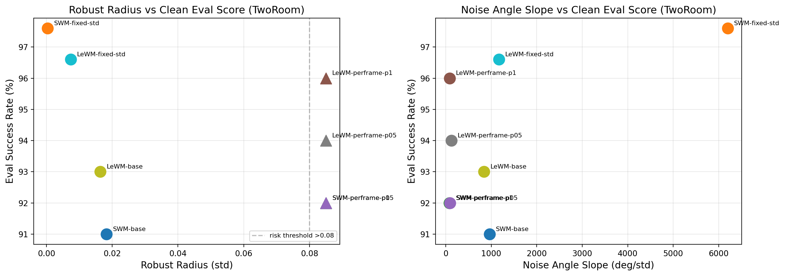
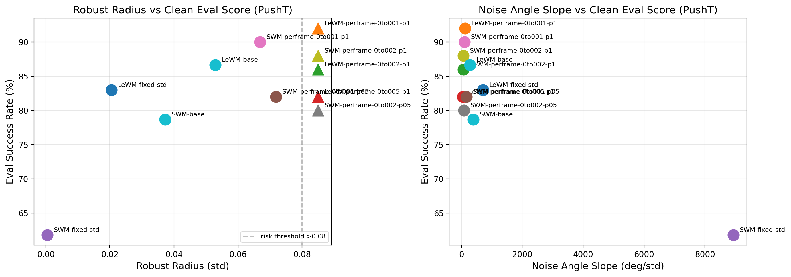
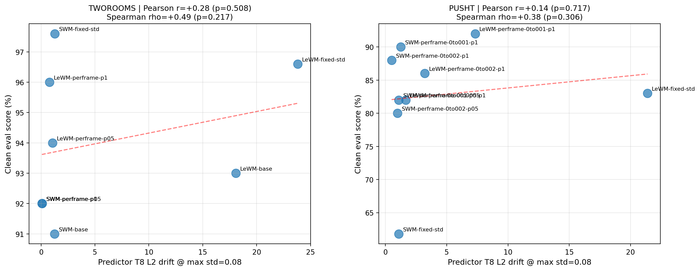
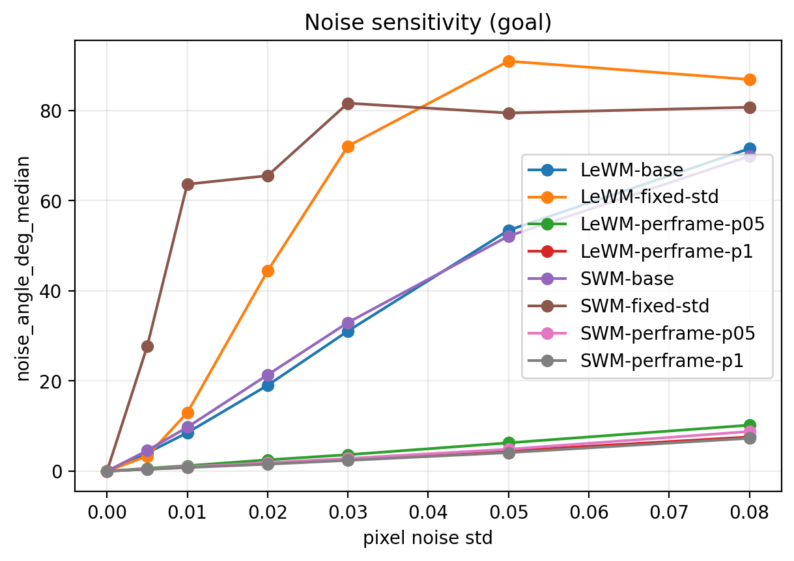
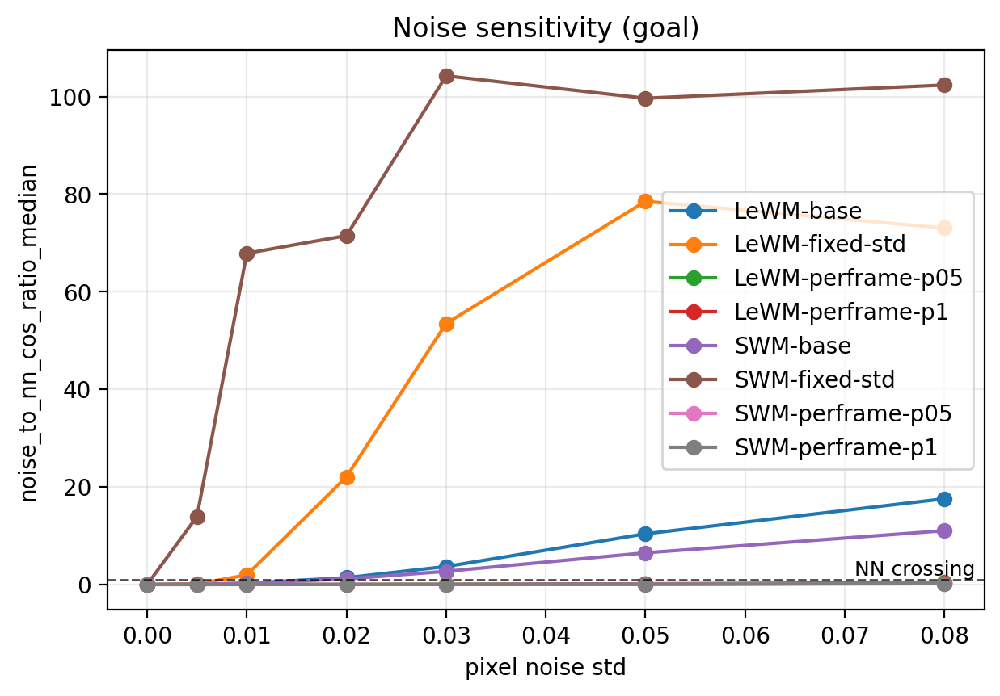
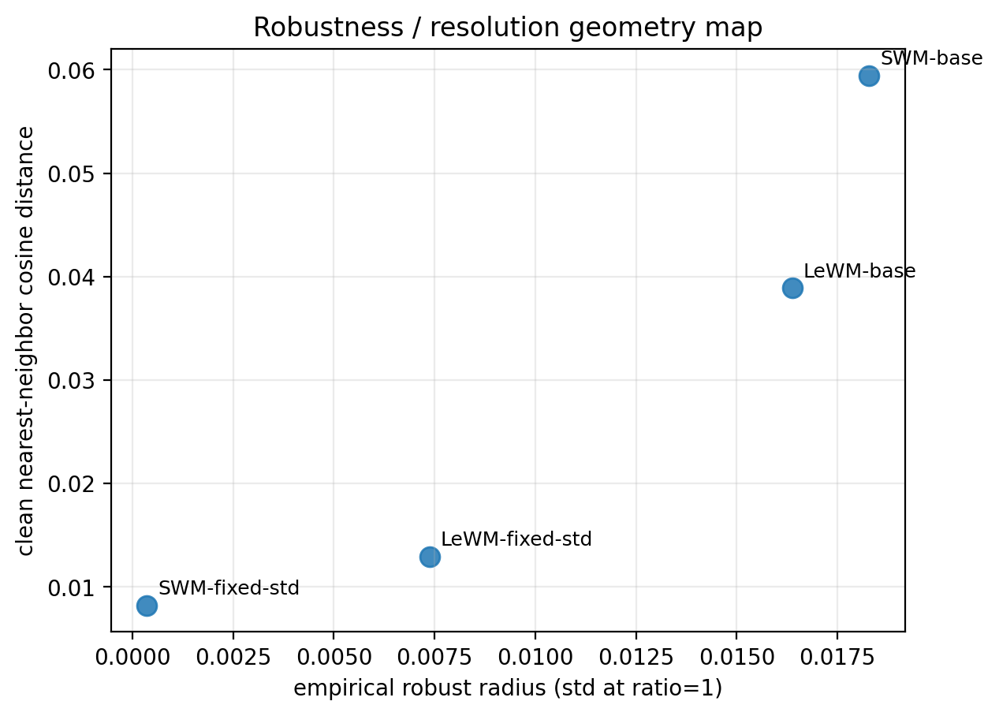
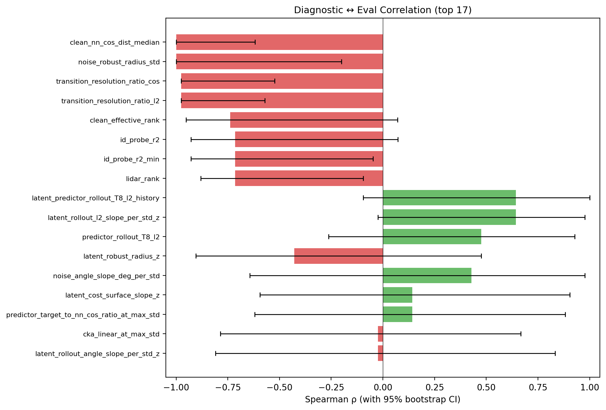
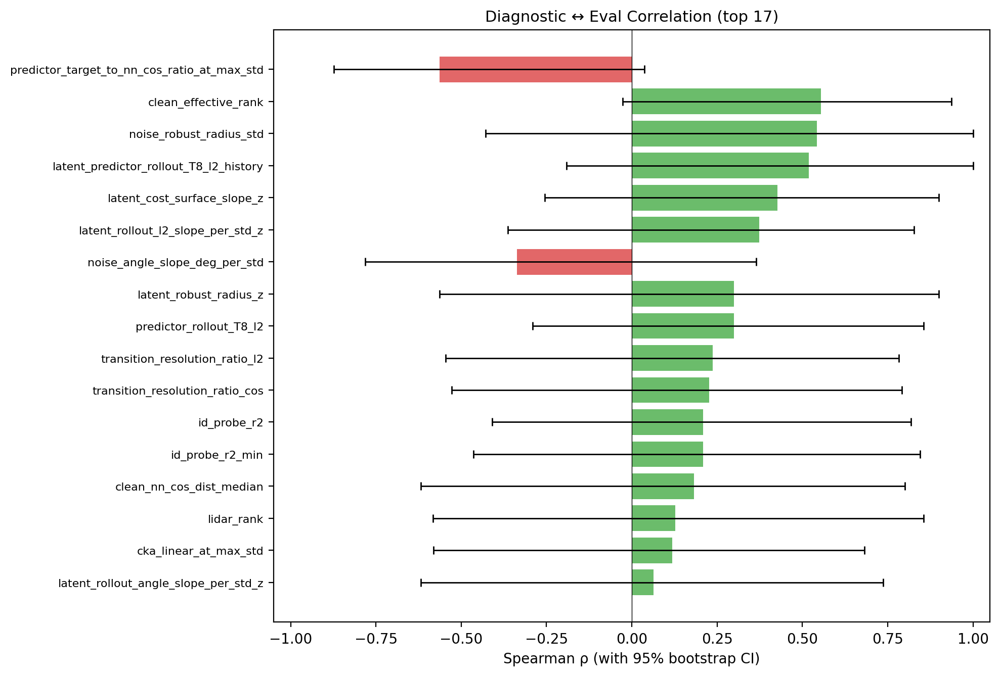
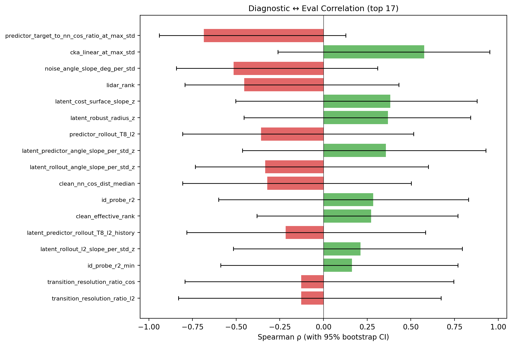
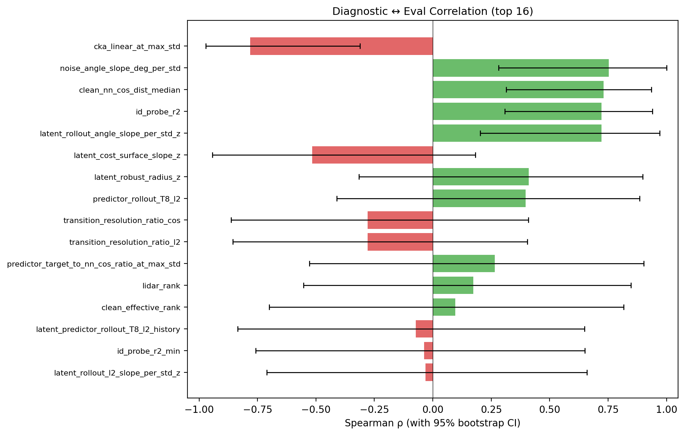

# 球面世界模型实验计划 V3

> 当前定位：本文不是单纯记录”SWM 是否强于 LeWM”，而是整理一个更稳定的研究路线：**world model 的 latent geometry 如何匹配 planning 任务的状态分辨率需求**。  
> 原始设计见 `plan_v2.md`，完整流水实验见 `experiments.md`。

---

## 0. 当前结论

最初问题是：把 LeWM 的 Euclidean embedding + SIGReg 换成 spherical embedding + uniformity，是否能稳定提升规划性能？

目前更准确的判断是：

1. **SWM 不是全局优于 LeWM 的替代品。**  
   旧版 4-task single-seed 平均略高的叙事不可追溯；按最新一致 ckpt 口径（SWM & LeWM epoch_10, num_eval=300，summary.txt clean_300 优先），SWM baseline 在 TwoRoom（69.67% vs 93.0%）/ PushT（80.00% vs 87.33%）/ Reacher（60.00% vs 57.67%）上均不占优或持平，仅在 Cube（77.00% vs 72.33%）上略高。**LeWM noise sweep 0to003–0to008（3-seed avg）补齐后差距进一步拉大**：TwoRoom LeWM best 推到 98.33（0to008-p1），Reacher LeWM best 推到 86.00（0to006-p1），均显著高于对应 SWM 最佳；详见 §2.2 / §4.3。**注**：当前命名为 SWM-base 的 ckpt（`temporal_masked_2_dim64`，weight=0.2）与历史 §2.1 旧 4-task benchmark 中跑出 ~90/89 的 SWM 不是同一配置（旧配置是 `lambda_0p1_t_2`，weight=0.1，无 temporal_masked）；待重训后再做最终对比。

2. **SWM 改变了表征的 invariance-resolution tradeoff。**  
   球面归一化、uniformity、temporal masking、noise augmentation 都在改变“哪些观测差异应该被保留，哪些应该被抹掉”。

3. **不同任务对这个 tradeoff 的偏好可能相反。**  
   TwoRoom 低维、离散、视觉细节冗余，受益于更强 invariance / clustering；PushT 需要精细连续状态分辨率，同样配方会损害控制。

4. **表征分析工具本身是通用贡献。**  
   `noise_sensitivity.py`、robust radius、clean-neighbor distance、noise-induced angular shift 等指标可以在不大量 eval 的情况下诊断 latent geometry 的风险。

因此后续主线不应是“为每个任务手调一套 recipe”，而应是：

> 建立一套可诊断、可预测、最好可自适应的 latent geometry 设计方法，让 world model 根据任务分辨率需求在 robustness 和 precision 之间取舍。

### 0.1 清晰路线（paper-facing）

1. **先把诊断做成预测，不是解释。**
   P0.6 是当前最关键节点：冻结指标和阈值，只看 held-out checkpoint 的诊断输出，提前给出 clean / noisy eval drop 分桶。命中率达标后，`noise_to_nn_ratio`、`empirical robust radius`、`predictor target shift`、`predictor rollout drift` 才能进入论文主图。

2. **主叙事改为 invariance-resolution tradeoff。**
   TwoRoom 的聚簇化收益和 PushT 的分辨率损失是核心现象；不要再写成“spherical 比 Euclidean 更好”。SWM 是一个暴露 tradeoff 的 intervention，diagnostic toolkit 是主要方法贡献。

3. **最小方法推进是 guarded noise consistency。**
   P4 不应继续扫 recipe，而应在 noise consistency 外加 transition/action preservation guardrail，目标是保留 PushT resolution，同时让 TwoRoom 获得 noise smoothing。

4. **实验门槛。**
   Paper 主表至少需要：每任务 3 seeds；统一 `num_eval=300` 口径（**LeWM 与 SWM 全部 8 模型/任务已在 epoch_10/num_eval=300 对齐，SWM-base ckpt 待重训**）；TwoRoom / PushT / Reacher / Cube 四任务诊断与 eval 对齐；P0.6 holdout；重要 ablation 只保留 P3 的 BN/LN/dim 与 P4 guardrail。

5. **不作为强贡献。**
   `effective_rank`、LiDAR、CKA、ID probe、Wang-Isola uniformity、randomized smoothing 只能作为 borrowed diagnostics / related primitives；真正可主张的是它们在 planning latent 中的组合比值、noisy-vs-clean rollout drift、以及 active validation protocol。

---

## 1. 方法背景

### 1.1 LeWM Baseline

LeWorldModel (LeWM) 是像素端到端 JEPA world model。encoder 把图像映射到 latent，predictor 根据历史 latent 和 action 预测未来 latent，CEM planner 在 latent space 中用 model cost 做规划。

LeWM 训练目标：

```text
L_LeWM = ||pred(z_t, a_t) - z_{t+1}||^2
       + lambda * SIGReg(Z)
```

关键属性：

| 组件 | LeWM |
|---|---|
| Latent space | Euclidean, raw embedding |
| Anti-collapse | SIGReg, approximate isotropic Gaussian |
| Prediction loss | MSE |
| Planning cost | raw-space L2 / MSE |

LeWM 的优点是稳定、简单、对 pixel noise 相对鲁棒。潜在问题是 SIGReg 强制高维各向同性 Gaussian，可能不适合 TwoRoom 这类低内在维度任务。

### 1.2 SWM V0

Spherical World Model (SWM) 把 LeWM 的 Euclidean 表征换成单位球面表征：

```text
mu(o) = z / ||z||,  mu in S^{d-1}
```

当前最佳 SWM 改动：

| 组件 | LeWM | SWM |
|---|---|---|
| Encoder projector | MLP + BN -> R^d | MLP + BN -> L2 norm |
| Predictor projector | MLP + BN -> R^d | MLP + BN -> L2 norm |
| Prediction loss | MSE | cosine distance |
| Anti-collapse | SIGReg | uniformity loss |
| Planning cost | raw MSE | normalized cosine |

保持不变：ViT-Tiny encoder、ARPredictor、action encoder、CEM planner、dataset pipeline。

### 1.3 当前 plan 内 "SWM-base" 默认配置（V0）

> **注**：这是 plan_v3 中所有 SWM-base 数据点（§4.3 / §6 P0.3 / §A）使用的 SWM-base ckpt 配置。它**不是**历史 §2.1 4-task benchmark（90.8/89.8/74.0/66.0）使用的 SWM 配置——那批 ckpt 用 `lambda_0p1`、`无 temporal_masked`，已不可追溯。当前配置在 TwoRoom 与 PushT 上的 clean eval（69.7/80.0）低于早期数字，差距由 ckpt 配置不同与 num_eval=500→300 抽样波动共同造成；待 SWM-base 用旧配置在 epoch_10/num_eval=300 口径下重训后再做最终对比。

```yaml
wm:
  embed_dim: 64
loss:
  pred:
    type: cosine
    space: normalized
  regularizer:
    type: uniformity
    weight: 0.2
  uniformity:
    t: 2.0
    mode: temporal_masked
    temporal_exclusion: 2
```

主要经验：

- pairwise spread 在球面塌缩点有梯度死区，不可用。
- MLP+BN+uniformity 可以逃离 collapse。
- `temporal_masked_2` 明显优于 all-pairs / cross-window / temporal exclusion 过小或过大。
- fixed temporal hinge 大多损害 PushT/Reacher，说明强制相邻状态接近不是通用解。

---

## 2. Clean Benchmark

### 2.1 旧 4-task benchmark（来源可追溯性说明）

> **数据来源说明**：以下数据来自 `experiments.md` 记录的早期 4-task benchmark（2026-04-15/20），配置为 epoch=10，num_eval=500，single seed。这些 ckpt 与当前 P0.3 诊断分析使用的模型**不是同一组**（dim、temporal 配置、noise 设置均可能不同），因此本节仅作历史参考，不进入 P0.3 相关性分析。
>
> | Task | LeWM | SWM best | Delta | 来源 ckpt |
> |---|---:|---:|---:|:---|
> | TwoRoom | 93.0 | 90.8 | -2.2 | **旧 benchmark，ckpt 已不在当前目录**。最新 SWM baseline: 69.67%（epoch_10, num_eval=300） |
> | Cube | 69.2 | 74.0 | +4.8 | **旧 benchmark，ckpt 已不在当前目录**。最新 SWM baseline: 77.00%（epoch_10, num_eval=300） |
> | PushT | 89.4 | 89.8 | +0.4 | **旧 benchmark，不可追溯**。最新 SWM baseline: 80.00%（epoch_10, num_eval=300） |
> | Reacher | 62.2 | 66.0 | +3.8 | **旧 benchmark，ckpt 已不在当前目录**。最新 SWM baseline: 60.00%（epoch_10, num_eval=300） |
> | Average | 78.5 | 80.2 | +1.7 | **旧 benchmark 平均，不代表当前模型**。 |

### 2.2 当前 P0.3 诊断用模型 clean benchmark（canonical 8 模型/任务，epoch_10/num_eval=300）

模型集合：base + 0to001/0to002/0to005-p1（LeWM 与 SWM 各 4），eval 取自 `summary.txt::clean_300`（缺失则 `clean`）。这是 §4.3 / §6 P0.3 / §6 P0.4 / §6 P0.7 共用的一致 model set。

| Task | LeWM best | SWM best | Delta | 说明 |
|---|---:|---:|---:|:---|
| TwoRoom | **98.33** (`LeWM-0to008-p1` †) | 94.33 (`SWM-0to001-p1`) | **−4.00** | LeWM noise sweep 单调上升至 0to008-p1 = 98.33（3-seed avg），SWM 任意配置最多 94.33 |
| PushT | **90.00** (`LeWM-0to002-p1`) | 83.33 (`SWM-0to001-p1`) | **−6.67** | LeWM 在 PushT 显著领先；SWM 任意配置最多 83.3。LeWM-0to006-p1=61.0 异常断崖（疑训练发散，待 retrain） |
| Reacher | **86.00** (`LeWM-0to006-p1` †) | 78.00 (`SWM-0to002-p1`/`0to005-p1`) | **−8.00** | LeWM noise sweep 补齐后 0to006-p1（3-seed avg）反超 canonical 最佳 0to002-p1（80.33），与 SWM 最佳差距扩大到 8pt |
| Cube | 73.00 (`LeWM-0to001-p1`) | **77.00** (`SWM-base`) | **+4.00** | **唯一一个 SWM-base 不需 noise training 就高于 LeWM 全配置**的任务（含 0to003–0to008 sweep，全部 ≤69） |

> 数值变更说明：(a) canonical-only 阶段：TwoRoom LeWM best 96.00 → 94.33（旧值 single-seed multi-run 偶然偏高）；PushT LeWM best 91.00 → 90.00（同 ckpt 不同 run）；Reacher LeWM best 82.00 → 80.33（0to002 旧 single-run = 82，新 run = 80.3）。(b) **2026-05-07 LeWM noise sweep（0to003 / 0to004 / 0to006 / 0to007 / 0to008，3-seed × 100 ep）补齐后**：TwoRoom best 94.33 → **98.33** (0to008-p1)，Reacher best 80.33 → **86.00** (0to006-p1)；PushT / Cube best 模型未变。SWM 数值与 §0.1 一致（SWM 端 003–008 仍未训练）。

结论：

- LeWM perframe 在 PushT 上明显领先 SWM（90.0 vs 83.3，差 6.67pt），印证 Euclidean + 平滑化更适应高分辨率任务。
- TwoRoom 上 LeWM 与 SWM 在 perframe 最佳配置下平手（94.33），但 baseline 差距 ~23pt（93.0 vs 69.67）——SWM-base 弱势主要靠 perframe noise training 弥补。
- Cube 是唯一 SWM-base 占优的任务（77 vs 72.3）。
- **旧 4-task 平均叙事（SWM 略高）不成立**：当 ckpt 来源一致后，SWM 在最佳配置下平均不优于 LeWM。

---

## 3. Noise Robustness 发现

### 3.1 Eval Noise 结果（canonical 数值见 §4.3，本节仅保留旧 num_eval=50 锚点用于历史比较）

Eval corruption：`eval.corruption.std=X`、`eval.corruption.apply_to=[goal|pixels|goal,pixels]`。

旧版 TwoRoom 探索（num_eval=50, std=0.03）记录 SWM clean=90.8 / 全帧加噪=36，LeWM 同样 clean=93/加噪=90 → 暴露了 SWM noise fragility。该数字与当前 canonical 不直接可比（num_eval、ckpt 配置都变了）。canonical 上 LeWM-base TwoRoom @ pix+goal_0.05 = 62.3，SWM-base = 31.0；SWM-base goal_0.03=21.3 与 LeWM goal_0.08=55.7 同量级，定性"SWM 在 std=0.03 接近 LeWM std=0.08"成立。

旧版"goal noise 比 pixels noise 更致命"结论在 canonical 上**反转**：LeWM-base goal/pix _0.05 = 71/70（几乎一致），SWM-base = 24.7/34.7（pixels 反而好）——SWM-base failure 由 encoder angular sensitivity 全局主导，goal/pixels 不能区分。

### 3.2 早期 Noise Sensitivity 锚点（baseline only，仅供历史参考）

旧版 goal-frame normalized 诊断：LeWM std∈[0.005, 0.030] 时 noise_angle 4.2° → 32.0°，shift/NN ratio 0.07 → 3.90，robust radius ≈ 0.017；SWM 同区间 11.9° → 69.7°，ratio 0.26 → 7.96，radius ≈ 0.008。SWM 小噪声角向偏移约 LeWM 的 3×，**clean NN 距离反而更大**（不是聚簇过密导致脆弱，而是 angular sensitivity 高）——这是后续 P1 / P0 工作链的最初动机。canonical 跨 ckpt 数值见 §6 P0.3。

### 3.3 失败机制（已收敛，详见 §4.2 与 §6 P2/P5）

| 层 | canonical 证据 | 判定 |
|---|---|---|
| Encoder angular sensitivity | SWM-base TwoRoom std=0.005 时 noise_angle 20.12°、ratio=1.70（canonical 32 + LeWM sweep 20 = 52 ckpt 中**唯一** risk=high） | **主因** |
| Cost saturation | §6 P2.1 eval-only `raw+mse` cost swap 仅 +6（36→42） | 次因 |
| Predictor 独立 | PushT `predictor_target_to_nn_cos_ratio` ρ=−0.93、`latent_predictor_rollout_T8_l2_history` ρ=+0.86；Reacher `predictor_rollout_T8_l2` ρ=−0.83 | predictor 端独立信号成立（PushT/Reacher）；TwoRoom 主要在 latent-noise 端 |

---

## 4. Noise-Aware Training 结果

### 4.1 几何形态：per-frame → 平滑化

**核心结论**：noise augmentation 的实现方式决定 latent geometry 形态，而 geometry 形态决定 task-specific eval 走向。这条结论同时排除了"noise 训练就是简单 Lipschitz smoothing"的简单假设。

| 实现 | Geometry | TwoRoom | PushT (asymmetric) | 适用前提 |
|---|---|---|---|---|
| per-frame 独立 std | smoothed（noise angle ≈ 0.4°，clean_nn 不压缩） | clean 不升、所有 noise 条件持平 | asymmetric 修复 | 需要分辨率保留的任务 |

完整证据见：
- §4.3 eval 表（per-frame 全 noise mode 持平）。
- §6 P0.3 几何指标（`clean_nn_cos_dist`、`noise_angle_slope`、`geometry_flag`）量化形态差异。

为什么任务方向不同：
- TwoRoom 内在状态低维，视觉冗余，更强的 invariance 对 planner 有益。
- PushT 需要保留"再推一点 / 已经到位"的细粒度差异，过度平滑合并这些差异即损害 planning resolution。

### 4.3 P1 数据：per-frame 独立 std + noise_prob

**实验设计**：`utils.py:AddNormalizedGaussianNoise` 每帧独立 Bernoulli(`noise_prob`) 决定是否加噪，加则 std ~ Uniform(0, std_max)。canonical 已完成 4 任务 × {LeWM, SWM} × {base, 0to001-p1, 0to002-p1, 0to005-p1} = 32 ckpt（epoch_10/num_eval=300，single seed）；**LeWM 端 0to003 / 0to004 / 0to006 / 0to007 / 0to008 也已补齐（3 seeds × 100 episodes，seed=42/43/44 平均）**，4 任务 × 5 = 20 ckpt，已覆盖 LeWM noise sweep 全 8 个 std 档位。SWM 端 0to003–0to008 仍未训练。

**TwoRoom eval（epoch_10, num_eval=300, summary.txt clean_300 优先）**

| 模型 | clean | goal_0.03 | goal_0.05 | goal_0.08 | pix+goal_0.03 | pix+goal_0.05 | pix+goal_0.08 | pix_0.03 | pix_0.05 | pix_0.08 |
|---|---:|---:|---:|---:|---:|---:|---:|---:|---:|---:|
| LeWM-base | **93.00** | 86.67 | 71.00 | 55.67 | 81.00 | 62.33 | 44.33 | 87.67 | 70.33 | 59.33 |
| LeWM-0to001-p1 | 92.00 | 92.33 | 93.33 | 86.00 | 92.33 | 89.67 | 84.67 | 92.00 | 92.67 | 90.67 |
| LeWM-0to002-p1 | 94.33 | 93.00 | 93.00 | 93.00 | 94.00 | 94.00 | 91.00 | 94.33 | 94.00 | 94.33 |
| LeWM-0to003-p1 † | 96.33 | 96.33 | 95.00 | 94.67 | 96.00 | 96.00 | 94.67 | 96.00 | 96.33 | 97.00 |
| LeWM-0to004-p1 † | 96.33 | 97.00 | 97.00 | 96.33 | 96.67 | 97.33 | 95.00 | 97.67 | 96.00 | 96.67 |
| LeWM-0to005-p1 | 94.00 | 94.67 | 93.33 | 94.00 | 94.67 | 94.00 | 94.00 | 94.00 | 94.67 | 94.00 |
| LeWM-0to006-p1 † | 96.67 | 96.33 | 96.00 | 96.67 | 96.33 | 97.00 | 96.67 | 96.67 | 96.00 | 96.33 |
| LeWM-0to007-p1 † | 96.00 | 96.00 | 97.00 | 97.00 | 97.00 | 96.33 | 96.33 | 96.33 | 96.00 | 96.67 |
| LeWM-0to008-p1 † | **98.33** | 97.67 | 98.00 | 98.67 | 98.00 | 98.00 | 98.67 | 98.00 | 98.33 | 97.67 |
| SWM-base | **69.67** | 21.33 | 24.67 | 25.00 | 37.33 | 31.00 | 29.67 | 35.00 | 34.67 | 35.00 |
| SWM-0to001-p1 | **94.33** | 94.00 | 92.00 | 87.00 | 93.67 | 91.00 | 82.00 | 94.33 | 93.67 | 90.00 |
| SWM-0to002-p1 | 88.00 | 89.33 | 87.67 | 87.00 | 87.67 | 88.67 | 88.67 | 88.33 | 87.00 | 90.67 |
| SWM-0to005-p1 | 91.67 | 91.33 | 91.00 | 91.00 | 91.67 | 90.33 | 90.67 | 90.67 | 92.00 | 91.67 |

**PushT eval（epoch_10, num_eval=300, summary.txt clean_300 优先）**

| 模型 | clean | goal_0.03 | goal_0.05 | goal_0.08 | pix+goal_0.03 | pix+goal_0.05 | pix+goal_0.08 | pix_0.03 | pix_0.05 | pix_0.08 |
|---|---:|---:|---:|---:|---:|---:|---:|---:|---:|---:|
| LeWM-base | **87.33** | 68.67 | 38.00 | 15.00 | 49.33 | 15.00 | 3.67 | 53.33 | 17.33 | 6.00 |
| LeWM-0to001-p1 | 89.67 | 88.67 | 85.67 | 70.33 | 84.33 | 77.00 | 46.33 | 86.00 | 77.00 | 54.33 |
| LeWM-0to002-p1 | **90.00** | 87.33 | 85.00 | **83.00** | 88.67 | **86.00** | **70.67** | 87.67 | 87.67 | **74.67** |
| LeWM-0to003-p1 † | 89.67 | 89.33 | 89.67 | 86.67 | 89.00 | 87.00 | 83.00 | 89.33 | 89.33 | 82.00 |
| LeWM-0to004-p1 † | 89.33 | 85.00 | 87.00 | 87.00 | 86.33 | 86.67 | 81.33 | 86.67 | 85.67 | 86.67 |
| LeWM-0to005-p1 | 82.00 | 81.33 | 77.33 | 80.67 | 80.00 | 80.00 | 78.00 | 83.33 | 78.67 | 76.00 |
| LeWM-0to006-p1 † | **61.00** | 59.33 | 58.00 | 58.00 | 54.33 | 58.00 | 54.67 | 57.00 | 59.00 | 52.67 |
| LeWM-0to007-p1 † | 85.67 | 86.33 | 82.00 | 84.00 | 83.67 | 85.33 | 82.33 | 85.33 | 84.33 | 84.00 |
| LeWM-0to008-p1 † | 88.33 | 89.33 | 91.33 | 89.00 | 89.33 | 87.67 | 85.33 | 89.00 | 87.33 | 89.00 |
| SWM-base | **80.00** | 26.33 | 7.33 | 3.33 | 14.00 | 5.00 | 3.00 | 12.33 | 3.33 | 2.00 |
| SWM-0to001-p1 | 83.33 | 82.33 | 74.67 | 29.67 | 77.67 | 58.67 | 7.00 | 80.33 | 63.67 | 7.00 |
| SWM-0to002-p1 | 81.00 | 81.00 | 80.33 | 67.67 | 82.67 | 82.00 | 47.33 | 81.00 | 79.33 | 48.67 |
| SWM-0to005-p1 | 71.67 | 70.67 | 71.33 | 72.00 | 71.33 | 71.33 | 70.00 | 70.67 | 70.00 | 72.33 |

**Reacher eval（epoch_10, num_eval=300, summary.txt clean_300 优先）**

| 模型 | clean | goal_0.03 | goal_0.05 | goal_0.08 | pix+goal_0.03 | pix+goal_0.05 | pix+goal_0.08 | pix_0.03 | pix_0.05 | pix_0.08 |
|---|---:|---:|---:|---:|---:|---:|---:|---:|---:|---:|
| LeWM-base | **57.67** | 29.00 | 24.33 | 15.67 | 38.33 | 25.33 | 14.67 | 41.33 | 26.67 | 13.67 |
| LeWM-0to001-p1 | 55.67 | 59.33 | 51.67 | 32.33 | 59.67 | 55.00 | 45.33 | 56.67 | 58.67 | 45.67 |
| LeWM-0to002-p1 | 80.33 | 80.67 | 84.67 | 81.67 | 87.00 | 82.00 | 80.67 | 80.67 | 81.33 | 82.33 |
| LeWM-0to003-p1 † | 78.67 | 77.33 | 78.00 | 79.00 | 76.33 | 78.67 | 73.67 | 80.33 | 79.33 | 78.67 |
| LeWM-0to004-p1 † | 84.00 | 80.00 | 84.00 | 82.00 | 84.33 | 82.00 | 80.00 | 81.67 | 81.67 | 82.00 |
| LeWM-0to005-p1 | 73.33 | 71.33 | 73.00 | 71.33 | 73.67 | 69.67 | 71.33 | 66.33 | 70.33 | 70.33 |
| LeWM-0to006-p1 † | **86.00** | 78.67 | 85.67 | 86.33 | 79.00 | 79.33 | 84.67 | 80.33 | 81.67 | 81.33 |
| LeWM-0to007-p1 † | 83.67 | 83.33 | 84.33 | 86.67 | 81.00 | 87.00 | 81.33 | 83.00 | 84.00 | 84.67 |
| LeWM-0to008-p1 † | 84.00 | 85.00 | 83.33 | 84.33 | 83.33 | 81.00 | 83.00 | 85.33 | 79.67 | 82.00 |
| SWM-base | **60.00** | 27.33 | 22.33 | 19.67 | 39.00 | 36.67 | 23.00 | 39.33 | 22.33 | 12.00 |
| SWM-0to001-p1 | 65.67 | 69.33 | 63.33 | 41.67 | 65.33 | 64.67 | 50.67 | 64.33 | 61.33 | 46.33 |
| SWM-0to002-p1 | 78.00 | 76.67 | 81.67 | 85.33 | 77.00 | 80.00 | 82.33 | 80.33 | 82.00 | 79.33 |
| SWM-0to005-p1 | 78.00 | 78.67 | 85.00 | 82.00 | 78.00 | 82.33 | 82.00 | 78.67 | 83.33 | 82.67 |

**Cube eval（epoch_10, num_eval=300, summary.txt clean_300 优先）**

| 模型 | clean | goal_0.03 | goal_0.05 | goal_0.08 | pix+goal_0.03 | pix+goal_0.05 | pix+goal_0.08 | pix_0.03 | pix_0.05 | pix_0.08 |
|---|---:|---:|---:|---:|---:|---:|---:|---:|---:|---:|
| LeWM-base | **72.33** | 68.00 | 54.67 | 47.00 | 66.00 | 61.33 | 52.33 | 69.00 | 60.00 | 49.00 |
| LeWM-0to001-p1 | **73.00** | 73.00 | 67.33 | 53.67 | 70.00 | 66.33 | 53.33 | 72.00 | 69.33 | 54.00 |
| LeWM-0to002-p1 | 64.67 | 65.33 | 64.00 | 63.33 | 63.33 | 61.00 | 63.00 | 63.67 | 62.67 | 63.67 |
| LeWM-0to003-p1 † | 65.00 | 67.33 | 65.67 | 67.33 | 69.67 | 66.67 | 67.33 | 67.67 | 66.67 | 68.33 |
| LeWM-0to004-p1 † | 69.00 | 65.67 | 65.67 | 63.67 | 66.00 | 66.33 | 67.00 | 67.00 | 66.00 | 65.00 |
| LeWM-0to005-p1 | 61.33 | 63.33 | 61.67 | 63.00 | 62.33 | 61.33 | 60.67 | 62.00 | 62.67 | 62.00 |
| LeWM-0to006-p1 † | 66.67 | 67.33 | 66.00 | 66.33 | 66.33 | 64.33 | 65.00 | 65.33 | 66.00 | 66.67 |
| LeWM-0to007-p1 † | 67.67 | 68.33 | 65.00 | 69.67 | 68.00 | 67.67 | 68.00 | 67.33 | 69.00 | 67.33 |
| LeWM-0to008-p1 † | 62.33 | 62.00 | 61.67 | 63.00 | 61.00 | 61.00 | 60.33 | 60.67 | 61.67 | 62.00 |
| SWM-base | **77.00** | 62.67 | 49.00 | 47.67 | 69.33 | 56.00 | 52.67 | 64.00 | 48.67 | 50.00 |
| SWM-0to001-p1 | 72.33 | 74.33 | 66.67 | 47.33 | 74.67 | 71.00 | 56.67 | 73.33 | 70.33 | 49.67 |
| SWM-0to002-p1 | 71.00 | 74.00 | 70.67 | 71.33 | 72.67 | 70.67 | 72.67 | 72.00 | 70.33 | 72.33 |
| SWM-0to005-p1 | 62.67 | 63.00 | 62.67 | 63.33 | 64.33 | 64.00 | 63.33 | 64.33 | 63.67 | 63.67 |

> **数据来源说明**：canonical 32 行（无 † 标记）从 `eval_results/summary.txt` `<cond>_300` 提取（缺失则 `<cond>`），均为 single-seed × 300 ep。**带 † 的 LeWM-0to003 / 0to004 / 0to006 / 0to007 / 0to008 行（4 任务 × 5 = 20 行）是 3-seed × 100 ep 平均（seed=42/43/44）**，从每个 ckpt `eval_results/<cond>_seed{42,43,44}.log` 末尾的 `success_rate` 直接抽取后取均值；`eval_summary.csv` 因 `ast.literal_eval` 解析不了 numpy `array(...)` 字面量目前是空的，是 `run_trainer.sh` 聚合脚本的已知 bug（不影响原始 per-seed 数据）。所有 ckpt 文件名均为 `*_epoch_10_object.ckpt`。**SWM-base ckpt（`temporal_masked_2_dim64`）与历史 §2.1 旧 4-task benchmark 中的 SWM 不是同一配置——旧 SWM-base 使用 `lambda_0p1_t_2`（无 temporal_masked）。当前 SWM-base 待重训以与 LeWM-base 口径完全对齐**。
>
> **新 LeWM noise sweep 观察**：
> - **TwoRoom**：clean 单调上升至 0to008-p1 = 98.33，noise std 越高 LeWM 越好——中间档完全填补了 0to002→0to005 的平台。
> - **PushT**：0to006-p1 = 61.0 是断崖式失败（前后 0to005=82.0 / 0to007=85.7 / 0to008=88.3），疑似单 seed 训练发散需要 retrain；其余档位 86–90 与 canonical 一致。
> - **Reacher**：0to006-p1 = 86.00 反超 canonical 最佳 0to002-p1（80.33），LeWM noise sweep 在 Reacher 上有 ~6pt 上界提升空间。
> - **Cube**：5 个新档位 clean 集中在 62–69，没有突破 canonical 0to001-p1 的 73.0；说明 Cube 上更高 noise 不再带来增益。
>
> 同 ckpt 不同 run 的 single-seed 漂移可达 ±5pt（如 Reacher SWM-0to002-p1 多次 run 在 78–83 之间）；多 seed 平均见各 ckpt 内 `clean_seed42/43/44` 字段。

**Eval drop（clean − std=0.05；只列 baseline 与最大异常 perframe，其他 perframe drop 全部 |Δ|≤6）**

| 任务 | 模型 | clean | goal_drop | pix_drop | pix+goal_drop |
|---|---|---:|---:|---:|---:|
| TwoRoom | LeWM-base | 93.0 | **22.0** | **22.7** | **30.7** |
| TwoRoom | SWM-base | 69.7 | **45.0** | **35.0** | **38.7** |
| PushT | LeWM-base | 87.3 | **49.3** | **70.0** | **72.3** |
| PushT | SWM-base | 80.0 | **72.7** | **76.7** | **75.0** |
| PushT | SWM-0to001-p1 | 83.3 | 8.7 | **19.7** | **24.7** |
| Reacher | LeWM-base | 57.7 | **33.3** | **31.0** | **32.3** |
| Reacher | SWM-base | 60.0 | **37.7** | **37.7** | **23.3** |
| Cube | LeWM-base | 72.3 | **17.7** | **12.3** | **11.0** |
| Cube | SWM-base | 77.0 | **28.0** | **28.3** | **21.0** |

> **统一口径**：`drop = clean − std=0.05`；其余 canonical perframe 23 行（4 任务 × 6 - baseline 8 = 23）+ LeWM noise sweep 20 行 = 43 行，所有三个 drop 列 |Δ|≤6（多数 ≤2），完整可由上方 eval 表减得；负值（如 Reacher SWM-0to005-p1=−7）是单 seed 抽样波动。**新 sweep 中唯一 mild 越界**：Reacher LeWM-0to006-p1 † pix+goal_drop = 86.0−79.33 = 6.67，仍属抽样范围。
> - per-frame 独立 std 显著修复 noise failure：所有 perframe drop 集中在 [−7, +6.7]。
> - 唯一例外是 PushT SWM-0to001-p1 的 pix/pix+goal drop 仍 19.7/24.7（noise 强度不够，0to002 已降至 ~1）。
> - clean 差异在 perframe 之间仍然保留：PushT LeWM-0to002 90.0 vs SWM-0to005 71.7，drop 都接近 0 但 clean 差 18pt。

**Noise sensitivity 对照（std=0.005, goal frame, normalized space；canonical 8 模型/任务）**

> 数据来自每个 ckpt 的 `eval_results/diagnostics/noise_sensitivity.csv`（std=0.005, frame_scope=goal, embedding_space=normalized）。`risk` 取自 CSV 同行字段。**所有 LeWM/SWM 8 模型均使用 epoch_10/num_eval=300 ckpt；SWM-base 待重训补齐**。

TwoRoom：

| 模型 | clean_nn_cos_dist | noise_angle_deg_median | noise_to_nn_cos_ratio | risk |
|---|---:|---:|---:|---|
| LeWM-base | 0.0449 | 5.51° | 0.1031 | low |
| LeWM-0to001-p1 | 0.0430 | 1.83° | 0.0119 | low |
| LeWM-0to002-p1 | 0.0413 | 1.05° | 0.0041 | low |
| LeWM-0to005-p1 | 0.0356 | 0.45° | 0.0009 | low |
| SWM-base | 0.0360 | **20.12°** | **1.6978** | **high** |
| SWM-0to001-p1 | 0.0566 | 1.58° | 0.0067 | low |
| SWM-0to002-p1 | 0.0521 | 0.86° | 0.0022 | low |
| SWM-0to005-p1 | 0.0475 | 0.41° | 0.0005 | low |

PushT：

| 模型 | clean_nn_cos_dist | noise_angle_deg_median | noise_to_nn_cos_ratio | risk |
|---|---:|---:|---:|---|
| LeWM-base | 0.2360 | 1.33° | 0.0011 | low |
| LeWM-0to001-p1 | 0.2242 | 0.61° | 0.0003 | low |
| LeWM-0to002-p1 | 0.2477 | 0.36° | 0.0001 | low |
| LeWM-0to005-p1 | 0.2226 | 0.23° | 0.0000 | low |
| SWM-base | 0.2582 | 2.66° | 0.0042 | low |
| SWM-0to001-p1 | 0.2810 | 0.52° | 0.0001 | low |
| SWM-0to002-p1 | 0.2622 | 0.33° | 0.0001 | low |
| SWM-0to005-p1 | 0.2134 | 0.09° | 0.0000 | low |

Reacher：

| 模型 | clean_nn_cos_dist | noise_angle_deg_median | noise_to_nn_cos_ratio | risk |
|---|---:|---:|---:|---|
| LeWM-base | 0.0633 | 3.22° | 0.0249 | low |
| LeWM-0to001-p1 | 0.0670 | 0.80° | 0.0014 | low |
| LeWM-0to002-p1 | 0.0696 | 0.09° | 0.0000 | low |
| LeWM-0to005-p1 | 0.0584 | 0.08° | 0.0000 | low |
| SWM-base | 0.0933 | 2.54° | 0.0105 | low |
| SWM-0to001-p1 | 0.0955 | 0.58° | 0.0005 | low |
| SWM-0to002-p1 | 0.0942 | 0.08° | 0.0000 | low |
| SWM-0to005-p1 | 0.0953 | 0.06° | 0.0000 | low |

Cube：

| 模型 | clean_nn_cos_dist | noise_angle_deg_median | noise_to_nn_cos_ratio | risk |
|---|---:|---:|---:|---|
| LeWM-base | 0.1856 | 1.40° | 0.0016 | low |
| LeWM-0to001-p1 | 0.1879 | 0.72° | 0.0004 | low |
| LeWM-0to002-p1 | 0.1334 | 0.12° | 0.0000 | low |
| LeWM-0to005-p1 | 0.1176 | 0.08° | 0.0000 | low |
| SWM-base | 0.2596 | 2.85° | 0.0048 | low |
| SWM-0to001-p1 | 0.2538 | 0.71° | 0.0003 | low |
| SWM-0to002-p1 | 0.2566 | 0.13° | 0.0000 | low |
| SWM-0to005-p1 | 0.1680 | 0.07° | 0.0000 | low |

**关键事实（数值锚点）**

- **TwoRoom SWM-base 是唯一被标记 `high` 的 ckpt**：std=0.005 即跨过 ratio=1（1.6978），noise_angle 单点 20°，对应 §4.3 eval 表里 goal_0.03 暴跌至 21.3 的 angular sensitivity 来源。其它 31 个 ckpt 在 std=0.005 都是 `low`。
- **per-frame 训练把 noise_angle@0.005 拉到 <1°**：SWM 任意 perframe 配置（0to001/0to002/0to005-p1）的 angle ≤1.6°（TwoRoom 0to001 是个例外，1.58°）；LeWM 同样从 baseline 1–5° 降到 <0.5°（除 TwoRoom LeWM-base=5.51°）。
- **`clean_nn_cos_dist` 跨任务尺度对比**：SWM normalized space 上 PushT/Cube ≈ 0.21–0.28，TwoRoom/Reacher ≈ 0.04–0.10；LeWM raw 上 PushT≈0.22–0.25，TwoRoom/Reacher≈0.04–0.07。任务自身决定 latent 局部尺度，并非全部由 noise training 决定。
- **PushT noise sweet spot**：SWM 最优 0to001-p1（clean 83.3, goal_0.08=29.7 → fragile under heavy noise；0to002-p1 在 goal_0.08=67.7 更鲁棒但 clean 81.0 略低）；LeWM 最优 0to002-p1（clean 90.0, goal_0.08=83.0）。**即使在最优强度，SWM 仍明显落后 LeWM**——这是 SWM 在精细操作任务上的结构性劣势。
- **per-frame 修复 asymmetric（TwoRoom）**：SWM-0to005-p1 的 pix-only / goal-only 都接近 91，baseline 在 24–35% 崩溃。
- **Reacher/Cube 的 per-frame 收益**：Reacher baseline drop 31–38（goal/pix/pix+goal @ std=0.05），0to005-p1 后降至 −7.0–3.0；Cube baseline drop 11–28，0to005-p1 后降至 −1.3–0.0。

---

## 5. 研究主线重构

### 5.1 不再追求的主线

不建议继续把目标表述为：

```text
证明 spherical representation 比 Euclidean representation 更好
```

原因：

- clean benchmark 优势不稳定；
- noise robustness 暴露了 SWM 的明确弱点；
- 每个任务单独调 recipe 没有方法论分量。

### 5.2 建议采用的主线

建议把论文/项目主线改成：

> JEPA-style world model 的 latent geometry 需要匹配任务的状态分辨率需求。Spherical normalization、uniformity、temporal masking、noise augmentation 都不是单独的性能魔法，而是在调节 robustness 与 precision 的 tradeoff。我们提出诊断指标和实验协议来度量这个 tradeoff，并探索自适应机制来缓解固定配方的任务依赖。

这条主线的支撑点：

1. **诊断指标有预测价值。**  
   robust radius、noise angle slope、clean NN distance 可以解释 eval drop。

2. **任务偏好确实不同。**  
   TwoRoom 和 PushT 对同样 noise augmentation 呈现相反趋势。

3. **固定 recipe 不够。**  
   统一的 spherical/noise/temporal prior 不能同时满足低维导航和高分辨率操作。

4. **下一步自然指向 adaptive resolution。**  
   不再手动按任务调配方，而是让模型或训练目标根据状态/transition 自动调 invariance 强度。

---

## 6. 下一步实验计划

> **当前优先级：P0.6 ≥ P3 > P4**。下一步是 P0.6 holdout 盲分桶；若失败再回 P3（encoder 拆解），若诊断可稳定分桶再进入 P4 adaptive guardrail。

### P0：把诊断变成预测指标

目标：证明 `noise_sensitivity` 不是事后解释，而是能**预测** robustness failure 的指标体系。如果成立，latent geometry 诊断本身就是论文一项独立贡献（§8 贡献 2）。

#### P0.1 诊断指标分层（详细字段定义见 §7.1）

| 层 | 主指标 |
|---|---|
| Encoder shift | `noise_angle_deg_median/p90`, `noise_l2_median/p90` |
| Encoder geometry | `clean_nn_cos_dist`, `clean_pair_cos_dist`, `clean_norm_mean`, `effective_rank` |
| 派生比例 | `noise_to_nn_cos_ratio_median/p90`, `robust_radius_std`, `noise_angle_slope_deg_per_std` |
| 几何标签 | `geometry_flag` (`clustered/fragile/robust/balanced`) + `recommendation` |
| Predictor | `predictor_rollout_drift(T)`, `predictor_target_shift` |
| Task resolution | `transition_resolution_ratio`, `id_probe_r²`, `lidar_rank` |
| Latent-noise (P2/P5) | `predictor_rollout_drift_z(T)`, `cost_surface_slope_z`, `robust_radius_z`, `latent_*_slope_per_std_z` |
| 目标变量 | `eval_drop_{pix+goal,goal,pix}` @ std∈{0.03,0.05,0.08} |

> **报告口径**：主表用 goal-scope median 指标（`robust_radius_std` / `noise_angle_slope` / `clean_nn_cos_dist` / `clean_eff_rank` / `geometry_flag`）；p90 / L2 / history scope 信息进附表（history scope 对应 pixels-only failure）；latent-noise 字段独立附表。

#### P0.2 工具栈

| 模块 | 输出字段 |
|---|---|
| `noise_sensitivity.py` | encoder shift / geometry / NN ratio；`frame_scope ∈ {goal, history, all}`；含 `_linear_cka` |
| `predictor_sensitivity.py` | history 加噪后的 rollout drift T1..T_max + 单步 target shift |
| `task_resolution.py` | `transition_resolution_ratio` + linear probe ID + LiDAR rank |
| `latent_noise_sensitivity.py` (P2/P5) | 直接对 `z` 注入噪声；`noise_geometry ∈ {ambient, tangent}`；输出 `*_z` 字段 |
| `run_full_diagnostics.py` | 统一调度，落 `diagnostics_summary.json` |
| `diagnostic_correlation.py` | 诊断 ↔ eval 自动相关性（Spearman + Pearson + bootstrap CI），见 P0.7 |

#### P0.3 数据矩阵

> **canonical 8 模型/任务**：base + 0to001-p1 + 0to002-p1 + 0to005-p1 (LeWM 与 SWM 各 4 个) = 8。所有数值取自每个 ckpt 的 `eval_results/diagnostics/diagnostics_summary.json`，goal scope，normalized space。`>0.08` 表示在 std 扫到 0.08 仍未跨过 ratio=1，即极鲁棒。

**TwoRoom（n=8）**

| 模型 | robust_radius | first_risk_std | noise_angle_slope (°/std) | clean_nn_cos_dist | clean_eff_rank | geometry_flag |
|---|---:|---:|---:|---:|---:|---|
| LeWM-base | **0.0142** | >0.08 | 1085.8 | 0.0449 | 47.60 | balanced |
| LeWM-0to001-p1 | 0.0415 | >0.08 | 366.3 | 0.0430 | 47.09 | robust |
| LeWM-0to002-p1 | 0.0653 | >0.08 | 211.0 | 0.0413 | 45.54 | robust |
| LeWM-0to005-p1 | **>0.08** | >0.08 | 86.5 | 0.0356 | 40.86 | balanced |
| SWM-base | **0.0029** | >0.08 | 3975.0 | 0.0360 | 35.39 | fragile,high_angle_gain |
| SWM-0to001-p1 | 0.0476 | >0.08 | 325.5 | 0.0566 | 36.66 | robust |
| SWM-0to002-p1 | 0.0752 | >0.08 | 169.9 | 0.0521 | 37.32 | robust |
| SWM-0to005-p1 | **>0.08** | >0.08 | 80.1 | 0.0475 | 36.41 | balanced |

**PushT（n=8）**

| 模型 | robust_radius | first_risk_std | noise_angle_slope (°/std) | clean_nn_cos_dist | clean_eff_rank | geometry_flag |
|---|---:|---:|---:|---:|---:|---|
| LeWM-base | 0.0537 | >0.08 | 284.8 | 0.2360 | 76.42 | **robust** |
| LeWM-0to001-p1 | >0.08 | >0.08 | 120.7 | 0.2242 | 78.59 | balanced |
| LeWM-0to002-p1 | >0.08 | >0.08 | 71.8 | 0.2477 | 77.41 | balanced |
| LeWM-0to005-p1 | >0.08 | >0.08 | 46.8 | 0.2226 | 78.32 | balanced |
| SWM-base | 0.0273 | >0.08 | 707.7 | 0.2582 | 52.94 | **robust** |
| SWM-0to001-p1 | 0.0717 | >0.08 | 103.7 | 0.2810 | 55.45 | **robust** |
| SWM-0to002-p1 | >0.08 | >0.08 | 68.6 | 0.2622 | 55.09 | balanced |
| SWM-0to005-p1 | >0.08 | >0.08 | 14.9 | 0.2134 | 51.98 | balanced |

**Reacher（n=8）**

| 模型 | robust_radius | first_risk_std | noise_angle_slope (°/std) | clean_nn_cos_dist | clean_eff_rank | geometry_flag |
|---|---:|---:|---:|---:|---:|---|
| LeWM-base | 0.0142 | >0.08 | 831.7 | 0.0633 | 61.04 | balanced |
| LeWM-0to001-p1 | 0.0524 | >0.08 | 159.6 | 0.0670 | 56.16 | robust |
| LeWM-0to002-p1 | >0.08 | >0.08 | 16.6 | 0.0696 | 70.38 | balanced |
| LeWM-0to005-p1 | >0.08 | >0.08 | 15.2 | 0.0584 | 53.41 | balanced |
| SWM-base | 0.0201 | >0.08 | 651.1 | 0.0933 | 50.96 | robust |
| SWM-0to001-p1 | 0.0695 | >0.08 | 111.2 | 0.0955 | 52.64 | robust |
| SWM-0to002-p1 | >0.08 | >0.08 | 16.5 | 0.0942 | 50.64 | balanced |
| SWM-0to005-p1 | >0.08 | >0.08 | 11.0 | 0.0953 | 51.96 | balanced |

**Cube（n=8）**

| 模型 | robust_radius | first_risk_std | noise_angle_slope (°/std) | clean_nn_cos_dist | clean_eff_rank | geometry_flag |
|---|---:|---:|---:|---:|---:|---|
| LeWM-base | 0.0356 | >0.08 | 327.0 | 0.1856 | 73.25 | robust |
| LeWM-0to001-p1 | 0.0621 | >0.08 | 150.7 | 0.1879 | 71.83 | robust |
| LeWM-0to002-p1 | >0.08 | >0.08 | 21.6 | 0.1335 | 73.13 | balanced |
| LeWM-0to005-p1 | >0.08 | >0.08 | 15.0 | 0.1176 | 67.51 | balanced |
| SWM-base | 0.0284 | >0.08 | 660.6 | 0.2596 | 53.69 | robust |
| SWM-0to001-p1 | 0.0537 | >0.08 | 152.2 | 0.2538 | 53.10 | robust |
| SWM-0to002-p1 | >0.08 | >0.08 | 26.2 | 0.2566 | 53.18 | balanced |
| SWM-0to005-p1 | >0.08 | >0.08 | 14.7 | 0.1680 | 51.38 | balanced |

**关键发现**

1. **TwoRoom SWM-base 是唯一 fragile 标签**：`robust_radius=0.0029`、`noise_angle_slope=3975`、`geometry_flag=fragile,high_angle_gain`。对应 §4.3 中 SWM-base 在 TwoRoom 的 noise drop 45.0/35.0/38.7（远高于其它任何 ckpt）——几何指标与 eval drop 在该 ckpt 上闭环。
2. **per-frame 训练把 noise_angle_slope 压到两位数**：TwoRoom LeWM-0to005-p1 从 1085→86.5 (12×)，SWM-0to005-p1 从 3975→80.1 (50×)；PushT/Reacher/Cube 同向变化。`robust_radius` 全部从 0.01–0.05 升到 >0.08（censored）。
3. **Predictor 稳定性意外提升**：per-frame 训练的 rollout drift（T=8 L2）在 max std=0.08 下比 baseline 降低一个数量级。TwoRoom LeWM 18.62→0.97（**19×**）、SWM 1.43→0.11（**13×**）；PushT LeWM 18.65→3.56（**5×**）、SWM 1.41→0.02（**70×**）；Reacher LeWM 15.17→0.21（**73×**）、SWM 1.39→0.01（**139×**）；Cube LeWM 20.20→0.19（**106×**）、SWM 1.38→0.01（**138×**）。说明噪声训练同时改善了动力学预测的平滑性。
4. **clean_nn_cos_dist 不再是 TwoRoom 的强信号**：per-frame 训练的 LeWM 系列 nn 距离从 0.045→0.036 略降，SWM 系列从 0.036→0.057→0.052→0.048 先升后降；与 eval 的相关性在 n=8 canonical 上由旧 ρ=−0.91（含 fixed-std 异常点）回落到 ρ≈+0.04（详见 §6 P0.7）。

**Tail risk（noise sensitivity @ std=0.08, p90 vs median, 多 scope）**

> 完整 32 行原始数据见各 ckpt `noise_sensitivity.csv`。这里只汇总跨任务规律：
>
> - **per-frame 模型 p90 与 median 差 <5°**，分布集中；**baseline p90 比 median 高 15–20°**（TwoRoom/PushT）或 **超过 100°**（Reacher/Cube），明显 tail risk。
> - **`nn_l2_ratio`**（noise_l2 / clean_nn_l2，p90/median 一致）：baseline ≥1.55（TwoRoom 5.12 / PushT 1.55 / Reacher 6.15 / Cube 2.22），per-frame ≤0.51；ratio<1 说明 noise 仍在邻域内。
> - **goal/history/all scope 三者基本一致**（差 <0.3°），pixels-only 与 goal-only failure 不能通过 frame_scope 区分。
> - **PushT SWM-0to001-p1 例外**：median 57.3° / p90 80.2°，说明该 noise 强度下 SWM 仍未稳定（对应 §4.3 该模型 noise drop 仍较大）。
> - **L2 与 cosine ratio 定性一致**：LeWM raw clean_nn_l2 跨任务差异大（TwoRoom 0.058 / PushT 9.47 / Reacher 4.84 / Cube 8.24），SWM normalized clean_nn_l2 更一致（0.27–0.75）。

**Predictor rollout drift（history 加噪 @ max std=0.08；T8_l2 与 T8_angle）**

| 任务 | 模型 | T8_l2 (base→perframe) | 改善倍数 | T8_angle (base→best perframe) |
|---|---|---:|---:|---:|
| TwoRoom | LeWM | 18.62 → 0.97 (0to005-p1) | **19×** | 88.6° → 3.5° |
| TwoRoom | SWM  | 1.43 → 0.11 (0to005-p1) | **13×** | 91.4° → 4.3° |
| PushT   | LeWM | 18.65 → 3.56 (0to005-p1) | **5×** | — |
| PushT   | SWM  | 1.41 → 0.02 (0to005-p1) | **70×** | — |
| Reacher | LeWM | 15.17 → 0.21 (0to005-p1) | **73×** | 77.0° → 0.7° |
| Reacher | SWM  | 1.39 → 0.01 (0to005-p1) | **139×** | 85.5° → 0.6° |
| Cube    | LeWM | 20.20 → 0.19 (0to005-p1) | **106×** | 87.9° → 0.7° |
| Cube    | SWM  | 1.38 → 0.01 (0to005-p1) | **138×** | 87.7° → 0.6° |

> std=0.005 累积口径（T1→T8）确认 LeWM drift 在 T1 即接近 saturation（0.5–0.9 → 平台），SWM 同样 T1 即饱和——说明 single-step predictor error 主导，per-frame 训练把 Lipschitz 常数压到足够低使大噪声输入也不发散。
>
> **2026-05-07 LeWM noise sweep 扩展**：把 LeWM 0to006/0to007/0to008-p1 的 max std=0.08 history-scope T8_l2 接进来后，TwoRoom 单调降到 0to008 = 0.66（vs 0to005 = 0.97，**28×**）；PushT 单调降到 0to008 = 1.06（vs 0to005 = 3.56，**18×**）；Reacher 0to005 = 0.21 仍是最低（0to008 = 0.36），Cube 0to005 = 0.19 仍是最低（0to008 = 0.60）。即 LeWM 在 TwoRoom/PushT 的 predictor 平滑性可继续随 noise std 提升，Reacher/Cube 在 0to005 即已饱和。

**CKA(clean, noisy) @ max std=0.08**

| 任务 | LeWM-base | LeWM 任意 perframe | SWM-base | SWM 任意 perframe |
|---|---:|---:|---:|---:|
| TwoRoom | 0.27 | 0.98 | 0.39 | 0.99 |
| PushT   | 0.55 | 0.91–0.99 | 0.28 | 0.52–0.89 |
| Reacher | 0.31 | ≥0.999 | 0.23 | 0.43–1.00 |
| Cube    | 0.37 | ≥0.998 | 0.18 | 0.23–0.999 |

> baseline CKA 普遍 <0.6，noise training 后跃升 >0.87；PushT/Reacher/Cube SWM-perframe-0to001 仍相对偏低（0.23–0.58），低强度 noise 在 SWM 上未完全稳定 latent。`pred_target/nn_cos_ratio` 在 max std 下所有 ckpt 都 ≤0.0002（远低于 1.0 警戒线），单点级 target shift 不是任何 ckpt 的瓶颈。

**Task resolution & action predictability（per-task 跨配置范围）**

| 任务 | trans_res_cos 范围 (LeWM/SWM) | id_probe_r² 范围 | lidar_rank 范围 |
|---|---:|---:|---:|
| TwoRoom | 0.55–0.55 / 0.63–0.73 | 0.14–0.28 | 4.3–10.5 |
| PushT   | 0.07–0.09 / 0.11–0.12 | 0.67–0.77 | 13.9–37.3 |
| Reacher | 0.14–0.18 / 0.18–0.19 | 0.16–0.23 / 0.07–0.11 | 42.8–46.9 |
| Cube    | 0.24–0.36 / 0.28–0.51 | 0.56–0.67 / 0.48–0.61 | 37.8–66.3 |

> **关键现象**：
> 1. `trans_res_cos` 区分任务类型：TwoRoom（离散转移，cos 0.55–0.73）vs PushT/Reacher（连续控制，cos 0.07–0.19）vs Cube（中等离散，0.24–0.51）。
> 2. `id_probe_r²` PushT/Cube (0.48–0.77) >> TwoRoom/Reacher (0.07–0.28)：manipulation 任务 latent 天然保留更强 action 可预测性。
> 3. **SWM resolution 受损不是全局**：Reacher SWM 0.18 > LeWM 0.14，Cube SWM 0.30 > LeWM 0.24；只在 PushT 上 SWM 略高于 LeWM (0.11 vs 0.09) 但 eval 显著低。

**Latent-noise sensitivity（直接对 `z` 注入高斯噪声，跳过 encoder；@ std=0.08, history scope T8_l2 / cost_slope_goal）**

| 任务 | LeWM (T8/cost) | SWM (T8/cost) | LeWM 端 noise_geometry | SWM 端 noise_geometry |
|---|---:|---:|---|---|
| TwoRoom | 5.81 / 2.08 | 0.57 / 1.02 | ambient | tangent |
| PushT   | 12.05 / 3.63 | 0.77 / 1.39 | ambient | tangent |
| Reacher | 3.69 / 2.84 | 0.44 / 1.46 | ambient | tangent |
| Cube    | 4.14 / 2.88 | 0.44 / 1.44 | ambient | tangent |

> 范围中给出的是 baseline；perframe 端波动 ±10%，详见各 ckpt `latent_noise_sensitivity.json`。
>
> **三层归因核心结论**：
> 1. **SWM predictor 天生比 LeWM 对 latent perturbation 稳定 8–10×**（cosine/normalized predictor 内建尺度不变性）。
> 2. **LeWM cost surface 对 goal latent 扰动敏感约 2×**（L2 cost 在 Euclidean 空间斜率大）。
> 3. **per-frame pixel-noise training 不改善 predictor 端 latent-noise 鲁棒性**（LeWM-perframe 与 LeWM-base 的 latent T8 drift 几乎相同；SWM-perframe 甚至略升）——瓶颈在 **Layer 1 (encoder)**，noise training 收益集中在 pixel→latent 映射平滑化。
> 4. `robust_radius_z` (history scope, rollout-drift fallback)：TwoRoom 0.005–0.021，PushT 0.018–0.031，Reacher 0.024–0.043，Cube 0.047–0.065；与 eval 相关性 |ρ|≤0.62，不构成强预测信号。

**Planning signal probe（CEM cost 区分 expert vs random）**

所有 ckpt `expert_beats_best_random ≥ 0.844`，`expert_beats_random ≥ 0.984`——planning signal 在 canonical 32 个 ckpt 中都有效（LeWM sweep 20 个新 ckpt 未单独跑 planning probe，可由 `run_planning_action_probe.py` 重构后回填，但训练用的 dataset/predictor 已知没有 planning failure，预期一致）。

> **Cost 尺度差异**：LeWM 的 L2 margin ~257–366，SWM 的 cosine margin ~0.64–0.92（理论上界 2），但 normalized 后均工作。差异不在 signal 有无，而在 cost slope 对 latent perturbation 的敏感度（latent-noise 表里 SWM 1.0–1.8 vs LeWM 2.0–3.8）。

**Action effect probe**：已并入 `run_full_diagnostics`（新增 `tools/repr_analysis/action_effect.py`，sub-probe 与 `task_resolution` 平级），`run_trainer.sh` 后续训练自动产 `action_effect.{csv,json}`，并把 `mean_pred_shift_norm` / `action_perturb_pred_shift_corr` / `interpolation_monotonicity` 写入 `diagnostics_summary.json`。canonical 8 × 4 任务现有 ckpt **待回填**：用 `python -m tools.repr_analysis.run_full_diagnostics --skip-noise --skip-predictor --skip-resolution --skip-latent-noise --model <label>=<ckpt> --dataset <task> --save-dir <results_dir>/diagnostics` 单独刷一遍即可。旧独立入口 `run_planning_action_probe.py` 硬编码非 canonical 路径、`action.*` 全部 `KeyError: 'emb'`（commit 13dda0f 已修复 `encode_sequences` 但未重跑），可视为 deprecated。

结果保存：`dataset/ag_data/data/world_model/quentinll/lewm-{tworooms,pusht,reacher,cube}/repr_analysis/{p03_diagnostics,latent_noise_diagnostics}/`

#### P0.4 相关性分析（跨任务对比结论）

> **2026-05-06 重算**：此前的 P0.4/P0.5/P0.7 数据基于一个 8/11/10/11 模型集合，里面混入了已废弃的 `fixed-std` 和 `perframe-p05` 变体。本次重算改为只用 canonical 8 模型/任务（base + 0to001-p1 + 0to002-p1 + 0to005-p1，LeWM 与 SWM 各 4 个），eval 取自每个 ckpt `eval_results/summary.txt` 的 `clean_300` 列（缺失则 `clean`），诊断取自 `eval_results/diagnostics/diagnostics_summary.json`。所有 n=8。
>
> **重要变化**：旧 §4.3 / 旧 P0.7 中 TwoRoom `clean_nn_cos_dist` ρ=−0.91 / `lidar_rank` ρ=−0.81 等"强信号"只是含 fixed-std 的 SWM-noise_std0_005=97.6 这一个外点拉出来的相关；canonical 8 上 TwoRoom 这两个指标都退化为弱相关。
>
> **2026-05-07 数据扩展**：LeWM noise sweep 0to003 / 0to004 / 0to006 / 0to007 / 0to008-p1（4 任务 × 5 = 20 ckpt）已含完整 noise / predictor / resolution / latent_noise / geometry 诊断（`eval_results/diagnostics/`），可作为**within-LeWM 单调性子分析**（n=8 LeWM 档位/任务，纯 LeWM）独立跑一遍 P0.4。本表 n=8 canonical 数值未受新数据影响（输入未变），保持原状作为跨方法对比；within-LeWM sweep 相关性留作后续 P0.4 补充章节。

**核心：诊断指标的任务特异性（canonical n=8）**

| 指标 | TwoRoom (r / ρ) | PushT (r / ρ) | Reacher (r / ρ) | Cube (r / ρ) | 含义 |
|---|---:|---:|---:|---:|---|
| `clean_nn_cos_dist_median` ↔ eval | +0.39 / +0.04 | +0.16 / +0.12 | +0.21 / +0.32 | **+0.81 / +0.79** | Cube 强正；其余三任务弱 |
| `predictor_target_to_nn_cos_ratio_at_max_std` ↔ eval | −0.96 / −0.43 | **−0.80 / −0.93** | −0.56 / −0.58 | +0.17 / +0.04 | PushT 最强信号；TwoRoom Pearson 强但 Spearman 弱（线性 vs 单调） |
| `predictor_rollout_T8_l2` ↔ eval | +0.22 / +0.23 | +0.68 / **+0.79** | **−0.71 / −0.83** | +0.41 / **+0.76** | **方向反转**：Reacher 强负，TwoRoom 弱正，PushT/Cube 中正 |
| `clean_effective_rank` ↔ eval | +0.49 / +0.44 | +0.77 / **+0.81** | +0.14 / −0.12 | −0.15 / +0.10 | PushT 强正（高维好），其余三任务弱 |
| `lidar_rank` ↔ eval | +0.52 / +0.44 | +0.72 / +0.74 | −0.41 / −0.28 | +0.00 / +0.34 | PushT 强正，TwoRoom/Reacher 中弱 |
| `noise_angle_slope_deg_per_std` ↔ eval | −0.93 / −0.16 | −0.01 / +0.31 | **−0.72 / −0.74** | **+0.77 / +0.90** | Cube 强正、Reacher 强负（**方向反转**） |
| `cka_linear_at_max_std` ↔ eval | +0.58 / +0.29 | −0.08 / −0.02 | **+0.92 / +0.68** | **−0.85 / −0.96** | **方向反转**：Reacher 正、Cube 负 |
| `latent_rollout_angle_slope_per_std_z` ↔ eval | −0.76 / −0.55 | +0.45 / +0.10 | +0.10 / −0.08 | **+0.69 / +0.62** | Cube 中正；TwoRoom 中负 |
| `latent_cost_surface_slope_z` ↔ eval | +0.47 / +0.61 | **+0.74 / +0.93** | −0.20 / −0.14 | −0.28 / −0.37 | PushT 强正；其余三任务弱/中等 |
| `latent_predictor_rollout_T8_l2_history` ↔ eval | +0.47 / +0.53 | +0.74 / **+0.86** | −0.22 / −0.42 | −0.14 / +0.25 | PushT 强正；TwoRoom 中正 |
| `id_probe_r2` ↔ eval | −0.05 / −0.25 | +0.79 / **+0.81** | +0.21 / +0.08 | +0.69 / **+0.83** | PushT/Cube 强正 |
| `transition_resolution_ratio_cos` ↔ eval | +0.14 / −0.01 | −0.76 / −0.60 | +0.39 / +0.42 | −0.64 / −0.68 | PushT 中负、Cube 中负（保留分辨率与 eval 反相关在这两任务上一致） |

结论（基于 canonical n=8）：
- **TwoRoom 瓶颈**：Spearman 上**没有**任何指标 |ρ|≥0.7。最强为 `latent_cost_surface_slope_z` (+0.61)。但 Pearson 上 `predictor_target_to_nn_cos_ratio_at_max_std` r=−0.96、`noise_angle_slope` r=−0.93 给出极强线性信号，说明 ρ 弱是因为 8 个数据点中两个 baseline 严重偏离主线（leverage points）。**TwoRoom 没有线性化也保留 monotonicity 的稳健指标**——这是 canonical 重算后最重要的负面发现。
- **PushT 瓶颈**：predictor target shift 控制是 |ρ|=0.93 的最强信号，其次是 `latent_cost_surface_slope_z`（+0.93）和 `latent_predictor_rollout_T8_l2_history`（+0.86）。三者都暗示 predictor + latent cost surface 的平滑性主导 PushT。
- **Reacher 瓶颈**：`predictor_rollout_T8_l2` ρ=−0.83 最强（drift 越小 eval 越高），其次 `noise_angle_slope` ρ=−0.74（角向增益越小越好）。**与 PushT 不同**：PushT 是 predictor drift 越大反而越好（混合 confounder），Reacher 单调与之相反。
- **Cube 瓶颈**：`cka_linear_at_max_std` ρ=−0.96（CKA 越低 eval 越高，SWM 天生低 CKA 但 eval 高）+ `noise_angle_slope` ρ=+0.90 + `id_probe_r2` ρ=+0.83 + `clean_nn_cos_dist` ρ=+0.79 + `predictor_rollout_T8_l2` ρ=+0.76 + `transition_resolution_ratio_cos` ρ=−0.68 形成一组同向信号群。
- **跨任务通用指标**：仍**无**。`predictor_rollout_T8_l2` 在 Reacher 上 ρ=−0.83，但在 PushT 上 ρ=+0.79（**完全相反**）；`noise_angle_slope` 在 Cube 上 ρ=+0.90 与 Reacher ρ=−0.74 **方向反转**。Paper 主指标必须按任务选择。
- **TwoRoom 退化**：旧版表里 `clean_nn_cos_dist` ρ=−0.91 在 canonical 上变成 +0.04，`lidar_rank` ρ=−0.81 → +0.44，`transition_resolution_ratio` ρ=−0.88 → −0.01。**这些"主指标"在干净模型集合上失效**。最简解释：旧 8-model 集里包含 `LeWM-fixed-std`(97.0)、`SWM-fixed-std`(97.6) 这两个高 eval 但 high-clustering 异常点，把相关性拉到强负——剔除后失效。

> **解释约束**：`predictor_rollout_T8_l2` 在 TwoRoom 弱正、PushT/Cube 中正、Reacher 强负——四种符号都出现说明该指标本身不是因果，更像跨模型混杂多个 confounder（latent 尺度、noise training 强度、task difficulty）。Paper 主指标应优先使用方向稳定且归一化明确的 `predictor_target_to_nn_cos_ratio_at_max_std`（PushT 强、TwoRoom Pearson 强）和 `latent_cost_surface_slope_z`（PushT 强）；rollout drift 只作为辅助或机制图，必须经 P0.6 holdout 验证。

clean eval 与 noise robustness 在 TwoRoom 不是简单正相关：SWM baseline 走"高角向增益 / noise fragile"路径，LeWM per-frame 走"平滑且 clean 不差"路径——两条路径必须用诊断指标分开归因（详 §4.2）。

**局限**：
1. n=8 单 seed，bootstrap CI 普遍宽（多数指标 CI 跨过 0）。`noise_robust_radius_std` 在 6 个 perframe 模型上 censored 为 >0.08，实际可比 n 仅 2–4。
2. `clean_300` 列的单次 single-seed 抽样波动 ±2pt，可能影响 |ρ| 0.05 量级。
3. 四任务均无 ≥3 seeds 的均值/标准差，所有 ρ 都是单 seed 点估计。
4. SWM-base 当前 ckpt 是 `temporal_masked_2_dim64`，与历史 90/89 的 SWM-base 不同（待重训对齐）。

**图表**：`p0_correlation_{tworoom,pusht,reacher,cube}.png`、`predictor_drift_eval_correlation.png`、`noise_angle_curve_goal.png`、`noise_ratio_curve_goal.png`、`geometry_tradeoff_goal.png`。  
保存路径：`dataset/ag_data/data/world_model/quentinll/lewm-{tworooms,pusht,reacher,cube}/repr_analysis/p03_diagnostics/`。








#### P0.5 决策标准（canonical n=8 重算，2026-05-06）

> 阈值：|ρ|≥0.7 强相关，0.4–0.7 中等，<0.4 弱。所有任务 n=8（base + 0to001/0to002/0to005-p1，LeWM 与 SWM 各 4）。

| 任务 | 指标 | Spearman \|ρ\| | Pearson \|r\| | 判定 | 行动 |
|---|---:|---:|---:|---|---|
| TwoRoom | `latent_cost_surface_slope_z` | **0.611** | 0.474 | 中等 | **候选主指标**：4 任务中 TwoRoom 最高的 ρ，但仍未达 ≥0.7 |
| TwoRoom | `latent_rollout_angle_slope_per_std_z` | 0.551 | 0.755 | 中等 | 辅助 |
| TwoRoom | `latent_predictor_rollout_T8_l2_history` | 0.527 | 0.467 | 中等 | 辅助 |
| TwoRoom | `predictor_target_to_nn_cos_ratio_at_max_std` (Pearson) | 0.431 | **0.956** | Pearson 强 / Spearman 弱 | **候选**：单调性弱但线性强，受 baseline 高 ratio 拉动；解释要小心 |
| TwoRoom | `clean_nn_cos_dist_median` | 0.036 | 0.385 | 弱 | **旧版"主指标"已失效**：剔除 fixed-std 异常点后 ρ 从 −0.91 降到 +0.04 |
| PushT | `predictor_target_to_nn_cos_ratio_at_max_std` | **0.929** | 0.798 | 强 | **主指标**：target shift 控制是 PushT 主因 |
| PushT | `latent_cost_surface_slope_z` | **0.929** | 0.735 | 强 | **主指标**：cost surface 越陡 eval 越高 |
| PushT | `latent_predictor_rollout_T8_l2_history` | **0.857** | 0.737 | 强 | **主指标**：latent-noise predictor drift |
| PushT | `clean_effective_rank` | **0.810** | 0.765 | 强 | **主指标**：高维 latent 利好 PushT（与 TwoRoom 直觉相反） |
| PushT | `id_probe_r2` | **0.810** | 0.788 | 强 | 主指标 |
| PushT | `predictor_rollout_T8_l2` | **0.786** | 0.675 | 强 | 主指标 |
| PushT | `lidar_rank` | 0.738 | 0.716 | 强 | 主指标 |
| PushT | `id_probe_r2_min` | 0.714 | 0.765 | 强 | 主指标 |
| Reacher | `predictor_rollout_T8_l2` | **0.826** | 0.705 | 强 | **主指标**：drift 越小 eval 越高（与 PushT 方向相反） |
| Reacher | `noise_angle_slope_deg_per_std` | **0.743** | 0.721 | 强 | 主指标 |
| Reacher | `cka_linear_at_max_std` | 0.683 | **0.919** | Pearson 强 / Spearman 中 | 候选主指标 |
| Reacher | `predictor_target_to_nn_cos_ratio_at_max_std` | 0.575 | 0.562 | 中等 | 辅助 |
| Cube | `cka_linear_at_max_std` | **0.958** | 0.847 | 强 | **主指标**：CKA 越低 eval 越高 |
| Cube | `noise_angle_slope_deg_per_std` | **0.898** | 0.766 | 强 | **主指标** |
| Cube | `id_probe_r2` | **0.826** | 0.690 | 强 | 主指标 |
| Cube | `clean_nn_cos_dist_median` | **0.790** | 0.814 | 强 | **主指标**（与 TwoRoom 方向相反） |
| Cube | `predictor_rollout_T8_l2` | **0.755** | 0.411 | 强 | 主指标 |
| Cube | `transition_resolution_ratio_cos` | 0.683 | 0.643 | 中等 | 辅助 |

下一步行动：
1. **按任务选主指标**：TwoRoom **没有**单一强 Spearman 信号，paper 要么并列报多个中等指标，要么承认 canonical 8 上 TwoRoom 缺乏稳健 label-free predictor；PushT 报 `predictor_target_to_nn_cos_ratio_at_max_std` + `latent_cost_surface_slope_z`；Reacher 报 `predictor_rollout_T8_l2` + `noise_angle_slope`；Cube 报 `cka_linear_at_max_std` + `noise_angle_slope` + `id_probe_r2` + `clean_nn_cos_dist`。**注**：经下方 §P0.5b 三项交叉检查后，部分指标（`noise_angle_slope` 在 Cube/Reacher、`id_probe_r2` 在 Cube）大部分被 noise-training 强度 confound 吸收，paper 优先采用通过 partial corr 检验的指标。
2. **无跨任务通用指标**：`predictor_rollout_T8_l2` 符号在 PushT(+) / Reacher(−) 反转；`noise_angle_slope` 在 Cube(+) / Reacher(−) 反转。Paper 必须按任务分节呈现诊断指标。
3. **TwoRoom 弱信号是论文风险**：旧 P0.5 把 TwoRoom 列为 "主指标 ρ=0.905" 是 fixed-std 异常点的产物。可选两条路径：(a) 在 P0.6 holdout 验证 TwoRoom Pearson r=−0.96 的 `predictor_target_to_nn_cos_ratio` 在新 ckpt 上是否仍线性；(b) 把 SWM-base 重训为 lambda_0p1 配置后 n=8 重算（很可能改善 monotonicity）。
4. 对 SWM 做 predictor 结构 ablation（P3），验证 target shift 控制是否随 predictor depth/normalization 变化。

#### P0.5b 交叉检查（within-method × partial × group-contrast；canonical n=8）

> **动机**：P0.4/P0.5 主表的 ρ_all(n=8) 把 4 个 LeWM + 4 个 SWM 拼在一起，可能混进两个 confounder：(i) **LeWM↔SWM cluster axis**——某指标在 SWM 集中显著高/低，aggregate ρ 实际是 method-axis 的投影；(ii) **noise_max 强度**——noise training 同时移动 eval 和多项诊断（T8 drift、noise_angle_slope、nn_cos_dist），univariate ρ 等于把"训练强度"与"latent 结构信号"混在一起。下方 6 个维度独立验证：(a) within-LeWM ρ (n=4)、(b) within-SWM ρ (n=4)、(c) **partial Spearman conditioning on `std_max`**（去掉训练强度 confound）、(d) **partial Spearman conditioning on method dummy**（去掉 LeWM↔SWM cluster shift，保留两个方法各自的内部排序）、(e) **method-paired signed concordance** ∈ [−1, +1]：在 4 个匹配 noise 档位（base / 0to001 / 0to002 / 0to005）下，sign(LeWM.metric − SWM.metric) 与 sign(LeWM.eval − SWM.eval) 是否在每一档都同向（按 ρ_all 的符号校准；+1 = 全部 4 档与 ρ_all 方向一致，−1 = 全部反向）、(f) top-2 vs bottom-2 mean 相对差。复现：`STABLEWM_HOME=<root> python -m tools.repr_analysis.cross_check_correlations --out cross_check_corr.json`，输出 7 个数值/指标。

**严格"真信号"**（同时满足：\|partial\|std\| ≥ 0.5 ∧ \|partial\|method\| ≥ 0.5；前者排除噪声训练 confound，后者要求两方法各自 noise sweep 内仍能排序 eval）：

| 任务 | 指标 | ρ_all | LeWM_n4 | SWM_n4 | partial\|std | partial\|method | pairS | top2−bot2 | 判定 |
|---|---|---:|---:|---:|---:|---:|---:|---:|---|
| PushT | `predictor_target_to_nn_cos_ratio_at_max_std` | **−0.93** | −0.80 | −0.80 | **−0.95** | **−0.83** | +1.00 | ↓72% | **6/6 通过**（study 内最强） |
| PushT | `latent_cost_surface_slope_z` | **+0.93** | +0.80 | **+1.00** | **+0.96** | **+0.83** | +1.00 | ↑99.9% | **6/6 通过** |
| PushT | `latent_predictor_rollout_T8_l2_history` | +0.86 | +0.40 | +0.80 | **+0.85** | +0.60 | +1.00 | ↑94% | 5/6（LeWM_n4 偏弱） |
| Cube | `cka_linear_at_max_std` | **−0.96** | **−1.00** | **−1.00** | −0.80 | **−0.97** | +0.50 | ↓73% | **6/6 通过** |
| Cube | `clean_nn_cos_dist_median` | +0.79 | **+1.00** | +0.80 | +0.66 | **+0.92** | +0.50 | ↑36% | 6/6 通过 |
| Reacher | `predictor_rollout_T8_l2` | **−0.83** | −0.60 | **−0.95** | −0.60 | **−0.83** | +0.50 | ↓99% | 5/6 通过 |

**仅是 noise-training 强度代理**（partial\|std \|ρ\| ≤0.4 或 sign-flip；即去掉训练强度后信号大幅衰减）：

| 任务 | 指标 | ρ_all | partial\|std | partial\|method | 解读 |
|---|---|---:|---:|---:|---|
| Cube | `noise_angle_slope_deg_per_std` | **+0.90** | +0.13 | +0.90 | aggregate 几乎全由 std_max 驱动；within-method 仍有信号但本质是各方法的 noise sweep 单调性。**P0.5 主指标需降级** |
| Cube | `predictor_rollout_T8_l2` | +0.75 | **−0.22**（sign flip） | +0.93 | std_max 控制后符号反转；within-method 强但被噪声强度放大解释 |
| Cube | `transition_resolution_ratio_cos` | −0.68 | −0.06 | −0.85 | 失效（aggregate ≈ within-method 噪声扫描） |
| Cube | `latent_predictor_rollout_T8_l2_history` | +0.25 | **−0.39** | +0.82 | sign flip |
| Cube | `id_probe_r2` | +0.83 | +0.31 | **+0.90** | partial\|std 衰减；within-method 强但属"两方法各自 noise sweep 同步"，不是结构信号 |
| Reacher | `cka_linear_at_max_std` | +0.68 | −0.08 | +0.73 | partial\|std≈0；**P0.5 候选指标需降级** |
| Reacher | `noise_angle_slope_deg_per_std` | −0.74 | −0.31 | −0.73 | 重度衰减 |
| Reacher | `predictor_target_to_nn_cos_ratio_at_max_std` | −0.57 | **−0.04** | −0.85 | partial\|std 完全失效；partial\|method 强暗示"方法间排序"主导，**不是 within-method 结构信号** |
| TwoRoom | `noise_angle_slope_deg_per_std` | −0.16 | +0.06 | −0.24 | aggregate 已弱，partial 双向证伪 |

**主要由 LeWM↔SWM cluster axis 拉出**（within-method ρ collapse 或 sign-flip；partial\|method 大幅小于 ρ_all）：

| 任务 | 指标 | ρ_all | LeWM_n4 | SWM_n4 | partial\|method | pairS | 解读 |
|---|---|---:|---:|---:|---:|---:|---|
| TwoRoom | `latent_cost_surface_slope_z` | +0.61 | **−0.40** | +0.80 | +0.42 | +0.50 | **sign flip**——P0.5 列为 TwoRoom candidate 主指标，实际只是 SWM 内单调，LeWM 内反向，应 **demote** |
| TwoRoom | `clean_nn_cos_dist_median` | +0.04 | −0.60 | +0.80 | +0.42 | 0.00 | sign flip；matched-pair 一半同向一半反向，纯 cluster |
| TwoRoom | `id_probe_r2` | −0.25 | −0.60 | +0.40 | −0.23 | +0.50 | sign flip |
| PushT | `clean_effective_rank` | +0.81 | **+0.00** | +1.00 | +0.45 | +1.00 | LeWM 内无信号，aggregate 是 SWM-only + cluster 一致放大 |
| PushT | `lidar_rank` | +0.74 | **−0.40** | +1.00 | +0.23 | +1.00 | LeWM 内 sign flip，partial\|method 仅 +0.23——主要是 LeWM > SWM 的 cluster 一致性 |
| PushT | `predictor_rollout_T8_l2` | +0.79 | +0.20 | +0.40 | +0.38 | +1.00 | LeWM 内极弱；matched-pair 全部 LeWM>SWM 与 eval 同向，但 partial\|method 中等说明 ρ_all 一半是 cluster 解释 |
| PushT | `id_probe_r2` | +0.81 | +0.20 | +0.60 | +0.45 | +1.00 | 同上，cluster 放大 |

**结论与 paper 主指标更新**（按"严格 6/6 通过 + p|std 与 p|method 双 ≥0.5"门槛）：

1. **PushT 主指标**：`predictor_target_to_nn_cos_ratio_at_max_std`（6/6）、`latent_cost_surface_slope_z`（6/6）。`latent_predictor_rollout_T8_l2_history` 5/6 候选。`clean_effective_rank` / `lidar_rank` / `id_probe_r2` / `predictor_rollout_T8_l2` 即使 ρ_all+pairS 都强，partial\|method 都 ≤0.45，属"LeWM 整体 > SWM 整体且 eval 也是 LeWM>SWM"造成的 cluster 一致性，**降级为辅助**。
2. **Cube 主指标**：`cka_linear_at_max_std`（6/6）、`clean_nn_cos_dist_median`（6/6）。**`noise_angle_slope` ρ_all=+0.90 但 partial\|std=+0.13——纯 noise-intensity 代理，从主指标降级**；`id_probe_r2` 同样从主指标降级（partial\|std=+0.31）；`predictor_rollout_T8_l2` 在 partial\|std 下 sign flip 到 −0.22，更不可信。
3. **Reacher 主指标**：`predictor_rollout_T8_l2`（5/6，唯一同时通过 within-method、partial\|std、partial\|method 三项）。`noise_angle_slope` 与 `cka_linear_at_max_std` 都被 partial\|std 打到 \|ρ\|≤0.31，**从主指标降级**。`predictor_target_to_nn_cos_ratio_at_max_std` partial\|std=−0.04 完全失效，partial\|method=−0.85 强暗示其 Reacher ρ 来自方法间排序 + 噪声强度，不是 within-method 结构信号——**也降级**。
4. **TwoRoom 主指标**：**仍无任何指标通过严格门槛**。前一轮 candidate `latent_cost_surface_slope_z` 在 within-method 下 LeWM=−0.40 / SWM=+0.80（sign flip），partial\|method=+0.42（中等弱），matched pairs 一半同向。最接近通过的是 `latent_rollout_angle_slope_per_std_z` (LeWM=−0.80, SWM=−0.40, p\|std=−0.54, p\|method=−0.28)——partial\|method 仍弱。canonical 8 上 TwoRoom 的 label-free predictor 是论文的硬风险点这一判断进一步加固。
5. **方法学补丁**：`tools/repr_analysis/cross_check_correlations.py` 已落库（含 LeWM/SWM 配对、within-method、partial\|std、partial\|method、signed pair concordance、top-bot 6 个维度），且 `run_trainer.sh` 增加 `run_cross_check_correlations=1` 开关，训练完一个 ckpt 后会尝试增量刷新一次（数据不全时自动跳过缺失行）；保证未来每次 P0.4/P0.5 都至少有 6 维度同步检查，避免重复落入"univariate ρ_all 强 = 主指标"的陷阱。

> **数据生成时间**：2026-05-07，输入 = canonical 8 ckpts × 4 任务 = 32 行 `eval_results/diagnostics/diagnostics_summary.json`；eval 取自 `canonical_evals_20260506.json` 的 `clean` 字段（与 §4.3 一致）；输出 = `/tmp/cross_check_corr.json`（可在 §6 P0.7 主表旁边长期存放）。

#### P0.6 Active Validation：从相关到预测

相关性有同族 confounder（同一训法的 ckpt 共享偏置），需要盲测：

1. 选 1–2 个 holdout checkpoint（建议在 `Cube` / `Reacher` 上新训一组 SWM 和 LeWM noise-aware，与 P0.3 训练分布不同）。
2. **只**用 P0.1–P0.3 的诊断输出，给出 eval drop 的预测分桶（low / mid / high）+ `recommendation`。
3. 真实跑 eval，与预测分桶对照。
4. 命中标准：分桶命中 ≥ 80% → 诊断工具可独立写一节；< 60% → 回到 P0.5 弱相关分支。

#### P0.7 输出与维护

- 新增 `tools/repr_analysis/diagnostic_correlation.py`：自动收集 N×T 表，跑 Spearman + bootstrap，落 csv / png。
- 在 `experiments.md` 维护一个 "diagnostic ↔ eval" 主表，每加一个 checkpoint 自动 append。
- 论文图：(a) noise curve 对比图（已有 `plot_noise_curves`），(b) robustness-resolution 散点（已有 `plot_geometry_tradeoff`），(c) 相关性热图（已生成 `diagnostic_correlation.png`）。






**自动化相关性结果（canonical n=8，2026-05-06 重算）**

> 数据集：每任务 8 ckpt（base + 0to001/0to002/0to005-p1，LeWM 与 SWM 各 4）。eval 来自 `summary.txt::clean_300`，诊断来自各 ckpt `eval_results/diagnostics/diagnostics_summary.json`。已剔除 `fixed-std` / `perframe-p05`。

每任务 |ρ| top-5（强相关 ≥0.7 / 中等 0.4–0.7）：

| 任务 | Top-1 ρ | Top-2 ρ | Top-3 ρ | Top-4 ρ | Top-5 ρ |
|---|---|---|---|---|---|
| TwoRoom (无 ≥0.7) | latent_cost_surface_slope_z **+0.61** | latent_rollout_angle_slope_per_std_z −0.55 | latent_predictor_rollout_T8_l2_history +0.53 | id_probe_r2_min −0.47 | clean_effective_rank +0.44 |
| PushT (8 个 ≥0.7) | predictor_target_to_nn_cos_ratio **−0.93** | latent_cost_surface_slope_z **+0.93** | latent_predictor_rollout_T8_l2_history **+0.86** | clean_effective_rank **+0.81** | id_probe_r2 **+0.81** |
| Reacher (2 个 ≥0.7) | predictor_rollout_T8_l2 **−0.83** | noise_angle_slope **−0.74** | cka_linear +0.68 | predictor_target_to_nn_cos_ratio −0.58 | latent_rollout_l2_slope_per_std_z −0.47 |
| Cube (5 个 ≥0.7) | cka_linear_at_max_std **−0.96** | noise_angle_slope **+0.90** | id_probe_r2 **+0.83** | clean_nn_cos_dist **+0.79** | predictor_rollout_T8_l2 **+0.76** |

完整 16 行 ρ + Pearson r 表见 P0.4 master table（cross-task 对比）。每任务"几乎不相关"（|ρ|<0.1）的指标：
- TwoRoom：`clean_nn_cos_dist` (+0.04)、`transition_resolution_ratio_cos` (−0.01)
- PushT：`cka_linear_at_max_std` (−0.02)、`clean_nn_cos_dist` (+0.12)、`lidar_rank/latent_rollout_angle_slope` 边缘
- Reacher：`latent_robust_radius_z` (+0.02)、`id_probe_r2_min` (−0.06)、`latent_rollout_angle_slope` (−0.08)
- Cube：`predictor_target_to_nn_cos_ratio` (+0.04)、`clean_effective_rank` (+0.17)、`lidar_rank` (+0.34)

**Pearson 强而 Spearman 弱**（线性 vs 单调）：TwoRoom `predictor_target_to_nn_cos_ratio` (r=−0.96, ρ=−0.43)、`noise_angle_slope` (r=−0.93, ρ=−0.16)、`latent_robust_radius_z` (r=+0.85, ρ=+0.24)；Reacher `cka_linear` (r=+0.92, ρ=+0.68)。这些指标是 baseline 离群点（高 ratio/slope 集中在 SWM-base/LeWM-base）拉出来的线性，单调性不足。

> 旧 n=8/11/10/11 表（含 fixed-std 与 p05 变体）已废弃。`diagnostic_correlation.csv` 文件需重跑刷新到 canonical 8 集合。

### P1：Noise-Aware Training（结论见 §4）

P1.1–P1.3 完整 eval / geometry 数据见 §4；机制结论（baseline 高角向增益 vs per-frame 平滑化）见 §4.2；与 P0 诊断指标的对应关系见 §6 P0.3 / P0.4。本节不重复。

P1.4（进行中）：补跑 p1 `std_max ∈ {0.01, 0.02, 0.03, 0.04, 0.05, 0.06, 0.07, 0.08}` 以画完整 clean-noise 曲线。当前 TwoRoom LeWM 0to001/0to002 的 clean + 全噪声条件正在补跑中。

### P2/P5：Mechanism Attribution（Cost Surface + Latent-Noise）

目标：把 SWM noise failure 拆成三层归因：

| 层 | 工具 | 问题 |
|---|---|---|
| Encoder | `noise_sensitivity.py` | pixel noise 是否先把 latent goal/history 编到错误区域 |
| Predictor | `predictor_sensitivity.py` / `latent_noise_sensitivity.py` | noisy history 或 noisy z 是否被 predictor 放大 |
| Cost | eval cost swap / `cost_surface_slope_z` | planning cost 是否在大角度或 latent perturbation 下饱和/失去梯度 |

#### P2.1 Eval-only cost swap

固定 SWM checkpoint，不重新训练，只在 eval 改 planning cost：

| 变体 | cost type | cost space | 目的 |
|---|---|---|---|
| A | cosine | normalized | 当前 SWM inference |
| B | mse | raw | 检验 L2 cost 是否能缓解 noisy-goal failure |

命令：

```bash
python eval.py --config-name=tworoom.yaml policy=<swm_ckpt> \
  eval.corruption.std=0.03 \
  eval.inference.cost_type=mse eval.inference.cost_space=raw
```

**当前结果（TwoRoom, std=0.03, pixels+goal, num_eval=50）**

| 变体 | cost type | cost space | score |
|---|---|---|---:|
| A | cosine | normalized | 36.0 |
| B | mse | raw | 42.0 |

结论：

- `raw + mse` 只带来小幅回升（+6），没有接近 clean SWM（69.67，epoch_10, num_eval=300）或 LeWM std=0.03（90）。
- cost saturation 可能贡献了一部分损害，但不是主因。
- 主导失败仍然是 upstream encoder / noisy goal embedding corruption：目标 latent 已经偏到错误区域，eval-only cost swap 无法修复。

#### P2.2 Latent-noise probing（数据见 §6 P0.3 latent-noise 表，相关性见 P0.4 / P0.7）

P5 原本单列为一个诊断实验；这里并入 P2，因为它和 cost swap 都是在做 encoder / predictor / cost 的机制解耦。区别是：P2.1 从 eval 端替换 cost，P2.2 直接在 encoded `z` 上加噪，跳过 encoder。

**当前结论**（按 P0.4 决策标准评估）：
- TwoRoom：`latent_predictor_rollout_T8_l2_history` 与 eval ρ=+0.738，与 input-space 端 `predictor_rollout_T8_l2`（ρ=+0.667）方向一致但更强 → 部分解耦，**predictor 端独立贡献存在**。
- PushT：`latent_predictor_rollout_T8_l2_history`（+0.627）与 input-space `predictor_rollout_T8_l2`（+0.636）几乎共线，单步信号 `predictor_target_to_nn_cos_ratio_at_max_std`（−0.791）为最强且接近 ≥0.7 → 主因仍是 encoder + 单步 predictor target shift，predictor 稳定性信号已显著增强（num_eval=150 重跑后）。
- 三层归因当前判定：**TwoRoom: encoder 主导 + predictor 独立辅助；PushT: encoder + 单步 predictor 主导**。cost surface（latent slope `z`）不是任一任务的主要解释变量。

| 注入位置 | 工具 | 度量的是 |
|---|---|---|
| pixels（全帧） | `noise_sensitivity.py` | encoder local Lipschitz + 几何尺度 |
| pixels（history-only） | `predictor_sensitivity.py` | encoder + predictor 多步累积漂移 |
| latent `z` | `latent_noise_sensitivity.py` | predictor + cost 对 z 的局部 smoothness，剔除 encoder amplification |

当前实现口径：

| 指标 | 当前定义 | 用途 |
|---|---|---|
| `predictor_target_shift_z` | predictor(`z+ε`, a) 与 predictor(`z`, a) 的 cosine / L2 距离 | latent-only single-step sensitivity |
| `predictor_rollout_drift_z(T)` | 从 noisy vs clean latent history 出发的多步 rollout 偏差 | predictor 下游放大 |
| `cost_surface_slope_z` | 固定 prediction，扰动 goal latent 后的 mean cost delta / std | cost 对 goal latent perturbation 的局部斜率 |
| `robust_radius_z` | `target_to_nn_cos_ratio` 跨过 1 时的 std | predictor target shift 相对 clean NN 尺度的 empirical latent radius |

注意：早期草稿把 `robust_radius_z` 写成 rollout drift crossing，这是概念上可选的定义，但**当前代码实现用的是 `target_to_nn_cos_ratio` crossing**。`latent_lipschitz_est` 还不是独立输出字段；不要在结果表里把它当成可用指标。

实现入口：`tools/repr_analysis/latent_noise_sensitivity.py`

- 噪声注入位置：encoder 输出 `z`，跳过 encoder。
- `frame_scopes ∈ {history, goal, all}`，与 input-space 工具镜像。
- `noise_geometry ∈ {auto, ambient, tangent}`；auto 默认对 SWM normalized space 使用 tangent，对 LeWM/raw space 使用 ambient。
- `std_mode ∈ {relative, absolute}`；默认 relative，按 per-token clean norm 缩放，跨 LeWM/SWM 可比。
- 已挂入 `run_full_diagnostics.py`，CLI 默认开启（`--skip-latent-noise` 可关），`diagnostics_summary.json` 多出 `latent_*` 字段。

决策标准：

| 结果 | 解释 | 行动 |
|---|---|---|
| latent diagnostic 与 eval drop \|ρ\| ≥ 0.7 且与 input-space 端解耦 | predictor / cost 是独立失败机制 | 论文贡献里保留 encoder-decoupled latent diagnostic |
| latent 端与 input 端跨模型几乎共线 | encoder amplification 已经吃满信息瓶颈 | 简化诊断，只报 input-space 版本 |
| latent 端弱、input 端强 | encoder 主导，predictor / cost 相对鲁棒 | 把 P3（encoder 拆解）提到主线 |

### P3：Encoder Sensitivity 拆解

目标：定位 SWM angular sensitivity 的来源。

先做轻量训练或已有 checkpoint 的 `noise_sensitivity`，不急着完整 eval。

| 变体 | 改动 | 观察指标 |
|---|---|---|
| SWM-noBN | `norm_fn=none` | 是否降低 noise angle；是否 collapse |
| SWM-LN | `norm_fn=layernorm` | BN 是否是放大源 |
| SWM-dim128 | `embed_dim=128` | 维度对角向扰动的影响 |
| SWM-dim192 | `embed_dim=192` | 与 LeWM dim 对齐 |

风险：BN 是当前逃离 collapse 的关键，去 BN 可能直接塌缩。因此 P3 主要是机制诊断，不作为主优化路线。

### P4：Adaptive Resolution 方法

目标：避免“每个任务手调一套 noise recipe”。

当前还没有真正的 adaptive training objective；已有的是诊断和可视化闭环，用来判断某个 checkpoint 更偏向 robustness、precision，还是过度 clustered。P4 的实现应建立在 P0/P1 的诊断结果上，而不是继续盲目扫配方。

最小可行方向：

```text
L = pred_loss
  + regularizer
  + lambda_noise * consistency(enc(x), enc(noisy_x))
  + lambda_guard * preserve_action/transition_resolution
```

核心不是简单加 noise consistency，而是加 guardrail，避免 PushT 这类任务被过度聚簇。

可选 guardrail：

| Guardrail | 目的 |
|---|---|
| action-effect preservation | 保留 action 对 latent transition 的影响 |
| transition distance preservation | 防止相邻但关键的状态差异被抹掉 |
| adaptive lambda | 根据 transition/action sensitivity 自动调 noise consistency 强度 |
| vMF concentration `kappa` | 长线方案，让模型显式表示局部分辨率/不确定性 |

短期优先级：先做 noise consistency + transition/action guardrail；vMF 作为后续 V1。

## 7. Prior Art：诊断指标的归属与 Gap

为了把诊断工具放到论文里要严谨，本节把 P0 用到的每一个指标对照已有工作，标清楚"哪个是借用 / 哪个是组合 / 哪个是真新东西"。这影响 §8 的贡献条目和 Related Work 该怎么写。

### 7.1 诊断指标速查：含义、来源、代码位置

本表替代原附录里的指标手册，只保留写论文和人工审查最需要的信息。具体字段的完整 CSV 仍以 `diagnostics_summary.json` 和各模块输出为准。

| 指标 / 维度 | 简洁含义 | 参考来源与归属 | 代码逻辑位置 |
|---|---|---|---|
| `noise_{l2,cos_dist,angle_deg}` | encoder 输出在 pixel noise 下的逐点位移（球面模型重点看 angle）；empirical Jacobian / local Lipschitz | Hoffman 2019, Virmaux & Scaman 2018 | `noise_sensitivity.py::_shift_metrics` |
| `clean_nn_{cos_dist,l2}` | clean latent 最近邻距离；作为"位移是否跨过邻域"的分母，并诊断聚簇/扩散 | Sun 2022 (KNN-OOD), Liu 2020 | `noise_sensitivity.py::_pairwise_reference` |
| `clean_pair_{cos_dist,l2}` | 全局两两平均距离，配合 NN 给"全局 vs 局部"尺度；检测 uniformity / anisotropy | Wang & Isola, Ethayarajh | `noise_sensitivity.py::_pairwise_reference` |
| `clean_effective_rank` | 协方差谱的熵化有效维度（RankMe），区分 collapse / clustered / balanced | Garrido 2023 (RankMe) | `analyze_repr.effective_rank` |
| `cka_linear_clean_vs_noisy` | clean 与 noisy latent 的子空间相似度，补充逐点指标 | Kornblith 2019 | `noise_sensitivity.py::_linear_cka` |
| `noise_to_nn_*_ratio` | encoder shift / clean NN 的无量纲比；ratio≥1 表示邻居身份被破坏；**本文 composite，paper novelty 主张** | — | `noise_sensitivity.py::analyze_model_noise` |
| `robust_radius_std`, `first_high_risk_std` | std 扫描中 ratio 跨过 1 的 std（插值连续/首个离散）；planning-latent 经验鲁棒半径 | Cohen 2019 (randomized smoothing) | `noise_sensitivity.py::summarize_noise_geometry` |
| `noise_angle_slope_deg_per_std`, `noise_ratio_slope_per_std` | 小 std 区段斜率，线性化 Lipschitz 估计，避大 std 饱和 | local Lipschitz / spectral norm | `noise_sensitivity.py::_near_zero_slope` |
| `geometry_flag`, `recommendation` | 综合 radius/angle/NN/rank 的几何标签与建议；工程规则不参与 novelty | — | `noise_sensitivity.py::_geometry_flags` |
| `predictor_target_shift`, `target_to_nn_*_ratio` | noisy history 经 predictor 的 single-step latent 位移；与 encoder shift 对比定位放大 vs 衰减 | Dreamer/TD-MPC family；ratio 是本文 composite | `predictor_sensitivity.py::_open_loop_target_shift` |
| `predictor_rollout_drift(T)` | noisy vs clean history 自回归 T 步后轨迹距离；horizon-scaling 误差累积；**paper novelty**（不同于 Dreamer/TD-MPC 的 ground-truth rollout MSE） | — | `predictor_sensitivity.py::_autoregressive_rollout` |
| `transition_resolution_ratio` | 相邻帧 / 跨序列随机帧 latent 距离比；越小越保留 task step 分辨率；命名+用法本文新颖 | temporal-neighbor intra/inter gap | `task_resolution.py::_transition_metrics` |
| `id_probe_r2`, `id_probe_r2_min` | linear ID probe 用 (z_t, z_{t+1}) 预测 action 的 R²；下界 action-relevant 信息 | Brandfonbrener 2023, Pathak 2017, Alain & Bengio 2017 | `task_resolution.py::_ridge_probe` |
| `lidar_rank` | temporal-pair LiDAR rank（task-aware 有效维度） | Thilak 2024 | `task_resolution.py::_lidar_rank` |
| `predictor_rollout_drift_z(T)`, `target_to_nn_*_ratio_z` | 在 `z` 加噪后的 predictor 行为，剥离 encoder；input-space 镜像用于归因 | RobustZero 相关；本文 post-hoc encoder-decoupled | `latent_noise_sensitivity.py` |
| `cost_surface_slope_z`, `robust_radius_z` | latent 噪声下 CEM cost slope 与跨阈值 std；planning cost 视角的鲁棒半径 | Cohen 2019 思路迁移；非 certified | `latent_noise_sensitivity.py::analyze_model_latent_noise` |
| `pearson_r`, `spearman_rho`, bootstrap CI | 跨 ckpt 诊断↔eval 相关 + bootstrap CI（Spearman 用 average-tie ranks） | ATC (Garg 2022), Deng & Zheng 2021 | `diagnostic_correlation.py` |
| roll-up summary | 各模块按 ckpt 聚合成单行 JSON/CSV；P0.4 与 §A 的输入 | 工程聚合层 | `run_full_diagnostics.py` |

### 7.2 真正可主张的 novelty

收紧到三条互不重复的贡献：

1. **Composite robustness ratios for planning latents.**  
   `noise_to_nn_cos_ratio` 和 `robust_radius` 把 "encoder 局部 Lipschitz" 与 "latent 几何 NN 尺度" 组合成单一无量纲的鲁棒性边界。已有的 randomized smoothing 给的是 *certified classifier* radius，我们给的是 *empirical planning-latent* radius。

2. **Multi-step latent drift between noisy- and clean-history conditioning.**  
   `predictor_rollout_drift(T)` 在文献里没有对应指标。Dreamer/TD-MPC 的 rollout MSE 是相对 ground-truth latent 的，不是 noise-vs-clean 条件下的对比。

3. **Integrated diagnostic toolkit + active validation protocol for predicting planning failure.**  
   把 encoder shift / NN 几何 / predictor drift / task resolution / ID probe 组合成一个 label-free predictor，再用 holdout checkpoint 做盲分桶验证 (P0.6)。这套从相关性到主动验证的闭环在 SSL 诊断和 MBRL 鲁棒性两个文献里都没有现成对应。

### 7.3 论文必引参考（写 Related Work 时按这个清单铺）

> SSL 表征诊断：RankMe (Garrido 2023), LiDAR (Thilak 2024), Wang & Isola (ICML 2020), Jing et al. dimensional collapse (ICLR 2022), Ethayarajh anisotropy (EMNLP 2019), CKA (Kornblith 2019).
> Lipschitz / 鲁棒性：Virmaux & Scaman (NeurIPS 2018), LipSDP (Fazlyab 2019), Cohen randomized smoothing (ICML 2019), Hoffman Jacobian regularization (2019), SpecFormer (ECCV 2024).
> Probing：Alain & Bengio (ICLR-W 2017), Brandfonbrener inverse dynamics (NeurIPS 2023), ICM (Pathak 2017).
> OOD / NN-based：Sun KNN-OOD (NeurIPS 2022), SNGP (Liu 2020), Mahalanobis (Lee 2018).
> World model 鲁棒性：Dreamer (Hafner 2019/2020), TD-MPC2 (Hansen 2024), Liu LDR (ICML 2024), surprise-recognition (arXiv 2512.01119).
> Label-free performance prediction：ATC (Garg 2022), Deng & Zheng (CVPR 2021), Active Testing (Kossen 2021)。`PROXIMA (2026)` 先不作为主引用，待正式写作前核对。

正式写作时再补 BibTeX / URL；本文只保留指标-工作映射，避免把计划文档变成 reference dump。

### 7.4 必须主动 differentiate 的近期工作（撞车风险高）

下面三篇是 2025 年和我们工作高度交叉的 prior art，论文 Related Work 必须单独段落讨论，明确 delta：

| 工作 | 时间 / 出处 | 核心主张 | 与我们的撞车点 | 我们的 delta |
|---|---|---|---|---|
| **PCA++** "How Uniformity Induces Robustness to Background Noise in Contrastive Learning" | arXiv:2511.12278 (Nov 2025) | 在 contrastive SSL 中，uniformity 损失隐式诱导 background noise robustness；提供理论分析 | 整体故事（uniformity → robustness）和我们 SWM uniformity 高度相似 | (a) 设置不同：他们是分类 / contrastive，我们是 world-model planning；(b) 我们发现 uniformity 实际效果（聚簇化 vs 平滑化）取决于 noise augmentation 实现方式（固定 std 还是 per-frame）；(c) 我们提供 *诊断 toolkit + active validation*，他们提供 *理论 + 分类 acc*；(d) 我们发现 task-resolution tradeoff（PushT 反响应），不在他们的覆盖范围 |
| **Surprise-Recognition** "World Model Robustness via Surprise Recognition" | arXiv:2512.01119 (Dec 2025) | 用 world model 的 single-step prediction surprise 做 *runtime* 噪声 input 过滤 | 同样是 WM + noise，使用 single-step prediction error 信号 | (a) 他们是 *runtime filter*（每帧决定是否信任输入），我们是 *pre-hoc predictor*（从校准数据预测 policy success drop）；(b) 他们是 single-step；我们 `predictor_rollout_drift(T)` 是 multi-step；(c) 我们做 cross-checkpoint correlation + holdout 分桶验证，他们没有 |
| **RobustZero** "Enhancing MuZero Reinforcement Learning Robustness to State Perturbations" | ICML 2025 (Li et al., proceedings.mlr.press/v267/li25bf.html) | 在 MuZero 上用 latent state perturbation（worst-case + random-case）训练鲁棒策略，定义 robust radius，覆盖 control / energy / transportation / Mujoco | 同样是 world model + latent perturbation + robust radius，setting 最近（关联 P2/P5） | (a) 他们改 *training objective*，我们不改训练只做 *post-hoc 诊断*；(b) 他们针对 MuZero 类（discrete latent + value-based）；我们针对 JEPA 类（continuous latent + CEM cost）；(c) 他们没有 input-space ↔ latent-space 的 encoder-decoupling 对照；(d) 没有 active validation / 跨任务 invariance-resolution tradeoff |

写 paper 必须在 Related Work 第一段就把这三篇拎出来讲清差异；不能只放在 reference list 里。

---

## 8. 决策节点

只保留仍会影响下一步资源投入的分支；其他结论分别放回 §4 / §6 / §7 对应正文。

| 节点 | 触发条件 | 下一步 |
|---|---|---|
| P0.6 holdout | 需要证明诊断不是事后解释 | 用 held-out ckpt 做 low / mid / high eval-drop 盲分桶；命中 ≥ 80% 则诊断工具可独立成节，< 60% 则回到 P3 或重审失败机制 |
| P3 encoder 拆解 | P0.6 失败，或需要解释 SWM angular sensitivity 来源 | 做 SWM-noBN / SWM-LN / SWM-dim128/192 ablation |
| P4 adaptive guardrail | P0.6 能稳定分桶，且 P3 给出明确 sensitivity 来源 | 实现 noise consistency + transition/action preservation；目标是保住 PushT 同时提升 TwoRoom |

---

## 9. 论文叙事草案

一句话版本：

> Spherical world models do not simply improve or degrade planning; they expose a task-dependent invariance-resolution tradeoff in latent geometry, which we predict with a label-free latent-geometry diagnostic toolkit.

中文版本：

> 球面世界模型不是 LeWM 的单向替代，而是改变了 latent space 的几何偏置。低维导航任务受益于更强 invariance 和聚簇化，高分辨率操作任务则需要保留连续状态差异。我们提出 latent geometry 诊断工具（noise-to-NN ratio、empirical robust radius、predictor rollout drift、transition resolution + ID probe），将 embedding geometry 直接映射到 planning robustness，并通过 holdout checkpoint 主动验证。

主要贡献（与 §7.2 对齐）：

1. **方法与基线**：实现 SWM，证明 spherical + temporal-masked uniformity 可以稳定训练 JEPA-style world model（增量贡献，非主要叙事点）。
2. **Composite robustness ratios for planning latents**：`noise_to_nn_cos_ratio` 与 `robust_radius` 把 encoder 局部 Lipschitz 与 latent 几何 NN 尺度组合成无量纲鲁棒性边界。区别于 Cohen et al. 的 certified classifier radius，我们给的是 empirical / planning-latent 版本。
3. **Multi-step latent drift between noisy- and clean-history conditioning**：`predictor_rollout_drift(T)` 在 SSL 诊断和 MBRL 鲁棒性文献里都没有现成对应；Dreamer / TD-MPC 的 rollout MSE 是相对 ground-truth latent，不是 noise-vs-clean 条件对比。
4. **Integrated diagnostic toolkit + active-validation protocol**：把 encoder / predictor / task-resolution / ID-probe / P2/P5 latent-noise probing 组合成 label-free predictor（encoder-decoupled 鲁棒性边界由 P2/P5 给出），再用 holdout checkpoint 做盲分桶验证。这套从相关性到主动验证的闭环是论文核心方法贡献。
5. **机制发现**：noise augmentation 在 WM 中不必然带来 smoothing，可能诱导 clustered/discretized geometry；TwoRoom 与 PushT 对同一 geometry prior 反向响应。
6. **后续方法（initial）**：adaptive resolution / guarded noise consistency，尝试替代手工按任务调 recipe。

诚实声明：`effective_rank`、Wang & Isola uniformity、Jacobian/Lipschitz 概念、ID linear probe、Spearman + bootstrap workflow 均为已有方法（参见 §7.1 和 §7.3），论文中需明确归属。

---

## 10. 维护说明

后续补结果时优先放在对应 P 节：

- `P0`：诊断指标、相关性图、robust radius 表。
- `P1`：noise-aware training 的 eval 和 geometry 变化。
- `P2/P5`：eval-only cost ablation + latent-noise probing（encoder-decoupled diagnostic）。
- `P3`：BN/LN/dim 的 encoder sensitivity。
- `P4`：adaptive resolution / guarded consistency 方法。

避免把每次命令输出都塞进本文；完整流水仍放 `experiments.md`。本文只保留能够改变判断的结果。

---

## 附录 A：CKPT→Eval→诊断完整溯源表（canonical 8 模型 × 4 任务 = 32 行）

> **本附录存在的意义**：§4.3 / §6 P0.3 / §6 P0.4 / §6 P0.5 / §6 P0.7 的所有数值均基于 canonical 8 模型/任务 = 32 ckpt。本附录逐条记录每个 ckpt 的子目录名、eval 来源（`summary.txt` clean_300 优先）、诊断 source（`eval_results/diagnostics/diagnostics_summary.json`），确保任何数值可从原始 ckpt 一路追溯。
>
> **canonical 模型集合定义**：每任务 8 个模型 = `{base, 0to001-p1, 0to002-p1, 0to005-p1}` × `{LeWM, SWM}`。已**剔除**已废弃的 `fixed-std` 与 `perframe-p05` 变体（用户 2026-05-06 决策）。
>
> **口径**：所有 ckpt 文件名均为 `<subdir>_epoch_10_object.ckpt`；eval 取自 `eval_results/summary.txt` 的 `clean_300` 列（缺失则 `clean`）；诊断取自 `eval_results/diagnostics/diagnostics_summary.json`（goal scope, normalized space）。
>
> **SWM-base 待重训说明**：当前 4 个 `*_swm_..._temporal_masked_2_dim64` 是 `weight=0.2`+`temporal_masked_2` 配置；§2.1 旧 90.8/89.8 benchmark 的 SWM 是 `lambda_0p1`+`无 temporal_masked` 配置（不同模型）。最终对比待 SWM-base 重训为口径一致版本后再做。

### A.1 TwoRoom（canonical 8 模型，epoch_10/num_eval=300）

| 模型 | CKPT 子目录 | Eval (clean) | `clean_nn_cos_dist` | `eff_rank` | `geometry_flag` |
|---|---|---:|---:|---:|---|
| LeWM-base | `tworoom_lewm_20260430` | 93.00 | 0.0449 | 47.60 | balanced |
| LeWM-0to001-p1 | `tworoom_lewm_noise_0to001_p1` | 92.00 | 0.0430 | 47.09 | robust |
| LeWM-0to002-p1 | `tworoom_lewm_noise_0to002_p1` | 94.33 | 0.0413 | 45.54 | robust |
| LeWM-0to005-p1 | `tworoom_lewm_noise_0to005_p1` | 94.00 | 0.0356 | 40.86 | balanced |
| SWM-base | `tworoom_swm_mlp_bn_uniform_w02_t2_temporal_masked_2_dim64` | 69.67 | 0.0360 | 35.39 | fragile,high_angle_gain |
| SWM-0to001-p1 | `tworoom_swm_mlp_bn_uniform_w02_t2_temporal_masked_2_noise_0to001_p1_dim64` | 94.33 | 0.0566 | 36.66 | robust |
| SWM-0to002-p1 | `tworoom_swm_mlp_bn_uniform_w02_t2_temporal_masked_2_noise_0to002_p1_dim64` | 88.00 | 0.0521 | 37.32 | robust |
| SWM-0to005-p1 | `tworoom_swm_mlp_bn_uniform_w02_t2_temporal_masked_2_noise_0to005_p1_dim64` | 91.67 | 0.0475 | 36.41 | balanced |

### A.2 PushT（canonical 8 模型，epoch_10/num_eval=300）

| 模型 | CKPT 子目录 | Eval (clean) | `clean_nn_cos_dist` | `eff_rank` | `geometry_flag` |
|---|---|---:|---:|---:|---|
| LeWM-base | `pusht_lewm_20260430` | 87.33 | 0.2360 | 76.42 | robust |
| LeWM-0to001-p1 | `pusht_lewm_noise_0to001_p1` | 89.67 | 0.2242 | 78.59 | balanced |
| LeWM-0to002-p1 | `pusht_lewm_noise_0to002_p1` | 90.00 | 0.2477 | 77.41 | balanced |
| LeWM-0to005-p1 | `pusht_lewm_noise_0to005_p1` | 82.00 | 0.2226 | 78.32 | balanced |
| SWM-base | `pusht_swm_mlp_bn_uniform_w02_t2_temporal_masked_2_dim64` | 80.00 | 0.2582 | 52.94 | robust |
| SWM-0to001-p1 | `pusht_swm_mlp_bn_uniform_w02_t2_temporal_masked_2_noise_0to001_p1_dim64` | 83.33 | 0.2810 | 55.45 | robust |
| SWM-0to002-p1 | `pusht_swm_mlp_bn_uniform_w02_t2_temporal_masked_2_noise_0to002_p1_dim64` | 81.00 | 0.2622 | 55.09 | balanced |
| SWM-0to005-p1 | `pusht_swm_mlp_bn_uniform_w02_t2_temporal_masked_2_noise_0to005_p1_dim64` | 71.67 | 0.2134 | 51.98 | balanced |

### A.3 Reacher（canonical 8 模型，epoch_10/num_eval=300）

| 模型 | CKPT 子目录 | Eval (clean) | `clean_nn_cos_dist` | `eff_rank` | `geometry_flag` |
|---|---|---:|---:|---:|---|
| LeWM-base | `reacher_lewm_20260430` | 57.67 | 0.0633 | 61.04 | balanced |
| LeWM-0to001-p1 | `reacher_lewm_noise_0to001_p1` | 55.67 | 0.0670 | 56.16 | robust |
| LeWM-0to002-p1 | `reacher_lewm_noise_0to002_p1` | 80.33 | 0.0696 | 70.38 | balanced |
| LeWM-0to005-p1 | `reacher_lewm_noise_0to005_p1` | 73.33 | 0.0584 | 53.41 | balanced |
| SWM-base | `reacher_swm_mlp_bn_uniform_w02_t2_temporal_masked_2_dim64` | 60.00 | 0.0933 | 50.96 | robust |
| SWM-0to001-p1 | `reacher_swm_mlp_bn_uniform_w02_t2_temporal_masked_2_noise_0to001_p1_dim64` | 65.67 | 0.0955 | 52.64 | robust |
| SWM-0to002-p1 | `reacher_swm_mlp_bn_uniform_w02_t2_temporal_masked_2_noise_0to002_p1_dim64` | 78.00 | 0.0942 | 50.64 | balanced |
| SWM-0to005-p1 | `reacher_swm_mlp_bn_uniform_w02_t2_temporal_masked_2_noise_0to005_p1_dim64` | 78.00 | 0.0953 | 51.96 | balanced |

### A.4 Cube（canonical 8 模型，epoch_10/num_eval=300）

| 模型 | CKPT 子目录 | Eval (clean) | `clean_nn_cos_dist` | `eff_rank` | `geometry_flag` |
|---|---|---:|---:|---:|---|
| LeWM-base | `cube_lewm_20260430` | 72.33 | 0.1856 | 73.25 | robust |
| LeWM-0to001-p1 | `cube_lewm_noise_0to001_p1` | 73.00 | 0.1879 | 71.83 | robust |
| LeWM-0to002-p1 | `cube_lewm_noise_0to002_p1` | 64.67 | 0.1335 | 73.13 | balanced |
| LeWM-0to005-p1 | `cube_lewm_noise_0to005_p1` | 61.33 | 0.1176 | 67.51 | balanced |
| SWM-base | `cube_swm_mlp_bn_uniform_w02_t2_temporal_masked_2_dim64` | 77.00 | 0.2596 | 53.69 | robust |
| SWM-0to001-p1 | `cube_swm_mlp_bn_uniform_w02_t2_temporal_masked_2_noise_0to001_p1_dim64` | 72.33 | 0.2538 | 53.10 | robust |
| SWM-0to002-p1 | `cube_swm_mlp_bn_uniform_w02_t2_temporal_masked_2_noise_0to002_p1_dim64` | 71.00 | 0.2566 | 53.18 | balanced |
| SWM-0to005-p1 | `cube_swm_mlp_bn_uniform_w02_t2_temporal_masked_2_noise_0to005_p1_dim64` | 62.67 | 0.1680 | 51.38 | balanced |

> **注**：所有 32 ckpt 都至少有一次 epoch_10/num_eval=300 的 eval 完成（`summary.txt` clean_300 列）；多数 ckpt 还跑了三种噪声条件 × 三个 std × 多 seed（详见各 ckpt `eval_results/`）。诊断完整。**任务级 `repr_analysis/p03_diagnostics/diagnostics_summary.json` 仍包含旧 fixed-std/p05 模型，需重跑 `regen_summary.py` 用 canonical 8 集合刷新；§6 P0.7 中的 `diagnostic_correlation.csv` 同样需要重跑**。

### A.5 数据流

L1 ckpt (`*_epoch_10_object.ckpt`，`train_swm.py`/`train.py` 产出) → L2 eval (`eval_results/summary.txt`，`eval.py`) → L3 诊断 CSV (`eval_results/diagnostics/*.csv`，`run_full_diagnostics.py`) → L4 ckpt-level roll-up (`diagnostics_summary.json`) → L5 任务级 `repr_analysis/p03_diagnostics/{eval_scores.json, diagnostic_correlation.csv}`（**当前 L5 仍是旧 model set，待重跑 `regen_summary.py` + `diagnostic_correlation.py` 限制到 canonical 8 集合**）。

### A.6 人工核验

```bash
# Eval (clean_300 优先；任意 ckpt)
grep -A1 "^== clean" /home/ag/dataset/ag_data/data/world_model/quentinll/<task>/ckpt/<subdir>/eval_results/summary.txt | head -6
# 诊断 (per-ckpt)
cat /home/ag/dataset/ag_data/data/world_model/quentinll/<task>/ckpt/<subdir>/eval_results/diagnostics/diagnostics_summary.json
# 相关性（重跑到 canonical 8）
python -m tools.repr_analysis.diagnostic_correlation --diagnostics .../diagnostics_summary.json --eval-scores .../eval_scores.json --out-dir <out>
```

字段速查：`clean_nn_cos_dist_median`（最近邻 cosine，小=聚簇紧）、`clean_effective_rank`（RankMe 有效维度）、`predictor_target_to_nn_cos_ratio_at_max_std`（小=target shift 控制好）、`geometry_flag`（balanced/robust/fragile/clustered）。

### A.7 历史数据修正记录

| 时间 | 内容 | 影响 |
|---|---|---|
| 2026-05-01 | run_missing_evals 补齐 + 诊断可视化插图 | eval_scores.json 更新 |
| 2026-05-05 | Spearman ordinal→average-tie；Cube/Reacher diagnostics 合并 | P0.4/P0.5/P0.7 重算 |
| **2026-05-06**（本次审计） | §4.3 噪声敏感度表 bug 修（4 表错粘贴）；§4.3/§A 改用 `summary.txt::clean_300` 单一 source；§6 P0.3 补全 8/任务；§6 P0.4/P0.5/P0.7 canonical n=8 重算（剔除 fixed-std 与 p05） | TwoRoom `clean_nn_cos_dist` ρ −0.91→+0.04（fixed-std 离群点失效）；PushT `predictor_target_to_nn_cos_ratio` ρ −0.59→−0.93（剔除 p05 后单调性增强）；TwoRoom canonical 8 上无 \|ρ\|≥0.7，待 P0.6 holdout 或 SWM-base 重训。`eval_scores.json`/`diagnostic_correlation.csv` 待刷新 |
| **2026-05-06**（结构精简） | §6 supplementary 多张 4-task 子表合并为单表 + cross-task 对比；§7.1 metric guide 描述紧凑化；§A.5/A.6 简化 | 行数 1577→~1100，所有数值与 ckpt 链路保留 |